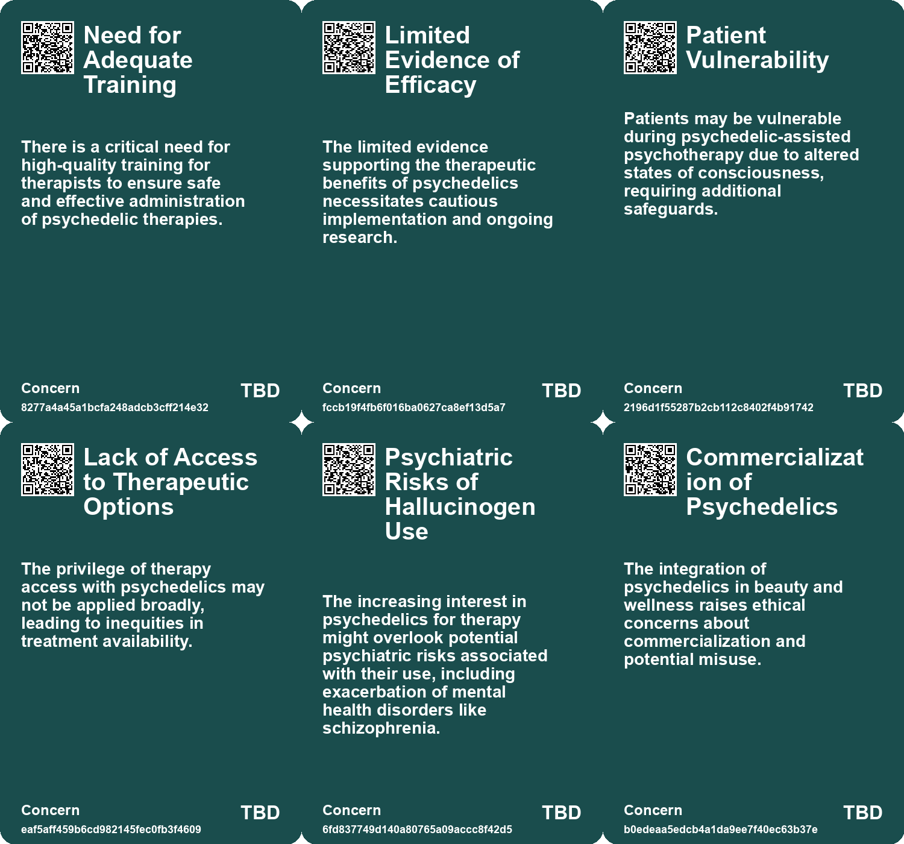
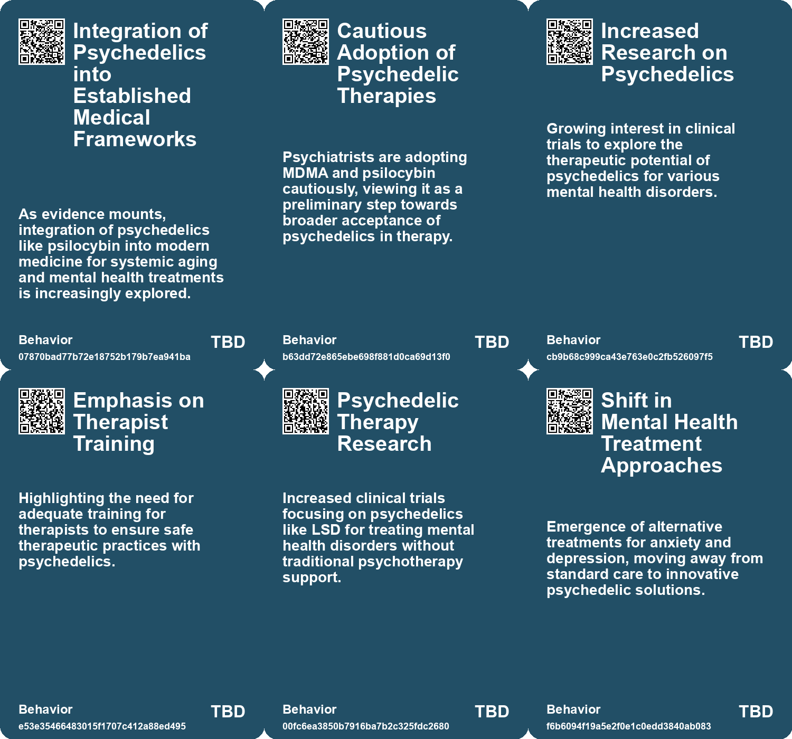
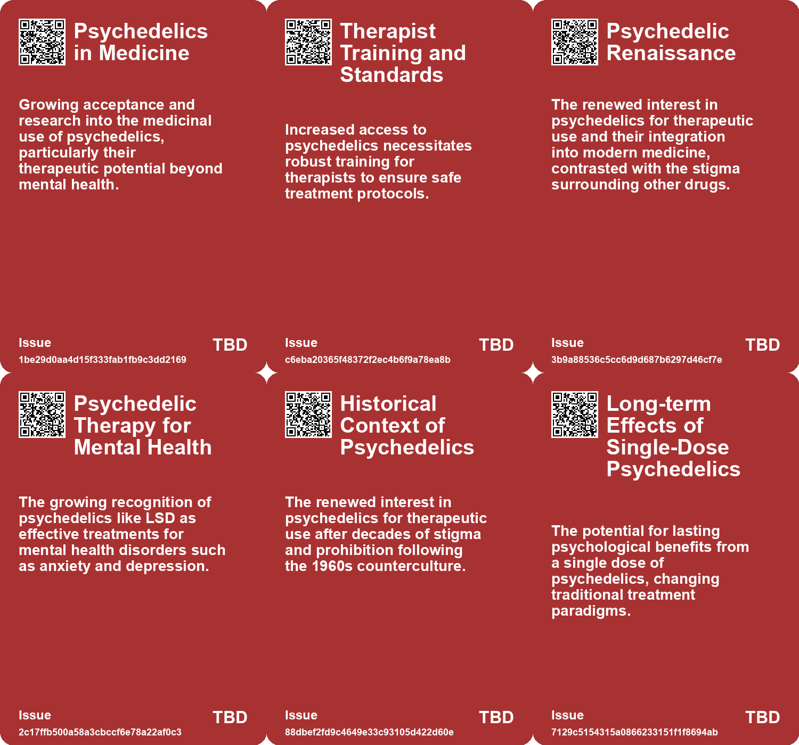
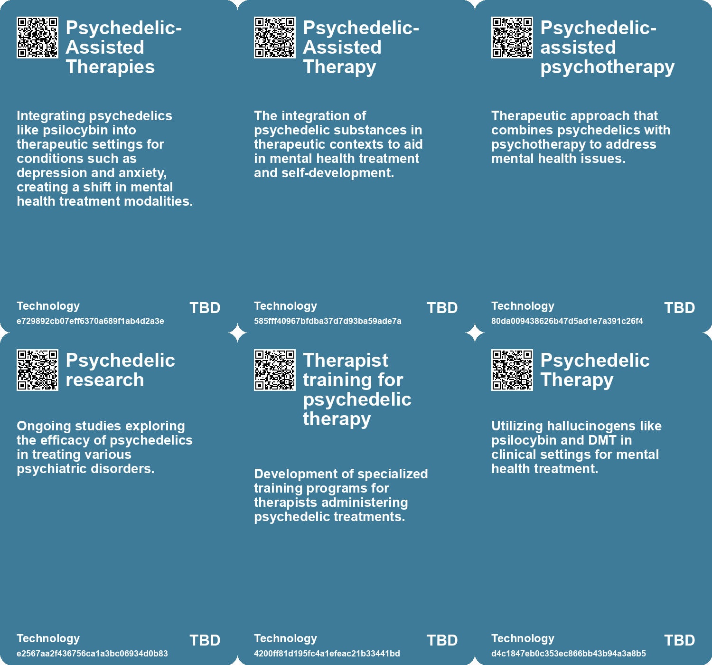

# *Topic*: Psychedelic-Assisted Therapies

# Summary

The evolving landscape of mental health treatment is increasingly embracing psychedelics as potential therapeutic agents. Australia has taken a significant step by allowing approved psychiatrists to prescribe MDMA and psilocybin for conditions like PTSD and treatment-resistant depression. This move reflects a broader shift in societal attitudes towards psychedelics, as evidenced by the Psychedelic Science 2023 conference, where influential figures discussed the potential benefits of these substances. Research continues to support this trend, with a clinical trial showing promising results for an LSD formulation aimed at treating generalized anxiety disorder.

The cultural significance of psychedelics is also being explored through literature and personal narratives. Mike Jay's book, "Psychonauts: Drugs and the Making of the Modern Mind," examines the historical context of drug use and self-experimentation, highlighting the cyclical nature of societal attitudes towards these substances. Meanwhile, hallucinogen use among Gen Z has surged, driven by a desire for alternative experiences and self-exploration, particularly during the pandemic.

The therapeutic potential of psychedelics extends beyond mental health. Recent studies from Emory University and Wellesley College suggest that psilocin, a compound derived from psilocybin, may delay cellular aging and improve health indicators in aged mice. This research opens new avenues for understanding the systemic effects of psychedelics, particularly in promoting healthier aging.

As the conversation around mental health evolves, alternative therapies are gaining traction. A hospital in Brussels is piloting "museum prescriptions" to help patients with depression and anxiety engage with cultural institutions, demonstrating the therapeutic benefits of art and community. Similarly, the beauty industry is responding to mental health concerns by incorporating holistic treatments aimed at enhancing well-being.

The rise of technology in mental health support is also notable. AI chatbots are becoming popular among young people seeking emotional assistance, particularly in regions where access to traditional therapy is limited. However, this trend raises concerns about the potential for harmful reinforcement of negative thoughts and the lack of regulatory oversight in AI therapy.

The intersection of technology and mental health is further complicated by the phenomenon of individuals forming intense attachments to AI, leading to disconnection from reality. This trend highlights the complexities of human-AI interactions and the potential impact on mental health and societal norms.

Finally, the exploration of grief and loss is being transformed by technology. Virtual reality experiences allow individuals to connect with deceased loved ones, fulfilling a fundamental human need for closure. While these innovations offer therapeutic benefits, they also raise ethical questions about addiction and the implications of remaining in a virtual world.

These themes reflect a dynamic interplay between mental health, technology, and cultural practices, revealing a society increasingly open to exploring new avenues for healing and understanding.

# Seeds

|    | name                                 | description                                                                                               | change                                                                                                           | 10-year                                                                                                                                  | driving-force                                                                                                      |
|---:|:-------------------------------------|:----------------------------------------------------------------------------------------------------------|:-----------------------------------------------------------------------------------------------------------------|:-----------------------------------------------------------------------------------------------------------------------------------------|:-------------------------------------------------------------------------------------------------------------------|
|  0 | Expanding Research on Psychedelics   | Increasing number of studies exploring alternative uses of psychedelics beyond mental health.             | Expanding research areas may eventually lead to comprehensive therapies beyond current psychiatric applications. | Psychedelics might be integrated into multifaceted treatment plans addressing both mental health and physical ailments related to aging. | Scientifically backed exploration of psychedelics promotes innovative healthcare solutions for complex conditions. |
|  1 | Destigmatization of Psychedelics     | Psychedelics are undergoing destigmatization, with more research on their benefits.                       | Shift in perception from dangerous substances to potentially therapeutic and beneficial drugs.                   | Psychedelics may be integrated into therapeutic practices and mainstream wellness culture.                                               | Growing scientific research and positive narratives surrounding psychedelics.                                      |
|  2 | Clinical Trials and Research         | Ongoing clinical trials exploring psilocybin for various psychiatric disorders.                           | From limited research to expansive clinical trials for diverse mental health applications.                       | A robust body of evidence supporting psychedelics for various psychiatric conditions.                                                    | Need for effective treatments for patients with limited options.                                                   |
|  3 | Regulatory Evolution                 | The Therapeutic Goods Administration's new regulations for psychedelic prescriptions.                     | Regulatory frameworks evolving to accommodate new kinds of therapies.                                            | More flexible and responsive regulatory environments for innovative medical treatments.                                                  | Pressure from research outcomes and patient advocacy for alternative treatments.                                   |
|  4 | Therapist Training Requirements      | Increased emphasis on therapist training for psychedelic-assisted therapies.                              | From untrained therapist involvement to mandatory high-quality training for practitioners.                       | A well-trained workforce adept at safely administering psychedelic therapies.                                                            | Recognition of the complexities involved in administering psychedelics in therapy.                                 |
|  5 | Psychedelic Renaissance              | Renewed interest in psychedelics for therapeutic and recreational use.                                    | From criminalization to potential therapeutic applications of psychedelics in medical fields.                    | Psychedelics may become integrated into mainstream therapy practices, changing treatment landscapes.                                     | Research and anecdotal evidence supporting therapeutic benefits drive interest in psychedelics.                    |
|  6 | Single-dose efficacy of psychedelics | Psychedelic treatments show significant improvement in anxiety and depression symptoms with single doses. | Move from multi-dose, long-term treatments to potentially one-time psychedelic therapies for mental health.      | Patients may experience long-lasting relief from mental health disorders with fewer treatments, reducing healthcare costs.               | Desire for quicker, more effective treatments in mental health care drives interest in single-dose psychedelics.   |
|  7 | Lack of psychotherapy in LSD trials  | MM120 trial conducted without psychotherapy suggests new approaches to psychedelic treatment.             | Shift from combined therapy approaches to standalone psychedelic treatment models.                               | Psychedelic treatments could be administered without extensive psychotherapy, making them more accessible.                               | Desire to simplify treatment protocols and reduce costs drives exploration of standalone psychedelic therapies.    |
|  8 | Renaissance of Psychedelic Research  | Recent studies renewed interest in psychedelics for therapeutic applications.                             | Shift from criminalization of psychedelics to a focus on their therapeutic potential.                            | Psychedelics may become mainstream in mental health treatment, transforming therapeutic practices.                                       | Growing body of research and anecdotal evidence supporting psychedelics' therapeutic benefits.                     |
|  9 | Integration of Psychedelics and AI   | Exploration of how psychedelics can integrate with artificial intelligence in wellness applications.      | From traditional therapy to tech-assisted psychedelic experiences for mental health.                             | Psychedelic therapy may involve AI tools to enhance emotional understanding and healing.                                                 | The increasing intersection of technology and mental health solutions.                                             |

# Concerns

|    | name                                  | description                                                                                                                                                                                     |
|---:|:--------------------------------------|:------------------------------------------------------------------------------------------------------------------------------------------------------------------------------------------------|
|  0 | Need for Adequate Training            | There is a critical need for high-quality training for therapists to ensure safe and effective administration of psychedelic therapies.                                                         |
|  1 | Limited Evidence of Efficacy          | The limited evidence supporting the therapeutic benefits of psychedelics necessitates cautious implementation and ongoing research.                                                             |
|  2 | Patient Vulnerability                 | Patients may be vulnerable during psychedelic-assisted psychotherapy due to altered states of consciousness, requiring additional safeguards.                                                   |
|  3 | Lack of Access to Therapeutic Options | The privilege of therapy access with psychedelics may not be applied broadly, leading to inequities in treatment availability.                                                                  |
|  4 | Psychiatric Risks of Hallucinogen Use | The increasing interest in psychedelics for therapy might overlook potential psychiatric risks associated with their use, including exacerbation of mental health disorders like schizophrenia. |
|  5 | Commercialization of Psychedelics     | The integration of psychedelics in beauty and wellness raises ethical concerns about commercialization and potential misuse.                                                                    |
|  6 | Ethical Concerns in Commercialization | As psychedelics are brought to market, ethical issues surrounding profit vs. therapeutic intent may arise, complicating treatment access.                                                       |
|  7 | Overshadowing Mental Health Solutions | Psychedelics could be seen as quick fixes for deeper mental health issues, diverting focus from traditional therapies.                                                                          |
|  8 | Dependency on Psychedelics            | There is a risk that reliance on psychedelics for emotional healing could overshadow other necessary psychological work.                                                                        |
|  9 | Mental Health Risks                   | While advocated for therapeutic use, psychedelics can pose mental health risks if not used responsibly or under guidance.                                                                       |

# Cards

## Concerns

## Behaviors

## Issue

## Technology

# Links

* [Exploring the Anti-Aging Effects of Psilocybin: Research Highlights Potential for Healthier Aging](https://futures.kghosh.me/e559954b0efdcb42fdd5d579c97686b0)
* [Psychedelics: A Shift in Perspective and the Need for New Categorization](https://futures.kghosh.me/13d07c8b2cd28b1d14da1f2b37f956f4)
* [Exploring the Rise of Hallucinogen Use Among Gen Z Post-Pandemic](https://futures.kghosh.me/3f44fa514b1232e0980e67899de4492a)
* [The Privacy Risks of AI Therapy in a Surveillance State](https://futures.kghosh.me/2a493a65f2f08559abd0c9f29816530b)
* [Exploring Hypnosis, Bicameral Mind, and Individual Agency in Modern Society](https://futures.kghosh.me/b7b7937de66bde57d6ca5ef00fd23cc9)
* [Exploring Psychedelic Masculinity: Athletes, Emotional Growth, and Toxicity](https://futures.kghosh.me/96831e5a59b49b51b8a5a00eee72e863)
* [AI-Fueled Delusions: The Disconnection Between Reality and Spiritual Fantasies](https://futures.kghosh.me/6515dbf29262169e3de5e2539171fd96)
* [FDA Grants Breakthrough Therapy Status to LSD Formulation for Generalized Anxiety Disorder](https://futures.kghosh.me/ebd45e3db0b21a530b067b34fa6dadd3)
* [Exploring Psilocybin's Effects on Cellular Aging and Longevity in Mice](https://futures.kghosh.me/acb01f116706c84d7adeb3525b23a057)
* [Understanding Internet and Technology Addicts Anonymous and AI Addiction](https://futures.kghosh.me/dde8183f64d803a2fda38520cce857d5)
* [StolenTime St. Lucia Unveils Specialized Grief Retreat Package for Emotional Healing](https://futures.kghosh.me/ed3bffbe03477d7ac6bde7f6982d198b)
* [The Rise of AI Chatbots in China's Mental Health Landscape: Opportunities and Risks](https://futures.kghosh.me/70e9fcd5fc1d2dd04ae1df8b2628194d)
* [The Future of Brain-Computer Interfaces: Promise and Ethical Concerns](https://futures.kghosh.me/c6702f63f03fb731d83c81e00768b28d)
* [Exploring Self-Experimentation and Drug Policy in Mike Jay's Psychonauts](https://futures.kghosh.me/46b83c5dfd8f27c0bb2335917e2f5a1f)
* [New Study Links Consciousness to Quantum Processes Through Anesthesia Research in Rats](https://futures.kghosh.me/78c4dd9c0875ccc6e42589474037ef4a)
* [Australia's Landmark Decision to Allow Prescription of MDMA and Psilocybin for Mental Health Treatment](https://futures.kghosh.me/551bd2bf76824741f2b0450fc112ae1e)
* [Exploring the Historical Relationship Between Drugs and Consciousness in Modern Society](https://futures.kghosh.me/9f63fa720db53d39066cead1fabeb6df)
* [Rediscovering Silence: The Need for Downtime in a Noisy World](https://futures.kghosh.me/6baa5e7c702f9608bef8029fe7db9156)
* [Exploring Game Transfer Phenomenon: When Video Games Impact Reality](https://futures.kghosh.me/cb84d5c485fbaeeb34783dc5340cbf09)
* [The Emotional Impact of Virtual Reality and AI in Grieving Process](https://futures.kghosh.me/f97f969e4aadfbae3dee287de4ab721d)
* [Exploring Collective Consciousness in a Future Driven by Mycelial Networks](https://futures.kghosh.me/9e74c32425eab87ba36167bfe05c8f2c)
* [The Evolution of Astrology: From Personal Readings to AI-Driven Insights](https://futures.kghosh.me/17e9c012b464f1087cfd8fc6f9425ed5)
* [Exploring Hallucinations: From Huichol Rituals to the Dreamachine Experience](https://futures.kghosh.me/efd4c52c6b463ea98a9302e343414689)
* [The Rise of PSYCARE: How Mental Health is Reshaping the Beauty Industry](https://futures.kghosh.me/b396d58ff64cbfdfe136c278b263ee5a)
* [The Importance of Authentic Experiences and Awe in a Tech-Dominated World](https://futures.kghosh.me/ce43c884bb8eefce9268368190014a48)
* [Brussels Introduces Museum Prescriptions for Mental Health Therapy](https://futures.kghosh.me/3c807d80ce080c015f1fc14086b7a09e)