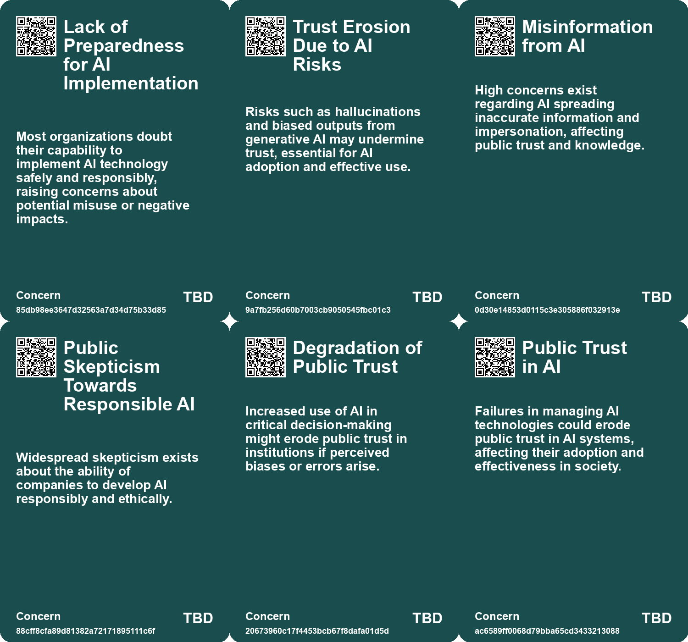
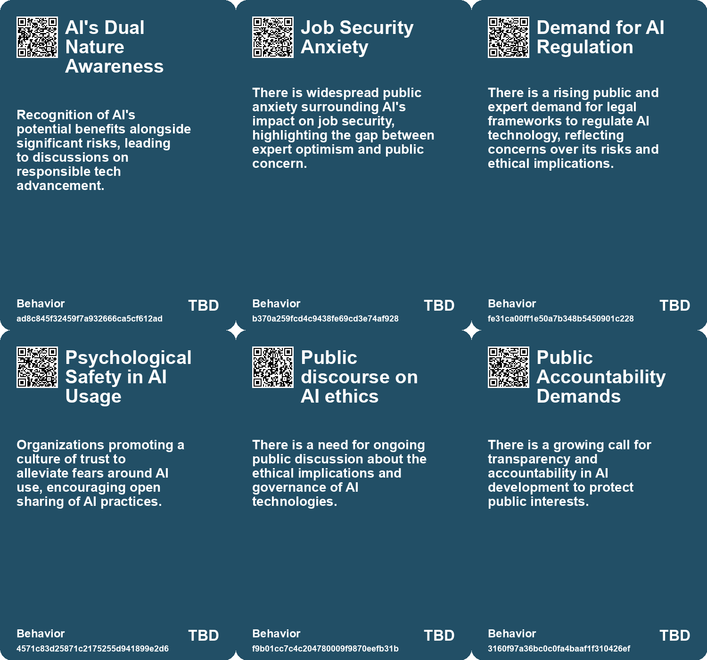
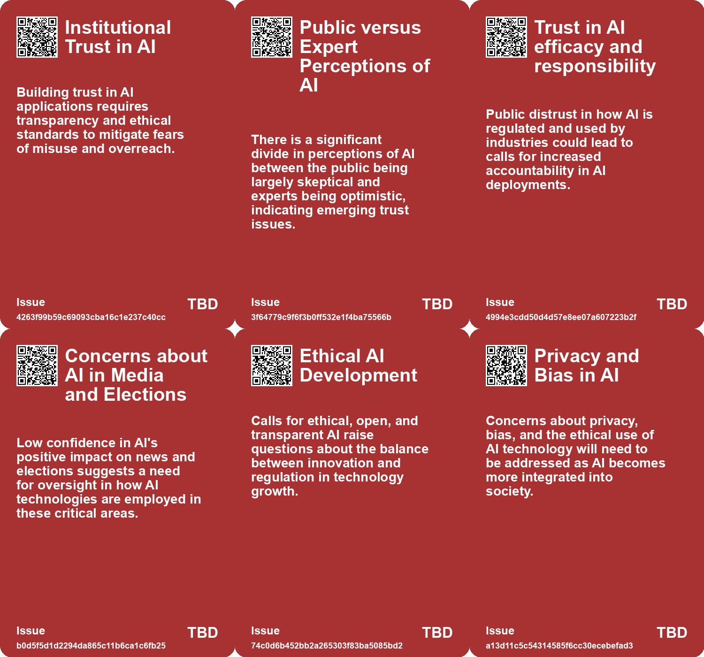

# *Topic*: Public Trust in AI and Technology

# Summary

The discourse surrounding artificial intelligence (AI) is increasingly focused on the need for regulation and ethical governance. Concerns about the impact of AI on election integrity have been raised, with calls for guidelines to prevent misinformation and protect democratic processes. As the 2024 election approaches, the potential for AI to spread prejudice and misinformation has become a pressing issue. Lawmakers and industry leaders alike are advocating for a framework that ensures AI development aligns with societal values.

The consolidation of AI resources among major tech companies poses significant challenges for innovation and diversity in the field. The dominance of firms like Microsoft and Amazon creates a dependency that stifles public-minded innovation and raises questions about the implications for democracy and individual agency. The concentration of power in the AI industry is seen as a threat to cultural values and collective interests, prompting calls for accountability and regulatory measures.

International efforts to establish AI governance are gaining momentum. The UN General Assembly has adopted a resolution promoting safe and trustworthy AI systems, emphasizing the importance of human rights in AI development. This initiative reflects a growing recognition of AI's potential to contribute to sustainable development while also highlighting the need for regulatory frameworks that prevent misuse. Similarly, the U.S. Department of Commerce is taking steps to enhance the safety and transparency of AI technologies, indicating a commitment to responsible innovation.

The ethical implications of AI are further underscored by discussions on the societal impact of generative AI. While there is optimism about AI's potential to enhance productivity and creativity, concerns about job displacement and misinformation persist. The need for Explainable AI (XAI) is emphasized as a way to build trust and ensure transparency in AI systems. Organizations are encouraged to adopt diverse teams and clear objectives to effectively implement XAI and maximize the benefits of AI.

The conversation also touches on the economic implications of AI, with experts debating the distribution of value within the industry. While big tech companies are expected to dominate, there are opportunities for startups to innovate at the application layer. The potential for AI to revolutionize sectors like education and entertainment is acknowledged, but the risks associated with misinformation and trust remain critical issues.

As AI technology evolves, the need for a balanced approach to its development is increasingly recognized. Discussions about transitioning from traditional economic systems to new models that prioritize creativity and exploration are gaining traction. The potential for AI to amplify existing inequalities or foster a more equitable future is a central theme, highlighting the importance of responsible leadership and ethical considerations in shaping AI's trajectory.

Finally, the importance of data integrity and access is underscored as AI becomes a vital resource akin to infrastructure. The establishment of Strategic Fact Reserves is proposed to ensure reliable training data for AI development, emphasizing the need for independent and uncontaminated data sources. This focus on data preservation reflects broader concerns about biases in AI models and the implications for societal outcomes.

# Seeds

|    | name                                    | description                                                                                                | change                                                                                                 | 10-year                                                                                                                | driving-force                                                                                          |
|---:|:----------------------------------------|:-----------------------------------------------------------------------------------------------------------|:-------------------------------------------------------------------------------------------------------|:-----------------------------------------------------------------------------------------------------------------------|:-------------------------------------------------------------------------------------------------------|
|  0 | Call for Human Oversight in AI          | Emphasis on maintaining human oversight in AI governance and applications.                                 | Transition from automated decision-making to human-in-the-loop systems in crucial areas like military. | In 10 years, human oversight may be a mandatory requirement in all AI implementations, especially in critical sectors. | The recognition of potential dangers posed by autonomous AI systems in military and security contexts. |
|  1 | Rise of Explainability                  | XAI emerges as a crucial need for AI adoption and trust.                                                   | Transition from black-box systems to transparent AI models.                                            | AI systems will be designed with explainability at their core.                                                         | Need for trust and accountability drives organizations to prioritize XAI.                              |
|  2 | Growing public concern over job loss    | The public is increasingly worried about AI's potential to eliminate jobs, especially in specific sectors. | Public concern transitioning from curiosity to anxiety regarding the economic impacts of AI.           | In 10 years, job markets may undergo significant transformation, leading to new jobs but potential unemployment fears. | The acceleration of automation and AI technologies in various industries is driving public discourse.  |
|  3 | Demand for AI regulation                | Both the public and experts are expressing a desire for more control and regulation over AI.               | From minimal regulation to significant calls for robust frameworks governing AI usage.                 | In the next decade, comprehensive regulatory frameworks could emerge, influencing AI development and application.      | Escalating risks and incidents related to AI use are prompting greater demand for effective oversight. |
|  4 | Public Concern Over AI Risks            | Increased public awareness and concern regarding the risks posed by AI.                                    | Shift from ignorance to active public debate over AI's societal impact and risks.                      | Public sentiment will shape regulatory frameworks, pushing for greater accountability in AI deployment.                | Rising incidents of AI misuse and ethical dilemmas fuel public demand for responsible AI practices.    |
|  5 | Ethical AI Development                  | Ongoing discussions about the ethical implications of AI technologies.                                     | From unregulated AI development to a more structured and ethical approach.                             | AI development will prioritize ethical considerations and societal impact in its applications.                         | Growing public concern regarding privacy, bias, and the societal impact of AI.                         |
|  6 | Global AI Collaboration                 | Emerging partnerships between governments and tech companies for equitable AI use.                         | Shift from isolated tech development to collaborative efforts for global impact.                       | Global frameworks will ensure that AI benefits are distributed equitably across regions.                               | Recognition of AI's potential to address global challenges and inequities.                             |
|  7 | Global Regulation of AI                 | A landmark UN resolution promotes safe and trustworthy AI systems globally.                                | From unregulated AI systems to a framework for safe and ethical AI use.                                | Global standards for AI will likely enhance safety and ethical considerations in technology development.               | International cooperation and the need for human rights in technology usage are driving this change.   |
|  8 | Emerging AI-curated Knowledge Ecosystem | AI is increasingly curating knowledge, raising issues of trust and explainability.                         | Shift from human-curated knowledge to AI-driven curation, challenging traditional information sources. | AI may dominate information dissemination, leading to a more homogenized and potentially biased knowledge base.        | The rapid advancement of AI technologies and the need for efficient information processing.            |
|  9 | Trustworthiness as a Key Concern        | Trust in AI's outputs is crucial, with emphasis on provenance and traceability of information.             | From blind trust in AI outputs to a demand for verifiable and trustworthy information.                 | AI systems may be designed to prioritize transparency and accuracy, fostering user trust.                              | Public demand for accountability and reliability in information sources drives this focus.             |

# Concerns

|    | name                                       | description                                                                                                                                                |
|---:|:-------------------------------------------|:-----------------------------------------------------------------------------------------------------------------------------------------------------------|
|  0 | Lack of Preparedness for AI Implementation | Most organizations doubt their capability to implement AI technology safely and responsibly, raising concerns about potential misuse or negative impacts.  |
|  1 | Trust Erosion Due to AI Risks              | Risks such as hallucinations and biased outputs from generative AI may undermine trust, essential for AI adoption and effective use.                       |
|  2 | Misinformation from AI                     | High concerns exist regarding AI spreading inaccurate information and impersonation, affecting public trust and knowledge.                                 |
|  3 | Public Skepticism Towards Responsible AI   | Widespread skepticism exists about the ability of companies to develop AI responsibly and ethically.                                                       |
|  4 | Degradation of Public Trust                | Increased use of AI in critical decision-making might erode public trust in institutions if perceived biases or errors arise.                              |
|  5 | Public Trust in AI                         | Failures in managing AI technologies could erode public trust in AI systems, affecting their adoption and effectiveness in society.                        |
|  6 | Lack of Accountability in AI Investments   | Without clear metrics for success, public investments in AI may not deliver promised societal benefits, risking taxpayer money and trust.                  |
|  7 | Mistrust in Generative AI                  | People exhibit mistrust in generative AI where it could provide significant value, potentially holding back beneficial innovations.                        |
|  8 | Overtrust in AI where it lacks competency  | Individuals may place excessive trust in generative AI technologies in areas where they are not competent, risking poor decision-making.                   |
|  9 | Lack of Transparency in AI Development     | Corporations deploying AI lack transparency regarding their models, data handling, and ethical standards, leading to potential misuse and public mistrust. |

# Cards

## Concerns

## Behaviors

## Issue

## Technology

# Links

* [Rethinking the Role of AI: From Political Tool to Ethical Design Options](https://futures.kghosh.me/c25cae2b8d72e7634d591247d9ac96d2)
* [Public-Private Partnerships in AI: Risks and Societal Implications](https://futures.kghosh.me/6264095641147fe54800b8f03723f381)
* [The Threat of Big Tech Dominance in the AI Landscape: A Call for Regulation and Accountability](https://futures.kghosh.me/d130f601121a2b6afde583e5960ed783)
* [The Importance of Explainable AI: Building Trust in Artificial Intelligence for Organizations](https://futures.kghosh.me/afe2219279811b5905b43a7731e95da7)
* [The Impact of Generative AI and Autonomous Agents on Business Value Creation and Trust Issues](https://futures.kghosh.me/15d4ec180189ca1739398f516844cefb)
* [Exploring the Future of AI in Knowledge Ecosystems and Global Challenges](https://futures.kghosh.me/a9266018b458295480a07167310458a9)
* [U.N. Security Council Addresses the Challenges and Opportunities of Artificial Intelligence](https://futures.kghosh.me/ca000dd628ace8fa385910be496aaf7e)
* [US Warns Europe Against Overly Cautious AI Regulations Amidst Global Competition](https://futures.kghosh.me/1d88d1adb536215512bd7d3380493797)
* [OpenAI CEO Highlights AI Risks to Election Integrity and Calls for Regulation](https://futures.kghosh.me/fd96f58595786b0820cca21394223a66)
* [The Transformative Potential of AI: Revolutionizing Education, Healthcare, and Global Equity](https://futures.kghosh.me/2449c2fc4b8afc7e268db4987fa821e5)
* [U.S. Department of Commerce Announces New AI Safety and Trustworthiness Initiatives](https://futures.kghosh.me/fa4fc4145d0de8fe7d6c3a734a47557f)
* [The Necessity of Strategic Fact Reserves for AI Development in Nations and Corporations](https://futures.kghosh.me/05e89c4773a48ddeceedf5e1e0e1d4fe)
* [The Threat of Authoritarian Intelligence: A Call for Responsible AI Development](https://futures.kghosh.me/0ba4fa557cd2aae4760bd7a2abca844e)
* [Contrasting Views on AI: Public Concerns vs. Expert Optimism and Advocacy for Regulation](https://futures.kghosh.me/e2ce30b29c24272c98349d7a121be360)
* [Understanding the Real Risks of AI Beyond Superintelligence and Scalability](https://futures.kghosh.me/ff7f7a51f925c273449a8648a18b7df8)
* [The Urgent Need for Ethical AI Regulations Amid Rapid Development and Deployment](https://futures.kghosh.me/382e9ebc1e518ee49e541da1e6b5f8af)
* [AI's Impact on Society: Job Displacement and the Need for Retraining](https://futures.kghosh.me/cf119665e47c7434e3e3c54dbbc585e3)
* [The Global Landscape of AI Regulation: Differing Approaches and Challenges Ahead](https://futures.kghosh.me/c3301a7146d6814214205c4b43376f17)
* [Navigating the Dilemma of AI Integration in Organizations: Embracing Secret Cyborgs for Innovation](https://futures.kghosh.me/c42a95f16678ed3834840d48f8e775a3)
* [Navigating the Future: The Impact of AI on Society and Economy](https://futures.kghosh.me/87709d0e31dee725ec1f54b7f4facbc4)
* [Thriving in an AI Era: Embracing, Adapting, and Complementing Technology](https://futures.kghosh.me/23a3410059759ba4214235628d4ebd4b)
* [UN General Assembly Adopts Historic Resolution on Safe and Trustworthy Artificial Intelligence](https://futures.kghosh.me/d7b56c819275b35f84a01258707f39f9)
* [The Transformative Impact of AI on Jobs, Reality, and Economic Value Distribution](https://futures.kghosh.me/17cff4adea214f71c7a5eed15307b0e7)