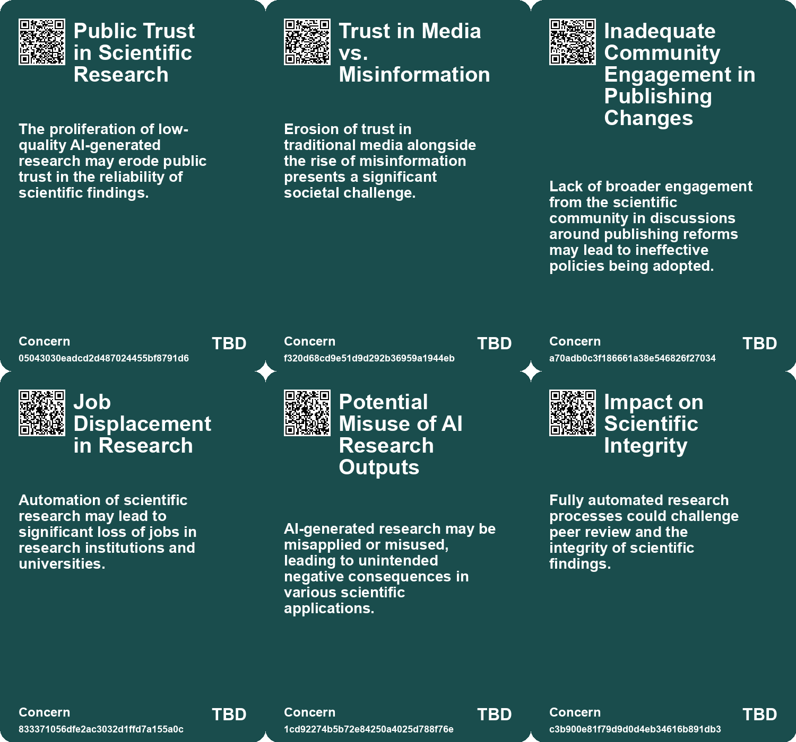
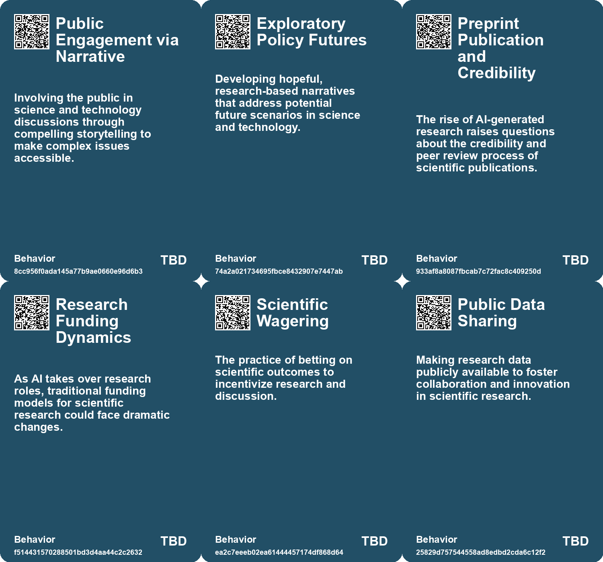
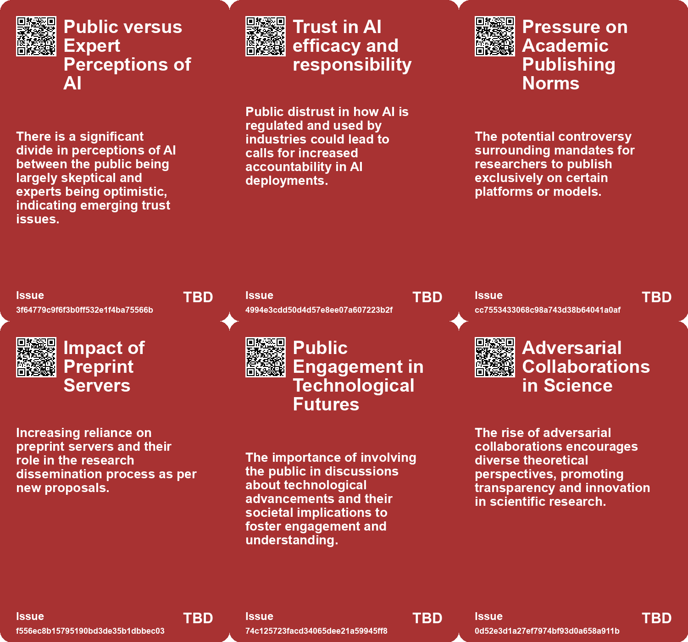
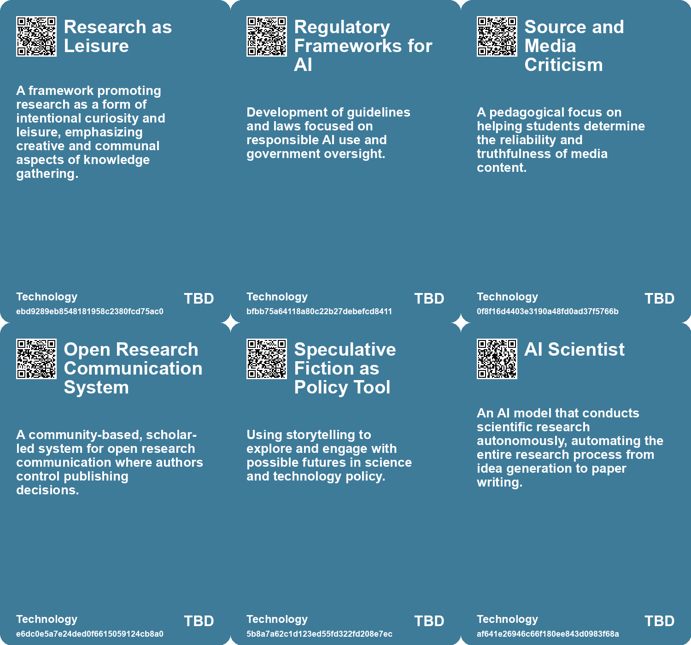

# *Topic*: Public Trust in Scientific Research

# Summary

The intersection of artificial intelligence (AI) and societal impact is a prominent theme in recent discussions. The emergence of AI technologies, such as autonomous research systems and generative models, raises questions about the future of academic publishing and the integrity of scientific research. The development of "The AI Scientist" by Sakana AI exemplifies the potential for AI to conduct independent research, but it also poses risks to traditional academic roles. Meanwhile, initiatives like Plan S aim to revolutionize research publishing by promoting open access, yet concerns about affordability and equity persist.

Public-private partnerships in AI development are under scrutiny, particularly regarding the influence of large tech companies on innovation. The National Artificial Intelligence Research Resource (NAIRR) is proposed as a solution, but its effectiveness in promoting public-minded innovation remains uncertain. The U.S. government is also taking steps to regulate AI, with the National Institute of Standards and Technology (NIST) releasing guidelines to enhance the safety and transparency of AI systems.

Digital literacy and fact-checking are increasingly recognized as essential skills in combating misinformation. Finland's educational approach integrates these skills into the curriculum, encouraging critical thinking among students. This model highlights the importance of preparing future generations to navigate a complex information landscape, a need echoed in discussions about the role of education in fostering skepticism and informed citizenship.

Trust is another critical element in societal dynamics, particularly in Denmark, where high levels of trust contribute to social cohesion and economic prosperity. However, challenges arise as diversity and immigration increase, prompting a reevaluation of trust in changing contexts. The relationship between trust and governance is further explored in the context of private power and its implications for democracy, emphasizing the need for equitable systems that support social justice.

The ongoing debate about the implications of AI on employment and social structures is underscored by the experiences of young life science researchers leaving academia for better opportunities in the private sector. This shift reflects broader concerns about job security and the sustainability of academic careers, as well as the need for systemic changes to address the imbalance in the labor market.

The ethical development of AI is a pressing concern, with calls for transparency and accountability in its deployment. The UN General Assembly's resolution on AI emphasizes the importance of human rights in AI systems, urging member states to develop regulatory frameworks that ensure responsible use. This aligns with the growing recognition of the need for diverse perspectives in AI development to mitigate biases and enhance societal benefits.

Finally, the role of science fiction in shaping public discourse around technology and policy is highlighted as a valuable tool for engaging diverse audiences. By envisioning potential futures, science fiction fosters empathy and encourages dialogue about the implications of scientific advancements. This narrative approach can help bridge the gap between complex scientific concepts and public understanding, ultimately contributing to more informed decision-making in technology policy.

# Seeds

|    | name                                           | description                                                                                             | change                                                                                               | 10-year                                                                                                                   | driving-force                                                                                                  |
|---:|:-----------------------------------------------|:--------------------------------------------------------------------------------------------------------|:-----------------------------------------------------------------------------------------------------|:--------------------------------------------------------------------------------------------------------------------------|:---------------------------------------------------------------------------------------------------------------|
|  0 | Emergence of Community-Based Publishing Models | A proposed shift to community-led, non-profit research publishing systems.                              | Transitioning from traditional commercial publishing to community-led models for research outputs.   | Community-led platforms could dominate research publishing, changing how knowledge is shared.                             | The need for equitable access and control of research outputs by scholars.                                     |
|  1 | Science Fiction as Policy Tool                 | Science fiction is increasingly recognized as a tool for engaging in science policy discussions.        | Shift from traditional policy discussions to using speculative fiction to inform policy.             | In 10 years, science fiction workshops may be standard in policy-making processes.                                        | The need for more engaging methods to discuss complex scientific and technological issues.                     |
|  2 | Engaging the Public                            | Increasing public involvement in science and technology discussions through narrative.                  | From expert-led discussions to more inclusive public engagement.                                     | Public engagement in policy debates may become standard practice.                                                         | The need for societal involvement in shaping technology's future.                                              |
|  3 | The Declaration on Human Enhancement           | A formal charter for scientific research in human enhancement announced by leading scientists.          | From informal discussions to formal agreements on human enhancement in sports.                       | Establishment of ethical guidelines and regulations surrounding human enhancement in sports.                              | Growing legitimacy and acceptance of human enhancement in competitive sports.                                  |
|  4 | AI Scientist Development                       | An AI system that can autonomously conduct scientific research has been developed.                      | Shift from human-led research to AI-driven scientific inquiry.                                       | In 10 years, AI could dominate scientific research, reshaping academic structures and methodologies.                      | The need for cost-effective and efficient research processes is driving the development of autonomous systems. |
|  5 | Potential Breakthroughs in Science             | AI-driven research could lead to significant scientific breakthroughs.                                  | From slow, human-led discoveries to rapid AI-driven advancements in various fields.                  | Accelerated discoveries in critical fields like cancer research and climate change solutions.                             | The capability of AI to process vast data sets and generate insights quickly.                                  |
|  6 | Public Availability of Research Data           | The trend of making research data publicly available to encourage further exploration and validation.   | Transition from restricted access to open data in scientific research, enabling wider collaboration. | In a decade, open access to research data could foster innovation and accelerate scientific discovery across disciplines. | The rise of open science movements advocating for transparency and collaboration in research.                  |
|  7 | Long-term Scientific Wagers                    | The tradition of long-term bets among scientists to stimulate research and discussion.                  | Growth of a culture that encourages scientific wagers as a motivation for research.                  | In a decade, scientific wagers may become a recognized method to foster scientific inquiry and debate.                    | The desire for engagement and accountability in scientific claims and predictions.                             |
|  8 | Increased Skepticism of Scientific Objectivity | Rising awareness of the limitations and biases inherent in scientific research and its interpretations. | From viewing science as an objective truth to recognizing the subjective influence of researchers.   | Expectations for scientific research may include greater transparency and acknowledgment of biases in methodology.        | Calls for accountability and ethical considerations in how science interacts with human life.                  |
|  9 | Trustworthiness as a Key Concern               | Trust in AI's outputs is crucial, with emphasis on provenance and traceability of information.          | From blind trust in AI outputs to a demand for verifiable and trustworthy information.               | AI systems may be designed to prioritize transparency and accuracy, fostering user trust.                                 | Public demand for accountability and reliability in information sources drives this focus.                     |

# Concerns

|    | name                                                  | description                                                                                                                                               |
|---:|:------------------------------------------------------|:----------------------------------------------------------------------------------------------------------------------------------------------------------|
|  0 | Public Trust in Scientific Research                   | The proliferation of low-quality AI-generated research may erode public trust in the reliability of scientific findings.                                  |
|  1 | Trust in Media vs. Misinformation                     | Erosion of trust in traditional media alongside the rise of misinformation presents a significant societal challenge.                                     |
|  2 | Inadequate Community Engagement in Publishing Changes | Lack of broader engagement from the scientific community in discussions around publishing reforms may lead to ineffective policies being adopted.         |
|  3 | Job Displacement in Research                          | Automation of scientific research may lead to significant loss of jobs in research institutions and universities.                                         |
|  4 | Potential Misuse of AI Research Outputs               | AI-generated research may be misapplied or misused, leading to unintended negative consequences in various scientific applications.                       |
|  5 | Impact on Scientific Integrity                        | Fully automated research processes could challenge peer review and the integrity of scientific findings.                                                  |
|  6 | HARKing in Scientific Research                        | Hypothesizing after results are known can undermine the reliability of theories, prompting a need for increased transparency in experimental predictions. |
|  7 | Cultural Resistance to Scientific Determinism         | Public reception of neuroscientific claims on free will may create division between scientific communities and traditional moral values.                  |
|  8 | Lack of Accountability in AI Investments              | Without clear metrics for success, public investments in AI may not deliver promised societal benefits, risking taxpayer money and trust.                 |
|  9 | Ethical Implications of Military Research Funding     | Concerns over the ethical ramifications of university-funded research with military applications, particularly in conflict zones like Gaza.               |

# Cards

## Concerns

## Behaviors

## Issue

## Technology

# Links

* [Public-Private Partnerships in AI: Risks and Societal Implications](https://futures.kghosh.me/6264095641147fe54800b8f03723f381)
* [Exploring the Future of Knowledge in the Age of AI: From Peer Review to NotebookLM](https://futures.kghosh.me/2c3e163f113838429299866828dad17c)
* [Exploring Wild Ideas: Quantum Mechanics, Brain Simulation, and Economic Growth](https://futures.kghosh.me/8dbda1aa70e9a8497543306086219a30)
* [The Interplay of Democracy, Work, and Economic Justice in Modern Society](https://futures.kghosh.me/43aa6ac3d82bbc19f0d66d5b2bb37897)
* [Enhanced Games: Merging Science and Safety in Athletic Competitions](https://futures.kghosh.me/9786ba9f5842c13525de5cff9ee70d53)
* [Harnessing Science Fiction as a Tool for Engaging Science and Technology Policy Discussions](https://futures.kghosh.me/58c98790e621e1df2e408b359c701026)
* [Finland's Innovative Approach to Combating Fake News Through Education](https://futures.kghosh.me/ad15fbe04bbe50ec3436c61403d19fca)
* [The Urgent Need for Ethical AI Regulations Amid Rapid Development and Deployment](https://futures.kghosh.me/382e9ebc1e518ee49e541da1e6b5f8af)
* [Google's Transition to Remote Work and the Evolution of Information Security](https://futures.kghosh.me/7a34820852cf03cbbdb1fb75ca3b629c)
* [The Necessity of Strategic Fact Reserves for AI Development in Nations and Corporations](https://futures.kghosh.me/05e89c4773a48ddeceedf5e1e0e1d4fe)
* [Contrasting Views on AI: Public Concerns vs. Expert Optimism and Advocacy for Regulation](https://futures.kghosh.me/e2ce30b29c24272c98349d7a121be360)
* [U.S. Department of Commerce Announces New AI Safety and Trustworthiness Initiatives](https://futures.kghosh.me/fa4fc4145d0de8fe7d6c3a734a47557f)
* [Critique of Climate Litigation: Overreach and Misguided Legal Strategies in the Fight for Climate Justice](https://futures.kghosh.me/520e99c78c4f0a986e3a3677778dc5ea)
* [Exploring Free Will and Determinism in Science and Literature](https://futures.kghosh.me/20dcd5f1dfbe5f80a079ad28644cf08f)
* [UK Government Partners with AI Leaders for Research and Safety Initiatives](https://futures.kghosh.me/7d282ab00a127ad93da225107b263810)
* [Reviving Research as Leisure: Embracing Curiosity and Reading Culture for Civilization's Future](https://futures.kghosh.me/e3389ae6863265accc860c33c364c11f)
* [cOAlition S Proposes Bold Changes to Revolutionize Research Publishing System](https://futures.kghosh.me/02f2ec8eec579967c3b2a336f34ac715)
* [Exploring the Complexities of Consciousness: Insights from Recent Scientific Wagers and Collaborations](https://futures.kghosh.me/098f4de4b2e0da23ef41a92329c5e761)
* [The AI Scientist: A Revolutionary Autonomous AI for Scientific Research](https://futures.kghosh.me/3607a211a5ceadc4c9c4f86cd5fcd2df)
* [UN General Assembly Adopts Historic Resolution on Safe and Trustworthy Artificial Intelligence](https://futures.kghosh.me/d7b56c819275b35f84a01258707f39f9)
* [Exploring the Bio Revolution: Opportunities, Risks, and Future Implications](https://futures.kghosh.me/62a5bae52266a680c6a13bd3ef8dc48c)
* [MIT's Controversial Ties to Israeli Military Funding and Student Protests](https://futures.kghosh.me/0d4171563ade773e41ab3c5949dccb52)
* [The Shift from Academia to Industry: Young Life Scientists Seek Better Opportunities](https://futures.kghosh.me/7054e5d956a73f1ccb060d1d8fe80151)
* [Exploring Trust in Denmark: A Nation Built on Goodwill and Equality](https://futures.kghosh.me/71b8e40b9db95feeacb1fe0d25d539e1)