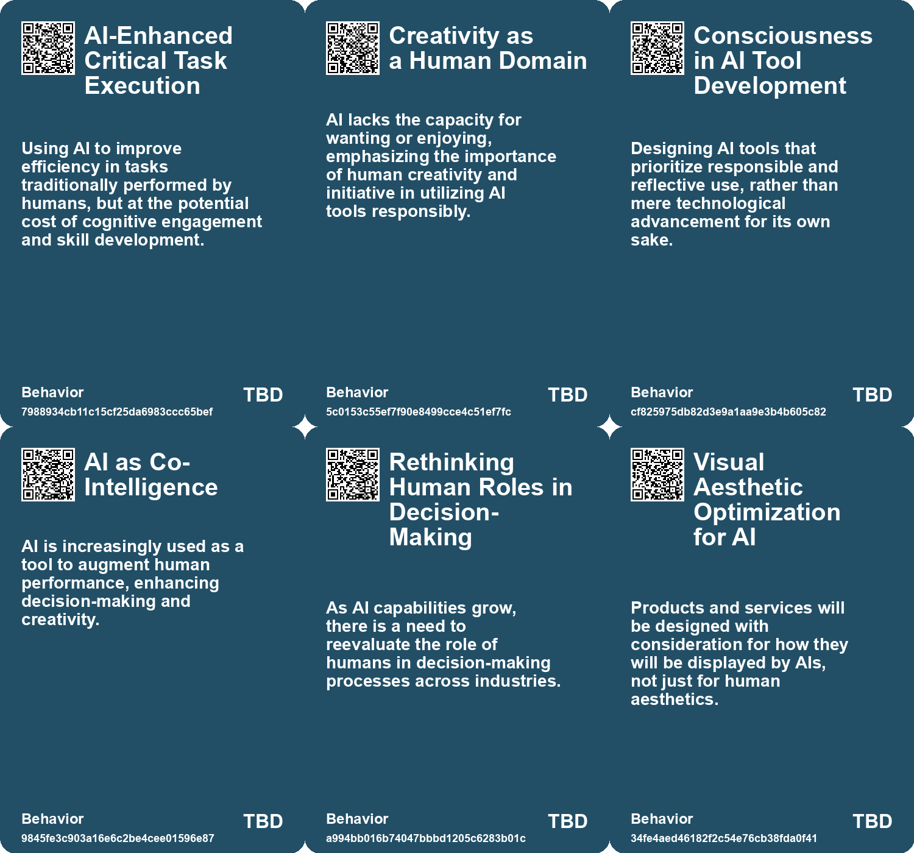
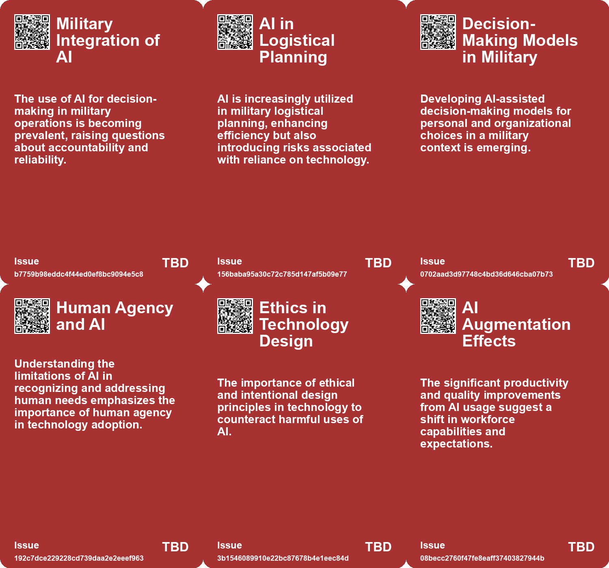
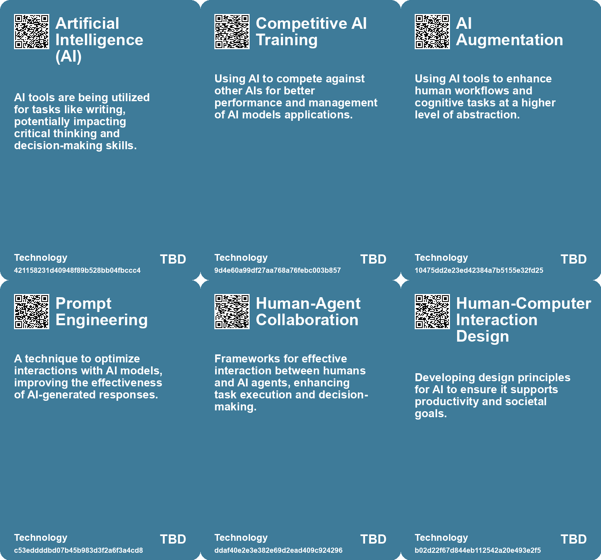

# *Topic*: Purposeful AI Utilization

# Summary

The integration of artificial intelligence (AI) into various sectors is reshaping workflows, job roles, and societal dynamics. A significant concern is the high failure rate of AI implementations in enterprises, with studies indicating that 95% do not positively impact profit and loss. Successful projects often focus on specific pain points and collaborate effectively with external providers. Despite substantial investments in AI for sales and marketing, back-office automation shows more promise, raising concerns about job displacement, particularly in entry-level customer service roles.

In education, business schools are adapting their curriculums to include AI, emphasizing the importance of technology skills for graduates. Some institutions are even developing AI chatbots to teach soft skills, while professors aim to provide a broader understanding of AI's implications for the future of work. This shift reflects a growing recognition of the need for individuals to complement AI with uniquely human skills such as creativity, communication, and collaboration.

The ethical implications of AI are also under scrutiny. As AI becomes a tool for social-emotional support in education and mental health, concerns arise about the depersonalization of care and the widening gap between those who can afford personalized services and those who cannot. The integration of AI in these fields must be balanced with human interaction to ensure equitable access to support.

AI's potential to drive social good is evident, particularly in advancing the United Nations Sustainable Development Goals. However, challenges such as funding disparities, biases, and privacy concerns persist. Collaboration among stakeholders is essential to harness AI's capabilities for positive change while addressing global challenges effectively.

The cognitive impact of AI on individuals is another critical theme. Studies indicate that heavy reliance on AI tools can lead to cognitive atrophy and diminished critical thinking skills. This trend raises concerns about the long-term effects on younger users, who may struggle with independent problem-solving as they increasingly depend on AI for decision-making. Promoting skepticism towards AI and encouraging healthy usage patterns are vital to mitigate these risks.

In the workplace, AI is transforming roles, particularly in customer support and consulting. Research shows that AI tools can enhance productivity and knowledge sharing, especially among novice workers. However, the effectiveness of AI varies, with experienced workers experiencing minimal impact. The integration of AI into complex tasks presents both opportunities and challenges, highlighting the need for a thoughtful approach to human-AI collaboration.

The evolving relationship between humans and AI is marked by a shift from active collaboration to a more passive reliance on AI outputs. As AI tools become more sophisticated, users must develop a new literacy to navigate these systems effectively. The opacity of AI processes raises concerns about trust and verification, emphasizing the importance of critical engagement with AI-generated results.

Finally, the future of AI interaction is poised for change, with personal AIs mediating user experiences. This shift will require businesses to adapt their strategies to ensure their data and APIs are prioritized by these personal AIs. The implications for user-facing businesses are profound, as success will depend on the quality of data provided and the effectiveness of their digital interfaces.

# Seeds

|    | name                               | description                                                                                  | change                                                                                                | 10-year                                                                                               | driving-force                                                                                            |
|---:|:-----------------------------------|:---------------------------------------------------------------------------------------------|:------------------------------------------------------------------------------------------------------|:------------------------------------------------------------------------------------------------------|:---------------------------------------------------------------------------------------------------------|
|  0 | Military Use of LLMs               | A member of the US military is using AI for decision-making and predictive analysis.         | Military decision-making is shifting from traditional methods to leveraging AI tools for predictions. | In 10 years, AI could become an integral part of military strategy and operations.                    | The need for increased efficiency and accuracy in military operations drives AI adoption.                |
|  1 | AI in Personal Decision-Making     | Military personnel are exploring individual decision-making models using AI tools.           | Shift from collective decision-making to an emphasis on personal decision processes supported by AI.  | Individual military decision-making may significantly rely on tailored AI recommendations.            | Desire to improve personal accountability and decision quality within military ranks drives this change. |
|  2 | AI-Assisted Logistical Planning    | AI is regularly used for logistical planning by military units, streamlining operations.     | Transitioning from manual processes to data-driven, AI-supported logistical planning.                 | Logistical operations may be fully automated and optimized through advanced AI systems.               | Need for optimizing logistics and operational readiness in dynamic military environments.                |
|  3 | Economic Incentives for Ethical AI | Recognizing the need to create systems that foster ethical AI use and accountability.        | Transition from unregulated AI usage to enshrined ethics and economic incentives for fairness.        | Infrastructures ensure that AI development aligns with ethical norms and human rights considerations. | Public awareness and demand for accountability in AI usage necessitating institutional reforms.          |
|  4 | AI and Community Building          | Potential for AI to enhance human creativity and community sharing.                          | Shift from individualistic to community-focused approaches leveraging AI.                             | More robust community platforms where AI facilitates creativity instead of stifling it.               | Desire for meaningful exchange and cooperation in creative endeavors among humans.                       |
|  5 | Centaurs and Cyborgs               | Emerging patterns of AI use show different levels of integration between humans and AI.      | From independent human work to collaborative and integrated human-AI task execution.                  | A shift in workforce roles, with more emphasis on human-AI collaboration in various sectors.          | The evolution of job roles and the need for adaptive skills in the workforce.                            |
|  6 | Evolving Concept of Agency         | Redefining agency from human-centric to AI-centric with advances in AI agents.               | Shift from a human-centric view of agency to a more inclusive AI-centric perspective.                 | In ten years, AI agents may be perceived as legitimate agents with agency akin to humans.             | The relentless advancement of AI technology and its integration into daily life.                         |
|  7 | Human-Agent Collaboration Models   | Developing frameworks for effective collaboration between humans and AI agents.              | Shift from isolated AI functionality to integrated human-agent teamwork.                              | In the future, human-agent collaborations may become standard practice across industries.             | The necessity of combining human intuition with AI efficiency in complex tasks.                          |
|  8 | AI Companions for Mental Health    | AI tools are being used to track and support mental health, especially in underserved areas. | From traditional mental health services to AI-driven support systems for mental well-being.           | AI companions could become common in mental health support, though effectiveness may vary widely.     | Rising mental health issues combined with a shortage of human therapists and support.                    |
|  9 | AI Literacy as a Necessity         | Increasing need for individuals to understand and use AI tools effectively.                  | Shift from ignorance of AI to a requirement for AI literacy in personal and professional settings.    | In 10 years, AI literacy will be as fundamental as digital literacy for all individuals.              | Rapid advancements in AI technology necessitating understanding for effective use.                       |

# Concerns

|    | name                                         | description                                                                                                                                |
|---:|:---------------------------------------------|:-------------------------------------------------------------------------------------------------------------------------------------------|
|  0 | Ethical Implications of AI Assistance        | The use of AI for decision-making raises ethical concerns regarding accountability and the dehumanization of military operations.          |
|  1 | Ideological Misuse of AI                     | AI technologies may be repurposed to reinforce existing ideologies that prioritize power and control over ethical considerations.          |
|  2 | Need for Critical Reexamination of AI        | The importance of critically assessing the underlying purposes and societal roles of AI technologies before widespread implementation.     |
|  3 | AI Misapplication                            | Consultants using AI produced fewer correct solutions on tasks outside AI's capability, indicating potential misuse or overreliance on AI. |
|  4 | Uncertain Co-Intelligence Impact             | The rise of AI as a co-intelligence tool could disrupt traditional decision-making and re-evaluate human roles in professional settings.   |
|  5 | Existential Reflection on Human Intelligence | As AI becomes superhuman, a cultural shift towards enhancing human capacities and intelligence may become necessary to retain relevance.   |
|  6 | Autonomous Decision-Making Risks             | The rise of autonomous, goal-driven AI agents may lead to unpredictable outcomes in complex tasks without human oversight.                 |
|  7 | Human-Computer Interaction and Design        | Poor design principles could prevent AI from enhancing productivity and may undermine human relevance and participation.                   |
|  8 | Unclear Regulatory Landscape                 | The lack of clear regulations around the use of generative AI may lead to misuse or unethical practices in various industries.             |
|  9 | Need for Human Oversight                     | Given the gaps between human and AI capabilities, there’s a pressing need for human decision-making to support AI applications.            |

# Cards

## Concerns

## Behaviors

## Issue

## Technology

# Links

* [Rethinking the Role of AI: From Political Tool to Ethical Design Options](https://futures.kghosh.me/c25cae2b8d72e7634d591247d9ac96d2)
* [The Transformative Role of Generative AI in Supply Chain and Marketing Management](https://futures.kghosh.me/1b46caa07ff58af58c2e1cf51b86402d)
* [Exploring the Evolution and Capabilities of AI Agents in Multi-Agent Systems](https://futures.kghosh.me/8c3af57e1a9f1b3f778f7b3cefcd6318)
* [The Quest for AGI: Current AI Capabilities and Future Implications](https://futures.kghosh.me/77c5c92357a7aeff1c388c1eb79b7259)
* [The Role of Social-Emotional AI: Bridging or Widening the Gap in Human Connection?](https://futures.kghosh.me/8e191b6221caa8d9f27b19268ab8a048)
* [Harnessing AI for Social Good: Opportunities and Challenges in Achieving the UN SDGs](https://futures.kghosh.me/0d88d49818819d335d12f792275fde97)
* [Recent Developments in AI Regulation and Technology: A Review of Key Initiatives and Critiques](https://futures.kghosh.me/a009ccdffaa59f53de56887aa19e6239)
* [Navigating Generative AI: The Importance of Custom Research for Effective Adoption](https://futures.kghosh.me/ed237776f4979a2104f62c4985fbeba8)
* [U.S. Military Explores AI Usage for Decision-Making and Operational Planning](https://futures.kghosh.me/6c6cdf887c967a8c2719440638634e49)
* [The Impact of Generative AI and Autonomous Agents on Business Value Creation and Trust Issues](https://futures.kghosh.me/15d4ec180189ca1739398f516844cefb)
* [The Shift to AI-Mediated Interactions: Implications for Businesses and APIs](https://futures.kghosh.me/416560fac9bedd69aa678761b51406a2)
* [MIT Study Challenges AI Job Displacement Fears with Economic Viability Insights](https://futures.kghosh.me/89ee61cc0d9fa77ecb1eb4100622a53f)
* [The Cognitive Costs of AI: Are We Sacrificing Our Mental Abilities for Convenience?](https://futures.kghosh.me/09e7abde98ff0c5590320545c5b20679)
* [AI's Potential to Enhance Human Evolution and Self-Actualization](https://futures.kghosh.me/8893f2e58b95e1993a5f8a1af090eedd)
* [The Flexibility of Human Self-Orientation vs. AI Limitations in Dynamic Environments](https://futures.kghosh.me/d9411983cedc4ea97632f2e8a3c2c090)
* [The Dangers of AI Reliance: Cognitive Atrophy and Critical Thinking Decline in Knowledge Workers](https://futures.kghosh.me/682e04f0b543e67738d8ffbb84fc50dd)
* [Exploring AI's Implications: Insights from a Discussion in New Zealand on Artificial Intelligence and Society](https://futures.kghosh.me/7bdbb32950c9d265f6ec455d964973fe)
* [MIT Study Reveals High Failure Rate of Enterprise AI Implementations Due to Poor Integration](https://futures.kghosh.me/a6a18a39971f1bcdb555339c05b4dbc5)
* [The Integration of AI in Business School Curriculums to Enhance Graduate Competitiveness](https://futures.kghosh.me/bc232b227c806ac26adf2b99fa4cff9d)
* [Exploring AI's Effect on Cognitive Skills and Learning Processes](https://futures.kghosh.me/950253f15955ca7be1cb2ebf244d0939)
* [Understanding the Real Risks of AI Beyond Superintelligence and Scalability](https://futures.kghosh.me/ff7f7a51f925c273449a8648a18b7df8)
* [U.S. Intelligence Community's Integration of Generative AI for Enhanced Operations](https://futures.kghosh.me/dc6864119c8835a3637517b2a4fe9fbb)
* [Thriving in an AI Era: Embracing, Adapting, and Complementing Technology](https://futures.kghosh.me/23a3410059759ba4214235628d4ebd4b)
* [Understanding AI Use Cases: Gods, Interns, Cogs, and Toys](https://futures.kghosh.me/3950528dc54ed7a01f67c9532587674a)
* [Shifting Relationships: From Co-Intelligence to Dependence on AI Wizards](https://futures.kghosh.me/8303805e3d7cbd7515b1e1e178fe6120)
* [Examining the Effects of AI on Knowledge Worker Performance: A Study with Boston Consulting Group](https://futures.kghosh.me/c63bd059cb529b72b00ecbdcd2f85268)