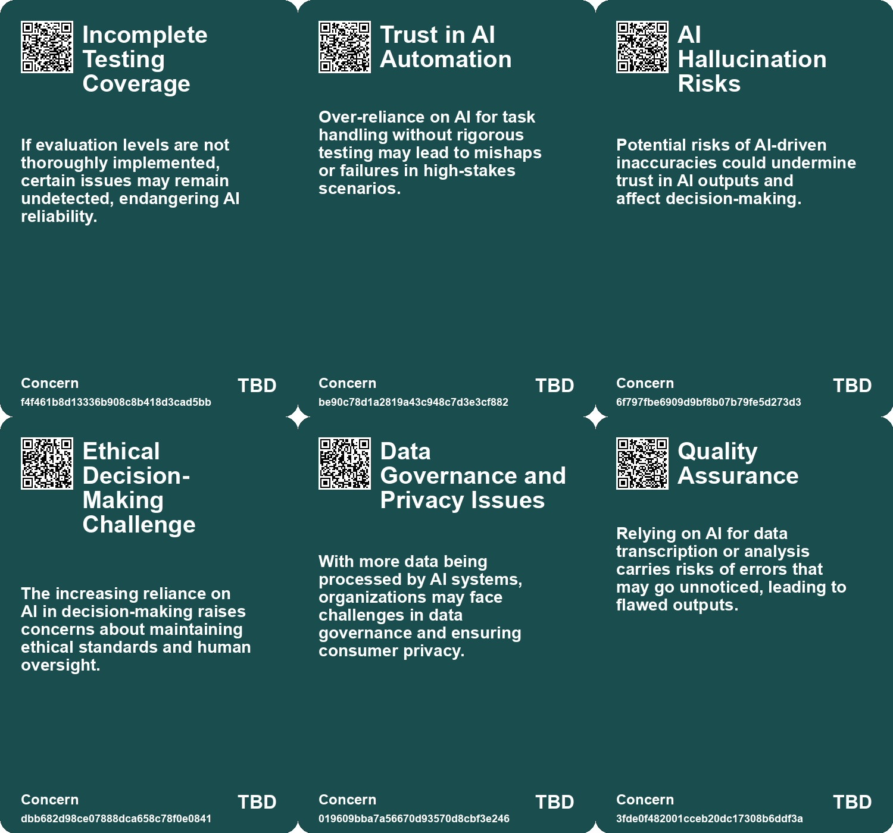
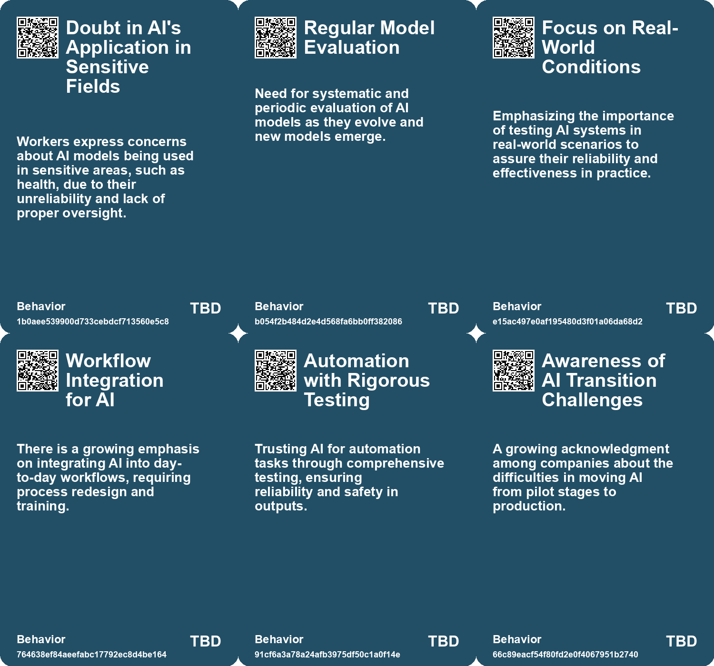
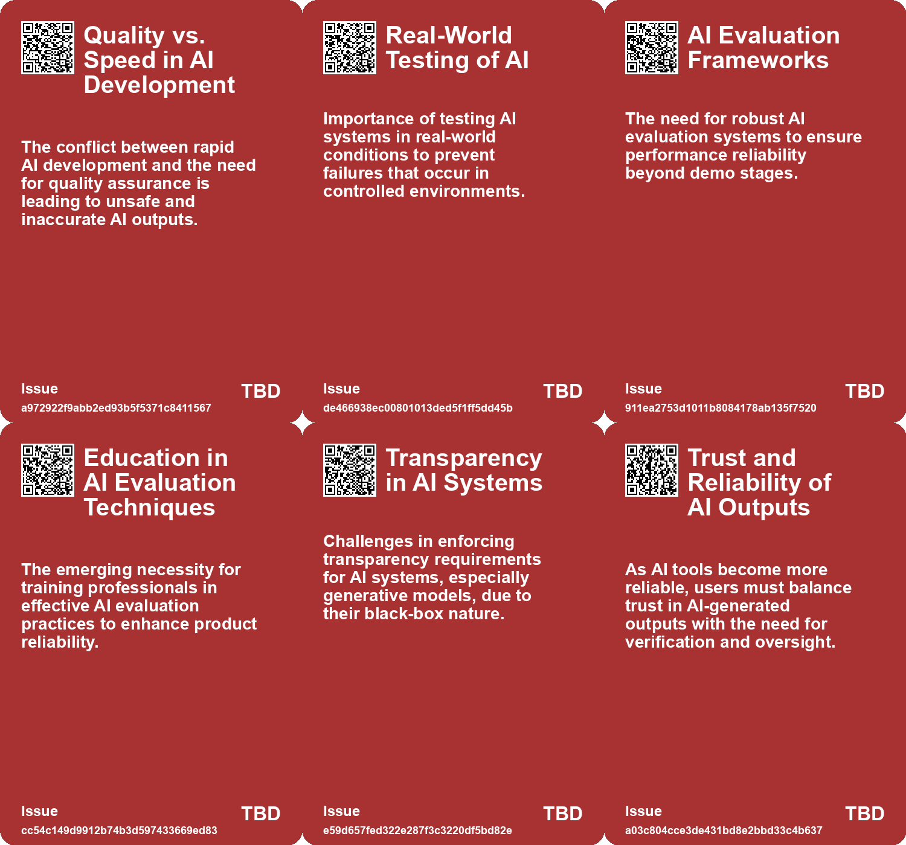
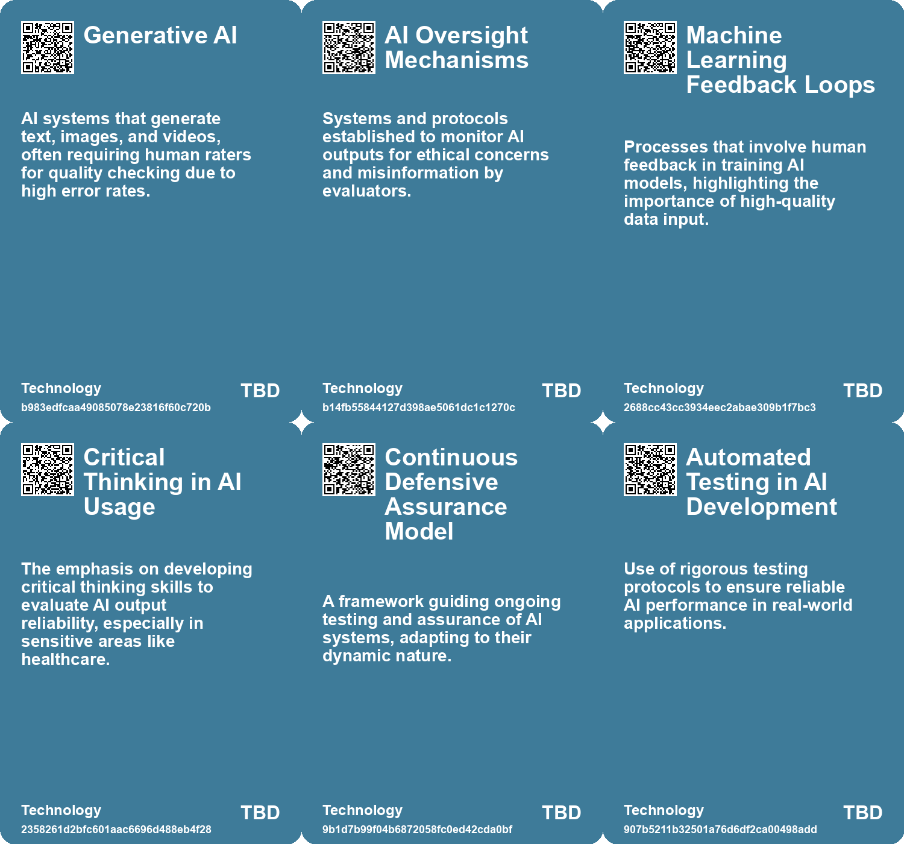

# *Topic*: Quality Control Challenges in AI

# Summary

The rapid advancement of generative AI has prompted a global race among regulators to establish a coherent framework for its use. The current regulatory landscape is fragmented, creating challenges for organizations trying to navigate the complexities of compliance. Key concerns include transparency, bias, privacy violations, and security risks. Regulators aim to create harmonized international regulations that encourage innovation while addressing these risks. Organizations are urged to focus on governance, data management, and individual rights to mitigate potential legal and reputational issues.

Despite increasing investments in AI, a significant number of enterprises are facing project failures. A recent survey revealed that 42% of AI initiatives were abandoned in 2023, a sharp rise from the previous year. Companies are struggling to move AI pilots into production, often scrapping nearly half of their proof-of-concepts due to challenges related to cost, data privacy, and security. Analysts suggest that learning from these failures can foster a culture of experimentation, which is essential for long-term success in AI projects.

The integration of AI into workplaces presents a dual-edged sword. While AI tools can enhance individual productivity, their inconsistent performance can limit overall organizational effectiveness. Many employees, dubbed "secret cyborgs," are using AI without disclosing it to their employers, driven by fears of job displacement and organizational policies. To harness AI's potential, organizations must engage employees in the AI agenda, reduce fears surrounding its use, and address the challenges it presents.

Research indicates that AI can significantly boost productivity and quality in consulting tasks, but its effectiveness diminishes for tasks outside its capabilities. The study identified two distinct patterns of successful AI use: "Centaurs," who blend human and AI strengths, and "Cyborgs," who rely heavily on AI. This highlights the need for a nuanced approach to human-AI collaboration, recognizing both the benefits and limitations of AI in complex tasks.

Concerns about the quality and diversity of AI-generated content have emerged, with some experts warning of a phenomenon known as "The Great Same-ning." This issue underscores the risk of AI producing repetitive outputs that lack creativity. While AI can enhance individual creativity, it may also stifle collective novelty, necessitating thoughtful use of these tools to maintain distinctiveness.

The public sector is also adapting to AI's transformative potential. The Cross-Government Testing Community has developed an AI Testing Framework to ensure effective testing and assurance of AI solutions. This framework aims to create safe, fair, and accountable AI systems, emphasizing the importance of ongoing evaluation to build public trust.

As AI technology evolves, so too does the need for responsible policy. Effective AI regulation involves taking precautions against algorithmic discrimination, ensuring transparency, and complying with international standards. Recent legislative efforts, such as Connecticut's SB 2, exemplify a balanced approach to AI regulation that fosters innovation while prioritizing safety.

The integration of AI into various sectors raises questions about its impact on job markets and economic viability. Research indicates that only a small percentage of tasks involving computer vision are currently suitable for AI automation. This suggests a gradual integration of AI into the workforce, highlighting the need for further exploration of its scalability and potential to create new job categories.

The U.S. government is actively working on initiatives to enhance the safety and trustworthiness of AI systems. The National Institute of Standards and Technology has released draft publications aimed at managing risks and promoting transparency in AI technology. These efforts reflect a commitment to responsible AI innovation and the development of global standards.

The conversation around AI also includes ethical considerations, particularly regarding its potential to compromise election integrity and spread misinformation. Experts emphasize the need for regulation and guidelines to address these societal harms, especially as the 2024 election approaches. The ongoing debate highlights the importance of international cooperation to ensure the safe deployment of AI technologies.

In summary, the evolving landscape of AI presents both opportunities and challenges across various sectors. As organizations navigate the complexities of AI integration, the focus must remain on responsible use, effective regulation, and the ethical implications of this transformative technology.

# Seeds

|    | name                                    | description                                                                                    | change                                                                                                 | 10-year                                                                                                         | driving-force                                                                                                   |
|---:|:----------------------------------------|:-----------------------------------------------------------------------------------------------|:-------------------------------------------------------------------------------------------------------|:----------------------------------------------------------------------------------------------------------------|:----------------------------------------------------------------------------------------------------------------|
|  0 | Distrust Among AI Workers               | AI workers express deep skepticism about the reliability of generative AI systems.             | Shift from trust in AI systems to skepticism and caution among AI professionals.                       | In 10 years, generative AI might be seen as unreliable, affecting its usage in various sectors.                 | Increased awareness of AI's limitations and variability in output quality drives caution.                       |
|  1 | Focus on Continuous Assurance           | Emphasis on continuous evaluation and testing of AI systems for long-term performance.         | From one-time testing approaches to ongoing, iterative assurance processes for AI.                     | Continuous assurance could lead to more reliable and adaptive AI systems across sectors.                        | The dynamic nature of AI systems demands continual vigilance and adjustment over time.                          |
|  2 | Data Fragmentation                      | Organizations struggle with disparate data making AI deployment challenging.                   | Shift from siloed data sources to a more unified and accessible data landscape.                        | Improved data integration could enable more widespread and impactful AI applications across sectors.            | The need for accurate, scalable insights drives investments in better data management solutions.                |
|  3 | Scaled Decision Making Risks            | AI enables decisions at unprecedented speed and volume, raising ethical concerns.              | Move from individualized decision-making processes to automated, large-scale decision-making.          | Widespread acceptance of systems where AI-backed decisions impact large populations instantly.                  | Economic advantages driving organizations to leverage AI for efficiency while ignoring ethical implications.    |
|  4 | Increasing AI Project Failures          | A growing number of enterprises are reporting failures in AI projects.                         | The shift from successful initial AI projects to a significant increase in failures.                   | Organizations may become more cautious and selective in AI adoption, focusing on fewer, more viable projects.   | The need to manage risks and avoid costly failures leads to a more conservative approach to AI experimentation. |
|  5 | Emerging AI Arms Race                   | Control and access to high-quality data becomes a critical factor in AI competition.           | Shift from collaborative research to competitive data monopolization by large firms.                   | In a decade, data ownership may further entrench power imbalances in AI development.                            | The race among tech firms to dominate AI capabilities through data access.                                      |
|  6 | Public-Private Partnership Limitations  | Concerns arise over the effectiveness of public-private partnerships in AI development.        | Shift from optimistic views on public-private partnerships to skepticism about their outcomes.         | In a decade, public-private collaborations may be restructured to prioritize societal needs.                    | The increasing recognition of conflicts of interest in such collaborations.                                     |
|  7 | AI Regulation and Accountability        | Growing calls for measures to ensure AI products are safe and effective.                       | Transition from minimal regulation to strict accountability measures for AI firms.                     | In 10 years, AI may be heavily regulated, ensuring it aligns with public interests.                             | Public demand for safety and ethical standards in AI technology.                                                |
|  8 | Emerging AI-curated Knowledge Ecosystem | AI is increasingly curating knowledge, raising issues of trust and explainability.             | Shift from human-curated knowledge to AI-driven curation, challenging traditional information sources. | AI may dominate information dissemination, leading to a more homogenized and potentially biased knowledge base. | The rapid advancement of AI technologies and the need for efficient information processing.                     |
|  9 | Trustworthiness as a Key Concern        | Trust in AI's outputs is crucial, with emphasis on provenance and traceability of information. | From blind trust in AI outputs to a demand for verifiable and trustworthy information.                 | AI systems may be designed to prioritize transparency and accuracy, fostering user trust.                       | Public demand for accountability and reliability in information sources drives this focus.                      |

# Concerns

|    | name                                                   | description                                                                                                                                       |
|---:|:-------------------------------------------------------|:--------------------------------------------------------------------------------------------------------------------------------------------------|
|  0 | Incomplete Testing Coverage                            | If evaluation levels are not thoroughly implemented, certain issues may remain undetected, endangering AI reliability.                            |
|  1 | Trust in AI Automation                                 | Over-reliance on AI for task handling without rigorous testing may lead to mishaps or failures in high-stakes scenarios.                          |
|  2 | AI Hallucination Risks                                 | Potential risks of AI-driven inaccuracies could undermine trust in AI outputs and affect decision-making.                                         |
|  3 | Ethical Decision-Making Challenge                      | The increasing reliance on AI in decision-making raises concerns about maintaining ethical standards and human oversight.                         |
|  4 | Data Governance and Privacy Issues                     | With more data being processed by AI systems, organizations may face challenges in data governance and ensuring consumer privacy.                 |
|  5 | Quality Assurance                                      | Relying on AI for data transcription or analysis carries risks of errors that may go unnoticed, leading to flawed outputs.                        |
|  6 | Bias and Fairness                                      | Concerns about discrimination or bias in AI outputs can lead to legal challenges and public backlash.                                             |
|  7 | Quality Control in AI Applications                     | Ensuring the safety, legality, and quality of AI outputs is becoming increasingly complex, posing risks for organizations that fail to manage it. |
|  8 | Trustworthiness of AI Systems                          | Challenges in ensuring AI systems are trustworthy might result in harmful outcomes if users cannot rely on AI-generated content.                  |
|  9 | Need for Clear Operational Standards in AI Development | Lack of clear standards for the operation and development of AI can lead to misuse, risks, and challenges in compliance for developers.           |

# Cards

## Concerns

## Behaviors

## Issue

## Technology

# Links

* [Effective Change Management Strategies for AI Integration in Organizations](https://futures.kghosh.me/7eff1fa6b2dda89fa9c1470272891080)
* [Public-Private Partnerships in AI: Risks and Societal Implications](https://futures.kghosh.me/6264095641147fe54800b8f03723f381)
* [MIT Study Challenges AI Job Displacement Fears with Economic Viability Insights](https://futures.kghosh.me/89ee61cc0d9fa77ecb1eb4100622a53f)
* [The Impact of Generative AI and Autonomous Agents on Business Value Creation and Trust Issues](https://futures.kghosh.me/15d4ec180189ca1739398f516844cefb)
* [Thriving in an AI Era: Embracing, Adapting, and Complementing Technology](https://futures.kghosh.me/23a3410059759ba4214235628d4ebd4b)
* [The Urgent Need for Ethical AI Regulations Amid Rapid Development and Deployment](https://futures.kghosh.me/382e9ebc1e518ee49e541da1e6b5f8af)
* [Understanding the Importance of Robust Evaluation Systems in AI Development](https://futures.kghosh.me/036d251f4174f7f407504fbb77e9c7c5)
* [Understanding the Real Risks of AI Beyond Superintelligence and Scalability](https://futures.kghosh.me/ff7f7a51f925c273449a8648a18b7df8)
* [The Security Risks of Rapid AI Integration: A Call for Caution and Awareness](https://futures.kghosh.me/b30a4282af9e53ca673438a8223d9525)
* [Navigating the Dilemma of AI Integration in Organizations: Embracing Secret Cyborgs for Innovation](https://futures.kghosh.me/c42a95f16678ed3834840d48f8e775a3)
* [U.S. Department of Commerce Announces New AI Safety and Trustworthiness Initiatives](https://futures.kghosh.me/fa4fc4145d0de8fe7d6c3a734a47557f)
* [Navigating the Complex Regulatory Landscape of Generative AI: Risks and Strategies for Organizations](https://futures.kghosh.me/43eafc183f7cc060f7cb7fed455e20a7)
* [Understanding Technological Improvement: The Role of Capability Thresholds in AI Advancement](https://futures.kghosh.me/25707767ff6f55ac1d19168e14af7245)
* [Exploring the Future of AI in Knowledge Ecosystems and Global Challenges](https://futures.kghosh.me/a9266018b458295480a07167310458a9)
* [Harnessing AI and Data Science to Transform Supply Chain Management Challenges and Solutions](https://futures.kghosh.me/d31c91e142d6237debea9b93e51a57c6)
* [Exploring the Risks of Homogeneity in AI Generated Content and Its Impact on Creativity](https://futures.kghosh.me/9f228766187c6c10eeddbda5a6dbbe7b)
* [OpenAI CEO Highlights AI Risks to Election Integrity and Calls for Regulation](https://futures.kghosh.me/fd96f58595786b0820cca21394223a66)
* [Evaluating AI Effectiveness: The Need for Customized Assessments Beyond Standard Benchmarks](https://futures.kghosh.me/18de8dd66f7714385f35628458d7671a)
* [AI Workers Share Ethical Concerns and Distrust Over Generative AI Reliability and Safety](https://futures.kghosh.me/440c60817054047ca4be7ef38b8c3074)
* [Examining the Effects of AI on Knowledge Worker Performance: A Study with Boston Consulting Group](https://futures.kghosh.me/c63bd059cb529b72b00ecbdcd2f85268)
* [AI Testing Framework: Ensuring Safe and Effective Public Sector AI Solutions](https://futures.kghosh.me/7ff12b663b4c7b648df68fea6f762d0a)
* [The Transformative Role of Generative AI in Supply Chain and Marketing Management](https://futures.kghosh.me/1b46caa07ff58af58c2e1cf51b86402d)
* [The Global Landscape of AI Regulation: Differing Approaches and Challenges Ahead](https://futures.kghosh.me/c3301a7146d6814214205c4b43376f17)
* [Understanding the 95% AI Pilot Failure Rate and How to Achieve Success](https://futures.kghosh.me/381b17bbec6c2957fe0995c6813483d0)
* [Recent Developments in AI Regulation and Technology: A Review of Key Initiatives and Critiques](https://futures.kghosh.me/a009ccdffaa59f53de56887aa19e6239)
* [Rising AI Project Failures Among Enterprises: Challenges and Insights for 2023](https://futures.kghosh.me/dff752bdc4a60d242f9040d19081c206)