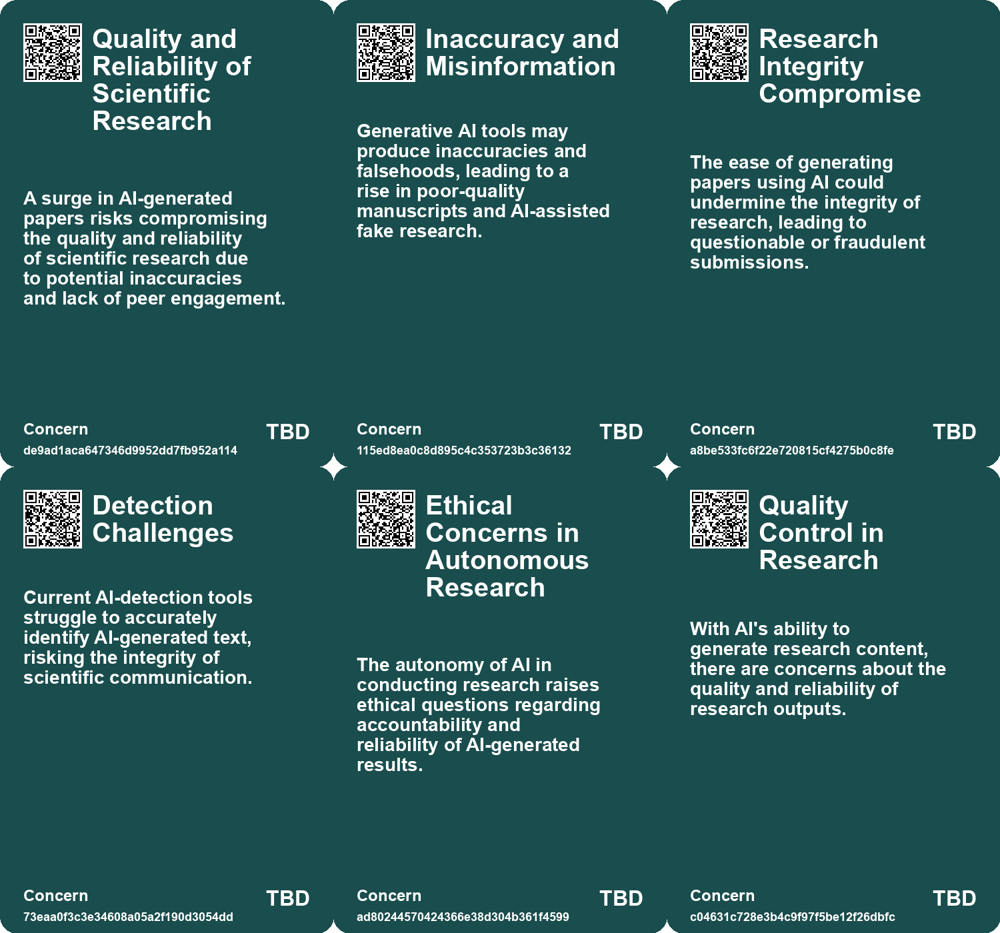
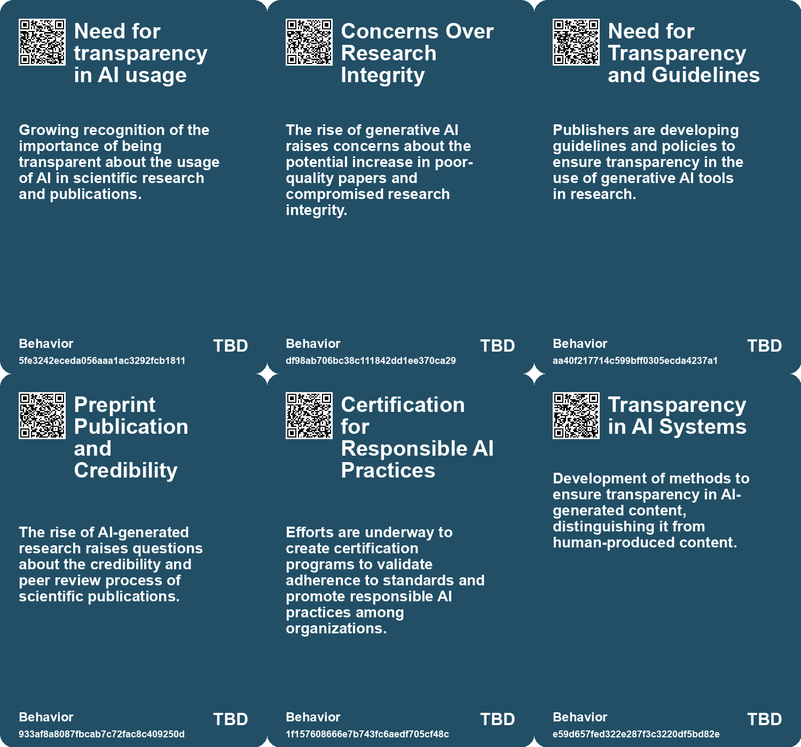
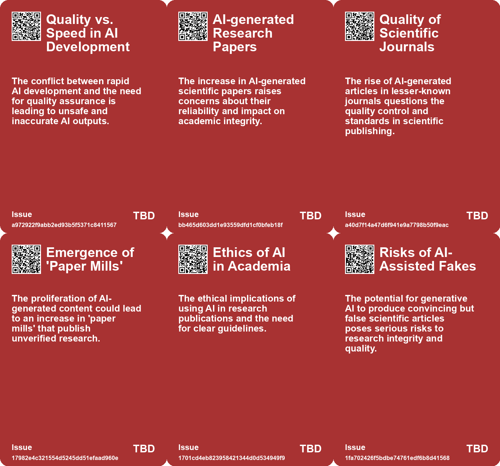
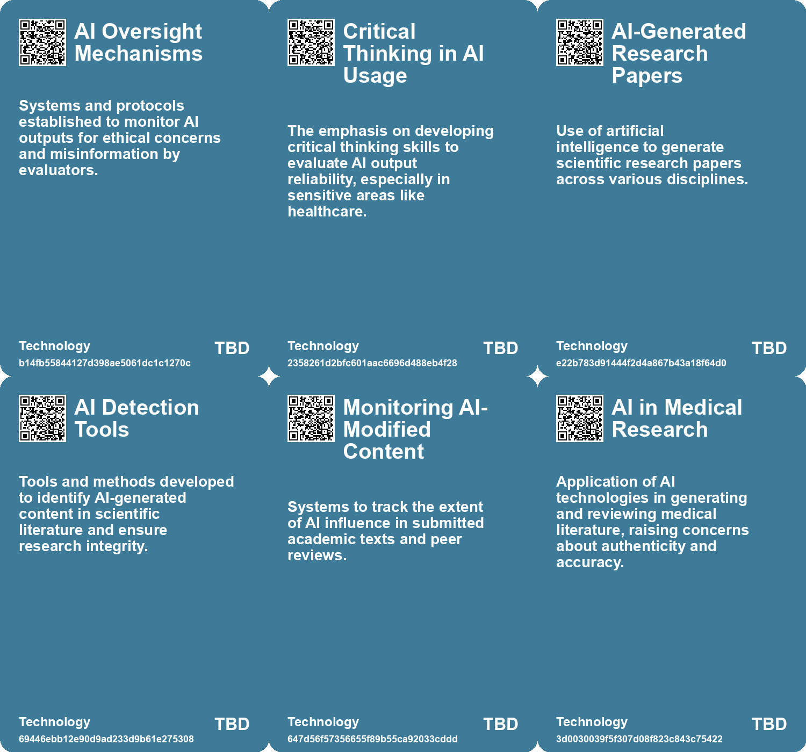

# *Topic*: Quality Control of AI-generated Research

# Summary

The rapid advancement of artificial intelligence (AI) is reshaping various sectors, particularly in scientific research and consulting. The emergence of autonomous AI systems, such as "The AI Scientist," raises questions about the future of traditional research roles. This system can conduct research independently, potentially producing publishable papers while reducing manpower costs. However, this innovation poses risks to job security within the academic community.

In the consulting industry, a study reveals that AI tools significantly enhance productivity and quality among knowledge workers. Consultants using AI demonstrated improved performance in tasks suited to AI capabilities, while those relying on AI for more complex tasks faced challenges. This highlights the dual nature of AI integration, where some workers act as "Centaurs," effectively collaborating with AI, while others become overly dependent, risking their problem-solving skills.

Regulatory frameworks are evolving in response to the growing influence of AI. The U.S. Department of Commerce has initiated measures to ensure the safe and trustworthy development of AI systems, including draft publications from the National Institute of Standards and Technology (NIST). These efforts aim to promote transparency and manage risks associated with AI technology. Meanwhile, the European Union is preparing a Code of Practice to enhance compliance with upcoming AI regulations, focusing on copyright protections and transparency.

Concerns about the integrity of academic research are mounting as AI-generated papers proliferate. A notable increase in AI-authored articles has been observed, with many receiving little to no citations. This trend raises alarms about the potential dilution of scientific rigor and the challenges of distinguishing legitimate research from AI-generated content. The rise of low-quality "genAI papers" threatens the traditional peer review process, prompting calls for vigilance in maintaining research standards.

The impact of AI extends beyond research and consulting into the creative industries. Artists and creative professionals face both opportunities and challenges as generative AI tools become more prevalent. While these tools can enhance creativity, they also risk undermining livelihoods by producing homogeneous content and exploiting artists' work without consent. The need for a new framework to protect artists' rights and ensure data consent is becoming increasingly urgent.

Public perception of AI reveals a divide between experts and the general population. A Pew Research Center report indicates that while AI experts are optimistic about the technology's potential benefits, the public expresses significant concerns about job loss and biased outcomes. Women, in particular, show greater apprehension towards AI, highlighting the need for diverse representation in discussions about AI development and regulation.

As AI continues to evolve, its implications for human behavior and job performance are becoming clearer. Research indicates that while AI can enhance productivity, it may also lead to over-reliance and complacency among workers. This trend underscores the importance of using AI as a supportive tool rather than allowing it to dominate decision-making processes.

The landscape of AI regulation remains fragmented, with varying approaches across the U.S., EU, and China. The EU's precautionary stance contrasts with the more hands-off approach of the U.S., while China seeks to balance innovation with control. As the regulatory environment develops, organizations must navigate these complexities to mitigate risks associated with AI deployment.

# Seeds

|    | name                                       | description                                                                                    | change                                                                                         | 10-year                                                                                                       | driving-force                                                                                                  |
|---:|:-------------------------------------------|:-----------------------------------------------------------------------------------------------|:-----------------------------------------------------------------------------------------------|:--------------------------------------------------------------------------------------------------------------|:---------------------------------------------------------------------------------------------------------------|
|  0 | Focus on Continuous Assurance              | Emphasis on continuous evaluation and testing of AI systems for long-term performance.         | From one-time testing approaches to ongoing, iterative assurance processes for AI.             | Continuous assurance could lead to more reliable and adaptive AI systems across sectors.                      | The dynamic nature of AI systems demands continual vigilance and adjustment over time.                         |
|  1 | Concerns over paper quality and integrity  | Increased use of AI tools raises fears about the quality of scientific manuscripts.            | Shift from high-quality, human-reviewed papers to potentially unreliable AI-generated content. | Scientific publishing may see an increase in low-quality submissions and challenges in maintaining integrity. | The ease with which AI tools can produce content without rigorous oversight or expertise.                      |
|  2 | AI Scientist Development                   | An AI system that can autonomously conduct scientific research has been developed.             | Shift from human-led research to AI-driven scientific inquiry.                                 | In 10 years, AI could dominate scientific research, reshaping academic structures and methodologies.          | The need for cost-effective and efficient research processes is driving the development of autonomous systems. |
|  3 | AI Integration in Academic Research        | AI's increasing role in writing and publishing academic papers.                                | Shift from traditional academic writing to AI-assisted writing processes.                      | Academic publishing will be dominated by AI-generated content, changing review and publication standards.     | The need for faster publication rates and improved writing quality in academia.                                |
|  4 | Automation of Peer Review                  | AI is starting to automate the peer review process in academic publishing.                     | Transition from human-based peer review to AI-assisted reviews.                                | Peer review will be predominantly automated, raising questions about quality and bias.                        | Overwhelming volume of submissions necessitating faster review processes.                                      |
|  5 | AI in Research Methodology                 | AI tools are changing how researchers conduct experiments and analyze data.                    | Evolution of research methods to include AI-driven analysis and hypothesis generation.         | Research will increasingly rely on AI for data analysis, potentially leading to new methodologies.            | The need for more efficient and effective research processes.                                                  |
|  6 | Bridging Academia and Public Understanding | AI could help translate academic research for public consumption.                              | From isolated academic findings to accessible public knowledge through AI.                     | There will be a more informed public engagement with research due to AI simplification.                       | Desire to make academic research relevant and understandable to broader audiences.                             |
|  7 | Ethical Concerns in AI Use                 | Concerns arise over AI's role in producing biased or flawed research.                          | Shift from traditional ethical considerations to new challenges posed by AI in research.       | The landscape of research ethics will evolve to address AI-related challenges.                                | Increasing reliance on AI tools without fully understanding their implications.                                |
|  8 | AI in Peer Review Processes                | Introduction of AI in peer review, potentially affecting quality of feedback.                  | Change from human-led peer review to AI-assisted evaluations in academia.                      | Peer review processes may rely heavily on AI, impacting the integrity of scientific validation.               | Desire for efficiency and faster publication times in academic publishing.                                     |
|  9 | Trustworthiness as a Key Concern           | Trust in AI's outputs is crucial, with emphasis on provenance and traceability of information. | From blind trust in AI outputs to a demand for verifiable and trustworthy information.         | AI systems may be designed to prioritize transparency and accuracy, fostering user trust.                     | Public demand for accountability and reliability in information sources drives this focus.                     |

# Concerns

|    | name                                           | description                                                                                                                                                     |
|---:|:-----------------------------------------------|:----------------------------------------------------------------------------------------------------------------------------------------------------------------|
|  0 | Quality Control of AI-generated Research       | The rise of AI-generated papers with poor quality threatens the integrity of scientific publishing and academic standards.                                      |
|  1 | Public Trust in Scientific Research            | The proliferation of low-quality AI-generated research may erode public trust in the reliability of scientific findings.                                        |
|  2 | Quality and Reliability of Scientific Research | A surge in AI-generated papers risks compromising the quality and reliability of scientific research due to potential inaccuracies and lack of peer engagement. |
|  3 | Research Integrity Compromise                  | The ease of generating papers using AI could undermine the integrity of research, leading to questionable or fraudulent submissions.                            |
|  4 | Ethical Concerns in Autonomous Research        | The autonomy of AI in conducting research raises ethical questions regarding accountability and reliability of AI-generated results.                            |
|  5 | Quality Control in Research                    | With AI's ability to generate research content, there are concerns about the quality and reliability of research outputs.                                       |
|  6 | Flood of AI-Generated Content                  | The surge of AI-created research content could overwhelm existing systems, compromising the research quality.                                                   |
|  7 | Research Integrity and Ethics                  | The need to re-evaluate ethical standards in light of AI's role in generating and reviewing research.                                                           |
|  8 | AI in Peer Review Process                      | There is a risk that AI may influence peer review, leading to biased or unqualified evaluations of research.                                                    |
|  9 | Ethical Concerns in Publishing                 | The potential for AI-generated errors raises questions about the ethical standards of publishing practices in academia.                                         |

# Cards

## Concerns

## Behaviors

## Issue

## Technology

# Links

* [Exploring the Future of Knowledge in the Age of AI: From Peer Review to NotebookLM](https://futures.kghosh.me/2c3e163f113838429299866828dad17c)
* [Exploring the Rising Trend of AI-Generated Research Papers and Its Implications](https://futures.kghosh.me/9b642aee67b2341d5b1597cbf199fa56)
* [The Impact of Generative AI and Autonomous Agents on Business Value Creation and Trust Issues](https://futures.kghosh.me/15d4ec180189ca1739398f516844cefb)
* [Navigating AI Governance: Building Trust and Compliance in a Complex Landscape](https://futures.kghosh.me/ae5781502d3793bed9753abfaaae817c)
* [The Impact of Generative AI on Creative Professions and the Need for New Data Rights Frameworks](https://futures.kghosh.me/858dac884c8fe7dfa6fc0c2cf093e97f)
* [The Urgent Need for Ethical AI Regulations Amid Rapid Development and Deployment](https://futures.kghosh.me/382e9ebc1e518ee49e541da1e6b5f8af)
* [The Transformative Impact of AI on Academic Research and Its Future Challenges](https://futures.kghosh.me/04ea36e5447d3914bd8e463d50f2715f)
* [Contrasting Views on AI: Public Concerns vs. Expert Optimism and Advocacy for Regulation](https://futures.kghosh.me/e2ce30b29c24272c98349d7a121be360)
* [U.S. Department of Commerce Announces New AI Safety and Trustworthiness Initiatives](https://futures.kghosh.me/fa4fc4145d0de8fe7d6c3a734a47557f)
* [Navigating the Complex Regulatory Landscape of Generative AI: Risks and Strategies for Organizations](https://futures.kghosh.me/43eafc183f7cc060f7cb7fed455e20a7)
* [Generative AI's Impact on Scientific Writing: Opportunities and Concerns](https://futures.kghosh.me/60f3a64993d5e355561c59e5d641bec9)
* [Exploring the Risks of Homogeneity in AI Generated Content and Its Impact on Creativity](https://futures.kghosh.me/9f228766187c6c10eeddbda5a6dbbe7b)
* [Establishing Responsible AI Governance: A Guide for Organizations in an Evolving Landscape](https://futures.kghosh.me/fab122d29aed97045e0cc1ea77bdef44)
* [Exploring AI's Impact on Legal Analysis: Insights from a Randomized Trial](https://futures.kghosh.me/4f3697c8144f776170502c3036e1d6f3)
* [EU's New Code of Practice Aims to Enhance Transparency and Compliance in AI Industry](https://futures.kghosh.me/b4018274e2792c9e4e374ad3ce424478)
* [The AI Scientist: A Revolutionary Autonomous AI for Scientific Research](https://futures.kghosh.me/3607a211a5ceadc4c9c4f86cd5fcd2df)
* [The Impact of AI on Human Performance: A Study on Complacency and Skill Reduction](https://futures.kghosh.me/82d675e881c727c6bf2f35d6a78e72f6)
* [AI Workers Share Ethical Concerns and Distrust Over Generative AI Reliability and Safety](https://futures.kghosh.me/440c60817054047ca4be7ef38b8c3074)
* [Examining the Effects of AI on Knowledge Worker Performance: A Study with Boston Consulting Group](https://futures.kghosh.me/c63bd059cb529b72b00ecbdcd2f85268)
* [Concerns Over AI Misuse in Scientific Literature: A Growing Challenge for Research Integrity](https://futures.kghosh.me/6dd4fe4c2f8f6e8fcc6f47e7ac1641cf)
* [AI Testing Framework: Ensuring Safe and Effective Public Sector AI Solutions](https://futures.kghosh.me/7ff12b663b4c7b648df68fea6f762d0a)
* [European Commission's Upcoming AI Code Faces Industry Lobbying and Delays Before August Release](https://futures.kghosh.me/a8cef81ba2485cea47c7a49121ff1737)
* [The Global Landscape of AI Regulation: Differing Approaches and Challenges Ahead](https://futures.kghosh.me/c3301a7146d6814214205c4b43376f17)
* [Recent Developments in AI Regulation and Technology: A Review of Key Initiatives and Critiques](https://futures.kghosh.me/a009ccdffaa59f53de56887aa19e6239)