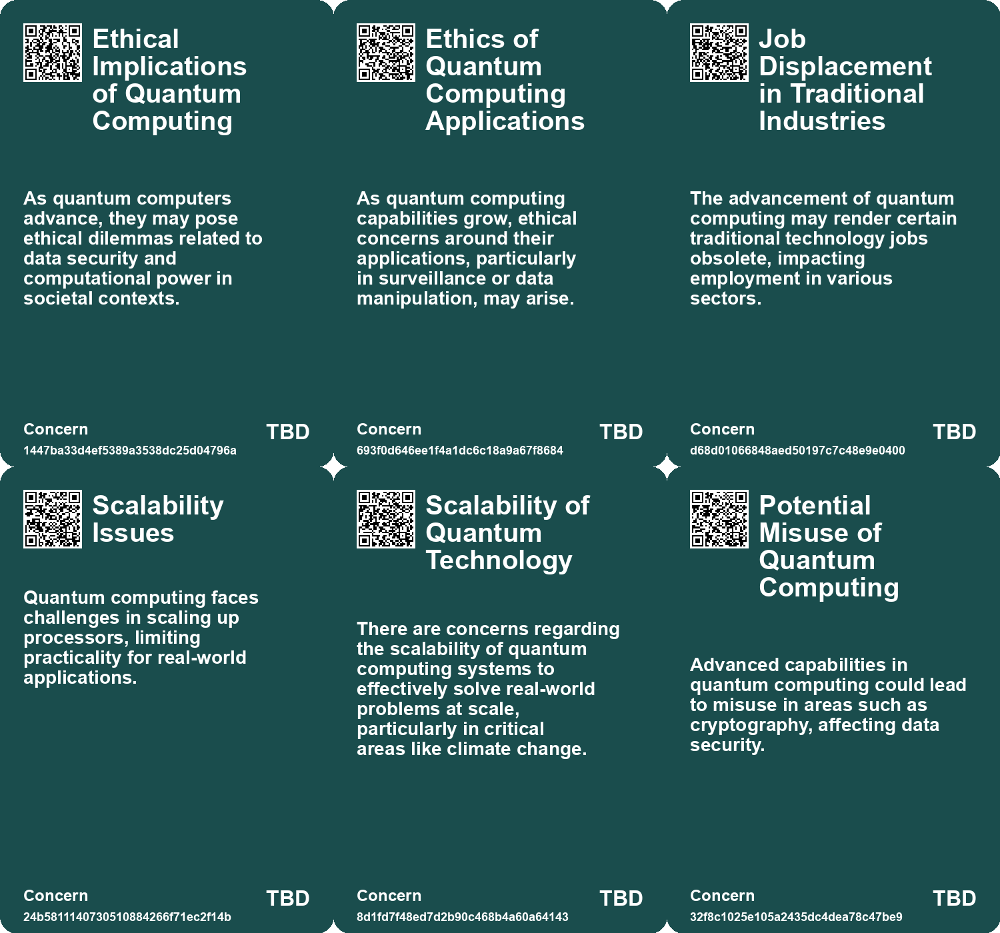
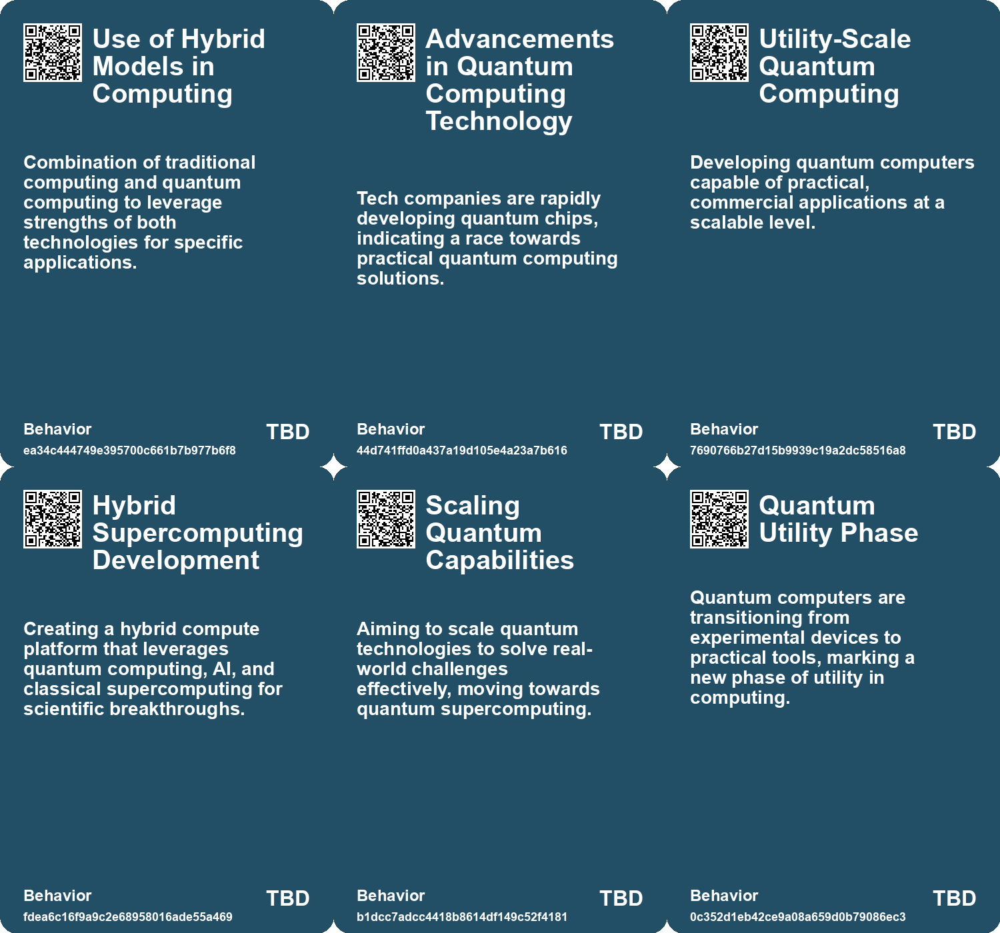
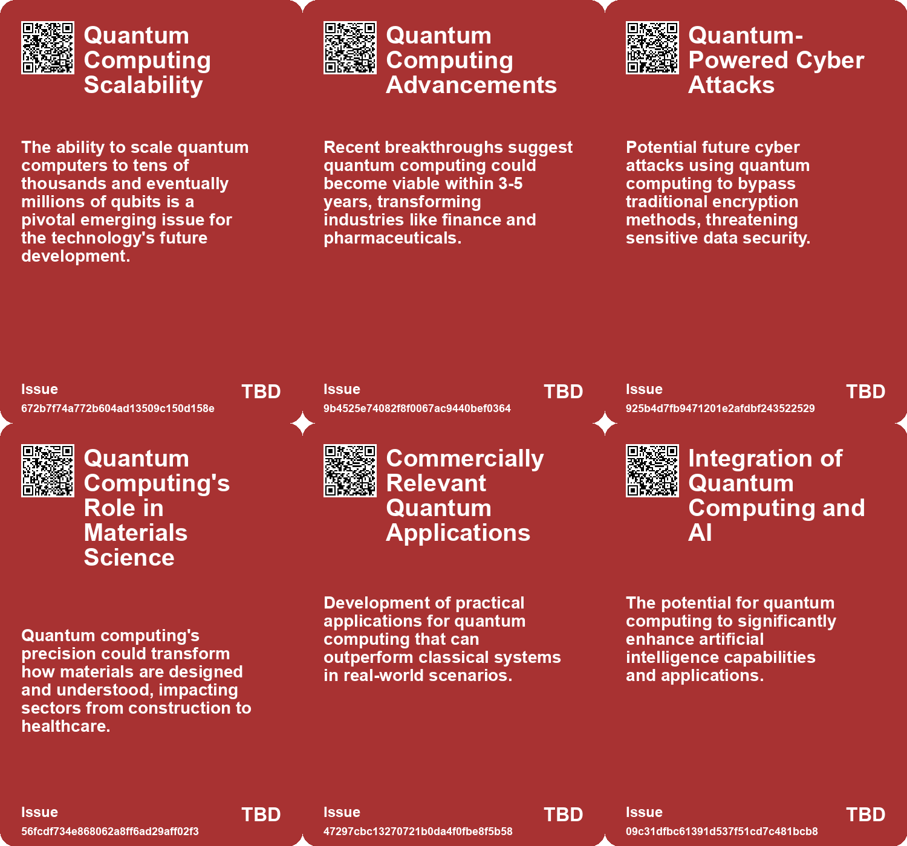
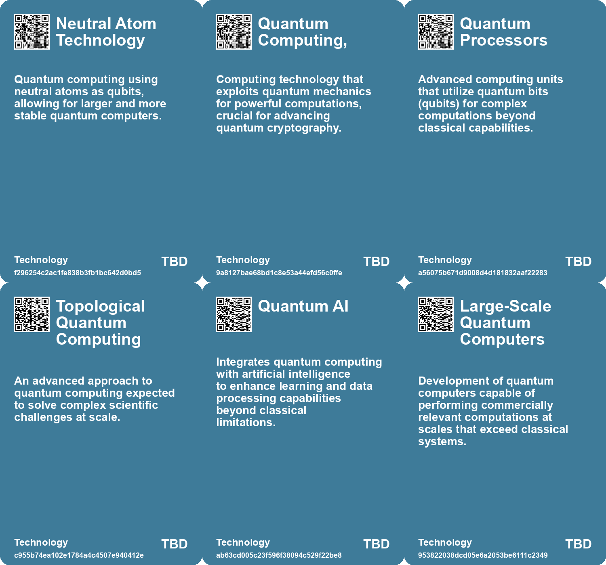

# *Topic*: Quantum Computing

# Summary

Quantum computing is advancing rapidly, with significant breakthroughs in scalability and error correction. Researchers at the University of Oxford have demonstrated quantum teleportation, allowing processors to communicate wirelessly and collaborate on complex problems. This innovation could lead to a distributed quantum computing system and potentially a quantum internet. Meanwhile, Google’s Willow chip has shown remarkable performance in reducing errors and speeding up computations, marking a step toward practical applications in various fields.

Major tech companies are making strides in quantum chip development. Amazon has introduced its Ocelot chip, which aims to create efficient large-scale quantum systems, while Microsoft has unveiled Majorana 1, a chip based on a new architecture that promises improved qubit stability and scalability. These developments are crucial as the industry seeks to transition from experimental devices to commercially viable quantum computers.

The urgency for enhanced cybersecurity measures is growing as quantum computing capabilities advance. The UK's National Cyber Security Centre warns that businesses must adopt post-quantum cryptography to protect against future quantum-powered cyber threats. This aligns with similar guidance from the US, emphasizing the need for organizations to upgrade their cryptographic systems to safeguard against potential vulnerabilities.

In the realm of quantum sensing, researchers at CU Boulder have developed a technique that allows a single sensor to measure multiple variables simultaneously with high precision. This advancement could revolutionize infrastructure monitoring and environmental sensing, addressing challenges posed by urban growth and climate change. The integration of quantum sensing technologies into urban management systems holds promise for creating smarter, more sustainable cities.

AI is playing a transformative role in physics and quantum research. Machine-learning algorithms are enhancing experimental design, leading to breakthroughs in quantum entanglement and gravitational wave detection. Researchers are leveraging AI to propose innovative designs for sensitive instruments, potentially improving detection capabilities significantly. This intersection of AI and quantum research is paving the way for new discoveries and applications.

The exploration of new materials is also gaining traction. Researchers at MIT have found that nanoparticles in solar photovoltaics can emit identical photons, which may simplify the development of optically based quantum computers. This approach contrasts with traditional methods that rely on ultracold atoms, suggesting a shift toward using light as the fundamental unit in quantum computing.

Finally, the development of new AI chips, such as Taichi from Tsinghua University, highlights the potential for photonic computing. This chip, which processes data using light instead of electricity, is significantly more energy-efficient than traditional electronic chips. As the demand for AI infrastructure grows, innovations like Taichi could play a crucial role in shaping the future of computing and artificial intelligence.

# Seeds

|    | name                                         | description                                                                                                          | change                                                                                                         | 10-year                                                                                                                     | driving-force                                                                                                  |
|---:|:---------------------------------------------|:---------------------------------------------------------------------------------------------------------------------|:---------------------------------------------------------------------------------------------------------------|:----------------------------------------------------------------------------------------------------------------------------|:---------------------------------------------------------------------------------------------------------------|
|  0 | Applications of Quantum in Materials Science | Potential for quantum computing to revolutionize materials science and efficiency improvements.                      | From traditional methods of material testing to advanced simulations using quantum capabilities.               | Materials science breakthroughs may accelerate technology advancements across various industries.                           | The push for innovation in creating efficient materials to meet energy and performance demands.                |
|  1 | Increase in Public Interest                  | Public interest in quantum computing appears to be rising as advancements are discussed.                             | Shift from niche interest to broader public awareness and application of quantum technology.                   | In 10 years, widespread public understanding and acceptance of quantum computing could transform industries.                | Growing recognition of quantum computing's potential to solve real-world problems.                             |
|  2 | Quantum-Powered Cyber Attacks                | An emergence of cyber threats utilizing quantum computing technologies.                                              | Current cybersecurity methods will become obsolete as quantum attacks become prevalent.                        | Quantum computing will redefine cyber threats, needing entirely new security infrastructures in organizations.              | Rapid advancements in quantum computing capabilities that could be exploited by malicious actors.              |
|  3 | Topological Core Architecture                | Introduction of a groundbreaking architecture for quantum computing utilizing topological properties.                | Transition from traditional qubit designs to topologically secured qubits enabling stability and scalability.  | Widespread industrial adoption of quantum computers delivering complex problem solving capabilities.                        | Accelerated demand for computing power to address large-scale complex problems in various fields.              |
|  4 | Hybrid Supercomputing Systems                | Development of hybrid supercomputing platforms integrating quantum, AI, and classical computing.                     | Shift from isolated quantum systems to integrated hybrid computing solutions for research.                     | Widespread use of hybrid computing systems to solve complex scientific problems efficiently.                                | The demand for advanced computational tools to accelerate scientific discovery and innovation.                 |
|  5 | Quantum Computing's Shift to Utility Phase   | Quantum computers are transitioning from experimental devices to practical tools for various applications.           | Quantum computers are moving from experimental phases to becoming useful in real-world applications.           | In ten years, quantum computers may be integral in industries like cryptography, materials science, and optimization.       | Advancements in technology and investment from corporations and researchers are driving this transition.       |
|  6 | Quantum Computing in Industrial Research     | Quantum computing is moving from academia to industrial research and development environments.                       | The focus is changing from university labs to corporate research facilities for quantum computing development. | In ten years, quantum computing could be a standard tool in various industries, transforming research and development.      | Investment from corporations and venture capitalists is pushing quantum research into industrial applications. |
|  7 | Emergence of Hybrid Quantum Technologies     | A combination of various quantum computing technologies is likely to emerge as the most effective solution.          | The approach to quantum computing is evolving from single technology use to hybrid solutions.                  | In ten years, hybrid quantum computing solutions may dominate the landscape, leveraging strengths of multiple technologies. | The complexity of quantum problems is motivating the exploration of diverse technological approaches.          |
|  8 | Quantum Teleportation Breakthrough           | Scientists achieved quantum teleportation of algorithms between distant processors, enhancing distributed computing. | Shift from single-location quantum processors to interconnected remote quantum systems.                        | In 10 years, we may see large-scale quantum networks facilitating complex computations.                                     | Advancements in quantum entanglement and teleportation techniques drive scalability in quantum computing.      |
|  9 | Scalability Solutions in Quantum Computing   | Potential solutions for scalability issues in quantum computing are being explored.                                  | From small-scale quantum processors to interconnected scalable systems.                                        | Large-scale quantum computers could become mainstream, solving previously impossible problems.                              | Demand for complex problem solving motivates scalability innovations.                                          |

# Concerns

|    | name                                       | description                                                                                                                                                                      |
|---:|:-------------------------------------------|:---------------------------------------------------------------------------------------------------------------------------------------------------------------------------------|
|  0 | Ethical Implications of Quantum Computing  | As quantum computers advance, they may pose ethical dilemmas related to data security and computational power in societal contexts.                                              |
|  1 | Ethics of Quantum Computing Applications   | As quantum computing capabilities grow, ethical concerns around their applications, particularly in surveillance or data manipulation, may arise.                                |
|  2 | Job Displacement in Traditional Industries | The advancement of quantum computing may render certain traditional technology jobs obsolete, impacting employment in various sectors.                                           |
|  3 | Scalability Issues                         | Quantum computing faces challenges in scaling up processors, limiting practicality for real-world applications.                                                                  |
|  4 | Scalability of Quantum Technology          | There are concerns regarding the scalability of quantum computing systems to effectively solve real-world problems at scale, particularly in critical areas like climate change. |
|  5 | Potential Misuse of Quantum Computing      | Advanced capabilities in quantum computing could lead to misuse in areas such as cryptography, affecting data security.                                                          |
|  6 | Technological Accessibility                | As quantum computing technology evolves, ensuring equitable access to such advanced tools for researchers and developers is a major concern.                                     |
|  7 | Dependence on Quantum Technologies         | Increased reliance on quantum computing could lead to vulnerabilities if the technology is not adequately secured against possible failures or attacks.                          |
|  8 | Cryptography Vulnerability                 | Quantum computers may break current encryption algorithms, necessitating development of quantum-resistant cryptography to ensure data security.                                  |
|  9 | Market Disruption                          | The transition to quantum computing may disrupt existing markets, particularly in sectors heavily reliant on current computing technologies.                                     |

# Cards

## Concerns

## Behaviors

## Issue

## Technology

# Links

* [A Vision for Expanding AI Infrastructure to Drive Economic Growth and Innovation](https://futures.kghosh.me/a1045c1231e63ffbb2422c8d850c5e6f)
* [Innovative Quantum Sensing Technique Revolutionizes Infrastructure and Environmental Monitoring](https://futures.kghosh.me/92eababae2221aa6578c0eb95e5c370a)
* [Caltech Team Develops New Quantum Computer with 6100 Qubits, Breaking Previous Record](https://futures.kghosh.me/2aad0d2567f4d35e5b86eb09b2b070bd)
* [Amazon Launches First Quantum Chip Ocelot, Aiming for Efficient Quantum Computing Solutions](https://futures.kghosh.me/97e5457c8666b4e72bf64cd183f31127)
* [Introducing Willow: Google's Revolutionary Quantum Chip Achieving Exponential Error Reduction and Unmatched Performance](https://futures.kghosh.me/26132972979838f349a8ea5a48eeb700)
* [The Impact of AI on Physics: Revolutionizing Experimentation and Discoveries](https://futures.kghosh.me/ee969ebdef3dce39abca4f85aa16ee3b)
* [The Rise of Quantum Computing: From Theory to Practical Applications](https://futures.kghosh.me/0ac55ea216cbcc501240ef9496a7c51b)
* [Taiwan's Ambitious AI Island Initiative Faces Energy and Geopolitical Challenges](https://futures.kghosh.me/9696933ed36b35a793b84c6ba725d8e6)
* [The Transition from Mathematical Models to Computer Simulations in Theoretical Physics](https://futures.kghosh.me/e2b9fc5eb7cf1a6f906df331567447b4)
* [Reviving von Neumann's Mathematics to Decode Space-Time and Quantum Mechanics](https://futures.kghosh.me/d985bde7290f11bbe58cafd94e80855d)
* [Harnessing Quantum Sensing for Sustainable Urban Infrastructure Management](https://futures.kghosh.me/4fddc420c6c76d438d8447e1828e7ed5)
* [Advancements in Quantum Computing and Leadership in Organizational Transformation](https://futures.kghosh.me/5341b0ceae7f2a93996fac75e1c734c2)
* [New Quantum Experiment Challenges Local Realism with Superconducting Qubits](https://futures.kghosh.me/cfa7b88cc31a76b552fd670d315800cc)
* [Tsinghua University's Taichi: A Revolutionary Light-Based AI Chip for Future Computing](https://futures.kghosh.me/1aec7cb8723d807f5486e963a0eb6337)
* [Advancements in Quantum Computing: Overcoming Scalability with Quantum Teleportation](https://futures.kghosh.me/4a29bff5e6b05b4826468801ee240edb)
* [Advancements in Quantum Cryptography: New Mathematical Foundations Unveiled](https://futures.kghosh.me/8310271ed396d421cd77c35c312b1f5e)
* [Advancing Quantum Chemistry: IBM and Lockheed Martin's Breakthrough in Modeling Open-Shell Molecules](https://futures.kghosh.me/e888ed1655341fad8a7a1f41f83edb34)
* [MIT Researchers Unveil New Quantum Light Source Using Lead-Halite Perovskite Nanoparticles](https://futures.kghosh.me/059bc68ff6f1a35906ae3e976a00c335)
* [UK Cybersecurity Agency Urges Firms to Adopt Post-Quantum Cryptography by 2035](https://futures.kghosh.me/e09fec2736014f7199149dc8b70af3c4)
* [Groundbreaking Quantum Teleportation Demonstrated at Oxford University for Scalable Technology](https://futures.kghosh.me/4b9bf29ac9c09642bef612847f5b9223)
* [Exploring the Future of Neural Networks through Sound and Physical Systems](https://futures.kghosh.me/92fd13cc9ae2e437ede8175d350860ef)
* [Majorana 1 : Une avancée majeure vers l'informatique quantique pratique avec des qubits topologiques](https://futures.kghosh.me/6bac89b8c5fdf1c1e33c8e1da193827a)
* [Nvidia's AI Chips Outpace Moore's Law, According to CEO Jensen Huang](https://futures.kghosh.me/0db919eaa86b089eb9f65219cfb84f1a)
* [Microsoft's Majorana 1 Chip Represents a Breakthrough in Quantum Computing Technology](https://futures.kghosh.me/2323b6ccbe23355cae8988de1adfb801)
* [Leveraging AI to Transform Experimental Design in Physics](https://futures.kghosh.me/f46e3ffd618b6a2499dd998c77821b40)
* [Microsoft Unveils Topoconductors: A New State of Matter Revolutionizing Quantum Computing](https://futures.kghosh.me/4dc27c3427b9c3021d4a20603e51e516)
* [Microsoft and Quantinuum Achieve Historic Milestone in Quantum Computing Reliability](https://futures.kghosh.me/2d67e5dd7f8c22dd5e55636e40072f0c)