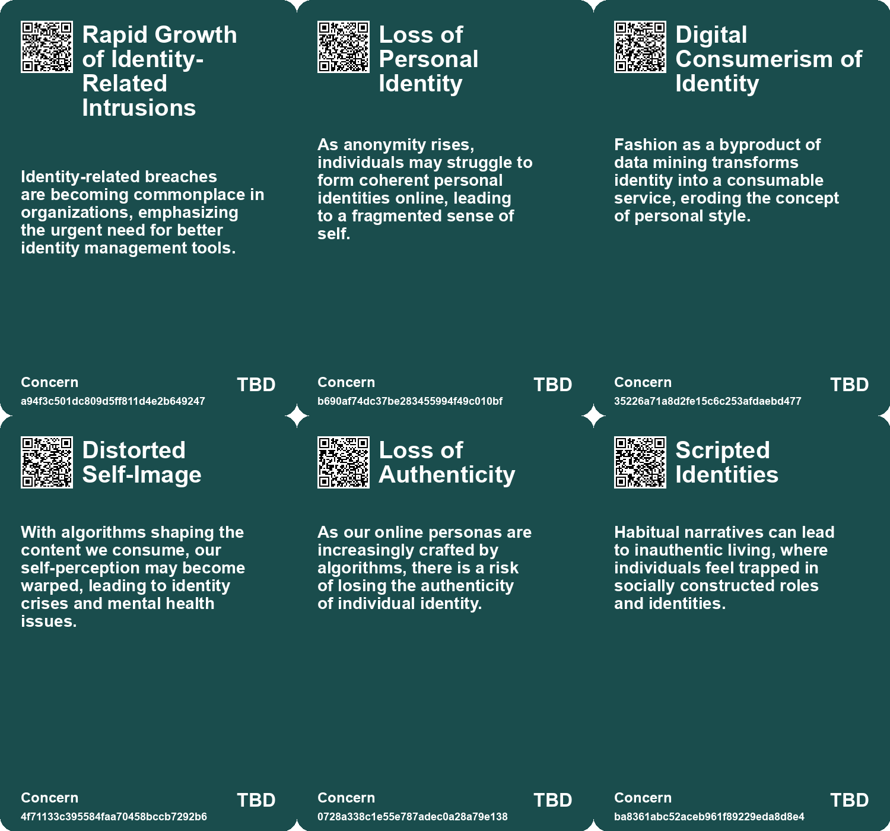
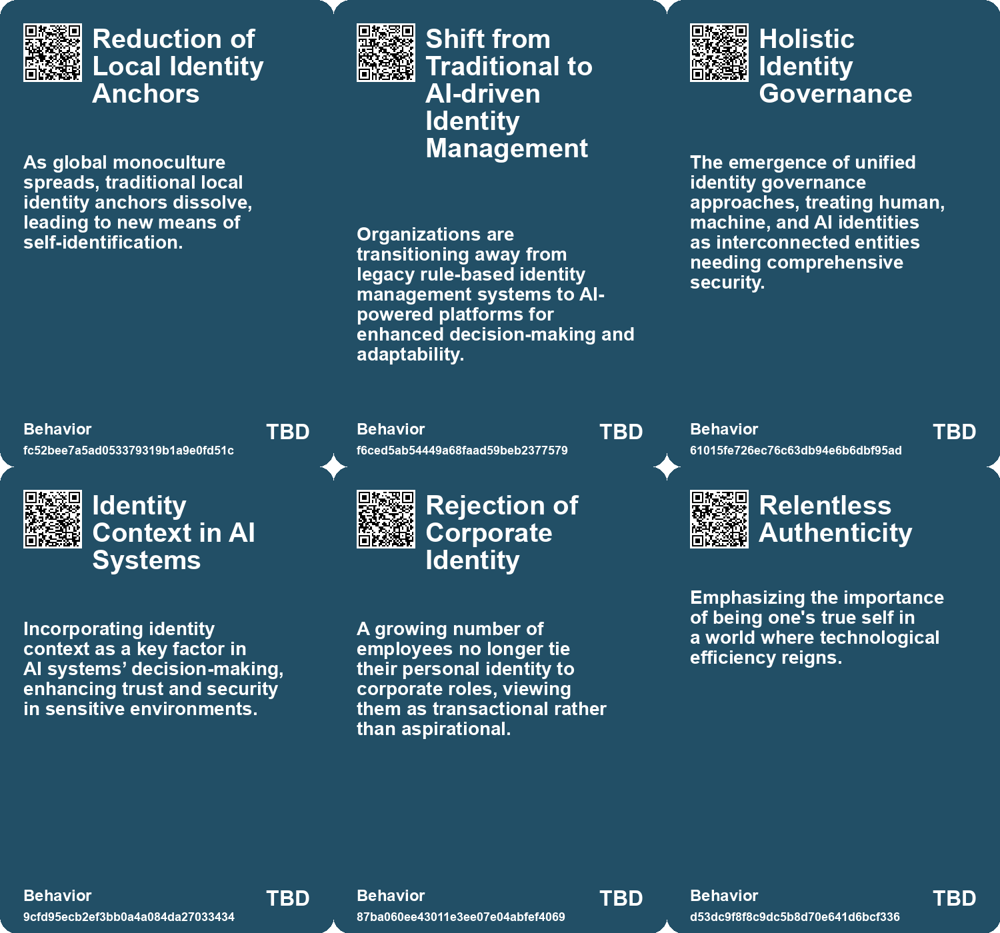
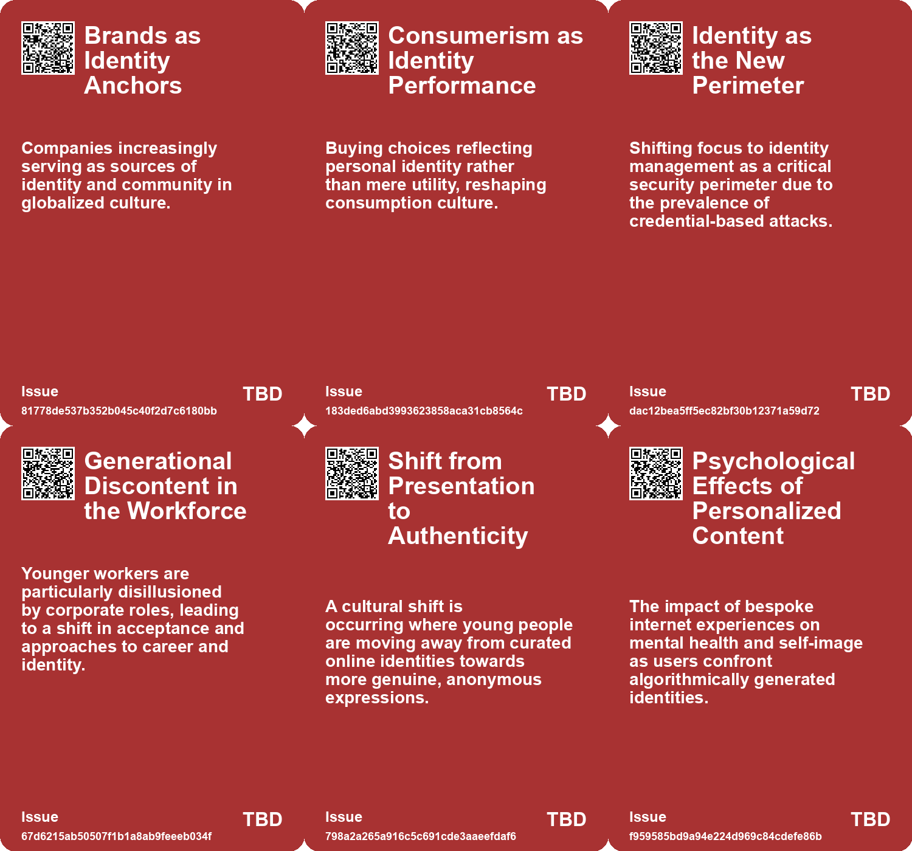
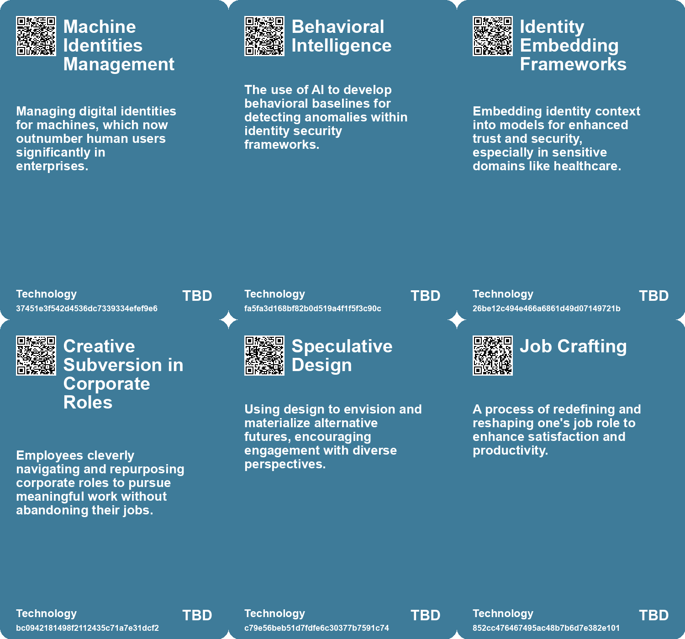

# *Topic*: Redefining Identities

# Summary

The evolving landscape of identity and security is a prominent theme, particularly in the context of generative AI. As organizations adopt AI-powered identity security systems, they face increased vulnerabilities, such as a significant rise in voice phishing attacks. The shift towards a zero-trust approach highlights the need for integrated identity management to combat these threats effectively.

Political narratives and societal changes are also under scrutiny. The dynamics surrounding Trump's potential 2024 election victory reveal how economic factors and gender differences influence voter behavior. The discussion extends to the broader implications of societal shifts, where emotions and symbols increasingly shape political identities. This reflects a transition from an information-driven society to one where personal narratives and emotional resonance play a crucial role.

Anonymity on the internet has gained traction among younger generations, particularly Gen Z. This trend is a response to security concerns and the pressures of maintaining a personal brand. Platforms like Discord and Tumblr cater to this desire for privacy, signaling a cultural shift towards valuing authenticity over exposure. This movement is accompanied by nostalgia for earlier internet cultures and a decline in influencer-driven content.

The concept of time and its cultural interpretations is another significant theme. The critique of linear time as a colonial construct opens discussions about alternative frameworks, such as crip time and Afrofuturism. These perspectives challenge mainstream notions of temporality and advocate for a reclamation of time that prioritizes equity and social justice.

The impact of technology on personal and societal well-being is a recurring concern. The rise of 'bullshit jobs' in corporate environments highlights the disconnect between perceived productivity and actual fulfillment. As individuals navigate the pressures of modern work, there is a call for redefining success beyond mere efficiency, emphasizing personal boundaries and authentic engagement.

The future of work is characterized by a shift towards freelance and gig economies, driven by technological advancements and changing workforce dynamics. Predictions indicate that a significant portion of the U.S. workforce will be freelancers by 2027. This shift necessitates a 'Company of One' mindset, where individuals focus on skill development and building professional networks to thrive in an evolving job landscape.

Finally, the intersection of fashion, identity, and technology reflects broader societal trends. The polished uniformity of Gen Z's fashion choices contrasts with the chaotic individuality of past subcultures. This shift raises questions about rebellion and conformity, suggesting that economic and technological forces are reshaping self-expression in contemporary youth culture.

# Seeds

|    | name                                           | description                                                                                            | change                                                                                         | 10-year                                                                                                                | driving-force                                                                                      |
|---:|:-----------------------------------------------|:-------------------------------------------------------------------------------------------------------|:-----------------------------------------------------------------------------------------------|:-----------------------------------------------------------------------------------------------------------------------|:---------------------------------------------------------------------------------------------------|
|  0 | Technological Integration in Consumption       | Brands integrating technology to enhance consumer engagement and identity reinforcement.               | Transition from simple product marketing to technologically enriched brand experiences.        | The consumer experience will increasingly blend technology and branding to reinforce identity.                         | Advances in technology present opportunities for deeper consumer engagement and loyalty.           |
|  1 | Proactive AI-Powered Security                  | Organizations are increasingly adopting AI to automate real-time identity protection measures.         | Traditional reactive security approaches are evolving into proactive measures powered by AI.   | In a decade, security may largely rely on AI-driven automated defenses, minimizing human intervention.                 | The need for faster, more effective responses to evolving cyber threats.                           |
|  2 | Embedded Identity Governance                   | Identity is being integrated into Large Language Models for enhanced security capabilities.            | Shift from isolated identity management to integrated governance within AI systems.            | In ten years, identity governance could be seamlessly integrated into AI models, improving security.                   | The emergence of advanced AI capabilities demanding stronger identity protection.                  |
|  3 | Cultural Shift in Work Identity                | Workers fragment their identities between professional and personal selves.                            | A movement from corporate identity to a dual identity where personal passions are prioritized. | By 2033, individuals may prioritize authentic self-expressions over traditional corporate personas.                    | A generational shift toward valuing personal authenticity fuels the desire for identity alignment. |
|  4 | Intentional Constraints in Creativity          | Individuals embrace limitations of AI to foster deeper creative expression and authenticity.           | From over-reliance on technology to valuing human touch and imperfections in creative outputs. | Artistic and creative processes may prioritize human elements, influencing cultural production standards.              | A quest for genuine connection and authenticity in the face of technological prowess.              |
|  5 | Continuous Blurring of Professional Boundaries | The rise of versatile roles as individuals switch between different capacities in work.                | Move away from rigid job roles to multi-faceted, fluid roles reflecting diverse talents.       | Work environments may prioritize flexibility, encouraging employees to adapt and evolve skills continuously.           | Technological advancements allowing for greater fluidity in skills and roles across industries.    |
|  6 | Rise of Anonymity Culture                      | Younger generations are increasingly valuing anonymity over personal branding online.                  | Shift from valuing personal branding and visibility to preferring anonymity and privacy.       | A future where online identities are predominantly anonymous, fostering different social interactions and communities. | Young people's frustration with surveillance and the pressures of attention-seeking behavior.      |
|  7 | Emergence of the 'Company of One'              | Individuals are rethinking their career approaches, focusing on personal branding.                     | From traditional employment models to self-reliance and freelance opportunities.               | More professionals will operate as independent entities rather than traditional employees.                             | The desire for autonomy and the ability to choose diverse work opportunities.                      |
|  8 | Rejection of Traditional Role Narratives       | A growing trend of individuals rejecting traditional narratives tied to roles like parent or employee. | Shifting from rigid role-based identities to fluid, choice-driven identities.                  | In 10 years, social norms may celebrate individual choice over traditional narratives in identity formation.           | The desire for personal freedom and authenticity in defining one's identity.                       |
|  9 | Fluidity of Identity                           | Growing acceptance of diverse and contextual identities beyond generational labels.                    | Shift from fixed generational labels to recognizing diverse, evolving identities.              | In ten years, identity will be seen as multifaceted and dynamic, shaping social interactions.                          | Desire for individual authenticity and complexity in self-identification.                          |

# Concerns

|    | name                                        | description                                                                                                                                                                           |
|---:|:--------------------------------------------|:--------------------------------------------------------------------------------------------------------------------------------------------------------------------------------------|
|  0 | Rapid Growth of Identity-Related Intrusions | Identity-related breaches are becoming commonplace in organizations, emphasizing the urgent need for better identity management tools.                                                |
|  1 | Loss of Personal Identity                   | As anonymity rises, individuals may struggle to form coherent personal identities online, leading to a fragmented sense of self.                                                      |
|  2 | Digital Consumerism of Identity             | Fashion as a byproduct of data mining transforms identity into a consumable service, eroding the concept of personal style.                                                           |
|  3 | Distorted Self-Image                        | With algorithms shaping the content we consume, our self-perception may become warped, leading to identity crises and mental health issues.                                           |
|  4 | Loss of Authenticity                        | As our online personas are increasingly crafted by algorithms, there is a risk of losing the authenticity of individual identity.                                                     |
|  5 | Scripted Identities                         | Habitual narratives can lead to inauthentic living, where individuals feel trapped in socially constructed roles and identities.                                                      |
|  6 | Resistance to Change                        | Reluctance to reject existing narratives may limit individuals from realizing their full range of potential perspectives and choices.                                                 |
|  7 | Multiplicity of Identity                    | The rejection of generational labels may create confusion in identity representation in media and marketing, complicating societal engagement.                                        |
|  8 | Temporal Disparities                        | Different communities, including marginalized identities, experience time differently, raising concerns over equitable access and recognition of these distinct temporal experiences. |
|  9 | Intersectionality and Time                  | Understanding how multiple identities affect the perception and experience of time could highlight systemic inequalities, but lacks broader societal recognition.                     |

# Cards

## Concerns

## Behaviors

## Issue

## Technology

# Links

* [Exploring RADAR's Resolutions: Ten Transformative Visions for 2023](https://futures.kghosh.me/0159774192872e1fdb6ebd7c80dbb9de)
* [The Interplay of Democracy, Work, and Economic Justice in Modern Society](https://futures.kghosh.me/43aa6ac3d82bbc19f0d66d5b2bb37897)
* [Adapting Organizational Structures to Embrace AI: Lessons from History and Future Directions](https://futures.kghosh.me/fd0f3b7a6783ba6a0fcd3a18c8241be5)
* [The Rise of Anonymity: Gen Z's Shift from Personal Branding to Privacy Online](https://futures.kghosh.me/52a829c92d96543f396d37b44440c475)
* [Essential Skills for Thriving in a Changing Work Landscape: Embrace the Future](https://futures.kghosh.me/d7ef2be80aa075fa18028d91bf7c1aaa)
* [Exploring Goal Flexibility and AI's Impact on Creativity and Connection](https://futures.kghosh.me/94d31e760d2d34d7355ef3ee6bf47ffe)
* [The Facade of Corporate Jobs: Navigating the Illusion of Meaning in the Workplace](https://futures.kghosh.me/b3a123db3ae75230ecea1b94013650e4)
* [Generative AI: Transforming Identity Security and Governance Amidst Rising Threats](https://futures.kghosh.me/06af6687242788a345b934758b3a0705)
* [Transforming Your Job: The Power of Job Crafting for Personal Growth](https://futures.kghosh.me/0a3a9424a728fe164599bd9118481521)
* [Navigating Gen Z Fashion: From Individuality to Algorithmic Uniformity](https://futures.kghosh.me/722ee1eb57d4c576f7e7604a88c9ef56)
* [Institute for Sustainable Worlds: A Catalyst for Social Change and Imagination](https://futures.kghosh.me/08e55fc0d90249b2ec84db7f4da5a0a0)
* [Exploring Six Narratives on Trump's 2024 Election Victory and Quincy Jones' Creative Philosophy](https://futures.kghosh.me/36a55767a1e538cce12f75e314c80bb8)
* [Redesigning Organizational Structures for a Rapidly Changing Future](https://futures.kghosh.me/a6112c31b538ae6e0d92d0e186d5c5f0)
* [The Limitations of Narratives and the Power of Perspectives in Understanding Life](https://futures.kghosh.me/79ac43e83f8a7da117a0837105462062)
* [Five Emerging Trends Transforming Business in the Coming Year](https://futures.kghosh.me/55bac03899915f25bf0b47fa4342472c)
* [The Psychological Impact of Algorithmic Profiling and Surveillance on Self-Identity in the Digital Age](https://futures.kghosh.me/70ebc812b72117e2ce11248d77ec7d37)
* [The Rise of the Symbolic Economy: Identity Through Consumption in a Globalized World](https://futures.kghosh.me/f836699644240599a4284c78b9ade0e1)
* [The Illusion of Online Activism in the Age of Trump: Embracing Real-World Action Instead](https://futures.kghosh.me/9f50450d1a7c46c073a928b6fa172c18)
* [Insights on Career Management: Navigating Work in a Changing Landscape](https://futures.kghosh.me/c722454183bad20fa287d966577d8b77)
* [Polaroid’s Shift: From Creativity to Authenticity in the Age of AI](https://futures.kghosh.me/ba6b48e83806da532c7578d24e914455)
* [Exploring Time: Cycles, Reclamation, and Jenny Odell’s Insights in Saving Time](https://futures.kghosh.me/047936a2b08c1b5dda3018bc98dc1d9b)
* [Navigating Jevons Paradox: Embracing Authenticity in a Productivity-Driven World](https://futures.kghosh.me/fc47a0f6771688b5d00260a9567c1fee)
* [Reimagining Work: The Shift from Job Bundles to Supportive Systems in the Age of AI](https://futures.kghosh.me/f2c6aff0a9f5334f8d4b278727c4e703)
* [The Shift to Freelancing: Embracing a Company of One Mindset for Future Success](https://futures.kghosh.me/39c874e172728d9411bc5af518598ba3)
* [Understanding Polarization: Healing Our Relationship with Technology and Embracing Diverse Perspectives](https://futures.kghosh.me/c1bb890337ef382bfaa5720c9fd05134)