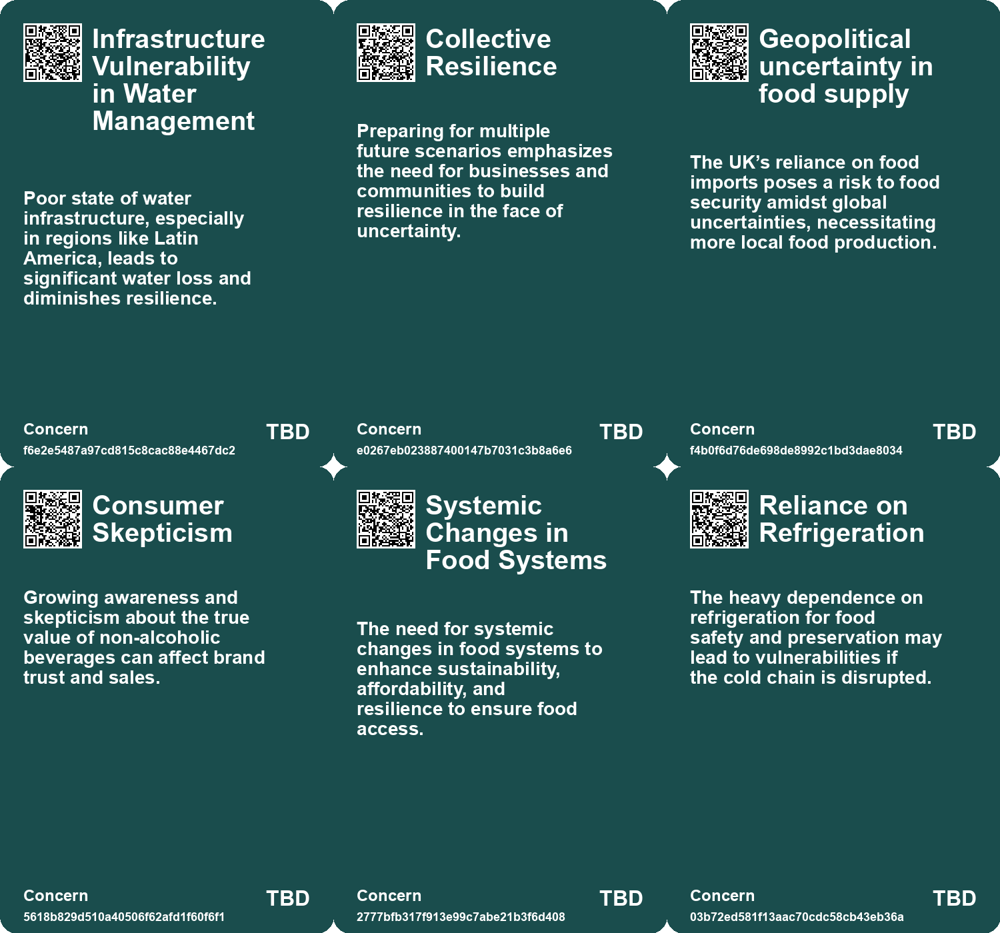
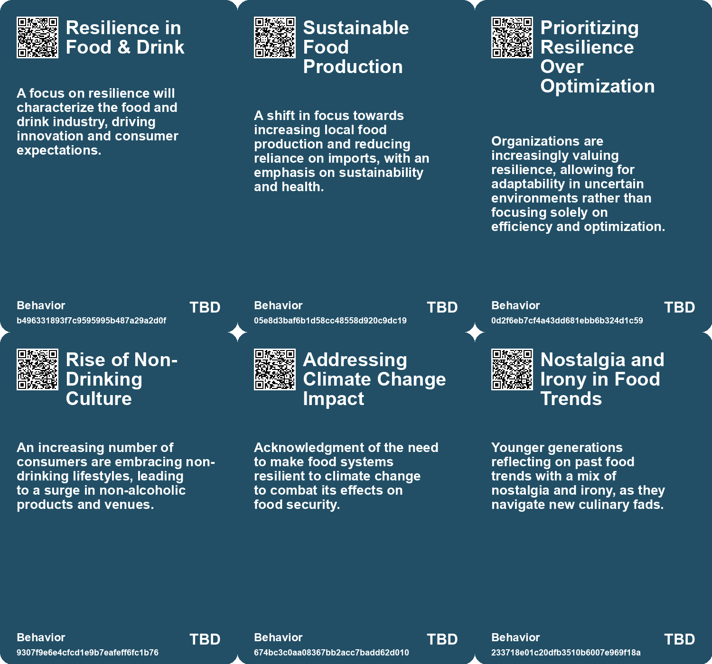
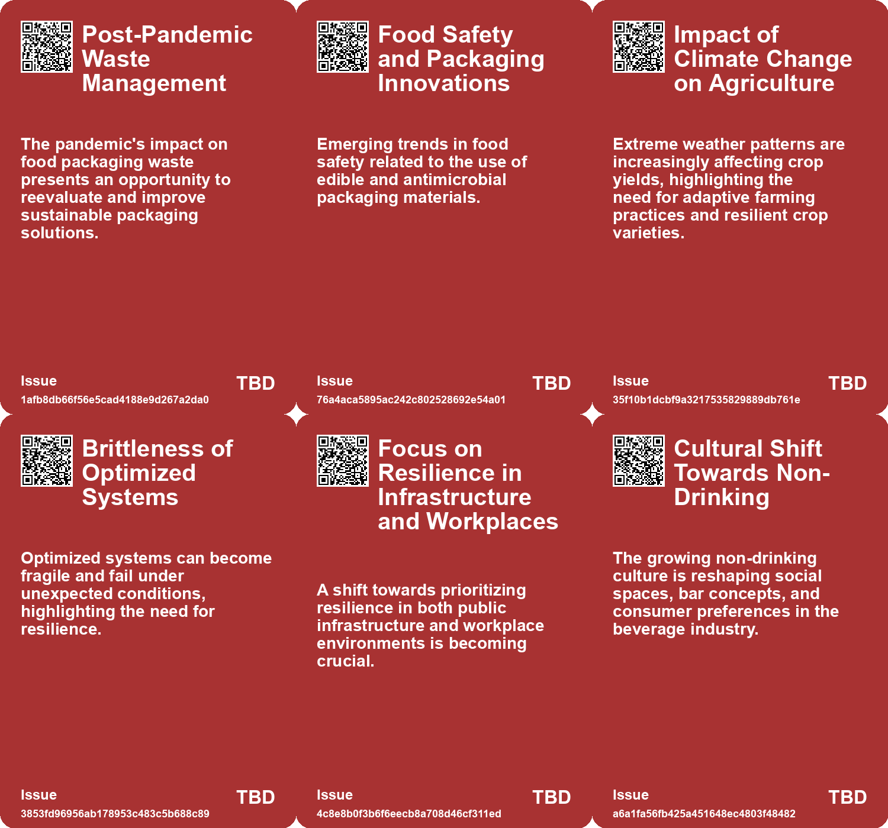
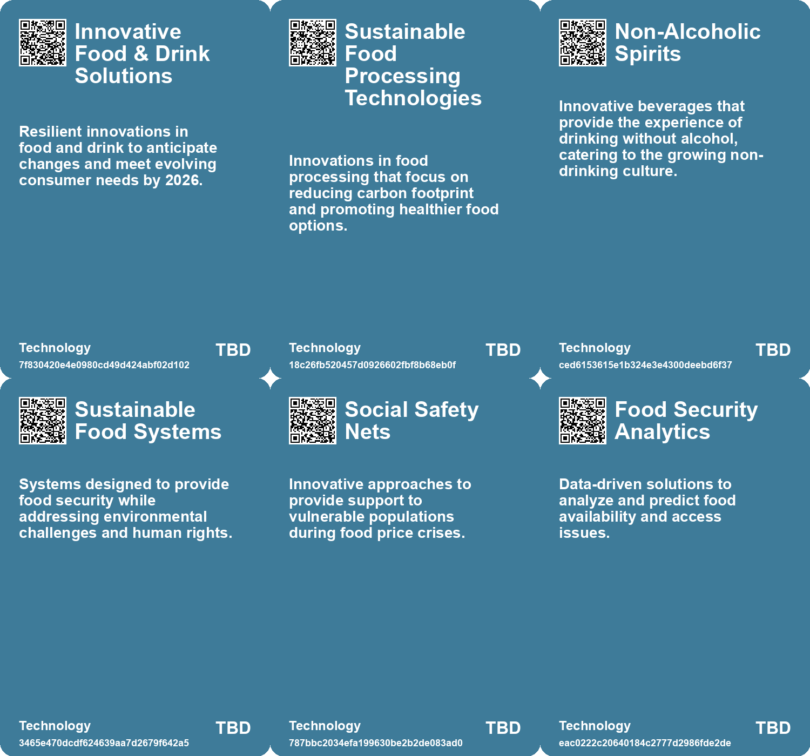

# *Topic*: Resilience in Food & Drink

# Summary

The trend of reducing alcohol consumption is gaining traction, particularly among younger generations. Many are embracing a sober lifestyle, driven by concerns about health, self-image, and mental well-being. Social media plays a significant role in shaping these attitudes, as individuals become more aware of the consequences of drinking. This shift is reflected in the growing market for alcohol-free beverages, which aim to provide enjoyable alternatives without the negative effects associated with alcohol.

Climate change poses a significant threat to global food security, with studies highlighting the risks of simultaneous harvest failures in major breadbasket regions. The concentration of greenhouse gases and extreme weather events are often underestimated, leading to potential price spikes and food insecurity. As the world grapples with these challenges, the need for better preparation and adaptive strategies becomes increasingly urgent. The interconnectedness of climate risks emphasizes the importance of resilience in food systems and infrastructure.

Water scarcity is emerging as a critical issue, with projections indicating that by 2040, freshwater resources could be severely depleted. The demand for water is rising due to population growth and climate change, leading to significant shortages in various regions. Effective water management strategies, including technological innovations and collaborative efforts among stakeholders, are essential to address this looming crisis. The economic implications of water scarcity are profound, with trillions of dollars at risk if current consumption patterns continue.

The food industry is undergoing a transformation, driven by changing consumer preferences and the need for sustainable practices. The rise of biodegradable packaging made from food waste, such as cranberry pomace, reflects a growing commitment to reducing plastic use. Additionally, the popularity of weight-loss drugs is reshaping dietary habits, prompting food manufacturers to adapt their offerings to cater to health-conscious consumers. This evolution highlights the importance of planning and collaboration in creating a sustainable food system.

The concept of resilience is increasingly relevant across various sectors, from disaster management to infrastructure development. Traditional approaches to risk management are being challenged by the complexity of interconnected systems and the unpredictability of climate events. A modernized framework that emphasizes flexibility and preparedness is essential for navigating these challenges. Airports, for example, must adopt strategies to withstand extreme weather, while communities need to foster local resilience to effectively respond to disasters.

Social connections and community engagement are vital in addressing issues like loneliness and social isolation. Initiatives that encourage interaction, such as Oma's Soep's campaign in grocery stores, demonstrate how businesses can play a role in fostering connections across generations. Supermarkets and other public spaces have the potential to facilitate meaningful interactions, countering the trend of increasing screen time and self-service.

Finally, the evolving nature of learning in a fast-paced world calls for a shift towards slow and mindful education. Emphasizing self-reflection and continuous skill development can help individuals adapt to rapid changes in technology and information. The Slow Food movement serves as an inspiration for creating a more thoughtful approach to learning, prioritizing quality over speed. This perspective encourages a deeper engagement with knowledge and fosters a more sustainable future for education.

# Seeds

|    | name                                           | description                                                                                             | change                                                                                                | 10-year                                                                                            | driving-force                                                                                  |
|---:|:-----------------------------------------------|:--------------------------------------------------------------------------------------------------------|:------------------------------------------------------------------------------------------------------|:---------------------------------------------------------------------------------------------------|:-----------------------------------------------------------------------------------------------|
|  0 | Collaboration between Industry and Researchers | Need for cooperation between food industry and researchers to innovate sustainable packaging solutions. | From isolated research to collaborative development of practical and scalable packaging technologies. | In ten years, collaborative networks may drive rapid innovation in sustainable food packaging.     | The urgency of addressing environmental issues and waste management challenges.                |
|  1 | Technological Adaptation in Agriculture        | Farmers are seeking more resilient crops to adapt to climate change impacts on yields.                  | Shift from traditional farming to innovative agricultural practices and crop varieties.               | Widespread adoption of genetically modified or climate-resistant crops becomes common.             | Need for sustainable food production in the face of changing climate conditions.               |
|  2 | Rise of Non-Alcoholic Culture                  | An increasing number of people are embracing non-drinking lifestyles and products.                      | Shifting from traditional alcohol consumption to non-alcoholic alternatives.                          | A significant portion of social gatherings will feature non-alcoholic drinks as the standard.      | Changing social norms and health-conscious lifestyles among consumers.                         |
|  3 | Systemic flaws in global food systems          | Awareness of underlying issues in food systems causing volatility and price hikes.                      | Shifts towards addressing systemic flaws rather than temporary fixes for food insecurity.             | Potential for reforming global food systems to promote sustainability and equity.                  | Call for more regulation and transparency in food markets to stabilize prices and access.      |
|  4 | Health and Gut Health Trends                   | Increased focus on foods promoting gut health among younger generations.                                | Growing preference for foods that contribute positively to health.                                    | Gut health may dominate food trends, influencing product development.                              | Rising awareness of health and wellness issues among consumers.                                |
|  5 | Refrigeration's Impact on Food Culture         | Refrigeration has transformed dining experiences, influencing food production and consumption habits.   | Shift from fresh, local food consumption to reliance on refrigerated and preserved foods.             | In 10 years, food culture may see a blend of fresh and preserved with advanced refrigeration tech. | Increasing demand for convenience and global food supply chains drives refrigeration reliance. |
|  6 | Community resilience through food production   | Food co-ops can foster community spirit and resilience during crises.                                   | From individual survival to collective support through shared resources and efforts.                  | Food co-ops may become more prevalent in urban areas facing social or economic challenges.         | Growing awareness of food security and community engagement in urban settings.                 |
|  7 | Culinary activism                              | Using food production as a means of political resistance and activism.                                  | From passive consumption to active engagement in social issues through food.                          | Food will increasingly be used as a tool for activism, raising awareness of social causes.         | The intersection of food culture and social justice movements gaining visibility.              |
|  8 | Cultural heritage through food                 | Reviving traditional recipes and ingredients to maintain cultural identity.                             | From loss of cultural identity to preservation and celebration through culinary practices.            | Traditional food practices may see a resurgence as communities seek to preserve their heritage.    | Globalization's impact prompting a counter-movement towards local and traditional foods.       |
|  9 | Innovation in survival food production         | Creativity in food production to address shortages and needs during crises.                             | From scarcity-driven rationing to innovative food solutions that meet community needs.                | Food production methods may evolve to prioritize sustainability and resilience in crises.          | Increased focus on food security and sustainable practices in food systems.                    |

# Concerns

|    | name                                             | description                                                                                                                                                       |
|---:|:-------------------------------------------------|:------------------------------------------------------------------------------------------------------------------------------------------------------------------|
|  0 | Infrastructure Vulnerability in Water Management | Poor state of water infrastructure, especially in regions like Latin America, leads to significant water loss and diminishes resilience.                          |
|  1 | Collective Resilience                            | Preparing for multiple future scenarios emphasizes the need for businesses and communities to build resilience in the face of uncertainty.                        |
|  2 | Geopolitical uncertainty in food supply          | The UK’s reliance on food imports poses a risk to food security amidst global uncertainties, necessitating more local food production.                            |
|  3 | Consumer Skepticism                              | Growing awareness and skepticism about the true value of non-alcoholic beverages can affect brand trust and sales.                                                |
|  4 | Systemic Changes in Food Systems                 | The need for systemic changes in food systems to enhance sustainability, affordability, and resilience to ensure food access.                                     |
|  5 | Reliance on Refrigeration                        | The heavy dependence on refrigeration for food safety and preservation may lead to vulnerabilities if the cold chain is disrupted.                                |
|  6 | Economic Disparities                             | Access to refrigeration varies significantly across regions, potentially exacerbating food insecurity and economic inequalities.                                  |
|  7 | Rise of Health-Conscious Consumerism             | Increasing demand for healthier food options might lead to significant changes in food production and agriculture.                                                |
|  8 | Quality of Alcohol-Free Alternatives             | As the popularity of alcohol-free drinks rises, concerns about whether they can match the taste and experience of traditional alcoholic beverages are emerging.   |
|  9 | Market Impact of Alcohol-Free Trend              | The growing alcohol-free drink market may disrupt traditional alcohol industries, affecting jobs and economic stability in regions reliant on alcohol production. |

# Cards

## Concerns

## Behaviors

## Issue

## Technology

# Links

* [Exploring the Impact of Refrigeration on American Food Culture and Safety](https://futures.kghosh.me/70244a8855e32b7bd9d1294b16c1016c)
* [Reimagining Learning: Embracing Slow Learning in an Accelerated World](https://futures.kghosh.me/042cf62855760b54fa5a194db9e6cf11)
* [Addressing Water Shortages in England: Future Supply Solutions and Challenges](https://futures.kghosh.me/603339d048beae59eddc7f4c91a3d4c7)
* [2025 Water Management: The Crucial Role of Digital Transformation in Addressing Global Water Challenges](https://futures.kghosh.me/a374b5aaabba03451c8c0ebd32edd833)
* [The Urgent Need for Effective Food Planning in the UK: Addressing Key Issues for Public Health and Equity](https://futures.kghosh.me/5bb40df4b040c9f780e9fe7ffb0a0b82)
* [Oma's Soep Launches Campaign to Combat Loneliness Through Grocery Store Interactions](https://futures.kghosh.me/d73cef2dc5d458ba6b4a61dff2997181)
* [Evolving Perspectives on Risk Management in the Context of Modern Disasters](https://futures.kghosh.me/cd4f6f65b2486d56699138cd2270044d)
* [Freshwater Crisis: World Risks Depletion by 2040 Amid Soaring Consumption Rates](https://futures.kghosh.me/dc4897041e178e21d79a6f99d545758d)
* [The Cooperative des Croque-Fruits: A Symbol of Resistance and Community During WWII in Marseille](https://futures.kghosh.me/8a255fe8ec4e5536143676c2d3e5fda7)
* [Resilience 2.0: A Strategic Foresight Report for the EU's Future Security and Growth](https://futures.kghosh.me/a4b221bd40d351c2ed13fa1bbbc74056)
* [Enhancing Airport Resilience to Climate Change: Strategies and Solutions for the Future](https://futures.kghosh.me/a6add16457f9bca667941b2ec045b485)
* [The Rising Trend of Alcohol-Free Drinks: A Business Perspective on Consumer Choices](https://futures.kghosh.me/ae181b5b4a88123e416678f59ec592b2)
* [The Conflict Between Optimization and Resilience in Organizational Systems](https://futures.kghosh.me/0362ad6b5f22e9f1a7f14a4b08987bc0)
* [Food Manufacturers Innovate to Counter Declining Sales from Weight-Loss Drug Users](https://futures.kghosh.me/51c61d79ee13dc8082eab91e6f0c6ed7)
* [The Shift in Drinking Culture: Reflections on Alcohol, Literature, and Nostalgia](https://futures.kghosh.me/9e0a5f95c1a309841b59276558cfdc2c)
* [Understanding the Rise of Sobriety Among Young Adults: Trends and Reasons Behind Alcohol Avoidance](https://futures.kghosh.me/94960bd3c0ad4c594fd56651f4087128)
* [Exploring the Pricing Dilemma of Non-Alcoholic Spirits and Mocktails](https://futures.kghosh.me/12e2e66a09a47d70f19d96165a9322ed)
* [Biodegradable Films from Cranberry Pomace: A Sustainable Alternative to Plastic Packaging](https://futures.kghosh.me/b442f3c78716d0a22167e5fc4359f276)
* [The Rise of Pickles: A Reflection of Gen Z's Food Trends and Social Dynamics](https://futures.kghosh.me/668e265ec4654109892bee400ea26d68)
* [Pernod Ricard's 2050 Future Scenarios: Navigating Climate Change's Impact on Society](https://futures.kghosh.me/b7e49e0a4886ff68dd58834e8712155b)
* [Urgent Need for Global Food Systems that Prioritize Human Rights and Security](https://futures.kghosh.me/c21f7a31bf1c99ef78e154ae4249e712)
* [Global Wheat Harvest Forecast: Challenges and Opportunities Amid Climate and Geopolitical Pressures](https://futures.kghosh.me/b99e8d470f4bd969ae5ec423c534eeee)
* [Study Highlights Underestimated Risks of Simultaneous Harvest Failures Due to Climate Change](https://futures.kghosh.me/9bebaea9ed2c74b635c7ffbedc039556)