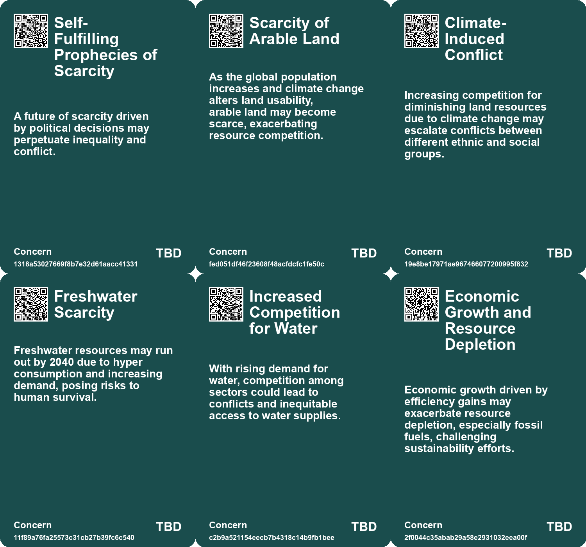
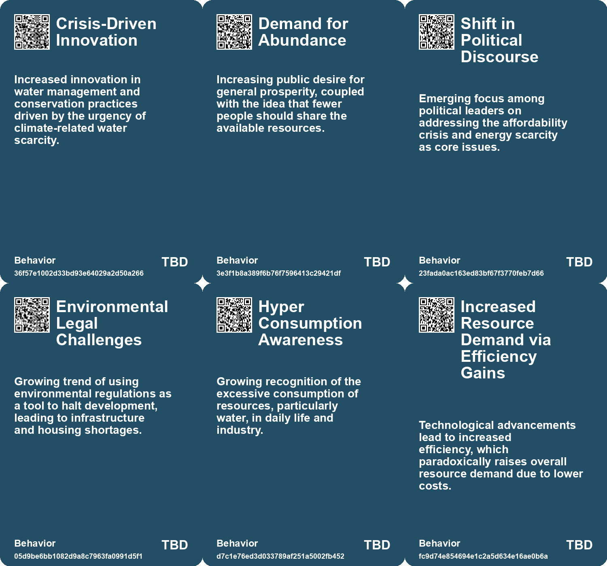
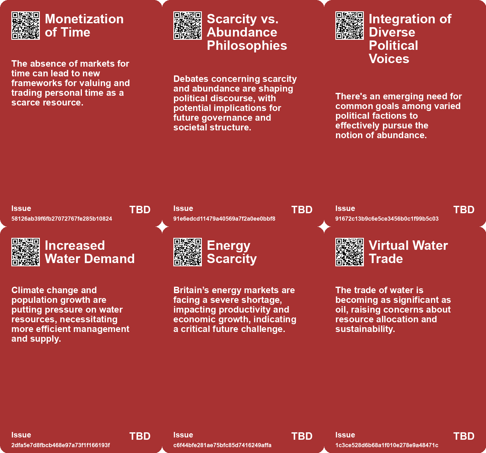
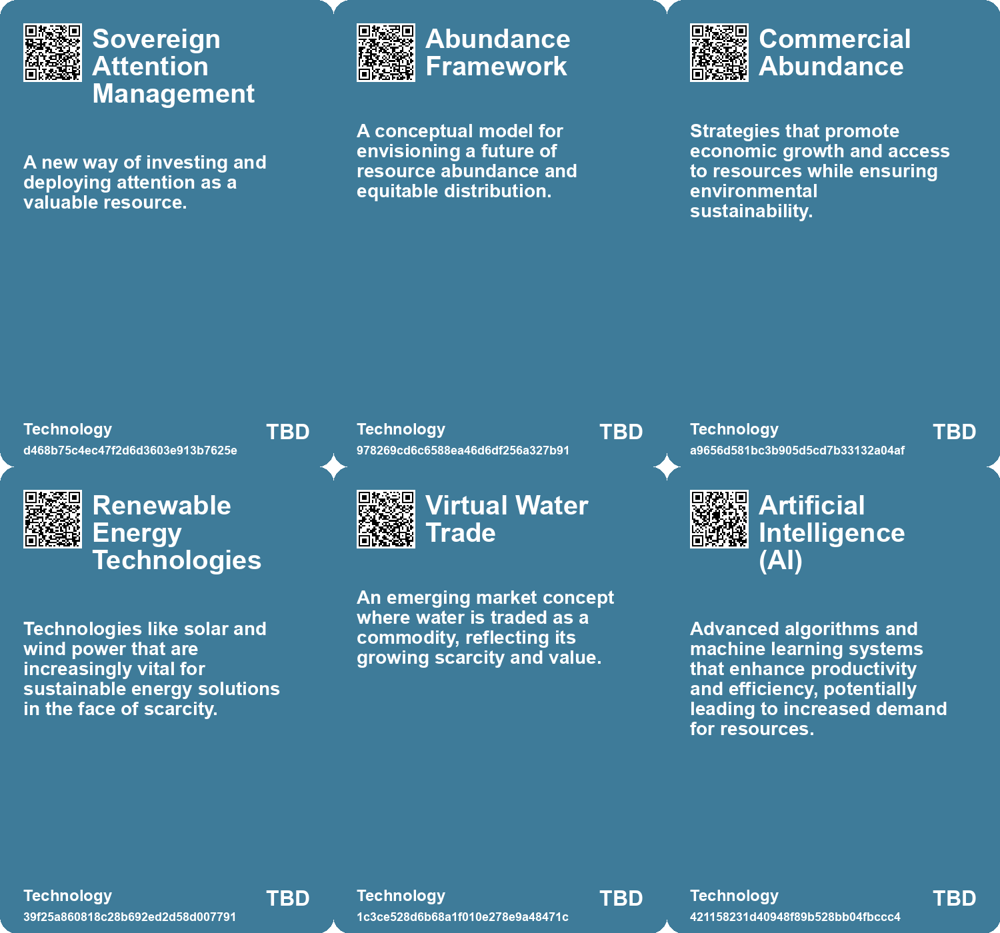

# *Topic*: Resource Scarcity

# Summary

The ongoing "war for talent" highlights the increasing importance of skilled individuals in the business landscape. Companies are grappling with recruitment and retention challenges, particularly among mid-level employees. As the demand for talent rises and the supply dwindles, organizations must adapt their strategies and foster a culture of development to remain competitive.

In the United Kingdom, an economic crisis is unfolding, driven by energy shortages and a housing affordability crisis. Outdated policies, such as the Town and Country Planning Act of 1947, have hindered construction and contributed to a polarized housing market. The soaring costs of electricity and a decline in nuclear energy production further complicate the situation. Comprehensive reforms are necessary to stimulate growth in both housing and energy sectors.

Freshwater scarcity poses a significant global threat, with projections indicating that usable freshwater could run out by 2040 if current consumption trends continue. Despite the planet being covered in water, less than 1% is accessible for human use. The demand for water has surged, driven by industries like fast fashion and agriculture. Urgent action is required to invest in water preservation and implement technologies that enhance water management.

American politics faces challenges stemming from a lack of compelling futures, leading to conflicts between those defending the present and those clinging to an idealized past. The book "Abundance" by Klein and Thompson is highlighted as a potential catalyst for inspiring political dialogue and broader public discourse on diverse visions for the future. Collaborative efforts across the political spectrum are essential to achieve a more equitable society.

Attention has emerged as a scarce resource in marketing and technology, particularly in the age of social media. The rise of platforms like TikTok has transformed audience engagement, necessitating innovative approaches for businesses to capture and monetize attention. As attention becomes increasingly valuable, companies must adapt their strategies to thrive in a content-saturated environment.

The Jevons paradox illustrates how improvements in resource efficiency can paradoxically lead to increased consumption. Historical examples show that advancements in efficiency often stimulate greater demand, raising concerns about sustainability. Economists emphasize the need for conservation policies to accompany efficiency gains to mitigate adverse effects on resource consumption.

Demographic decline poses economic challenges, particularly in relation to innovation and growth. Countries with shrinking workforces face rising healthcare costs and reduced productivity. The declining birth rates in nations like Italy and Japan threaten the availability of educated young workers, which could stifle innovation. Solutions such as focusing on education and technology are necessary to counteract these trends.

The global economy's reliance on perpetual growth is increasingly at odds with ecological sustainability. Researchers advocate for a "degrowth" approach, which emphasizes scaling down harmful production and prioritizing human well-being. This shift requires significant policy changes and societal commitment to address the challenges posed by climate change and resource depletion.

The concept of ultraprosperity envisions a future of sustained economic growth, but it raises questions about sustainability and the meaning of wealth. Factors driving this scenario include technological advancements and demographic shifts. However, the need to find purpose beyond financial success remains a critical consideration.

Water shortages in England are exacerbated by climate change and population growth, prompting the Environment Agency to implement Water Resource Management Plans. These plans aim to ensure sufficient water supply while addressing leakage and exploring new technologies. Collaboration among water companies and consumer engagement is vital for sustainable water management.

The impact of climate change on communities is profound, with many regions becoming increasingly uninhabitable. Building social trust and community resilience is essential for adapting to these challenges. Effective energy policies and political action are necessary to navigate the complex repercussions of a warming world.

The critique of contemporary work culture highlights the disconnect between labor and human fulfillment. Many jobs are seen as irrelevant to survival, perpetuating cycles of poverty and environmental degradation. A reevaluation of work's role in society is needed, focusing on happiness and community rather than profit.

A nationwide shortage of public workers is emerging in the United States, affecting essential government functions. Despite financial support from Congress, state and local governments have lost significant positions since the pandemic. Factors such as lower pay and job stress contribute to difficulties in hiring and retaining public workers, threatening core government services.

# Seeds

|    | name                                              | description                                                                                                | change                                                                                                                   | 10-year                                                                                                     | driving-force                                                                                           |
|---:|:--------------------------------------------------|:-----------------------------------------------------------------------------------------------------------|:-------------------------------------------------------------------------------------------------------------------------|:------------------------------------------------------------------------------------------------------------|:--------------------------------------------------------------------------------------------------------|
|  0 | Climate Change Impact on Reservoir Viability      | Recognition of climate change's role in diminishing the traditional suitability of reservoirs.             | From assuming reservoirs as reliable water sources to questioning their long-term viability due to environmental shifts. | Potential redesign of water management strategies that prioritize resilience against climate variability.   | Understanding the long-term implications of climate change on existing water resource frameworks.       |
|  1 | Time as a Mispriced Asset                         | Current view of time as an expendable resource rather than an owned asset.                                 | Shifting perspective from time being expendable to it being a personal asset that can be owned.                          | Society may recognize the intrinsic value of personal time, leading to changes in work culture.             | Increasing awareness and emphasis on mental health and personal well-being.                             |
|  2 | Crisis of Scarcity vs. Abundance                  | Escalating debate on scarcity and the inequities it breeds in society.                                     | Moving from a scarcity mindset to embracing potential paths to abundance for all.                                        | Future discussions will revolve around equitable distribution and sustainability rather than mere survival. | Economic inequality prompting demand for fair resource allocation and shared prosperity.                |
|  3 | Environmental Impact of Building Developments     | New housing projects increasing pressure on water resources.                                               | Transition from appropriate planning to immediate construction without considering water supply needs.                   | Future building regulations may mandate water resource assessments before any construction approval.        | Government policies prioritizing housing over infrastructure alignment may stimulate community dissent. |
|  4 | Freshwater Scarcity Risk                          | The world could run out of freshwater by 2040 due to unsustainable consumption.                            | Shift from abundant freshwater availability to critical scarcity by 2040.                                                | In 10 years, water scarcity may trigger global conflicts and economic instability.                          | Hyper consumption in agriculture, industry, and technology is driving unsustainable water use.          |
|  5 | Historical Misconceptions of Resource Consumption | Historical beliefs about technology reducing resource use are challenged by Jevons paradox.                | From assuming technology reduces resource use to recognizing it can increase demand.                                     | Future policies may better integrate efficiency measures with consumption management strategies.            | Historical evidence of resource depletion influences current economic strategies.                       |
|  6 | Infrastructure Investment vs. Labor Supply        | Infrastructure funding is available, but there is a lack of investment in recruiting and training workers. | From abundant funding for projects to a critical mismatch with workforce availability for execution.                     | In 10 years, infrastructure projects may be stalled or under-delivered due to persistent labor shortages.   | Financial allocations prioritize project funding over workforce development, exacerbating labor issues. |
|  7 | Help Wanted Forever                               | Persistent demand for skilled workers amidst economic growth.                                              | From high unemployment to constant job openings in various sectors.                                                      | A robust job market with ongoing labor shortages in certain industries.                                     | Strong economic growth creating a surge in demand for labor.                                            |
|  8 | War for Talent                                    | An increasing competition for skilled professionals across industries.                                     | Shift from traditional recruitment to aggressive talent acquisition strategies.                                          | Companies will prioritize talent acquisition and retention as a core business strategy.                     | Global economic growth and talent scarcity drive companies to innovate hiring practices.                |
|  9 | Demographic Impact on Workforce                   | Aging populations in countries like Japan and the US are affecting workforce availability.                 | Shift from a stable workforce to significant shortages due to demographic trends.                                        | Workforces in aging nations may shrink, leading to economic challenges and job gaps.                        | Low birth rates and retiring baby boomers create a demographic crunch.                                  |

# Concerns

|    | name                                   | description                                                                                                                                    |
|---:|:---------------------------------------|:-----------------------------------------------------------------------------------------------------------------------------------------------|
|  0 | Self-Fulfilling Prophecies of Scarcity | A future of scarcity driven by political decisions may perpetuate inequality and conflict.                                                     |
|  1 | Scarcity of Arable Land                | As the global population increases and climate change alters land usability, arable land may become scarce, exacerbating resource competition. |
|  2 | Climate-Induced Conflict               | Increasing competition for diminishing land resources due to climate change may escalate conflicts between different ethnic and social groups. |
|  3 | Freshwater Scarcity                    | Freshwater resources may run out by 2040 due to hyper consumption and increasing demand, posing risks to human survival.                       |
|  4 | Increased Competition for Water        | With rising demand for water, competition among sectors could lead to conflicts and inequitable access to water supplies.                      |
|  5 | Economic Growth and Resource Depletion | Economic growth driven by efficiency gains may exacerbate resource depletion, especially fossil fuels, challenging sustainability efforts.     |
|  6 | Water Resource Management Issues       | The paradox extends to water use, where increased efficiency can lead to more consumption and exacerbate resource scarcity.                    |
|  7 | Labor shortages                        | The impending shortage of skilled labor may hinder the growth of new businesses in an ultra-prosperous economy.                                |
|  8 | Talent Shortage                        | As demand for skilled talent increases, the supply is declining, leading to a significant talent shortage.                                     |
|  9 | Talent Constraint on Growth            | Companies may struggle to pursue growth opportunities due to a lack of available talent.                                                       |

# Cards

## Concerns

## Behaviors

## Issue

## Technology

# Links

* [Reclaiming Time: The Case for Time Ownership and Autonomy](https://futures.kghosh.me/feafa0faefec5de7bde81b2469e71081)
* [The U.S. Construction Sector Faces Severe Labor Shortages Amid Post-Covid Growth](https://futures.kghosh.me/9439e069670182ab70d681f007704c33)
* [The Interplay of Democracy, Work, and Economic Justice in Modern Society](https://futures.kghosh.me/43aa6ac3d82bbc19f0d66d5b2bb37897)
* [The Public Sector Staffing Crisis: Challenges and Consequences for Essential Services](https://futures.kghosh.me/712282cfc63ea5f0d674c24ec2748d53)
* [Addressing Water Shortages in England: Future Supply Solutions and Challenges](https://futures.kghosh.me/603339d048beae59eddc7f4c91a3d4c7)
* [Exploring the Historical and Future Transformations of Land Ownership Worldwide](https://futures.kghosh.me/68a769f0b8d15a4efd8f8136482b9660)
* [The War for Talent: Navigating the Competitive Landscape for Skilled Professionals](https://futures.kghosh.me/34196ff9f6a0d4a9b32a79610ae2a976)
* [Navigating Climate Change: The Need for Community Resilience and Social Trust](https://futures.kghosh.me/efa36dc9bd5ddc890866d4ab1e68e71f)
* [Exploring the Dangers of Outsourcing Happiness and Personal Fulfillment in Modern Society](https://futures.kghosh.me/a5c0ba498382a4edc0f2bf0d9653ad16)
* [Rethinking Economic Growth: The Case for Degrowth in a Sustainable Future](https://futures.kghosh.me/d18185596b0ee658ac31e9c3003c6d92)
* [Exploring Attention as the New Scarce Resource in Marketing and Technology](https://futures.kghosh.me/03a72f858a008d41b32f04b34d79d3d0)
* [Freshwater Crisis: World Risks Depletion by 2040 Amid Soaring Consumption Rates](https://futures.kghosh.me/dc4897041e178e21d79a6f99d545758d)
* [Britain's Water Crisis: The Debate Over Reservoirs vs. Sustainable Solutions](https://futures.kghosh.me/91f5d870184203cdc8fbb87dede02fe8)
* [The Vision of Ultraprosperity: A Future of Economic Growth and Change](https://futures.kghosh.me/719500bc852b3f2db19af6d9280207bf)
* [Exploring the UK’s Economic Crisis Rooted in Housing and Energy Shortages](https://futures.kghosh.me/14c9e2a7976b48f09c3e0cdf3c054c0a)
* [Reevaluating Work: A Critique of Capitalism and Its Impact on Humanity](https://futures.kghosh.me/b20fb97f6ad12a6389468e434068e2ad)
* [Understanding Jevons Paradox: The Unexpected Rise in Resource Consumption Through Efficiency Gains](https://futures.kghosh.me/72ad2ad82a4064cc0219178869779cd8)
* [The Economic Consequences of Declining Birth Rates and Aging Populations](https://futures.kghosh.me/bff595b72330d833dba477e2dc2a5656)
* [Navigating the Climate Crisis: The Importance of Community and Social Trust in Adapting to Change](https://futures.kghosh.me/d1e5dc8cd0f7c34dede43f5429dded3d)
* [Examining the Political Landscape: A Reflection on Ezra Klein and Derek Thompson's 'Abundance'](https://futures.kghosh.me/b7820dcd25b4e5b36ef678f56602f4c4)
* [Global Talent Shortage: A Looming Crisis for Industries by 2030](https://futures.kghosh.me/a2de650354976b7bc4c6442255f91931)