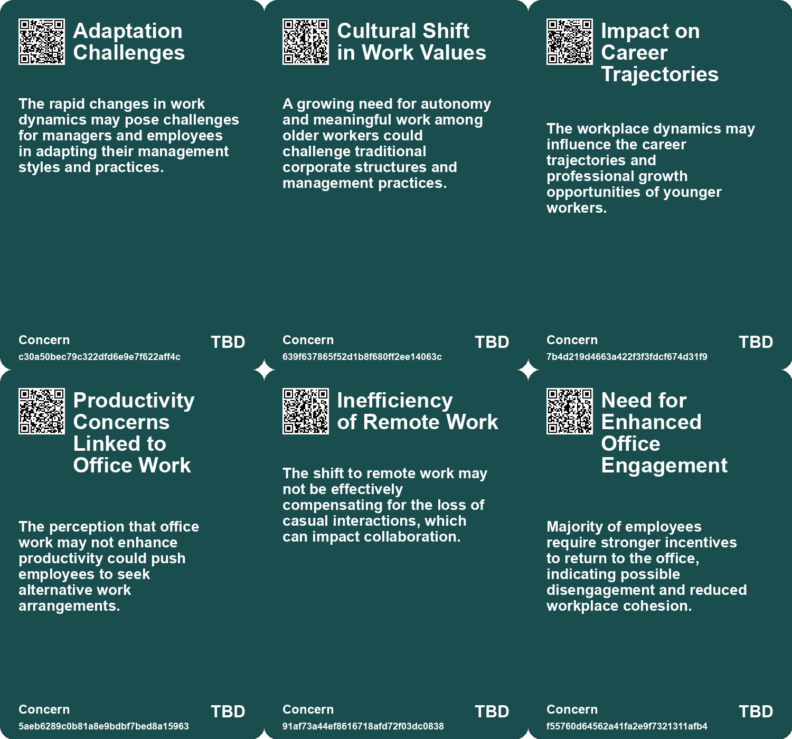
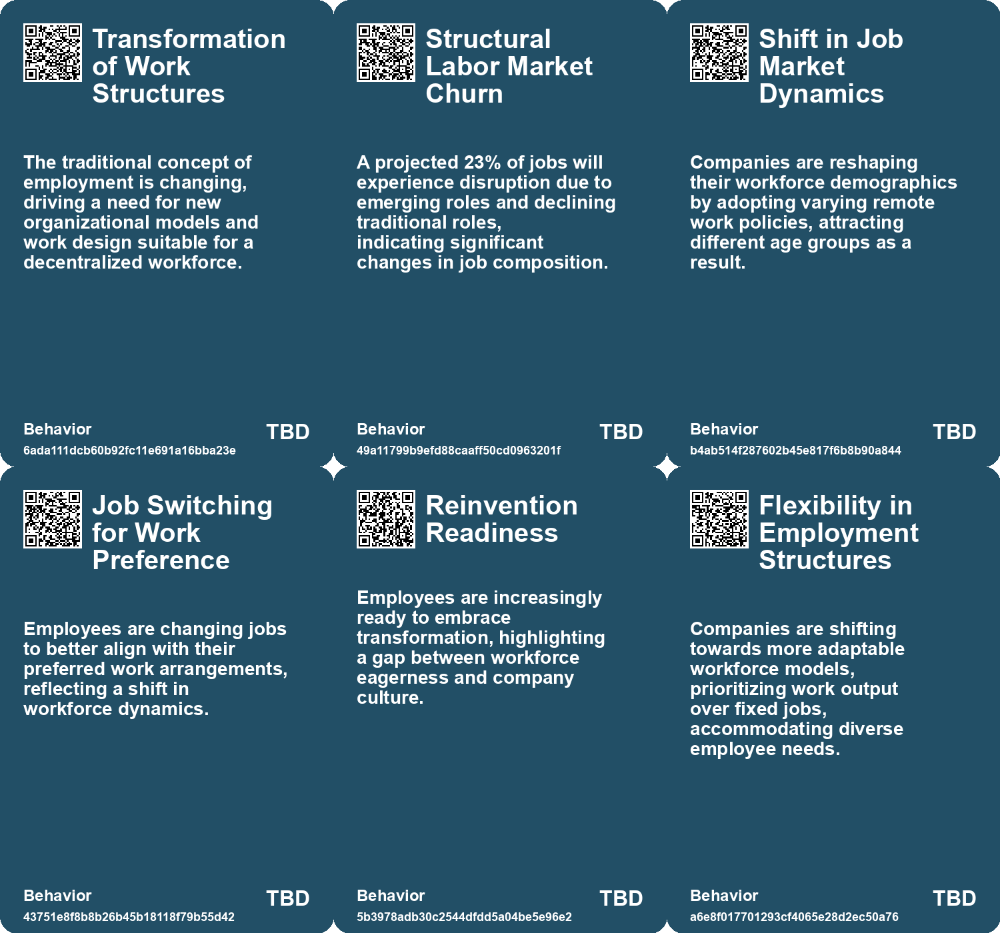
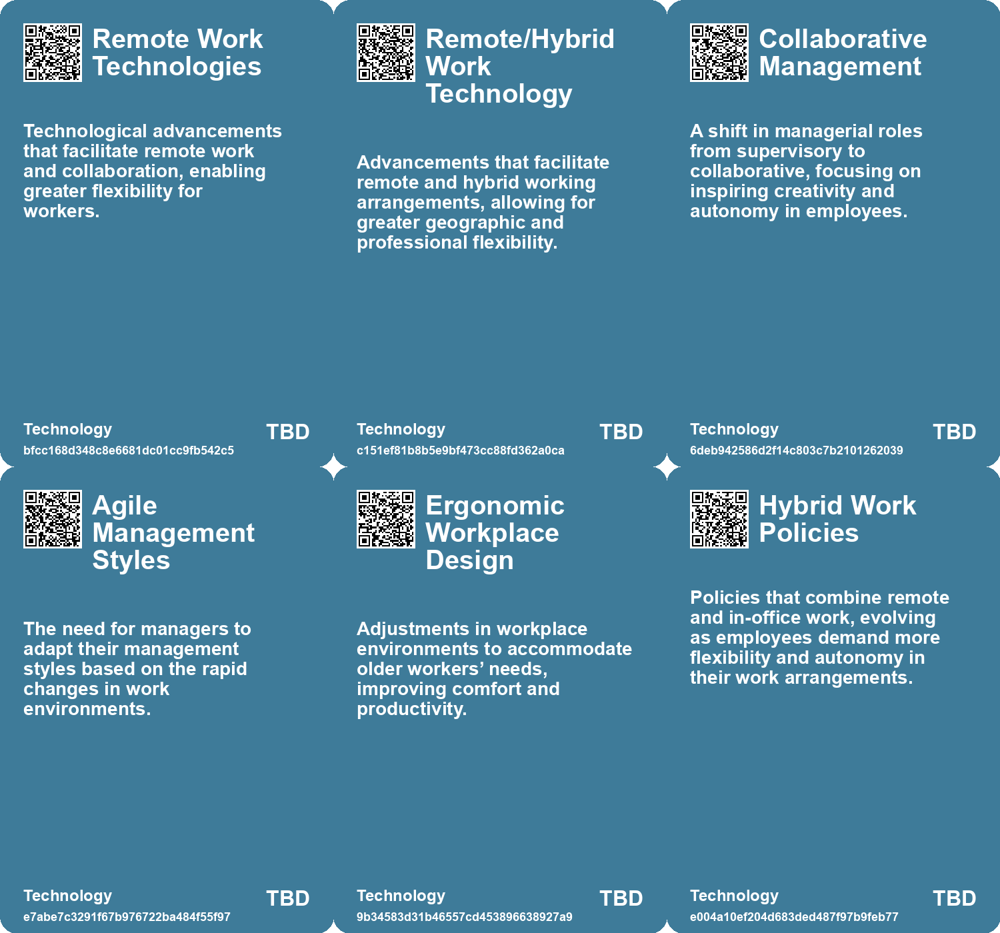

# *Topic*: Shift in Workplace Dynamics

# Summary

The evolving landscape of work is marked by significant shifts in employee preferences, organizational structures, and the integration of technology. A notable trend is the generational divide in work preferences, with younger professionals expressing a strong desire for in-person office environments. This craving for social interaction and mentorship contrasts with the rise of remote work, prompting companies to rethink their policies to attract diverse talent.

The urgency for workforce transformation is underscored by findings from the PwC Global Workforce Hopes and Fears Survey. Many senior executives recognize that their company cultures may not be ready for the reinvention that employees seek. A significant number of workers are contemplating job changes, highlighting a potential wave of resignations. Companies are urged to embrace open dialogue and foster a culture that supports skill development and innovation.

As the workforce ages, organizations face the challenge of integrating older workers while addressing their unique needs. The increasing proportion of older employees in developed countries necessitates a focus on reskilling and creating inclusive environments that respect their strengths. This demographic shift presents opportunities for organizations to enhance productivity and reduce turnover by valuing the contributions of older workers.

The rise of freelancing and the gig economy is reshaping traditional employment models. By 2027, it is projected that freelancers will make up over half of the U.S. workforce. This shift is driven by a desire for flexibility and autonomy, particularly among younger generations. The concept of a "Company of One" is gaining traction, encouraging individuals to develop skills and build networks that enhance their employability in both freelance and traditional roles.

Leadership is also undergoing transformation, moving away from traditional hierarchical models toward more collaborative approaches. Modern leaders are expected to act as mentors and coaches, fostering an environment that encourages continuous learning and adaptation. The emergence of the "Fractionalized Employee" reflects a growing preference for flexible roles that blend full-time employment with freelance opportunities.

The impact of artificial intelligence on the workplace is profound, with expectations for increased adoption in the coming years. AI is reshaping job roles, leading to flatter organizational structures and the need for dedicated AI leadership. However, the rapid integration of AI raises concerns about job displacement, particularly for entry-level workers in roles susceptible to automation.

Amid these changes, employee engagement is a pressing issue. The phenomenon of "quiet quitting" reflects a growing disconnection between workers and their organizations, driven by unclear expectations and limited growth opportunities. To combat this trend, companies must prioritize meaningful engagement, reskill managers, and foster a culture of collaboration and accountability.

Finally, the future of work is influenced by broader societal trends, including the need for improved social support systems. Issues such as childcare, housing affordability, and worker health are interconnected challenges that require attention to sustain a thriving labor market. As organizations navigate these complexities, they must adapt to the evolving expectations of their workforce while addressing the structural issues that impact employee well-being.

# Seeds

|    | name                               | description                                                                                  | change                                                                                                 | 10-year                                                                                                              | driving-force                                                                                        |
|---:|:-----------------------------------|:---------------------------------------------------------------------------------------------|:-------------------------------------------------------------------------------------------------------|:---------------------------------------------------------------------------------------------------------------------|:-----------------------------------------------------------------------------------------------------|
|  0 | Increased Job Churn                | A projected 23% job churn indicates significant structural changes in employment landscapes. | Shift from stable employment to a more dynamic and evolving job market with high turnover.             | In 10 years, job stability may decline, with workers frequently transitioning between roles.                         | Technological and economic pressures are reshaping the nature of work and employment.                |
|  1 | Aging Workforce Trends             | A significant increase in older workers is reshaping the job market dynamics.                | Shift from a young workforce dominance to a balanced age-diverse workforce.                            | By 2031, older workers will represent over 25% of the workforce in developed countries.                              | Aging populations and changing retirement policies are influencing workforce demographics.           |
|  2 | Aging Workforce Trends             | A significant increase in older workers is reshaping the job market dynamics.                | Shift from a young workforce dominance to a balanced age-diverse workforce.                            | By 2031, older workers will represent over 25% of the workforce in developed countries.                              | Aging populations and changing retirement policies are influencing workforce demographics.           |
|  3 | Communication Over Creativity      | A shift in focus from creating to communicating in the workplace.                            | From a creative output-oriented culture to one dominated by communication tasks.                       | The nature of work may fundamentally change, prioritizing communication skills over creative skills.                 | The growing complexity of organizational structures and communication needs.                         |
|  4 | Productivity Paranoia              | Leaders are increasingly uneasy about employee productivity in hybrid work environments.     | From trust in productivity to heightened suspicion and paranoia among leaders.                         | Workplace cultures may shift towards more transparency and accountability measures to address productivity concerns. | The struggle to adapt leadership styles to new hybrid work models and employee autonomy.             |
|  5 | Rise of Fractionalized Employment  | The emergence of a new employment model offering flexible work hours and roles.              | Transitioning from traditional full-time roles to more flexible, fractionalized employment structures. | In ten years, many employees may work fractionalized roles, balancing multiple interests and jobs effectively.       | The need for flexibility in work arrangements and the desire for work-life balance among employees.  |
|  6 | Generational Workforce Integration | Multiple generations working together creates unique workplace dynamics.                     | From a homogeneous workforce to a diverse one with varying values and expectations.                    | Companies will need to adapt to manage and leverage diverse generational perspectives.                               | The increasing lifespan and changing career trajectories of different generations.                   |
|  7 | Decline of Boss Culture            | A shift from traditional boss roles to leadership based on influence and collaboration.      | Transitioning from control-oriented management to a more supportive leadership model.                  | Leadership styles will center around emotional intelligence and relationship-building.                               | Technological advancement and shifting workforce demographics are reshaping work expectations.       |
|  8 | Remote Work Normalization          | Remote work is transitioning from a pandemic necessity to a standard work practice.          | Shift from remote work being a temporary solution to it being a permanent option for many employees.   | In 10 years, remote work may be fully integrated into work culture, with flexible arrangements widely accepted.      | The need for flexibility and improved work-life balance is driving the normalization of remote work. |
|  9 | Hybrid Work Model Adoption         | Companies are increasingly adopting hybrid work models for greater flexibility.              | From full-time office work to a balanced hybrid approach that allows remote work.                      | In 10 years, hybrid work models may become the norm, influencing workplace designs and policies.                     | The desire for flexibility and employee satisfaction is driving the adoption of hybrid models.       |

# Concerns

|    | name                                        | description                                                                                                                                          |
|---:|:--------------------------------------------|:-----------------------------------------------------------------------------------------------------------------------------------------------------|
|  0 | Adaptation Challenges                       | The rapid changes in work dynamics may pose challenges for managers and employees in adapting their management styles and practices.                 |
|  1 | Cultural Shift in Work Values               | A growing need for autonomy and meaningful work among older workers could challenge traditional corporate structures and management practices.       |
|  2 | Impact on Career Trajectories               | The workplace dynamics may influence the career trajectories and professional growth opportunities of younger workers.                               |
|  3 | Productivity Concerns Linked to Office Work | The perception that office work may not enhance productivity could push employees to seek alternative work arrangements.                             |
|  4 | Inefficiency of Remote Work                 | The shift to remote work may not be effectively compensating for the loss of casual interactions, which can impact collaboration.                    |
|  5 | Need for Enhanced Office Engagement         | Majority of employees require stronger incentives to return to the office, indicating possible disengagement and reduced workplace cohesion.         |
|  6 | Balancing Hybrid Work Expectations          | Challenges in maintaining productivity and engagement in a hybrid work setup, which could affect future workplace models.                            |
|  7 | Changing Work Dynamics                      | The shifting nature of work, including remote work and generational differences, may result in conflicts and misunderstandings within the workplace. |
|  8 | Decline of Traditional Management Roles     | The diminishing relevance of traditional management roles may lead to uncertainty in workforce structure and employee relationships.                 |
|  9 | Talent Shortage and Skill Gaps              | The evolving workplace demands new skills; a lack of training could result in a workforce unprepared for future challenges.                          |

# Cards

## Concerns

## Behaviors

## Issue

## Technology

# Links

* [The Pandemic's Impact on Workers' Attitudes and the Antiwork Movement](https://futures.kghosh.me/f3f7c111d85459c6aa1d719673cae79f)
* [The Transformative Impact of AI on Organizational Structures and Culture](https://futures.kghosh.me/fe6a32f4a3def00b40a187cec64fec72)
* [The Shift from Traditional Bosses to Modern Leadership: Embracing Growth and Change](https://futures.kghosh.me/74d6cb3000734dab48879c07a53c6632)
* [Embracing Older Workers: Strategies for a Changing Workforce Landscape](https://futures.kghosh.me/73f1352a504ec78d7c92fa6f9b7c6922)
* [The Generational Divide in Work Preferences: Young Professionals Favor In-Office Jobs](https://futures.kghosh.me/5a10c88b2c7660dac07161b1f5089e57)
* [The Shift to Freelancing: Embracing a Company of One Mindset for Future Success](https://futures.kghosh.me/39c874e172728d9411bc5af518598ba3)
* [Navigating Workforce Transformation: Insights from PwC's Global Survey on Employee Aspirations and Company Culture](https://futures.kghosh.me/4c886ce0e70f066b9f2199abe1d7bd1c)
* [The Rise of Meetings Over Creativity in White-Collar Work](https://futures.kghosh.me/32eca597c052201ad0a6a0907cf127d2)
* [The Decentralized Workforce: Transforming Employment through Digital Platforms](https://futures.kghosh.me/2c7f9030c5c74a2a747af2b356f1ce98)
* [Embracing Older Workers: Strategies for a Changing Workforce Landscape](https://futures.kghosh.me/ffd6ef9c04575c57dac84a44bf3c2474)
* [The New Normal: Embracing Remote and Hybrid Work as a Standard Practice](https://futures.kghosh.me/e03e1df88b69ffaca90522e9b7fb864e)
* [Embracing the Fractionalized Employee: A Shift in Workforce Dynamics for Future Success](https://futures.kghosh.me/8bf45b931961dd7fa9a7ed4287839b43)
* [Employees Embrace 'Coffee Badging' Amid Return-to-Office Pressure for Flexibility](https://futures.kghosh.me/0ebb89e118bf02cadd16c16bc3f06f63)
* [Microsoft Report Highlights Productivity Paranoia Amid Hybrid Work Shift and Introduces Viva Enhancements](https://futures.kghosh.me/c44ce31cbe9d5b538bab463761a1fe8c)
* [Five Emerging Trends Transforming Business in the Coming Year](https://futures.kghosh.me/55bac03899915f25bf0b47fa4342472c)
* [Navigating the Infinite Workday: Insights from the 2025 Work Trend Index Report](https://futures.kghosh.me/eef55f2e710257a37ec32bae1b59f47c)
* [The Evolution of Middle Management: From Supervisors to Collaborative Leaders](https://futures.kghosh.me/c0ce87f1bf029375202ddfac05e2ad30)
* [Understanding Employee Sentiment: Key Findings from PwC's Global Workforce Survey](https://futures.kghosh.me/b865313fdf172979b9c852573395fab1)
* [The Four Shifts: Transforming Society and Business in a Rapidly Changing World](https://futures.kghosh.me/0506cba04945d4f8cf25bf2399d36a46)
* [Impact of Generative AI on Early-Career Employment: A Study](https://futures.kghosh.me/6286563cae4851c1c414fffd13d908c2)
* [Redesigning Organizational Structures for a Rapidly Changing Future](https://futures.kghosh.me/a6112c31b538ae6e0d92d0e186d5c5f0)
* [Understanding Quiet Quitting: The Role of Management in Employee Engagement Crisis](https://futures.kghosh.me/1e45d2fc84595f57564761a068038652)
* [Addressing Systemic Issues to Sustain the Future Workforce: A Call for Stronger Collective Institutions](https://futures.kghosh.me/25e04663bf5a7381aedbf89013119bd8)
* [Exploring Job Evolution and Skills Development in the Future of Work: Insights from the 2023 Report](https://futures.kghosh.me/4abade09451838c25631bf9da940b724)
* [Navigating the AI Transformation in the Workplace: Opportunities and Challenges Ahead](https://futures.kghosh.me/cdb77fee7b2001c995ad4a078b38eb36)