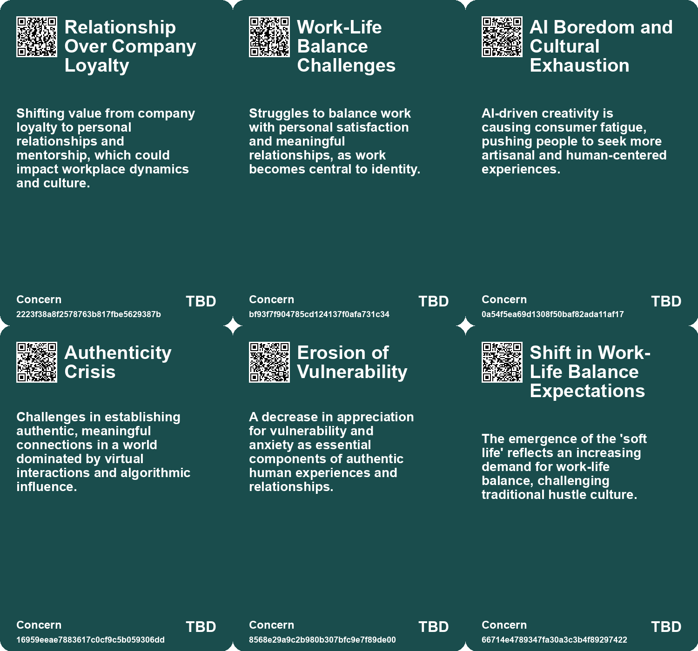
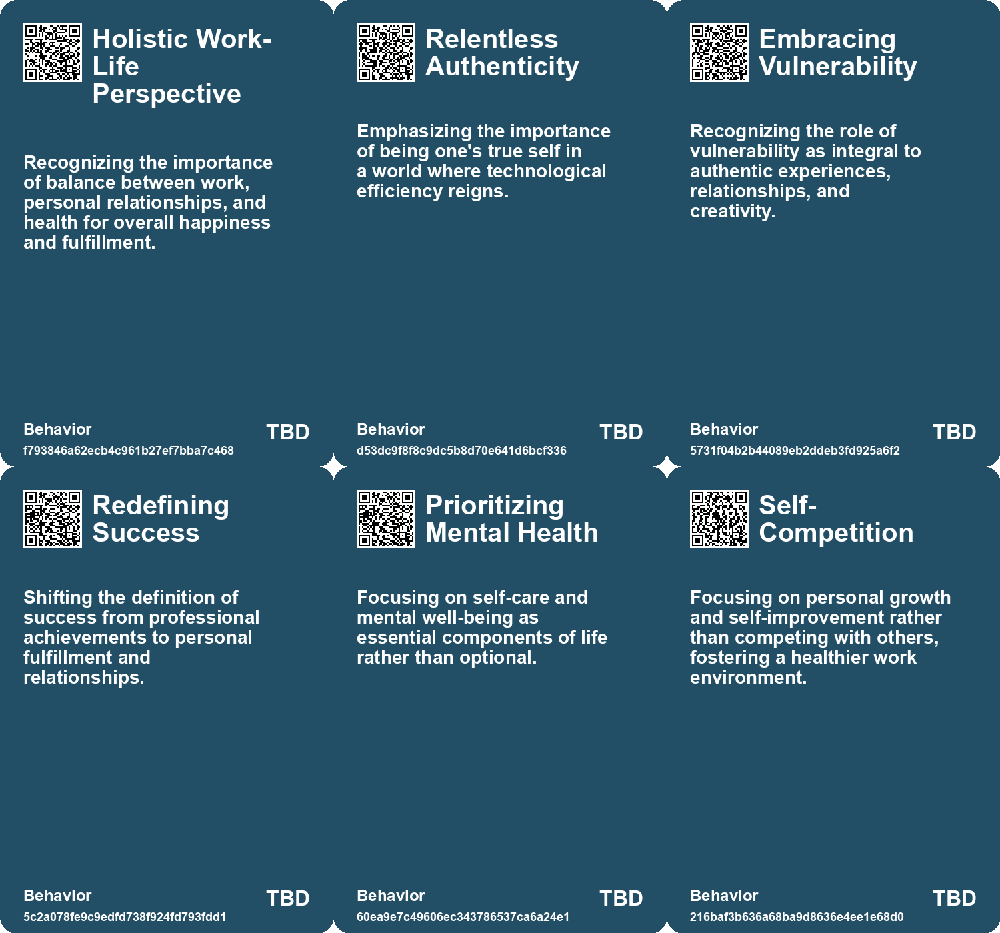
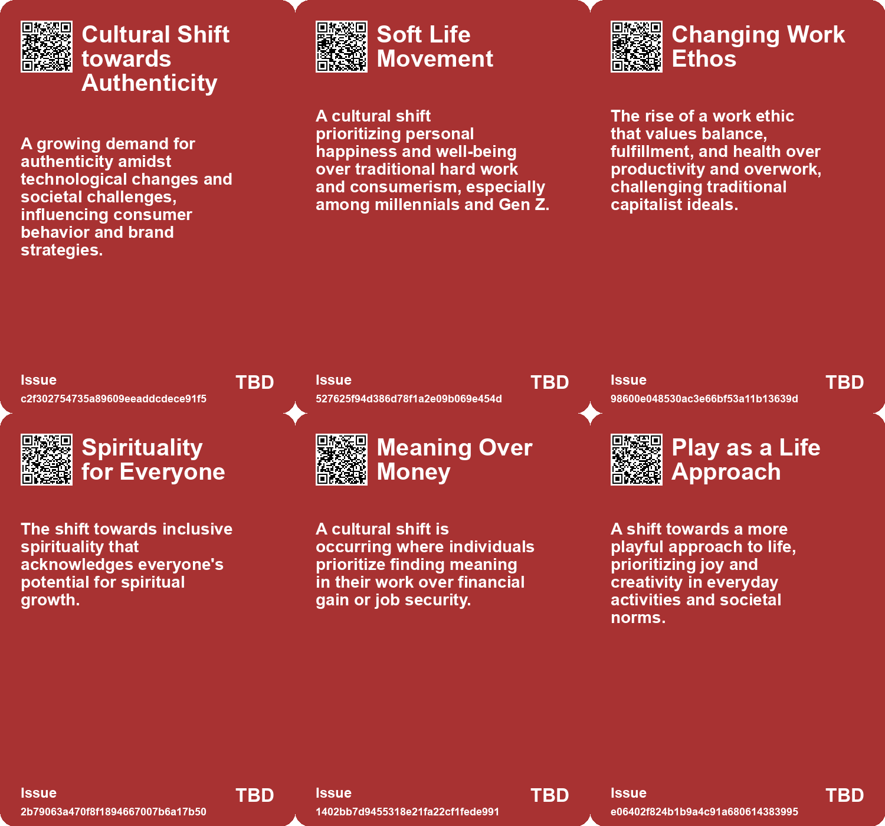
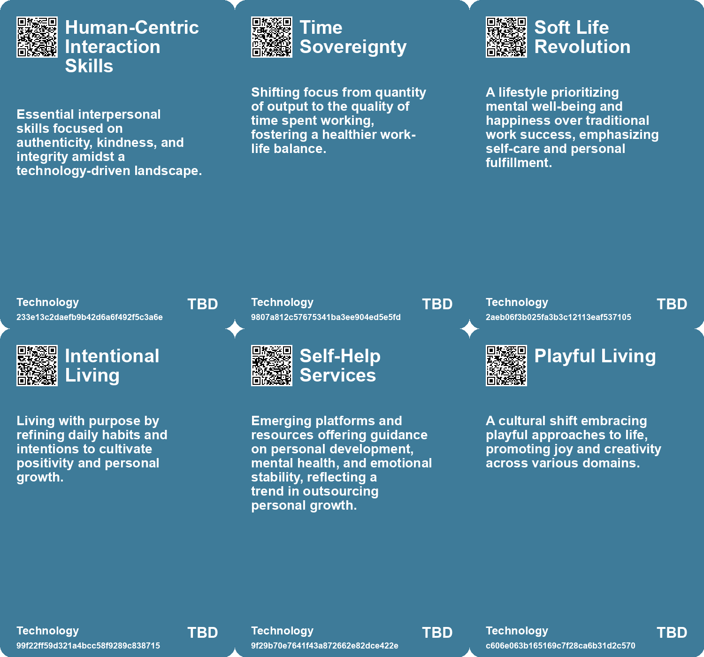

# *Topic*: Shift Toward Wellness and Authenticity

# Summary

A growing concern about mental health and social connections emerges across various discussions. The U.S. Surgeon General's report highlights a public health crisis of loneliness, with a significant portion of Americans feeling isolated. This crisis is particularly pronounced among younger generations, emphasizing the need for authentic relationships to enhance well-being. In parallel, the importance of emotional resilience and goal flexibility is underscored, suggesting that adjusting personal goals can lead to improved mental health.

Technology's impact on society is another prevalent theme. The rise of digital platforms has transformed interactions, often leading to superficial connections and a sense of isolation. The discussion around the negative effects of technology includes the polarization of societies and the commodification of social issues. A cultural shift towards prioritizing genuine human experiences over technology-driven interactions is advocated, emphasizing the need for deeper connections and authenticity.

The evolving nature of work and leadership is also a focal point. Traditional career paths are being redefined, with individuals seeking meaningful work that aligns with their values. The concept of a "soft life" is gaining traction, particularly among millennials, who prioritize well-being over material success. This shift reflects a broader reevaluation of what constitutes fulfillment in the workplace. Additionally, the transition from traditional bosses to modern leaders who act as mentors is highlighted, advocating for a more supportive work environment.

The discussion of personal growth and self-actualization is prominent. Individuals are encouraged to embrace authenticity and develop traits that foster resilience and connection. This includes practices such as setting boundaries, prioritizing self-care, and cultivating kindness in professional settings. The emphasis on personal development aligns with the idea of finding purpose and meaning in life, moving beyond mere productivity.

Cultural trends are shifting towards community-centric experiences and a reclamation of traditional values. As anxiety rises due to technological advancements and societal challenges, there is a growing desire for deeper connections and authenticity. Brands are responding to these trends by embodying values that resonate with consumers, revealing significant market opportunities for those who adapt.

The exploration of menopause as a significant life transition highlights the need for greater awareness and support. The emergence of menopause retreats reflects a growing demand for personalized attention and community support, indicating a shift in how society addresses women's health issues. This trend points to a broader recognition of the importance of addressing life transitions and the associated needs.

Finally, the transformative impact of innovative systems, such as the Toyota Production System, emphasizes the importance of continuous improvement and respect for people in the workplace. This approach reshapes manufacturing by prioritizing efficiency and quality, showcasing the potential for systemic change through intellectual curiosity and observation. The integration of AI in consulting also raises questions about the future of work and the need for adaptability in a rapidly changing landscape.

# Seeds

|    | name                              | description                                                                                | change                                                                                                         | 10-year                                                                                                                          | driving-force                                                                                                  |
|---:|:----------------------------------|:-------------------------------------------------------------------------------------------|:---------------------------------------------------------------------------------------------------------------|:---------------------------------------------------------------------------------------------------------------------------------|:---------------------------------------------------------------------------------------------------------------|
|  0 | The Importance of Perspective     | Shifting perspective on career success, emphasizing relationships and life beyond work.    | Broader understanding of career fulfillment moving beyond just financial success.                              | Future employees will value discussions around work-life balance and personal satisfaction over corporate prestige.              | Increasing awareness of holistic well-being will change workplace culture and individual career goals.         |
|  1 | Exploration of Vulnerability      | Recognition of vulnerability as a key element in authentic experiences of awe and life.    | Transition from avoidance of vulnerability to embracing it for deeper connections.                             | Greater acceptance and understanding of vulnerability leading to stronger relationships.                                         | Increasing awareness of the need for depth in personal experiences and connections.                            |
|  2 | Shift Towards Soft Living         | A growing trend among millennials prioritizing well-being over corporate success.          | A move from hard work and corporate ambition to valuing personal happiness and well-being.                     | In ten years, softer living may redefine success metrics, focusing on personal fulfillment over traditional career achievements. | The ongoing cost-of-living crisis and dissatisfaction with capitalist work structures are driving this change. |
|  3 | Rise of the Lazy Girl Job         | Emergence of lower-stress jobs that prioritize work-life balance and mental health.        | Shifting from high-pressure corporate jobs to more sustainable, low-stress employment.                         | In ten years, 'lazy girl jobs' could become mainstream, influencing job structures and expectations across industries.           | The desire for mental health prioritization and a backlash against overwork drives this trend.                 |
|  4 | Focus on Self-Care and Well-Being | A cultural shift towards prioritizing self-care as a necessity rather than indulgence.     | Transition from neglecting personal well-being to actively prioritizing mental health and self-care practices. | In ten years, self-care could be deeply integrated into workplace policies and societal norms, reshaping productivity norms.     | The recognition of mental health's importance, especially after the pandemic, drives this cultural shift.      |
|  5 | Hopepunk Movement                 | A cultural shift towards hope and action, moving away from nihilism.                       | Transition from nihilism to a proactive stance of kindness and hope.                                           | In ten years, hopepunk could influence cultural narratives, inspiring collective action for positive change.                     | A desire for a more positive and resilient society in response to global challenges.                           |
|  6 | Anti-Ambition Movement            | Growing acceptance of slower, more restful lifestyles over traditional ambition.           | Shift from a culture of relentless ambition to valuing rest and personal well-being.                           | In ten years, work-life balance will be prioritized, redefining success beyond traditional metrics.                              | Increasing awareness of burnout and the need for mental health prioritization.                                 |
|  7 | Community Care Movement           | A shift from self-care to community-focused care solutions.                                | Transitioning from individualistic self-care to communal support systems.                                      | In ten years, community care will be a fundamental aspect of societal health and resilience.                                     | Recognition that collective challenges require collective solutions beyond individual efforts.                 |
|  8 | Workplace Kindness Culture        | Growing emphasis on kindness as a core workplace value amidst current challenges.          | Shift from competitive work environments to supportive and compassionate cultures.                             | Workplaces will prioritize emotional intelligence and kindness in hiring and training.                                           | Increased awareness of mental health and well-being in professional settings.                                  |
|  9 | Radical Self-Care                 | Individuals are prioritizing self-care to enhance personal and professional effectiveness. | Transition from neglecting personal well-being to actively promoting self-care routines.                       | Self-care will be a standard practice integrated into professional development programs.                                         | Recognition of the link between individual well-being and workplace productivity.                              |

# Concerns

|    | name                                               | description                                                                                                                                                 |
|---:|:---------------------------------------------------|:------------------------------------------------------------------------------------------------------------------------------------------------------------|
|  0 | Relationship Over Company Loyalty                  | Shifting value from company loyalty to personal relationships and mentorship, which could impact workplace dynamics and culture.                            |
|  1 | Work-Life Balance Challenges                       | Struggles to balance work with personal satisfaction and meaningful relationships, as work becomes central to identity.                                     |
|  2 | AI Boredom and Cultural Exhaustion                 | AI-driven creativity is causing consumer fatigue, pushing people to seek more artisanal and human-centered experiences.                                     |
|  3 | Authenticity Crisis                                | Challenges in establishing authentic, meaningful connections in a world dominated by virtual interactions and algorithmic influence.                        |
|  4 | Erosion of Vulnerability                           | A decrease in appreciation for vulnerability and anxiety as essential components of authentic human experiences and relationships.                          |
|  5 | Shift in Work-Life Balance Expectations            | The emergence of the 'soft life' reflects an increasing demand for work-life balance, challenging traditional hustle culture.                               |
|  6 | Mental Health Impacts of Redefining Work           | The search for meaningful work can lead to increased stress and anxiety as individuals grapple with their evolving identities and values.                   |
|  7 | Play-Centric Approach                              | The shift towards a more playful and expressive lifestyle may clash with traditional professional and social norms, leading to friction in various sectors. |
|  8 | Accountability in Activism                         | As the push for accountability grows, brands may face backlash for insincerity, potentially leading to consumer disillusionment.                            |
|  9 | Economic Instability Impacting Employee Well-being | Mass layoffs and economic uncertainty may cause increased stress and fear among workers, necessitating a focus on kindness to mitigate negative effects.    |

# Cards

## Concerns

## Behaviors

## Issue

## Technology

# Links

* [Jay Shetty: Transforming Lives Through Intentions and Wisdom](https://futures.kghosh.me/38548b322684d1a81aa9ef61c7312cee)
* [Exploring RADAR's Resolutions: Ten Transformative Visions for 2023](https://futures.kghosh.me/0159774192872e1fdb6ebd7c80dbb9de)
* [The Importance of Kindness in the Workplace During Challenging Times](https://futures.kghosh.me/30ef1082d02491cac0f3331b1e684642)
* [Exploring the Modern Entertainment Landscape and Its Societal Implications](https://futures.kghosh.me/c5c2c794f1426e6e307a9df3f9ff61f6)
* [Aligning Company and Employee Purposes: Insights from the Latest Newsletter](https://futures.kghosh.me/859cef9c04d564bfcee93db7b45be82e)
* [Addressing the Social Fitness Crisis: The Need for Connection in Modern Society](https://futures.kghosh.me/9aeeedec876dadd7664c8ac15af0b90e)
* [Exploring Goal Flexibility and AI's Impact on Creativity and Connection](https://futures.kghosh.me/94d31e760d2d34d7355ef3ee6bf47ffe)
* [The Rise of PSYCARE: How Mental Health is Reshaping the Beauty Industry](https://futures.kghosh.me/b396d58ff64cbfdfe136c278b263ee5a)
* [Understanding Burnout: The ARMOR Framework for Tech Workers' Resilience](https://futures.kghosh.me/3ee0568fd96a3921f830e3d5703be922)
* [Nine Uncommon Traits to Stand Out in a Conformist World](https://futures.kghosh.me/f245eb459efde411b9aa2f34d07383d2)
* [The Shift from Traditional Bosses to Modern Leadership: Embracing Growth and Change](https://futures.kghosh.me/74d6cb3000734dab48879c07a53c6632)
* [The Rise of the 'Soft Life': A Shift from Overwork to Personal Fulfillment](https://futures.kghosh.me/0da19a44e3abef828697c7e76d045b32)
* [Five Emerging Trends Transforming Business in the Coming Year](https://futures.kghosh.me/55bac03899915f25bf0b47fa4342472c)
* [Insights on Career Management: Navigating Work in a Changing Landscape](https://futures.kghosh.me/c722454183bad20fa287d966577d8b77)
* [Exploring the Cultural Trends Shaping Consumer Behavior in 2026](https://futures.kghosh.me/05be870bd93b19dc0390539dc923ae7b)
* [The Four Shifts: Transforming Society and Business in a Rapidly Changing World](https://futures.kghosh.me/0506cba04945d4f8cf25bf2399d36a46)
* [Exploring Meaning and Fulfillment in a Transformative Work Landscape](https://futures.kghosh.me/561aac9a4c6d3a468f1b8c9a141a8b76)
* [Future Trends Post-2024: Declining Democracies and Emerging Cultural Shifts](https://futures.kghosh.me/bd1b01636b1360716b5951e1cac42724)
* [The Emergence of Menopause Retreats: Addressing Women's Health Needs and Wellness Solutions](https://futures.kghosh.me/045add002e344d1657fe658e0ebe6b41)
* [The Transformative Power of the Toyota Production System and its Relevance in an AI-Driven World](https://futures.kghosh.me/ae195a0a52b9b143bee7074983343615)
* [Essential Career Lessons for Success Across Decades in Today’s Workforce](https://futures.kghosh.me/a06d27f1dd5a2328ba6aa8854abc5318)
* [Navigating Jevons Paradox: Embracing Authenticity in a Productivity-Driven World](https://futures.kghosh.me/fc47a0f6771688b5d00260a9567c1fee)
* [The Importance of Authentic Experiences and Awe in a Tech-Dominated World](https://futures.kghosh.me/ce43c884bb8eefce9268368190014a48)
* [Understanding Polarization: Healing Our Relationship with Technology and Embracing Diverse Perspectives](https://futures.kghosh.me/c1bb890337ef382bfaa5720c9fd05134)
* [Exploring the Dangers of Outsourcing Happiness and Personal Fulfillment in Modern Society](https://futures.kghosh.me/a5c0ba498382a4edc0f2bf0d9653ad16)