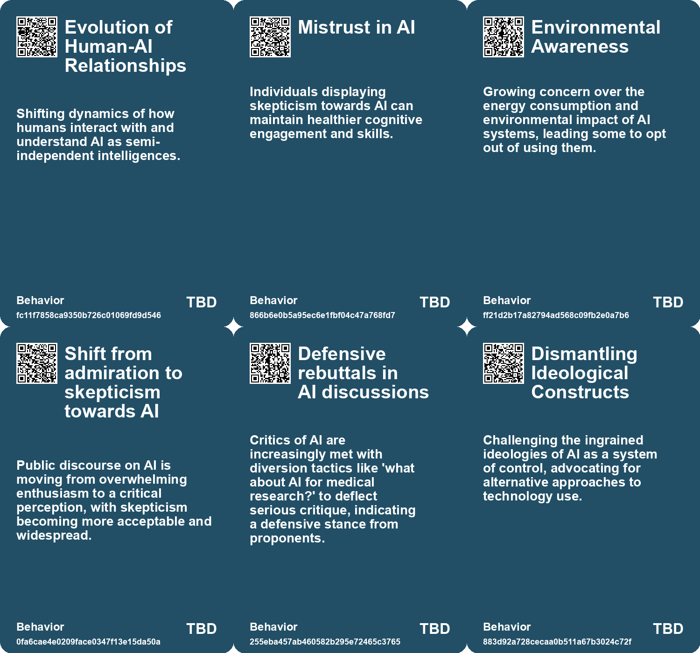
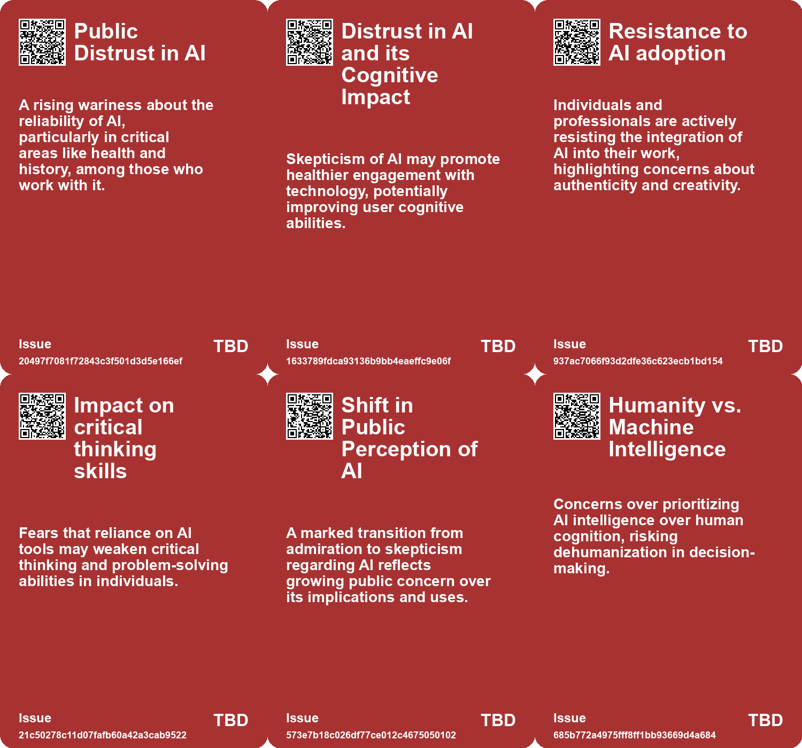
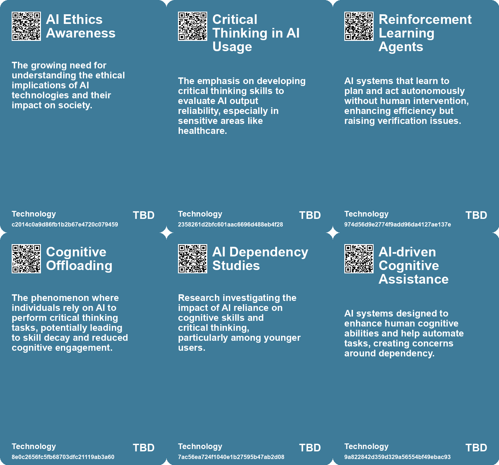

# *Topic*: Skepticism towards AI Integration

# Summary

The discourse surrounding artificial intelligence (AI) is shifting from initial optimism to growing skepticism. Many professionals express concerns about the emotional detachment of AI, its environmental impact, and the potential erosion of critical thinking skills. As AI tools like ChatGPT gain popularity, some individuals feel pressured to adopt these technologies, leading to fears of losing authenticity and control in creative processes.

The implications of AI extend beyond individual experiences to societal concerns. Discussions in New Zealand draw parallels between AI and nuclear technology, emphasizing the need for a nuanced understanding of AI's broader applications. The potential for dependency on AI, particularly in education, raises alarms about undermining learning and exacerbating social inequalities. The unpredictability of AI's evolution and its integration into various sectors highlight the necessity for critical engagement and public discourse.

Ethical considerations are at the forefront of the conversation. Many voices advocate for a more responsible approach to AI development, emphasizing the importance of transparency, trust, and explainability. The manipulation of narratives and the reinforcement of existing power structures through AI design are critical issues that demand scrutiny. The introduction of models like Public Diffusion aims to encourage ethical data sourcing and meaningful engagement with artistic work, contrasting with conventional AI systems that prioritize speed over context.

Concerns about misinformation and the reliability of AI-generated content are increasingly prominent. The ease with which AI can produce misleading information poses significant risks, particularly in political contexts. Calls for regulation and guidelines to ensure election integrity and mitigate societal harms are gaining traction. The need for a collective response to the challenges posed by AI is underscored by discussions among lawmakers and industry leaders.

The relationship between humans and AI is evolving, with a shift from collaboration to passive consumption of AI outputs. This change raises questions about the implications of relying on AI without understanding its processes. The importance of developing a new literacy in navigating AI outputs is emphasized, as users must learn to critically assess the usefulness and accuracy of AI-generated information.

The economic impact of AI is also a significant theme. While AI has the potential to enhance productivity, its inconsistent nature can limit organizational benefits. Many individuals use AI tools discreetly, fearing repercussions from their employers. To harness AI effectively, organizations must address employee concerns and foster a culture of collaboration.

Finally, the potential for AI to reshape societal structures is a topic of ongoing debate. Some envision a transition from capitalism to a new economic system focused on creativity and exploration, while others warn of the risks of amplifying greed and selfishness. The need for responsible leadership and careful consideration of AI's implications is crucial as society navigates this transformative landscape.

# Seeds

|    | name                                       | description                                                                                         | change                                                                                                     | 10-year                                                                                                        | driving-force                                                                                            |
|---:|:-------------------------------------------|:----------------------------------------------------------------------------------------------------|:-----------------------------------------------------------------------------------------------------------|:---------------------------------------------------------------------------------------------------------------|:---------------------------------------------------------------------------------------------------------|
|  0 | Distrust Among AI Workers                  | AI workers express deep skepticism about the reliability of generative AI systems.                  | Shift from trust in AI systems to skepticism and caution among AI professionals.                           | In 10 years, generative AI might be seen as unreliable, affecting its usage in various sectors.                | Increased awareness of AI's limitations and variability in output quality drives caution.                |
|  1 | Techno-Optimism vs Fear Balance            | A growing divide between optimism about AI and fear of its implications.                            | Shift from treating AI as mere tools to recognizing them as complex beings.                                | Public perception may evolve, treating AI as collaborative partners rather than tools or threats.              | Experience with increasingly advanced AI systems is shaping public understanding.                        |
|  2 | Challenges in verifying AI output accuracy | Difficulty in confirming the accuracy of AI-generated results due to lack of transparency.          | Transitioning from easily verifiable outputs to trusting AI conclusions without thorough checks.           | Potential widespread acceptance of AI outputs despite uncertainty concerning accuracy and correctness.         | Increased complexity of tasks handled by AI making verification cumbersome or impossible.                |
|  3 | AI's Societal Implications                 | Professionals express concerns over the long-term societal impacts of AI use in various fields.     | Transition from reliance on human judgment to dependence on AI for critical decisions.                     | In 10 years, society may see a critical erosion in skills necessary for problem-solving due to reliance on AI. | Concerns over diminishing critical thinking skills and human judgment.                                   |
|  4 | Skepticism Towards AI                      | A growing public skepticism towards AI is emerging, moving from admiration to criticism.            | Shift from excitement about AI to a more critical and skeptical approach among the public.                 | In 10 years, critiques of AI may be mainstream, affecting policies and AI development choices.                 | Public disappointment in AI performance and ethical implications is driving skepticism.                  |
|  5 | Marginalization of Critical Discourse      | Criticism of AI is often met with attempts to redirect discussions towards AI's potential benefits. | Shift from critical discourse being accepted to it being countered with justifications of AI applications. | Debate might evolve, with critical voices finding platforms but facing ongoing pushback from advocates.        | The desire to maintain investment and belief in AI’s potential is leading to marginalization of critics. |
|  6 | Long-term Strategic Planning               | Concerns over short-termism in tech companies hinder AI integration.                                | Shift from short-term profit focus to long-term strategic AI integration.                                  | Companies will prioritize sustainable AI integration strategies over quarterly profits.                        | The recognition of AI's transformative potential will drive long-term investment strategies.             |
|  7 | Risks of AI Misuse                         | Concerns about the amplification of greed and selfishness through AI.                               | From a cautious approach to AI to potential misuse and societal harm.                                      | In 10 years, society may grapple with the consequences of AI-driven greed and conflict.                        | The inherent risks of powerful technologies in the hands of the unwise.                                  |
|  8 | Public-Private Partnership Limitations     | Concerns arise over the effectiveness of public-private partnerships in AI development.             | Shift from optimistic views on public-private partnerships to skepticism about their outcomes.             | In a decade, public-private collaborations may be restructured to prioritize societal needs.                   | The increasing recognition of conflicts of interest in such collaborations.                              |
|  9 | Mistrust in Generative AI                  | People show skepticism towards generative AI in high-value areas.                                   | Shift from mistrust in valuable applications to increased reliance on trustworthy AI.                      | In 10 years, generative AI may be widely trusted and integrated into critical business processes.              | The need for efficiency and innovation in business drives acceptance of AI technologies.                 |

# Concerns

|    | name                                         | description                                                                                                                                                 |
|---:|:---------------------------------------------|:------------------------------------------------------------------------------------------------------------------------------------------------------------|
|  0 | Misuse of AI in Critical Decisions           | The trust in AI systems for important tasks raises concerns about accountability and the impact of potentially flawed AI decisions in significant contexts. |
|  1 | Provisional Trust and Verification           | The necessity to embrace provisional trust in AI outputs complicates the standard of accuracy and may lead to reliance on 'good enough' solutions.          |
|  2 | Loss of Critical Thinking Skills             | Over-reliance on AI could diminish human problem-solving abilities and critical thinking.                                                                   |
|  3 | Skepticism Towards AI Advances               | A growing public skepticism towards AI products and their actual benefits, leading to a more critical view of AI's role in society.                         |
|  4 | Potential for Authoritarianism               | Concerns that AI technologies may be aligned with authoritarian politics, influencing societal behavior and control.                                        |
|  5 | Distrust in AI Companies                     | A growing distrust in AI companies and their motives in marketing AI technologies, matched with public disappointment in past hype.                         |
|  6 | AI Hallucination Risks                       | Potential risks of AI-driven inaccuracies could undermine trust in AI outputs and affect decision-making.                                                   |
|  7 | Increased Complexity in Human-AI Interaction | The potential for rapid advancements in AI to lead to misunderstandings and complexities in how humans interact with these systems.                         |
|  8 | Public Distrust in Technology Leaders        | Growing public skepticism regarding the intentions of tech executives and their ability to self-regulate AI developments.                                   |
|  9 | Mistrust in Generative AI                    | People exhibit mistrust in generative AI where it could provide significant value, potentially holding back beneficial innovations.                         |

# Cards

## Concerns

## Behaviors

## Issue

## Technology

# Links

* [Embracing AI Disruption: Opportunities and Challenges in Education and Organizations](https://futures.kghosh.me/5a06b540b77553f7524f17711d73eec4)
* [Navigating the Future: The Impact of AI on Society and Economy](https://futures.kghosh.me/87709d0e31dee725ec1f54b7f4facbc4)
* [Navigating the Promises and Perils of Artificial Intelligence Development](https://futures.kghosh.me/7fcef9a240c0738d2390c83f9713dc98)
* [The Impact of Generative AI and Autonomous Agents on Business Value Creation and Trust Issues](https://futures.kghosh.me/15d4ec180189ca1739398f516844cefb)
* [The Dangers of AI Reliance: Cognitive Atrophy and Critical Thinking Decline in Knowledge Workers](https://futures.kghosh.me/682e04f0b543e67738d8ffbb84fc50dd)
* [AI's Potential to Enhance Human Evolution and Self-Actualization](https://futures.kghosh.me/8893f2e58b95e1993a5f8a1af090eedd)
* [Shifting Relationships: From Co-Intelligence to Dependence on AI Wizards](https://futures.kghosh.me/8303805e3d7cbd7515b1e1e178fe6120)
* [AI's Impact on Society: Job Displacement and the Need for Retraining](https://futures.kghosh.me/cf119665e47c7434e3e3c54dbbc585e3)
* [Shifting Perspectives: The Growing Skepticism Towards AI and Its Implications](https://futures.kghosh.me/29c7deb9342372a5679806355c66d5e2)
* [AI Workers Share Ethical Concerns and Distrust Over Generative AI Reliability and Safety](https://futures.kghosh.me/440c60817054047ca4be7ef38b8c3074)
* [Thriving in an AI Era: Embracing, Adapting, and Complementing Technology](https://futures.kghosh.me/23a3410059759ba4214235628d4ebd4b)
* [The Resistance to AI: Perspectives on Its Ethical, Environmental, and Creative Implications](https://futures.kghosh.me/d6b9f82c326ceb5994d94d5d5d68f0ee)
* [Exploring the Future of AI in Knowledge Ecosystems and Global Challenges](https://futures.kghosh.me/a9266018b458295480a07167310458a9)
* [The Transformative Potential of AI: Revolutionizing Education, Healthcare, and Global Equity](https://futures.kghosh.me/8acafe1fbe51c2de3cd689956b25b39f)
* [The Security Risks of Rapid AI Integration: A Call for Caution and Awareness](https://futures.kghosh.me/b30a4282af9e53ca673438a8223d9525)
* [Navigating AI: Balancing Technological Optimism with Appropriate Fear for the Future](https://futures.kghosh.me/98862cc3722aadf82c60f8af71f1fed5)
* [The Threat of Authoritarian Intelligence: A Call for Responsible AI Development](https://futures.kghosh.me/0ba4fa557cd2aae4760bd7a2abca844e)
* [Understanding the Real Risks of AI Beyond Superintelligence and Scalability](https://futures.kghosh.me/ff7f7a51f925c273449a8648a18b7df8)
* [Navigating the Dilemma of AI Integration in Organizations: Embracing Secret Cyborgs for Innovation](https://futures.kghosh.me/c42a95f16678ed3834840d48f8e775a3)
* [The Dual-edged Sword of AI: Misinformation and Societal Threats in the Age of Advanced Language Models](https://futures.kghosh.me/9787333cafcd0252d71a9bff845ad093)
* [Rethinking the Role of AI: From Political Tool to Ethical Design Options](https://futures.kghosh.me/c25cae2b8d72e7634d591247d9ac96d2)
* [OpenAI CEO Highlights AI Risks to Election Integrity and Calls for Regulation](https://futures.kghosh.me/fd96f58595786b0820cca21394223a66)
* [Public-Private Partnerships in AI: Risks and Societal Implications](https://futures.kghosh.me/6264095641147fe54800b8f03723f381)
* [Exploring AI's Implications: Insights from a Discussion in New Zealand on Artificial Intelligence and Society](https://futures.kghosh.me/7bdbb32950c9d265f6ec455d964973fe)