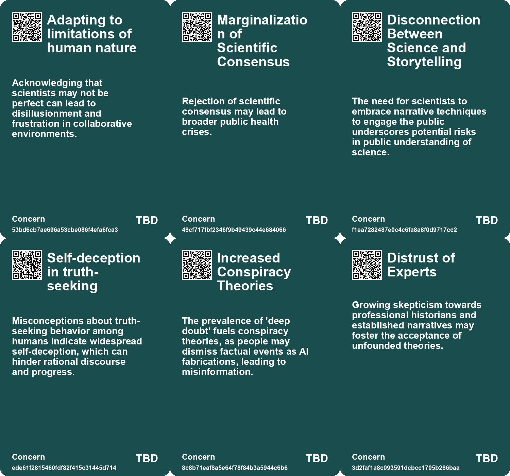
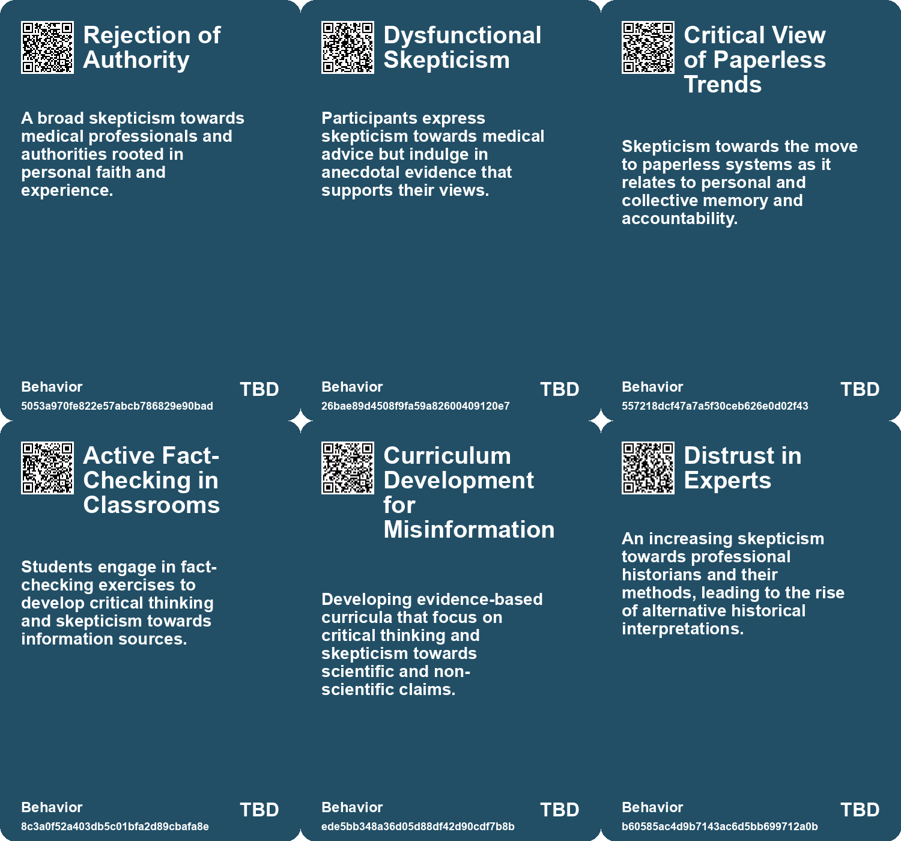
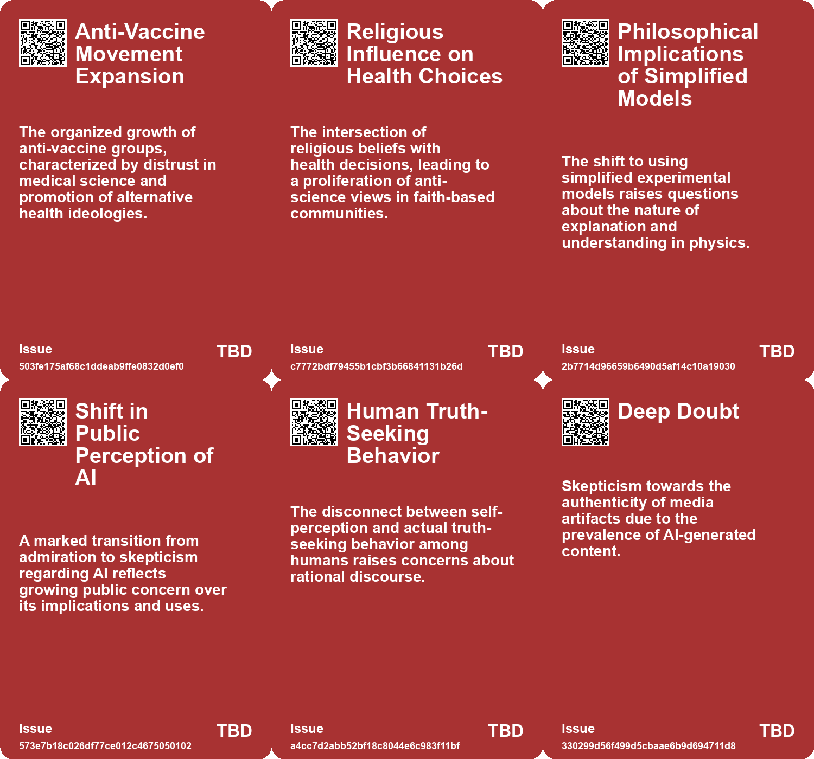
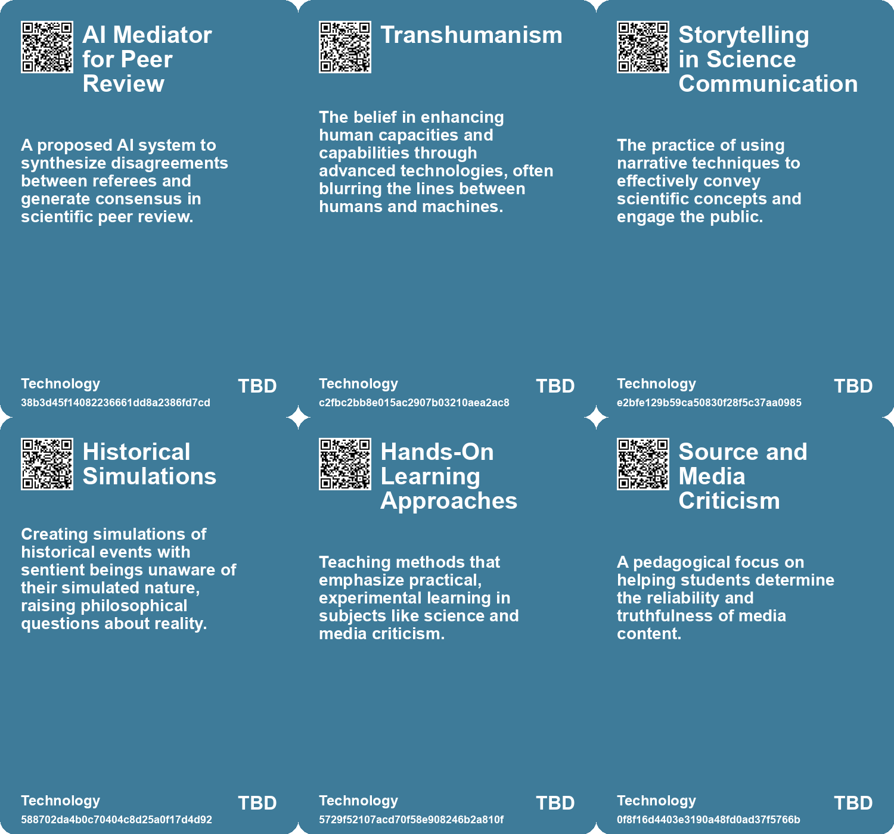

# *Topic*: Skepticism towards Scientific

# Summary

The ongoing debate between free will and determinism remains a focal point in contemporary discussions about human agency. The complexities of this debate are highlighted by neuro-determinists who argue that human decisions stem solely from neurological processes, challenging traditional notions of individual responsibility. This perspective raises significant implications for justice and societal institutions, as explored through the works of thinkers like Robert Sapolsky and Gregg Caruso. The literature of Fyodor Dostoevsky is also referenced, emphasizing the importance of moral choice and the subjective experience of free will.

Technological progress is another prominent theme, particularly the Techno-Optimist’s Fallacy, which posits that all technological advancements are inherently beneficial. This notion is scrutinized through examples such as nuclear energy and the dangers of ultra-processed foods. The conversation extends to the rise of AI and its potential to disrupt traditional research roles, as seen in the development of autonomous systems capable of conducting scientific research independently. Critics argue that the allure of technology often overshadows its risks, urging a more cautious approach to its integration into society.

The influence of digital media and the growing skepticism surrounding its authenticity are also significant. The phenomenon of "deep doubt" reflects a broader societal concern about the reliability of information in an age of photorealistic AI-generated content. This skepticism is compounded by the emergence of conspiracy theories and the concept of the "liar's dividend," which highlights how deceptive technologies can undermine trust in genuine evidence.

Education plays a crucial role in addressing misinformation and fostering critical thinking. Finland's innovative approach to integrating digital literacy and fact-checking into its curriculum serves as a model for combating fake news. By teaching students to navigate online media competently, Finland aims to cultivate a generation equipped to discern fact from fiction. This educational strategy emphasizes the importance of research and critical engagement with information.

The landscape of theoretical physics is evolving, with a shift from traditional mathematical modeling to computer simulations. This transition allows for new insights into complex systems, such as galaxy formation and quantum interactions. The emergence of quantum simulations raises philosophical questions about the nature of scientific explanation and the future of experimental predictions.

The challenges facing young life science researchers are increasingly evident, as many opt for careers in the private sector due to dissatisfaction with academic conditions. The imbalance between the number of graduate students and available faculty positions highlights systemic issues within academia. Calls for reform are growing, with demands for better support and compensation for researchers.

Finally, the role of science fiction in shaping public discourse around science and technology policy is gaining recognition. By engaging the imagination, science fiction can foster empathy and encourage dialogue about complex future scenarios. This genre serves as a bridge between traditional narratives and emerging technological realities, emphasizing the need for creative solutions to contemporary challenges.

# Seeds

|    | name                                           | description                                                                                             | change                                                                                                   | 10-year                                                                                                                         | driving-force                                                                                               |
|---:|:-----------------------------------------------|:--------------------------------------------------------------------------------------------------------|:---------------------------------------------------------------------------------------------------------|:--------------------------------------------------------------------------------------------------------------------------------|:------------------------------------------------------------------------------------------------------------|
|  0 | Cultivation of Anti-Establishment Sentiment    | Skepticism toward doctors and healthcare fuels anti-establishment views.                                | Incremental doubt toward medical professionals to open disdain and rejection.                            | A polarized public health environment, leading to differentiated health practices.                                              | Erosion of trust in scientific and medical communities post-pandemic.                                       |
|  1 | Skepticism Towards AI                          | A growing public skepticism towards AI is emerging, moving from admiration to criticism.                | Shift from excitement about AI to a more critical and skeptical approach among the public.               | In 10 years, critiques of AI may be mainstream, affecting policies and AI development choices.                                  | Public disappointment in AI performance and ethical implications is driving skepticism.                     |
|  2 | Self-Deception in Truth-Seeking                | Most humans are self-deceived about their rational truth-seeking abilities.                             | From belief in rationality to awareness of widespread self-deception.                                    | In ten years, this insight may lead to more critical approaches to truth and belief systems.                                    | Cognitive psychology insights drive awareness of self-deception in human behavior.                          |
|  3 | Conspiracy Theories Amplification              | Rise in conspiracy theories fueled by AI-generated media and deep doubt.                                | Shift from skepticism towards specific events to broader distrust in all media narratives.               | Conspiracy theories may become mainstream, affecting public trust in institutions and media.                                    | The intersection of technology, misinformation, and social media dynamics.                                  |
|  4 | Distrust in Historical Experts                 | Increasing skepticism towards professional historians and their interpretations of the past.            | Transition from reliance on expert historians to acceptance of amateur interpretations of history.       | In 10 years, historical understanding may be primarily influenced by social media personalities rather than trained historians. | A broader societal trend of questioning expert authority, fueled by misinformation and conspiracy theories. |
|  5 | Literary Criticism of Science Fiction          | Criticism of science fiction is often written by outsiders, leading to misunderstandings.               | The shift from external criticism to internal appreciation of science fiction's unique qualities.        | In 10 years, more informed criticism may emerge from within the science fiction community.                                      | The growing number of educated readers and writers in the genre will enhance critical discourse.            |
|  6 | Philosophical Reassessment of Free Will        | Ongoing debates about the nature of free will and moral responsibility in light of scientific findings. | From acceptance of free will as a foundational concept to questioning its validity based on determinism. | Philosophical frameworks may shift towards compatibilism or other models reconciling free will with determinism.                | Growing body of scientific literature suggesting deterministic views of human behavior.                     |
|  7 | Literature as a Reflection of Consciousness    | Literary works are increasingly used to explore and critique scientific perspectives on human behavior. | Shift from purely empirical analysis to incorporating subjective experiences in understanding behavior.  | Literature may play a key role in shaping public discourse on morality and individual agency in society.                        | Desire for a deeper understanding of human experience beyond scientific objectification.                    |
|  8 | Increased Skepticism of Scientific Objectivity | Rising awareness of the limitations and biases inherent in scientific research and its interpretations. | From viewing science as an objective truth to recognizing the subjective influence of researchers.       | Expectations for scientific research may include greater transparency and acknowledgment of biases in methodology.              | Calls for accountability and ethical considerations in how science interacts with human life.               |
|  9 | Skepticism about Technological Solutions       | There is skepticism about the sufficiency of technological solutions to climate change.                 | Transition from blind faith in technology to critical evaluation of its potential and limitations.       | Technological solutions may be integrated with deeper societal changes rather than being standalone fixes.                      | Growing recognition of the limitations of technology in addressing complex ecological issues.               |

# Concerns

|    | name                                                | description                                                                                                                                    |
|---:|:----------------------------------------------------|:-----------------------------------------------------------------------------------------------------------------------------------------------|
|  0 | Adapting to limitations of human nature             | Acknowledging that scientists may not be perfect can lead to disillusionment and frustration in collaborative environments.                    |
|  1 | Marginalization of Scientific Consensus             | Rejection of scientific consensus may lead to broader public health crises.                                                                    |
|  2 | Disconnection Between Science and Storytelling      | The need for scientists to embrace narrative techniques to engage the public underscores potential risks in public understanding of science.   |
|  3 | Self-deception in truth-seeking                     | Misconceptions about truth-seeking behavior among humans indicate widespread self-deception, which can hinder rational discourse and progress. |
|  4 | Increased Conspiracy Theories                       | The prevalence of 'deep doubt' fuels conspiracy theories, as people may dismiss factual events as AI fabrications, leading to misinformation.  |
|  5 | Distrust of Experts                                 | Growing skepticism towards professional historians and established narratives may foster the acceptance of unfounded theories.                 |
|  6 | Neglect of Individual Agency in Scientific Research | The scientific focus on objectifying human behavior risks overshadowing the subjective experience of free will and personal responsibility.    |
|  7 | Cultural Resistance to Scientific Determinism       | Public reception of neuroscientific claims on free will may create division between scientific communities and traditional moral values.       |
|  8 | Philosophical Paradoxes of Scientific Inquiry       | The contradictions in scientific naturalism raise questions about the nature of reason and persuasion in a deterministic world.                |
|  9 | Automation of Scientific Processes                  | Using AI for various academic tasks may lead to complete reliance on flawed technologies, compromising the scientific method.                  |

# Cards

## Concerns

## Behaviors

## Issue

## Technology

# Links

* [Exploring Wild Ideas: Quantum Mechanics, Brain Simulation, and Economic Growth](https://futures.kghosh.me/8dbda1aa70e9a8497543306086219a30)
* [Navigating Unconventional Paths in Science: Advice for Academic Misfits](https://futures.kghosh.me/31acd3259f9a87ff44dec0d6808eb2e8)
* [Exploring Attitudes Towards Climate Change and the Planetary Crisis Through the Polak Game](https://futures.kghosh.me/8829c6584a9427158f32a38766b0e3b2)
* [The Freedom Summit: A Rallying Cry for Anti-Vaccine Sentiments and Medical Distrust](https://futures.kghosh.me/5bb4812db1abfd19da133a7139cbbac9)
* [Embracing Uncertainty: Strategies for Navigating Life's Unknowns](https://futures.kghosh.me/b6a1403e12fe78cbb944ee7233c6d1f4)
* [The Transition from Mathematical Models to Computer Simulations in Theoretical Physics](https://futures.kghosh.me/e2b9fc5eb7cf1a6f906df331567447b4)
* [Concerns Over AI Misuse in Scientific Literature: A Growing Challenge for Research Integrity](https://futures.kghosh.me/6dd4fe4c2f8f6e8fcc6f47e7ac1641cf)
* [Exploring the Complexities of Consciousness: Insights from Recent Scientific Wagers and Collaborations](https://futures.kghosh.me/098f4de4b2e0da23ef41a92329c5e761)
* [Reflections on Paperlessness and Personal Archives in a Digital Age](https://futures.kghosh.me/795f331de0f04c70bc309ec865fa1769)
* [Shifting Perspectives: The Growing Skepticism Towards AI and Its Implications](https://futures.kghosh.me/29c7deb9342372a5679806355c66d5e2)
* [The Rise of Science Fiction: J.G. Ballard's Vision for Literature and Society](https://futures.kghosh.me/8ebb431ce8d949d5a1ecb52bbd42a69f)
* [Christof Koch and David Chalmers Conclude 25-Year Wager on Consciousness Discovery](https://futures.kghosh.me/a22ee1f3d953a98514b92c413784feea)
* [Exploring Free Will and Determinism in Science and Literature](https://futures.kghosh.me/20dcd5f1dfbe5f80a079ad28644cf08f)
* [Finland's Innovative Approach to Combating Fake News Through Education](https://futures.kghosh.me/ad15fbe04bbe50ec3436c61403d19fca)
* [Navigating the Challenges of Futures Work: The Importance of Imagination over Forecasting](https://futures.kghosh.me/fc5aff18bd82eee704d71ab624500dbe)
* [Understanding Polarization: Healing Our Relationship with Technology and Embracing Diverse Perspectives](https://futures.kghosh.me/c1bb890337ef382bfaa5720c9fd05134)
* [Exploring the Rise of 'Deep Doubt' Amidst AI-Generated Media Content](https://futures.kghosh.me/97be17298986599d68a1642e4359d6d5)
* [Understanding the Techno-Optimist's Fallacy and its Implications for Technology Regulation](https://futures.kghosh.me/0e281eb043be786a51d70cb923881594)
* [The AI Scientist: A Revolutionary Autonomous AI for Scientific Research](https://futures.kghosh.me/3607a211a5ceadc4c9c4f86cd5fcd2df)
* [Embracing Sensitivity: A Journey Through Personal and Environmental Awareness](https://futures.kghosh.me/c94b4b527962a011d4d17a4059841729)
* [Harnessing Science Fiction as a Tool for Engaging Science and Technology Policy Discussions](https://futures.kghosh.me/58c98790e621e1df2e408b359c701026)
* [The Evolution and Impact of Historical Revisionism Through Pseudohistory](https://futures.kghosh.me/9a403c0c9cfe943820447180b002d3af)
* [Exploring Humanity Through Science Fiction: The Journey of Astrobiologist Seven Rasmussen](https://futures.kghosh.me/64666123637fc35c1f3f2197c2b0fe14)
* [The Shift from Academia to Industry: Young Life Scientists Seek Better Opportunities](https://futures.kghosh.me/7054e5d956a73f1ccb060d1d8fe80151)