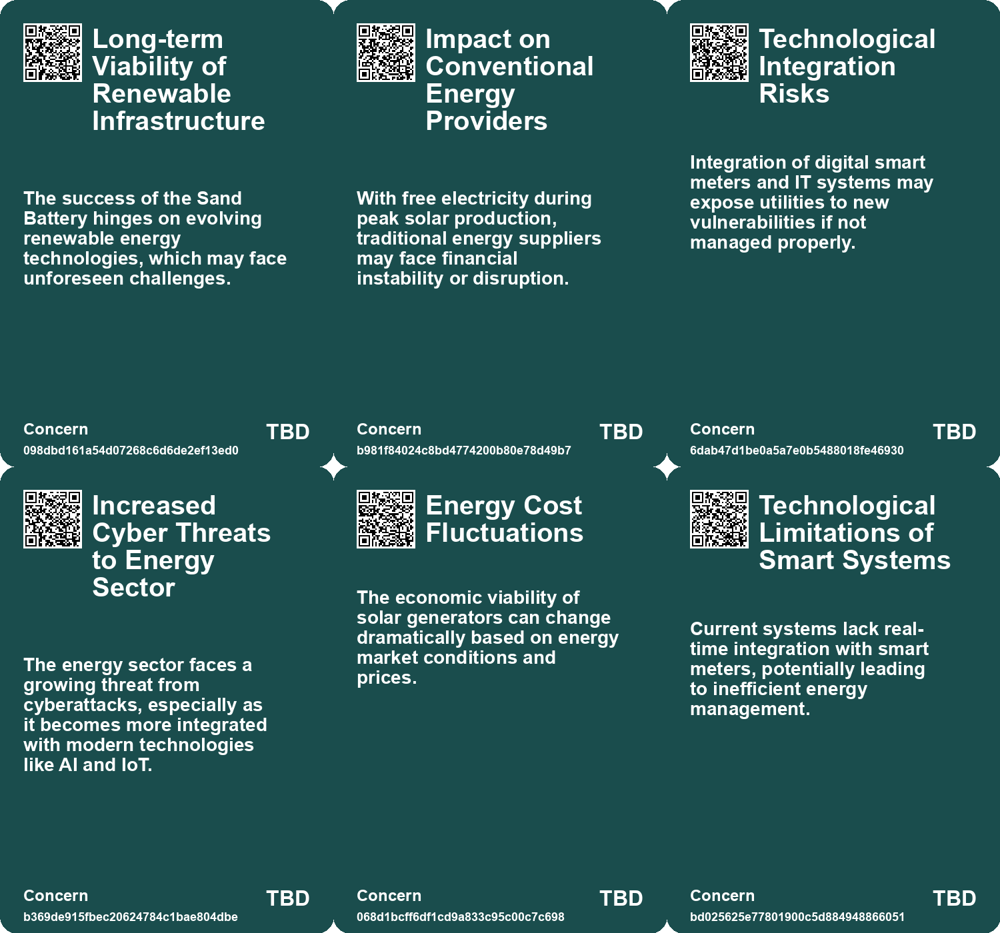
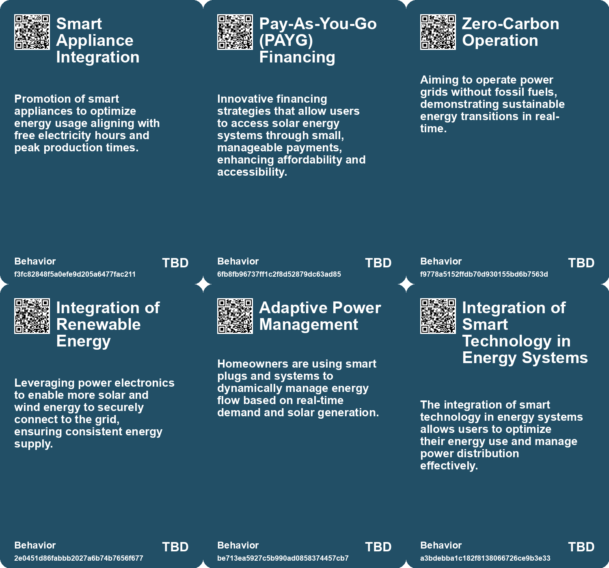
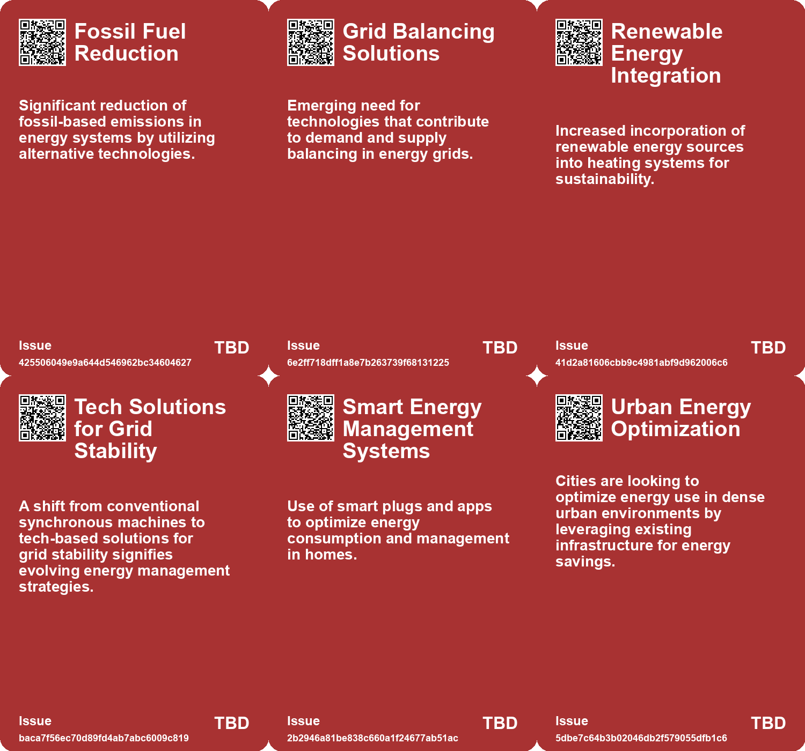
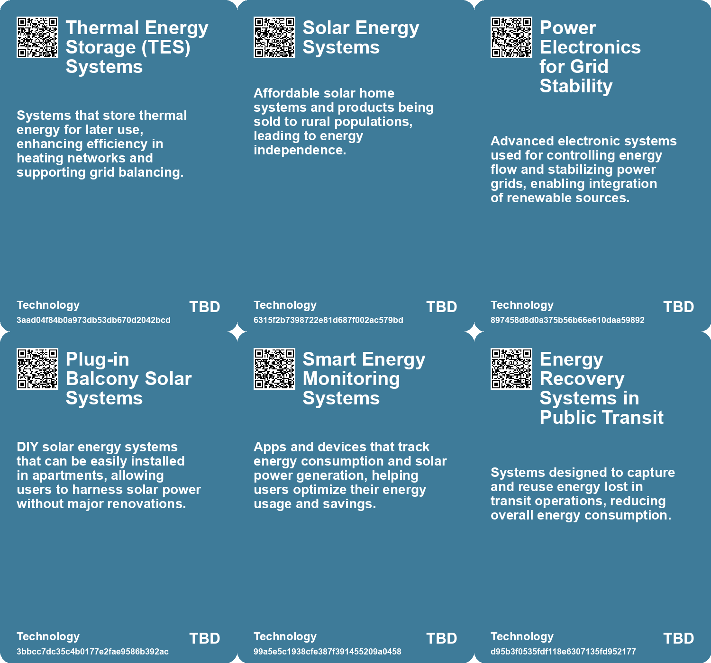

# *Topic*: Smart Energy Systems

# Summary

The energy landscape is undergoing significant transformation, driven by advancements in technology and a growing emphasis on sustainability. Heimdall Power, in collaboration with Meteomatics, has developed a system that enhances power grid transmission capacity by 30%. This technology combines real-time data from sensors and weather insights, allowing grid operators to optimize capacity and comply with regulatory requirements in the U.S. The integration of such innovations is crucial as the demand for reliable energy sources continues to rise.

Solar energy is at the forefront of this shift, with portable solar generators like EcoFlow's PowerStream gaining popularity. These systems provide energy independence and backup power, particularly in areas lacking grid access. In Europe, solar energy has become the largest source of electricity, surpassing traditional sources like nuclear and wind. This trend is mirrored in Sub-Saharan Africa, where solar solutions are transforming energy access for millions, thanks to innovative financing models and decreasing hardware costs.

The push for renewable energy is not without challenges. The UK's energy sector faces heightened cybersecurity threats, particularly as it integrates more digital technologies. Aging infrastructure and legacy systems increase vulnerability, necessitating modern security measures to protect critical energy assets. Similarly, the water utilities in the UK are grappling with security and sustainability issues, as climate change and rising demand put pressure on resources.

In the realm of energy storage, a new 200-MW grid-scale battery in Scotland has demonstrated its ability to stabilize the grid during failures, showcasing the potential of advanced battery technologies. Meanwhile, Australia is embarking on the Solar Sharer plan, which will provide free electricity during peak solar production hours, encouraging energy use when it is most abundant.

Innovations in energy generation are also emerging from unexpected places. A new solar-powered desalination system developed by MIT engineers aims to provide clean water to communities reliant on saline groundwater, maximizing solar energy use without battery storage. In Nevada, Zanskar's geothermal startup has identified a viable site for a power plant, highlighting the untapped potential of geothermal energy.

As the world grapples with record-breaking temperatures and increased energy demands, the need for efficient cooling solutions becomes critical. Inefficient air conditioning systems are straining power grids, particularly in developing economies. Addressing these challenges through improved standards and energy efficiency measures is essential for a sustainable energy future.

In the automotive sector, General Motors is launching GM Energy, a new division focused on renewable energy products, including batteries and solar panels. This move positions GM as a competitor to Tesla in the growing market for energy generation and storage. As electric vehicles gain traction, concerns about cybersecurity and infrastructure remain pressing, necessitating ongoing research and development to ensure safe and reliable systems.

The convergence of these themes underscores a pivotal moment in the energy sector, where innovation, sustainability, and security are intertwined. The transition to renewable energy sources is reshaping economies and lifestyles, reflecting a collective effort to address the pressing challenges of climate change and energy access.

# Seeds

|    | name                                         | description                                                                                                               | change                                                                                                      | 10-year                                                                                                             | driving-force                                                                                                         |
|---:|:---------------------------------------------|:--------------------------------------------------------------------------------------------------------------------------|:------------------------------------------------------------------------------------------------------------|:--------------------------------------------------------------------------------------------------------------------|:----------------------------------------------------------------------------------------------------------------------|
|  0 | Scaling Renewable Heating Solutions          | Large-scale projects demonstrating viability of renewable thermal energy systems.                                         | Scaling up thermal energy storage from smaller projects to larger district heating networks.                | Large-scale renewables could dominate urban energy systems, enhancing efficiency and sustainability.                | Advances in technology and funding for renewable infrastructure promoting larger projects.                            |
|  1 | Digital Infrastructure Layer Creation        | Solar energy systems are building a digital infrastructure for further financial services.                                | Emergence of holistic systems combining energy and financial services for consumers.                        | Enhanced access to various economic opportunities through a single infrastructure model.                            | The increasing need for integrated services in developing markets to drive economic growth.                           |
|  2 | Battery Storage Expansion                    | The planned integration of significant battery storage alongside solar generation indicates a shift in energy management. | From reliance on traditional energy sources to integrating flexible storage solutions in renewables.        | In the future, enhanced battery storage could revolutionize energy distribution and stability.                      | The need for reliable energy supply and advancements in battery technology.                                           |
|  3 | Integration of OT and IT                     | Increasing digital transformation creates complexities in securing energy systems.                                        | From isolated operational technologies to interconnected systems requiring cohesive security.               | Shift toward integrated cybersecurity measures that address both physical and digital vulnerabilities.              | Push for efficiency through technology integration drives the demand for cohesive cybersecurity strategies.           |
|  4 | Adoption of Small Modular Reactors (SMRs)    | Tech companies are increasingly turning to SMRs for sustainable energy needs.                                             | A shift from traditional energy sources to compact, nuclear-based power generation for tech infrastructure. | Data centers may predominantly rely on nuclear energy, transforming energy production and consumption patterns.     | The growing demand for sustainable, reliable energy to support AI and tech operations.                                |
|  5 | DIY Solar Solutions Popularity               | DIY solar systems from companies like EcoFlow and Anker gaining traction among consumers.                                 | Transition from solely professional installations to consumer-friendly DIY solar systems.                   | Homes may increasingly feature DIY solar solutions, promoting energy independence and cost savings.                 | Rising energy prices and technological advancements make DIY solar solutions more accessible.                         |
|  6 | Smart Energy Management Systems              | Integration of smart plugs and apps for real-time energy monitoring and management.                                       | Shift towards smart home technologies for optimizing energy consumption and savings.                        | Smart energy management may become standard in homes, enhancing energy efficiency and cost control.                 | The demand for energy efficiency and cost savings leads to increased adoption of smart technologies.                  |
|  7 | Safety Concerns with Home Energy Solutions   | Growing concerns about the safety of integrating home energy systems with the grid.                                       | Transition from traditional safety perceptions to a need for better safety protocols for new technologies.  | Enhanced safety standards and regulations for home energy systems to protect consumers and workers.                 | Rising safety concerns and regulatory scrutiny push for better practices in home energy management.                   |
|  8 | Commercialization of Massless Energy Storage | A new company aims to commercialize the concept of massless energy storage for various applications.                      | From laboratory research to potential market-ready solutions for vehicles and gadgets.                      | Mass-produced structural batteries could enable significant advancements in electric vehicles and portable devices. | The growing electric vehicle market creates a need for innovative solutions to enhance performance and reduce weight. |
|  9 | Increased Capacity for Renewable Energy      | Heimdall Power's tech allows for greater integration of renewable energy into the grid.                                   | Moving towards a grid that can support a higher percentage of renewable energy sources.                     | The grid may be dominated by renewable energy sources, transforming energy production and consumption.              | The global push for sustainable energy solutions and carbon reduction goals.                                          |

# Concerns

|    | name                                            | description                                                                                                                                    |
|---:|:------------------------------------------------|:-----------------------------------------------------------------------------------------------------------------------------------------------|
|  0 | Long-term Viability of Renewable Infrastructure | The success of the Sand Battery hinges on evolving renewable energy technologies, which may face unforeseen challenges.                        |
|  1 | Impact on Conventional Energy Providers         | With free electricity during peak solar production, traditional energy suppliers may face financial instability or disruption.                 |
|  2 | Technological Integration Risks                 | Integration of digital smart meters and IT systems may expose utilities to new vulnerabilities if not managed properly.                        |
|  3 | Increased Cyber Threats to Energy Sector        | The energy sector faces a growing threat from cyberattacks, especially as it becomes more integrated with modern technologies like AI and IoT. |
|  4 | Energy Cost Fluctuations                        | The economic viability of solar generators can change dramatically based on energy market conditions and prices.                               |
|  5 | Technological Limitations of Smart Systems      | Current systems lack real-time integration with smart meters, potentially leading to inefficient energy management.                            |
|  6 | Need for Policy Interventions                   | Urgent need for stronger policies to improve energy efficiency and reduce the impact of rising cooling demands on power systems.               |
|  7 | Energy Dependency Risks                         | Cities heavily reliant on centralized energy systems may be vulnerable to disruptions in electricity supply, especially during crises.         |
|  8 | Battery Storage Costs                           | High costs associated with battery storage systems can limit the effectiveness and attractiveness of solar solutions.                          |
|  9 | Public Safety and Compliance Risks              | Plug-in solar systems could lead to safety hazards if unregulated systems are improperly installed or maintained.                              |

# Cards

## Concerns

## Behaviors

## Issue

## Technology

# Links

* [Revolutionary Structural Battery Could Transform Electric Vehicles and Electronics](https://futures.kghosh.me/209ea02ec47418a1be011089e4e58efa)
* [Australia's New Solar Initiative: Free Electricity Hours for Residents by 2026](https://futures.kghosh.me/bfb15eb1a721b2ef04429a406b2f0deb)
* [Sweden's Energy Crisis: Government Measures and EU Market Challenges Amid Rising Prices](https://futures.kghosh.me/d0c0ac935a4108e752daca80749387a8)
* [Extreme Heat and Rising Air Conditioning Demand: The Urgent Need for Energy Efficiency Solutions](https://futures.kghosh.me/0ca38b65b97d6235d3b3dbb3efdb0c21)
* [Transformative Impact of Solar Energy Solutions in Africa: A New Infrastructure Paradigm](https://futures.kghosh.me/530d83cbb403ce78a442fbf71cacb512)
* [Spain Embraces DIY Solar Panels: A New Trend in Urban Energy Self-Sufficiency](https://futures.kghosh.me/6269bb1ff221e959b7b02d367d989ab2)
* [Safeguarding the UK's Energy Sector: The Cybersecurity Challenge in an AI Era](https://futures.kghosh.me/58871ce6d54ebbaf1ac529fa1376eb2a)
* [General Motors Launches GM Energy to Compete in Renewable Energy Market](https://futures.kghosh.me/db277b1d574be61a29e5d0e818b02268)
* [Barcelona's Innovative Subway System: Harnessing Regenerative Braking for Energy Efficiency](https://futures.kghosh.me/27e2e93d576270c6eaee2cfd32e5141c)
* [The Rise of 'Dumb Homes': High-End Buyers Reject Smart Technology](https://futures.kghosh.me/025cf0c3f2bcffc0ac242fb547a1320a)
* [Zanskar's Groundbreaking Geothermal Discovery in Nevada: A New Era for Blind Systems](https://futures.kghosh.me/fb1df9286a9f60f1f5de2679016e07eb)
* [Australia-Asia Power Link Project Secures Approval for Renewable Energy Transmission to Singapore](https://futures.kghosh.me/ea5d2a5fbea797de86df6083a13d6515)
* [Maximizing Solar Energy Use at Home with EcoFlow's PowerStream System](https://futures.kghosh.me/3a0ad892ff7df4cb7345acc2449c51b9)
* [Publicly Accessible PV Monitoring Systems Pose Cybersecurity Risks](https://futures.kghosh.me/3ac657f7b32d24bb43bddca058e2db25)
* [Innovation in Scotland: The Role of Grid-Scale Batteries in Stabilizing Energy Grids](https://futures.kghosh.me/ece3bd8007e38ba75470c88fcdafd4d3)
* [Google Partners with Kairos Power for Nuclear Energy to Power AI Data Centers](https://futures.kghosh.me/f9ef1fc984ab921e2f13d2c53db0a066)
* [Revolutionary Ultra-Thin Solar Technology Promises Efficient Energy Generation Without Silicon Panels](https://futures.kghosh.me/121994a09192673002c6987ca6b78f77)
* [Electric Vehicles Surge Ahead Amid Cybersecurity Concerns and Research Innovations](https://futures.kghosh.me/aed93d4ebe969eabe23df9935bdb4cb8)
* [EU's Electricity from Renewables Reaches 54% in Q2 2025, Led by Solar Power](https://futures.kghosh.me/239a1e4701a874e097e611adcb0f6c9b)
* [Transforming Water Utilities: Addressing Security and Sustainability Challenges through Innovation](https://futures.kghosh.me/d54442ea6fe7853d0f8674688c9b7064)
* [Innovative Sphere Sensors Set to Revolutionize High-Voltage Power Line Monitoring in the U.S.](https://futures.kghosh.me/5f6b61cf3188966409a86606c4fb6134)
* [Transforming Warfare: The Role of Uncrewed Systems in Modern Military Strategy](https://futures.kghosh.me/df83d0064f88153a92b016bc412f6b97)
* [Heimdall Power and Meteomatics Boost Power Grid Capacity by 30% Through Innovative Technology](https://futures.kghosh.me/ac1dca3c524bdd7aa99f29fd255c7c41)
* [MIT Engineers Develop Innovative Solar-Powered Desalination System for Clean Water](https://futures.kghosh.me/66f16672fad50ae27b2625c86d101b01)
* [Polar Night Energy and Lahti Energia Collaborate on a Major Sand Battery Project in Finland](https://futures.kghosh.me/0251d758d212293a473ce2ff6e3ab1ae)