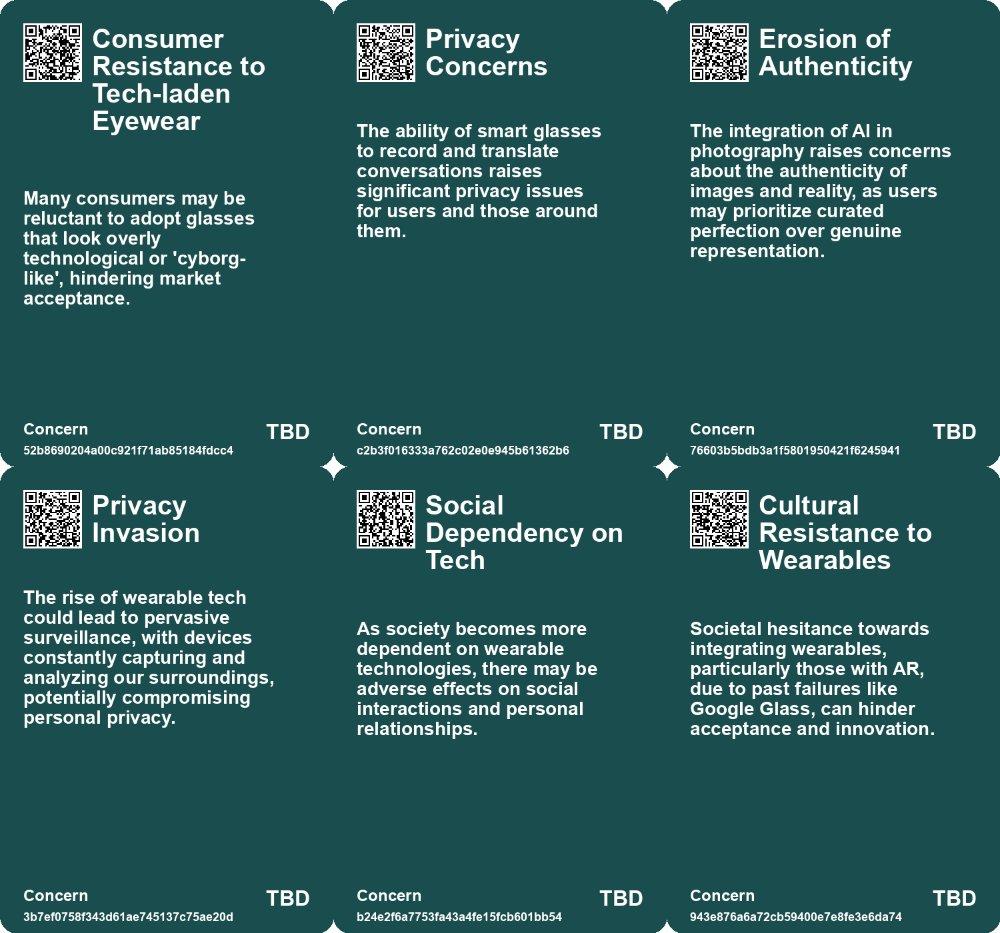
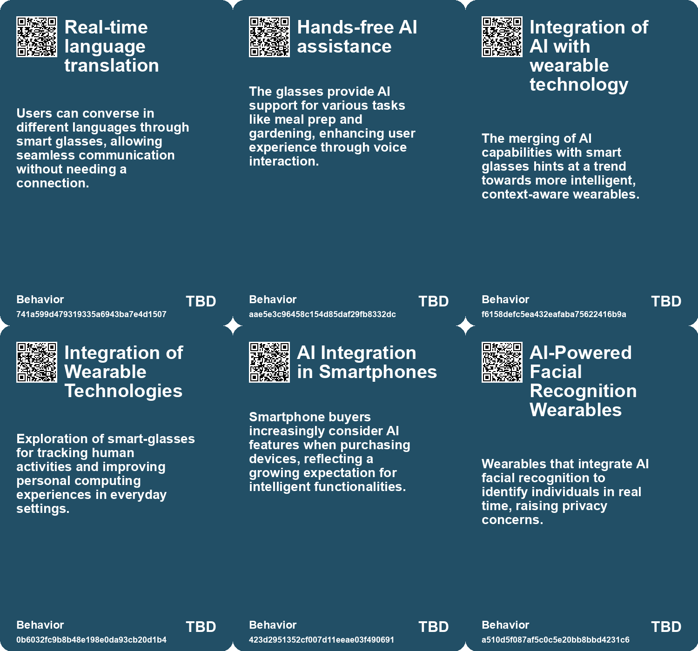
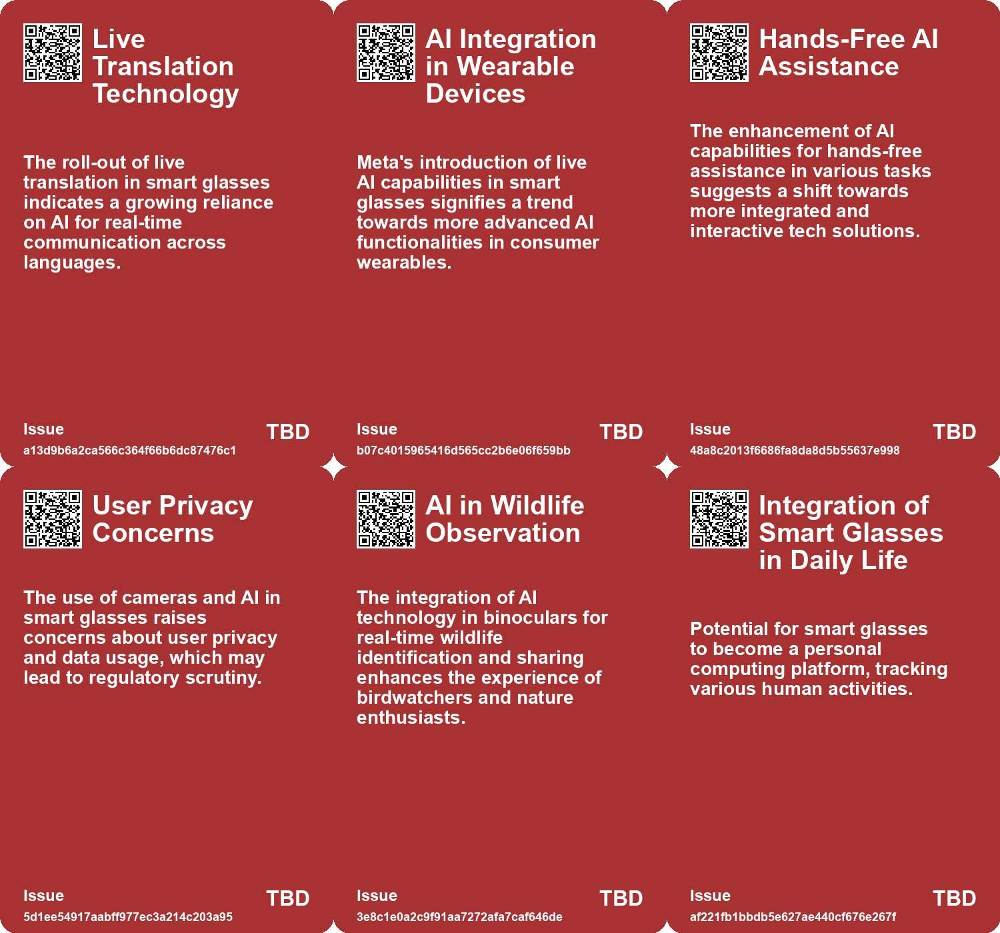
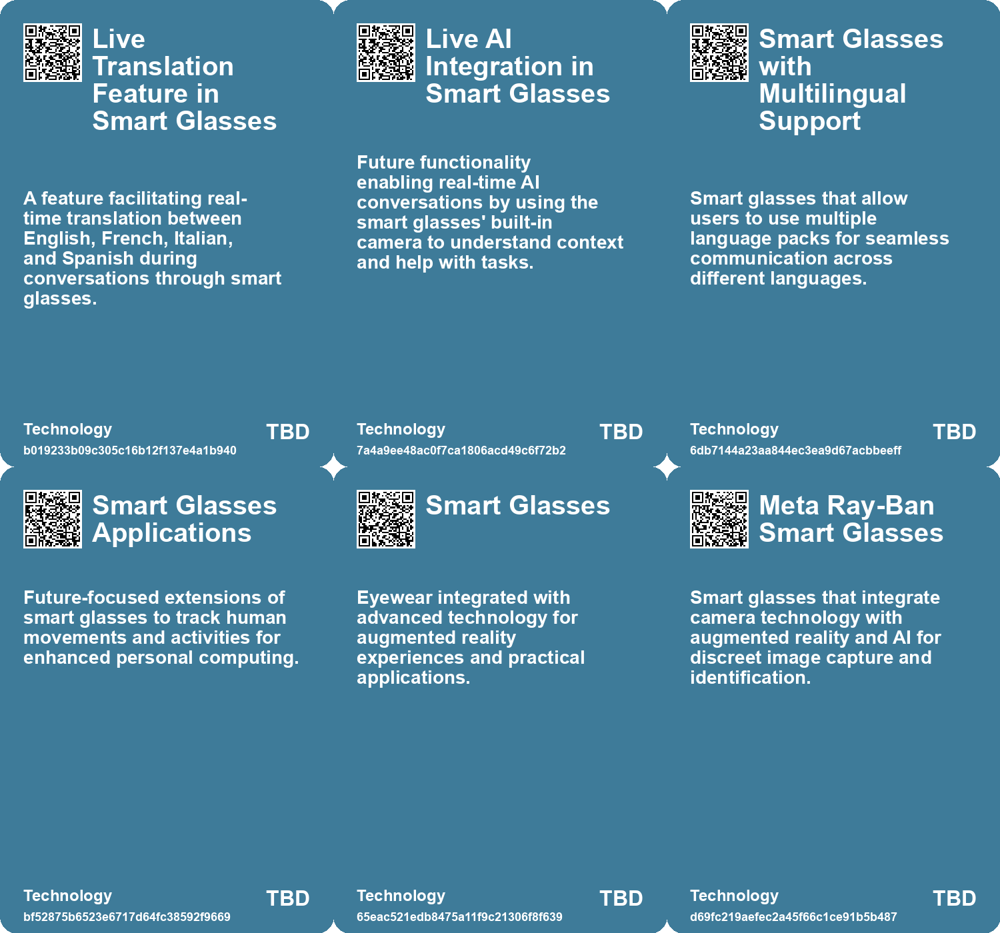

# *Topic*: Smart Glasses with AI Integration

# Summary

The rapid evolution of wearable technology is reshaping how we interact with the world. Innovations like Meta's Ray-Ban Smart Glasses now include live translation features, allowing users to communicate across languages without needing an internet connection. Meanwhile, Cornell University researchers have developed sonar glasses that can interpret silent speech commands, showcasing the potential for hands-free communication. Finnish company IXI is also making strides with autofocus glasses that adjust vision in real-time, aiming to replace traditional bifocals. These advancements highlight a growing trend toward integrating technology seamlessly into daily life.

Artificial intelligence continues to be a focal point in various sectors, with companies like Google and Microsoft leading the charge. Google is enhancing its Pixel 8 phone with AI features that simplify photography, while also introducing AI image editing tools for consumers. Microsoft is launching autonomous AI agents to automate tasks in business settings, emphasizing productivity. However, these advancements raise concerns about privacy and authenticity, particularly with AI's role in image manipulation and the potential for misinformation.

The ethical implications of technology are increasingly under scrutiny. A project by Harvard students using AI for facial recognition sparked debates about privacy and the potential misuse of personal data. Similarly, Optifye.ai's surveillance methods for monitoring factory workers have drawn criticism for dehumanizing treatment. As technology becomes more integrated into our lives, the balance between innovation and ethical responsibility remains a critical discussion point.

The intersection of AI and human relationships is also a significant theme. The rise of personal AI assistants is changing how we interact with information and each other. These assistants will curate our experiences, but they also pose risks of manipulation and loss of personal agency. The potential for mind-reading technology, as demonstrated by researchers in Singapore and Hong Kong, raises profound ethical questions about privacy and the right to free thought.

As AI becomes more prevalent, concerns about cognitive consequences emerge. Overreliance on AI tools may lead to diminished critical thinking and decision-making skills. This phenomenon, termed cognitive atrophy, highlights the need for individuals to maintain mental engagement and skepticism towards AI-generated information. The challenge lies in balancing the benefits of AI with the preservation of essential human cognitive abilities.

The future of AI hardware is also a topic of interest, with companies like Humane and Apple exploring new form factors for AI devices. The development of the Taichi AI chip, which processes data using light instead of electricity, signifies a leap in energy efficiency and performance. These advancements could pave the way for more powerful AI applications across various industries.

Finally, the ongoing evolution of technology is prompting discussions about the nature of human interaction. The trend toward reducing face-to-face communication through online services and automated systems raises concerns about empathy and social understanding. As technology continues to advance, the essence of human connection may be at risk, necessitating a reevaluation of how we engage with both technology and each other.

# Seeds

|    | name                                     | description                                                                         | change                                                                                          | 10-year                                                                                                      | driving-force                                                                                 |
|---:|:-----------------------------------------|:------------------------------------------------------------------------------------|:------------------------------------------------------------------------------------------------|:-------------------------------------------------------------------------------------------------------------|:----------------------------------------------------------------------------------------------|
|  0 | Hands-Free AI Assistance                 | Future plans for smart glasses to offer hands-free assistance with various tasks.   | Moving from traditional responsive devices to fully integrated, context-aware smart assistants. | AI-powered devices could become ubiquitous, fundamentally changing how we interact with technology.          | Advancements in AI technology and demand for more integrated smart solutions.                 |
|  1 | Integration of AI in Smart Glasses       | Future feature allowing AI conversations via glasses camera feed.                   | Shifting from passive technology to dynamic, interactive AI experiences.                        | AI could completely alter personal technology interactions, enhancing user experience dramatically.          | User desire for more intuitive and responsive technology interactions.                        |
|  2 | Competitive Landscape for Smart Glasses  | Meta's glasses could influence future Apple smart glasses development.              | From singular brand innovations to a competitive landscape of smart eyewear technology.         | A mature market for smart glasses, leading to diverse offerings and functionalities.                         | Corporate competition in tech leading to accelerated innovation and feature development.      |
|  3 | AI-Supported Binoculars                  | Swarovski's AX Visio introduces AI for bird identification and sharing experiences. | Change from traditional binoculars to smart, AI-assisted wildlife observation tools.            | In 10 years, AI-supported devices may dominate wildlife observation, enhancing user experience and learning. | The increasing integration of AI in everyday tools for enhanced user engagement and learning. |
|  4 | Sonar Glasses for Silent Communication   | Eyeglasses that use sonar technology to interpret silent speech commands.           | From traditional voice commands to silent communication through wearable technology.            | In 10 years, wearable devices may become the primary interface for hands-free interaction.                   | The growing demand for privacy and hands-free technology in personal devices.                 |
|  5 | Emergence of Wearable Technologies       | Wearable tech is becoming a primary way to access innovations like AI and AR.       | Shift from smartphone-centric technology to wearable devices for accessing digital innovations. | Wearable tech will dominate daily life, integrating seamlessly with our routines and identities.             | The push for more intuitive and integrated tech that enhances human capabilities.             |
|  6 | Integration of AR and VR into Daily Life | Wearable tech is paving the way for AR and VR integration in everyday activities.   | From separate virtual experiences to an integrated hybrid reality.                              | AR and VR will become commonplace, altering perceptions of reality and identity.                             | The desire to enhance experiences through immersive technology.                               |
|  7 | AI-based Facial Recognition in Wearables | Modification of Meta Ray-Ban Glasses to incorporate AI-based facial recognition.    | Shift from traditional privacy to real-time identification using wearables.                     | Widespread use of smart glasses for identification, potentially normalizing surveillance in daily life.      | Advancements in AI and consumer technology enabling discreet data collection.                 |
|  8 | AI in Communication                      | Zoom's AI avatars and features suggest a future where AI mediates communication.    | Evolving from human-to-human interaction to AI-mediated communication in professional settings. | AI may take a central role in communication, changing how relationships and teams function.                  | The rapid advancement of AI technology and its application in everyday tasks.                 |
|  9 | AI in Wearable Technology                | Integration of AI into wearable devices for health and lifestyle management.        | Evolving from simple wearables to smart devices that actively assist users.                     | Wearable tech that actively manages health and wellness through AI insights.                                 | Growing health consciousness and reliance on technology for personal well-being.              |

# Concerns

|    | name                                        | description                                                                                                                                                                  |
|---:|:--------------------------------------------|:-----------------------------------------------------------------------------------------------------------------------------------------------------------------------------|
|  0 | Consumer Resistance to Tech-laden Eyewear   | Many consumers may be reluctant to adopt glasses that look overly technological or 'cyborg-like', hindering market acceptance.                                               |
|  1 | Privacy Concerns                            | The ability of smart glasses to record and translate conversations raises significant privacy issues for users and those around them.                                        |
|  2 | Erosion of Authenticity                     | The integration of AI in photography raises concerns about the authenticity of images and reality, as users may prioritize curated perfection over genuine representation.   |
|  3 | Privacy Invasion                            | The rise of wearable tech could lead to pervasive surveillance, with devices constantly capturing and analyzing our surroundings, potentially compromising personal privacy. |
|  4 | Social Dependency on Tech                   | As society becomes more dependent on wearable technologies, there may be adverse effects on social interactions and personal relationships.                                  |
|  5 | Cultural Resistance to Wearables            | Societal hesitance towards integrating wearables, particularly those with AR, due to past failures like Google Glass, can hinder acceptance and innovation.                  |
|  6 | Ethical Implications of Augmented Reality   | The introduction of AR wearables raises ethical concerns surrounding the manipulation of reality and the potential for misinformation.                                       |
|  7 | Privacy Risks with On-Device AI             | The use of AI on devices raises concerns about data privacy and potential misuse of personal information.                                                                    |
|  8 | Market Disruption for Software Applications | As Siri and built-in AI take over tasks, standalone apps may struggle to survive, impacting software diversity.                                                              |
|  9 | Dependence on AI for Memory                 | Societal reliance on AI devices to recall personal information may diminish human memory capacity and critical thinking skills.                                              |

# Cards

## Concerns

## Behaviors

## Issue

## Technology

# Links

* [Tsinghua University's Taichi: A Revolutionary Light-Based AI Chip for Future Computing](https://futures.kghosh.me/1aec7cb8723d807f5486e963a0eb6337)
* [Survey Shows iPhone Users Value AI but Find Current Features Lacking](https://futures.kghosh.me/8a1e89d07cd80dcc74da86f69480c760)
* [Microsoft Unveils Air-Gapped AI Model for U.S. Intelligence Services to Enhance Data Security](https://futures.kghosh.me/4c2c25b1e6fe59720b8220e3b1a21ba4)
* [Google's New AI Patent Aims to Transform Smartphone Photography for Everyday Users](https://futures.kghosh.me/a60e6bcdb17f08219630a0dfff0760f9)
* [Cornell Researcher Develops Sonar Glasses for Silent Speech Recognition and Device Control](https://futures.kghosh.me/ec5ddbc54cbf0686918bc273da8d97c3)
* [The Cognitive Costs of AI: Are We Sacrificing Our Mental Abilities for Convenience?](https://futures.kghosh.me/09e7abde98ff0c5590320545c5b20679)
* [Swarovski Unveils AX Visio: The First AI-Supported Smart Binoculars for Wildlife Observation](https://futures.kghosh.me/8c153886d1a8b3bdae4f592d01e2e194)
* [Innovative Products and Technologies Transforming Everyday Life and Sustainability](https://futures.kghosh.me/04812fe3c35f54dbe402772b71bcbef6)
* [Innovative AI Hardware in 2024: Exploring New Form Factors and Applications](https://futures.kghosh.me/1f0a208e60ca217eb543648a46fe44ad)
* [Harvard Students Create AI-Powered Ray-Ban Glasses for Real-Time Facial Recognition](https://futures.kghosh.me/df23c7b48a8f711404c1d0d100c72e42)
* [Thriving in an AI Era: Embracing, Adapting, and Complementing Technology](https://futures.kghosh.me/23a3410059759ba4214235628d4ebd4b)
* [The Future of Wearable Technology: Merging Cyborg Lifestyles with Daily Life](https://futures.kghosh.me/a81c4775b91ccd0db3e1b84da893ac6f)
* [Advancements in AI: The Promise and Limitations of Interactive Models like GPT-4o and Astra](https://futures.kghosh.me/f98dab2817789f549215229135f086d0)
* [Apple's AI Innovations: Enhancing User Experience and Ecosystem Integration at WWDC](https://futures.kghosh.me/36fb34db6e6d559e27ceb9ff09d6f65b)
* [Innovative Autofocus Glasses by IXI: Revolutionizing Vision Correction with Liquid Crystals](https://futures.kghosh.me/191e9c6de0dfce7c2617050c6ab8d527)
* [The Diminishing Role of Human Interaction in Modern Technology and Its Societal Implications](https://futures.kghosh.me/31491f2b50e77cc7c45e541a9b2915d7)
* [Advancements in Mind-Reading Technology Raise Ethical Concerns About Privacy and Free Thought](https://futures.kghosh.me/95a515aafcc880230a55f57c5d902d3f)
* [The Role of Personal AI Assistants as Interfaces to Reality and Their Implications](https://futures.kghosh.me/f6a4f1f9e66f99bd101dee7d6a800855)
* [Exploring the Intersection of Technology and Sci-Fi: Insights on AI, Predictive Policing, and Drone Warfare](https://futures.kghosh.me/026209244953fa87db05ebd0105fb0c4)
* [The Controversial AI Monitoring System: A New Era of Factory Surveillance](https://futures.kghosh.me/ef44cb256854bbf303ad9cd0e262f0ec)
* [Meta's Ray-Ban Glasses Introduce Live Translation and Future AI Features](https://futures.kghosh.me/865c4dea84bbed684e720cae239e4237)
* [Google Unveils Advanced AI Models at Annual Developer Conference](https://futures.kghosh.me/f4718ee96320eab282c1a917013da4b3)
* [The Impact of AI on Image Manipulation and Authenticity in the Digital Age](https://futures.kghosh.me/447aaddba1b3b4ac319e14628e6ed8f2)
* [Microsoft Launches Autonomous AI Agents to Boost Productivity and Improve Business Efficiency](https://futures.kghosh.me/ccb5695c1b392857d55b45a52b0b62e6)
* [Zoom to Introduce AI Avatars for Meetings, Enhancing Productivity and Personalization Features](https://futures.kghosh.me/a4145dba2f6ae134e7e2a90f5ac1be72)