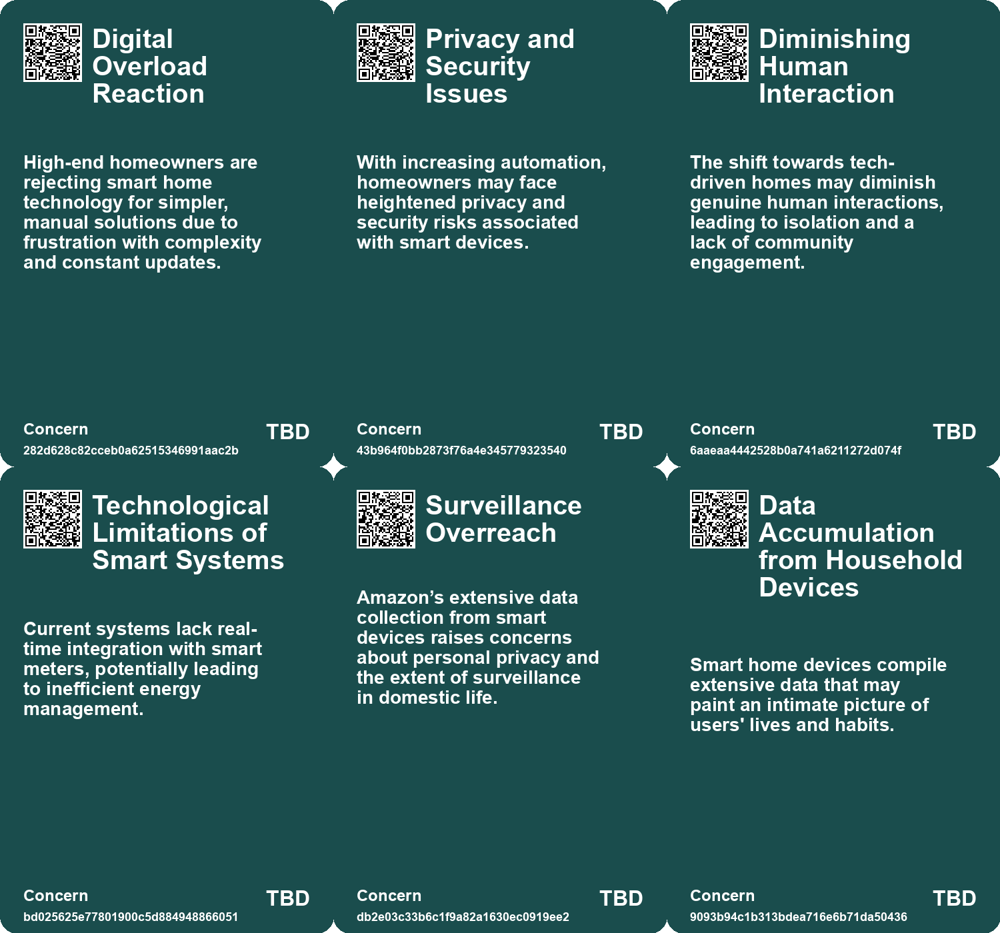
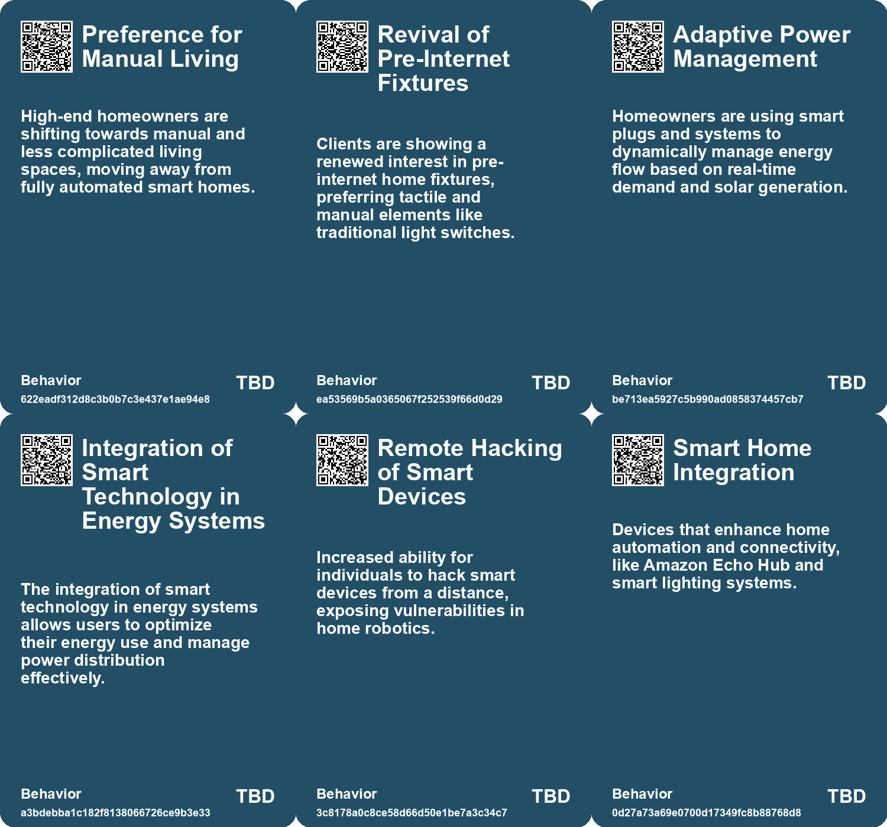
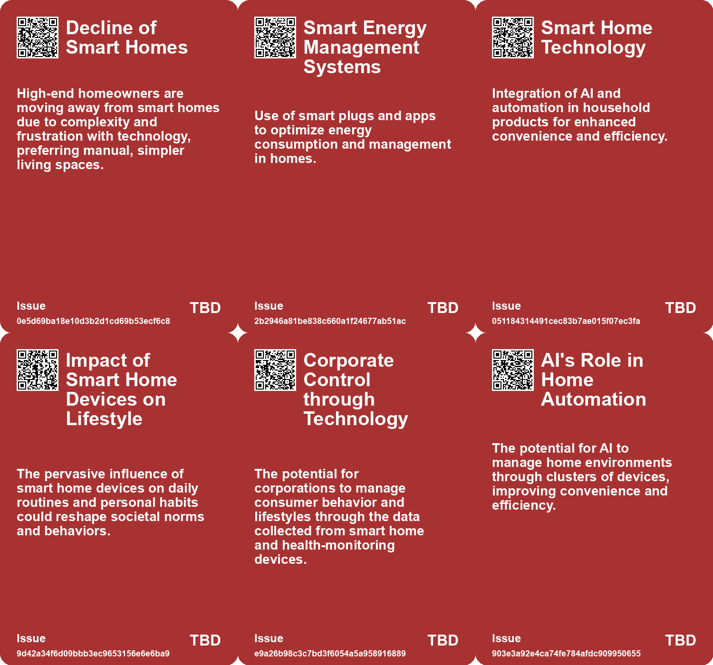

# *Topic*: Smart Home Integration

# Summary

A notable trend is emerging among high-end homeowners who are increasingly opting for low-tech living environments. This shift reflects a growing frustration with smart home technologies, which often come with complex interfaces and privacy concerns. Designers are reporting a demand for homes that prioritize tactile experiences and self-sufficiency over digital convenience. This movement signals a broader desire to escape the overwhelming presence of technology in daily life.

Privacy concerns are a recurring theme across various sectors, particularly with the rise of smart devices. Amazon's extensive range of products, including Echo speakers and Ring doorbells, raises significant questions about data collection and surveillance. Users face a dilemma between the convenience these devices offer and the potential invasion of privacy. Similarly, the proliferation of smart appliances, such as air fryers, has prompted scrutiny from consumer advocacy groups, highlighting the invasive permissions required for their operation.

The intersection of technology and security is also a critical focus. Innovations like Gamgee's Wi-Fi Home Alarm System demonstrate how technology can enhance home security by using Wi-Fi signals to detect intruders. However, concerns about privacy persist, as the system processes data locally to mitigate risks. In a related vein, vulnerabilities in devices like Ecovacs robot vacuums expose the potential for remote hacking, underscoring the need for stricter security standards in smart technology.

The integration of artificial intelligence into everyday life is advancing rapidly, with companies like Apple and Google enhancing their virtual assistants to streamline user interactions. Apple's recent developments aim to automate tasks while maintaining user privacy, reflecting a trend toward more intuitive technology. However, skepticism remains regarding the actual capabilities of AI, as seen at events like CES, where the gap between promises and reality is increasingly evident.

Wearable technology is evolving, with a focus on merging human and machine capabilities. The potential for augmented reality and AI to transform social interactions is significant, yet challenges remain in achieving seamless integration into daily routines. As wearable tech continues to develop, it raises questions about privacy and the implications of constant connectivity.

The energy sector is also experiencing technological advancements, particularly with Heimdall Power's innovations that enhance power grid capacity. By utilizing real-time data and weather insights, these technologies promise to improve energy efficiency and stability. However, the need for modernization and security in infrastructure remains critical, especially in light of vulnerabilities that could compromise national grids.

Finally, the rise of neurotechnology, particularly brain-computer interfaces, is paving the way for breakthroughs in assisting individuals with disabilities. While these advancements hold promise, they also raise ethical concerns regarding privacy and cognitive liberty. As the field progresses, the call for regulation and safety in neurotechnology becomes increasingly urgent, highlighting the need to balance innovation with ethical considerations.

# Seeds

|    | name                                          | description                                                                                  | change                                                                                                     | 10-year                                                                                                                          | driving-force                                                                                        |
|---:|:----------------------------------------------|:---------------------------------------------------------------------------------------------|:-----------------------------------------------------------------------------------------------------------|:---------------------------------------------------------------------------------------------------------------------------------|:-----------------------------------------------------------------------------------------------------|
|  0 | Decline of Smart Homes                        | High-end homeowners are moving away from fully automated homes to simpler, manual living.    | Shift from tech-heavy homes to low-tech, manual systems as buyers seek simplicity.                         | In a decade, homes may emphasize manual functionalities over digital complexities, leading to a revival of classic home designs. | A growing desire for simplicity and tactile experiences in everyday living.                          |
|  1 | Resurgence of Manual Features                 | Interest in low-tech and manual home features is gaining popularity.                         | Transition from digital dominance to manual systems that foster self-sufficiency and resilience.           | In ten years, homes may feature more manual options and self-sufficiency designs, reducing reliance on technology.               | The saturation of technology in daily life has led to a backlash in residential design preferences.  |
|  2 | Smart Energy Management Systems               | Integration of smart plugs and apps for real-time energy monitoring and management.          | Shift towards smart home technologies for optimizing energy consumption and savings.                       | Smart energy management may become standard in homes, enhancing energy efficiency and cost control.                              | The demand for energy efficiency and cost savings leads to increased adoption of smart technologies. |
|  3 | Safety Concerns with Home Energy Solutions    | Growing concerns about the safety of integrating home energy systems with the grid.          | Transition from traditional safety perceptions to a need for better safety protocols for new technologies. | Enhanced safety standards and regulations for home energy systems to protect consumers and workers.                              | Rising safety concerns and regulatory scrutiny push for better practices in home energy management.  |
|  4 | Ambient Intelligence                          | Amazon’s integration of smart devices creates a deeper understanding of user behavior.       | Shift from passive to active surveillance and data collection in domestic environments.                    | Homes will be fully integrated with ambient intelligence, optimizing daily activities based on user behavior.                    | Desire for convenience and personalized experiences drives acceptance of surveillance technology.    |
|  5 | Smart Home Ecosystem                          | Integration of various devices into a single smart home network.                             | Shift from isolated devices to an interconnected smart home ecosystem.                                     | Homes will evolve into interconnected networks, making them more efficient yet less private.                                     | Advancements in IoT technology and consumer demand for seamless integration.                         |
|  6 | AI in Wearable Technology                     | Integration of AI into wearable devices for health and lifestyle management.                 | Evolving from simple wearables to smart devices that actively assist users.                                | Wearable tech that actively manages health and wellness through AI insights.                                                     | Growing health consciousness and reliance on technology for personal well-being.                     |
|  7 | Emergence of AI Clusters                      | Concept of AI clusters for home and health management.                                       | Shift from individual AI tools to interconnected AI systems in homes.                                      | Homes equipped with integrated AI systems that manage daily tasks and health.                                                    | The increasing complexity of daily life necessitating smarter home environments.                     |
|  8 | Integration of Smart Technology in Daily Life | More household devices are being integrated with internet connectivity and smart technology. | Shift from basic household items to interconnected smart devices that enhance user experience.             | In 10 years, homes may be fully automated with interconnected devices managing daily tasks and privacy concerns.                 | Advancements in IoT technology and consumer desire for smart living solutions drive this trend.      |
|  9 | Investment in Smart Home Security             | Funding for innovative smart home security solutions is increasing.                          | Moving from traditional security systems to investment in cutting-edge smart technologies.                 | Smart home security systems will become a major market segment with widespread adoption.                                         | Consumer demand for convenience and efficiency in home security solutions.                           |

# Concerns

|    | name                                         | description                                                                                                                                        |
|---:|:---------------------------------------------|:---------------------------------------------------------------------------------------------------------------------------------------------------|
|  0 | Digital Overload Reaction                    | High-end homeowners are rejecting smart home technology for simpler, manual solutions due to frustration with complexity and constant updates.     |
|  1 | Privacy and Security Issues                  | With increasing automation, homeowners may face heightened privacy and security risks associated with smart devices.                               |
|  2 | Diminishing Human Interaction                | The shift towards tech-driven homes may diminish genuine human interactions, leading to isolation and a lack of community engagement.              |
|  3 | Technological Limitations of Smart Systems   | Current systems lack real-time integration with smart meters, potentially leading to inefficient energy management.                                |
|  4 | Surveillance Overreach                       | Amazon’s extensive data collection from smart devices raises concerns about personal privacy and the extent of surveillance in domestic life.      |
|  5 | Data Accumulation from Household Devices     | Smart home devices compile extensive data that may paint an intimate picture of users' lives and habits.                                           |
|  6 | Autonomous Surveillance Robots               | The introduction of robots that monitor personal spaces further blurs the line between convenience and privacy invasion.                           |
|  7 | Vulnerability to Cyber Attacks               | Integration of cloud software and real-time data monitoring may expose power grids to cyber threats and attacks from malicious entities.           |
|  8 | Excessive Surveillance through Smart Devices | Increasing prevalence of smart devices collecting excessive personal data raises privacy concerns and trust issues among consumers.                |
|  9 | Privacy Intrusions                           | The system's ability to monitor and record movements within the home may lead to concerns over privacy and unauthorized surveillance of residents. |

# Cards

## Concerns

## Behaviors

## Issue

## Technology

# Links

* [Understanding the Complex Landscape of Connected Vehicle Data and Privacy Concerns](https://futures.kghosh.me/fe7e41280ce4475f799785a436070868)
* [Exploring Vulnerabilities in Radio-Controlled Power Controllers and Grid Security](https://futures.kghosh.me/218eac6847270273820fa2beedd2c4fa)
* [Gamgee's Wi-Fi Home Alarm System: A New Approach to Home Security and Monitoring](https://futures.kghosh.me/fc0400d3f3e928ad0da43c7636b8a81b)
* [Exploring Amazon's Smart Home Devices: Data Collection and Privacy Concerns](https://futures.kghosh.me/6fb6587422619556f83c26b5b4386948)
* [The Rise of 'Dumb Homes': High-End Buyers Reject Smart Technology](https://futures.kghosh.me/025cf0c3f2bcffc0ac242fb547a1320a)
* [Enhancing Google Assistant for More Natural User Interactions](https://futures.kghosh.me/3b057a14187c304edd1a0f4bbed854a8)
* [The Future of Wearable Technology: Merging Cyborg Lifestyles with Daily Life](https://futures.kghosh.me/a81c4775b91ccd0db3e1b84da893ac6f)
* [Exploring Cookies, Supply Chains, and Future Challenges in Technology and Consumption](https://futures.kghosh.me/fa27e27bdec01712d582ab0f61c95bac)
* [Concerns Over Smart Devices Engaging in Excessive Surveillance and Data Collection](https://futures.kghosh.me/b8952391d3b4a64c666dd8d1105900e5)
* [The Future of Brain-Computer Interfaces: Promise and Ethical Concerns](https://futures.kghosh.me/c6702f63f03fb731d83c81e00768b28d)
* [Heimdall Power and Meteomatics Boost Power Grid Capacity by 30% Through Innovative Technology](https://futures.kghosh.me/ac1dca3c524bdd7aa99f29fd255c7c41)
* [The Dangers of Luxury Surveillance: How Consumer Tech Compromises Privacy and Autonomy](https://futures.kghosh.me/382ab5700ea4e7c189a438c6e024ef18)
* [Apple's AI Innovations: Enhancing User Experience and Ecosystem Integration at WWDC](https://futures.kghosh.me/36fb34db6e6d559e27ceb9ff09d6f65b)
* [Innovative AI Hardware in 2024: Exploring New Form Factors and Applications](https://futures.kghosh.me/1f0a208e60ca217eb543648a46fe44ad)
* [Hacking a Robot Vacuum: A Disturbing Look at Security Vulnerabilities in Smart Devices](https://futures.kghosh.me/f0cb19749546b051b8ccdb7af0c8908a)
* [Wi-Fi 802.11bf Standard Set to Transform Devices into Sensors by 2024, Privacy Concerns Loom](https://futures.kghosh.me/4171db6b2f6aee191a7eb30c335dcf21)
* [Innovative Products and Technologies Transforming Everyday Life and Sustainability](https://futures.kghosh.me/04812fe3c35f54dbe402772b71bcbef6)
* [Exploring the Disconnection Between AI Promises and Reality at CES 2023](https://futures.kghosh.me/761a3d9b508c2a1db7a6c60d1be5ec98)
* [Maximizing Solar Energy Use at Home with EcoFlow's PowerStream System](https://futures.kghosh.me/3a0ad892ff7df4cb7345acc2449c51b9)
* [Sonic Fire Tech: Innovative Fire Suppression Using Infrasound Technology](https://futures.kghosh.me/03463d082691498763d58fa2df4f805e)
* [Innovative Sphere Sensors Set to Revolutionize High-Voltage Power Line Monitoring in the U.S.](https://futures.kghosh.me/5f6b61cf3188966409a86606c4fb6134)
* [Smart Aqkol: Kazakhstan's Ambitious Smart City Project Amid Challenges and Concerns](https://futures.kghosh.me/4e33d2bbeb6b9732cb24a19cd11ee60b)
* [The Diminishing Role of Human Interaction in Modern Technology and Its Societal Implications](https://futures.kghosh.me/31491f2b50e77cc7c45e541a9b2915d7)
* [OHMNI: The Fashion Revolution for Privacy and Autonomy in a Digital Age](https://futures.kghosh.me/6014545e533ca07e1307fbc35740f55a)