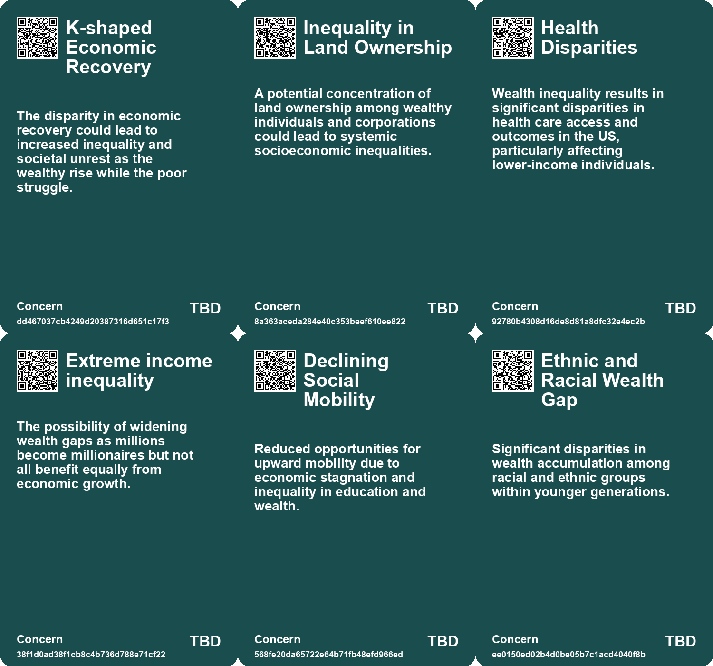
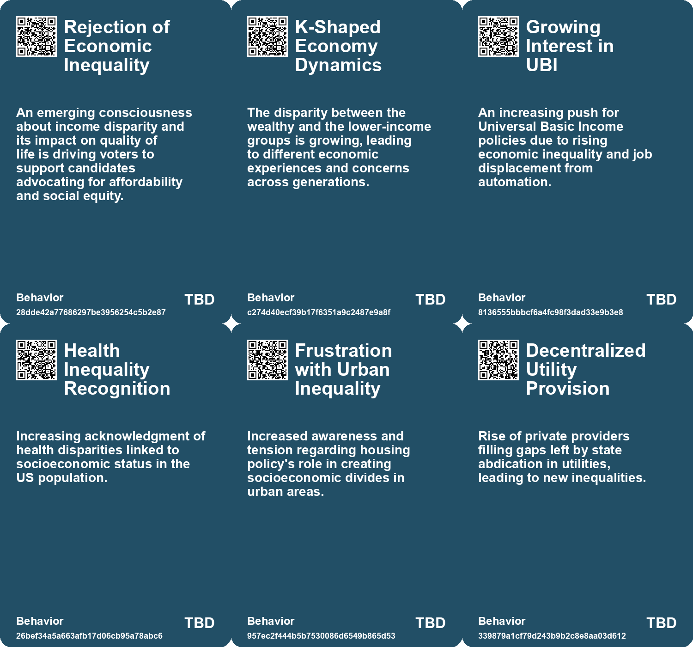
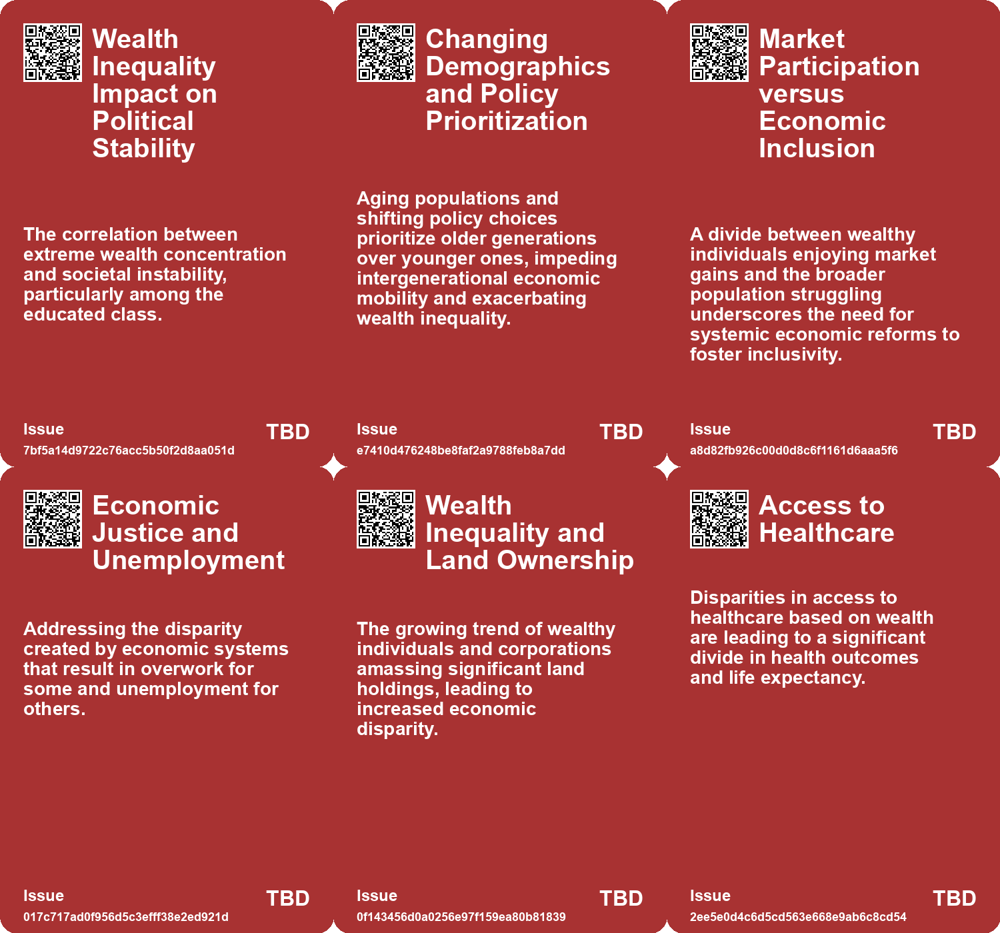
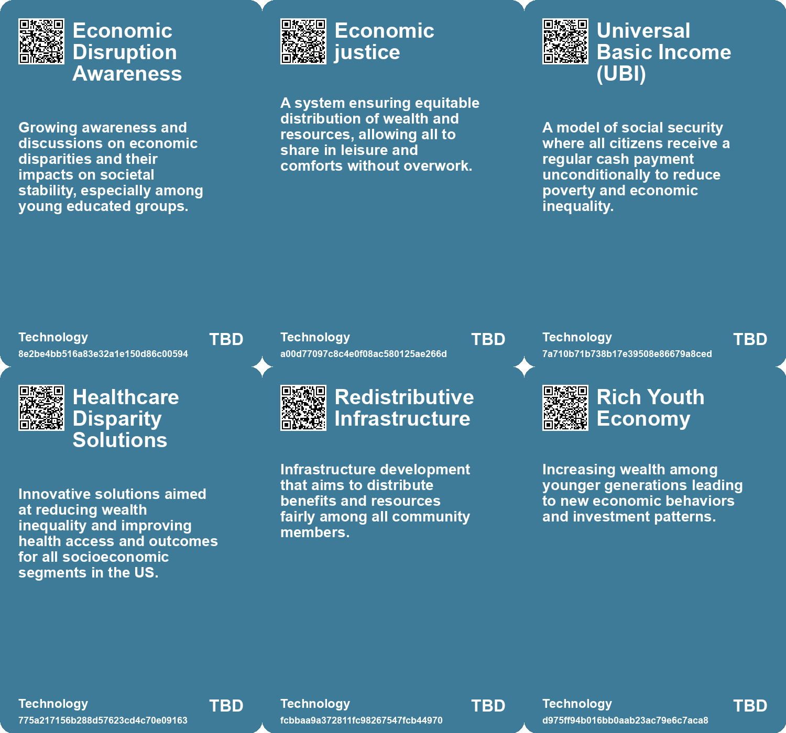

# *Topic*: Socioeconomic Inequality

# Summary

The concept of economic growth and its implications is a recurring theme. The idea of ultraprosperity suggests a future marked by two decades of continuous economic growth, leading to increased wealth, consumer spending, and philanthropy. However, this scenario raises questions about sustainability and the need for meaning beyond financial success. In contrast, the challenges posed by billionaires and wealth concentration highlight the negative effects of extreme wealth on society, contributing to inequality and hindering progress on global issues like climate change.

The impact of demographic changes on economies is another significant theme. Countries facing demographic decline, such as Italy and Japan, are grappling with shrinking workforces and rising healthcare costs, which threaten innovation and economic growth. The aging population worldwide presents similar challenges, necessitating policy adaptations to ensure the well-being of elderly citizens. Meanwhile, the U.K. struggles with economic decline, attributed to a focus on finance over industry and a lack of productivity growth.

Social issues, particularly loneliness and mental health, are increasingly recognized as public health crises. The U.S. Surgeon General's report highlights the alarming rates of isolation, especially among younger generations. This crisis is compounded by economic difficulties faced by Millennials and Generation Z, who experience anxiety and disillusionment due to climate change, high debt, and stagnant wages. The rise of the "credentialed precariat" reflects the struggles of educated young individuals burdened by economic challenges, signaling a shift in political dynamics.

The critique of work within contemporary capitalism raises questions about the value placed on labor. Many jobs are seen as irrelevant to human survival, perpetuating poverty and concentrating wealth. Advocates argue for a reevaluation of work's role in society, emphasizing the importance of leisure and fulfillment over profit. This perspective aligns with the growing discourse around Universal Basic Income (UBI), which aims to provide financial support without work requirements, addressing income inequality and the impact of automation.

Infrastructure and its role in society also emerge as critical topics. The degradation of infrastructure can lead to social inequality and exacerbate the effects of climate change. The need for sustainable and equitable infrastructure planning is underscored, as historical examples show how infrastructure development has influenced colonization and revolutionary movements.

The commodification of life and the transactional nature of modern society are explored through the lens of "Everything as a Service." This mindset leads to dissatisfaction and a loss of personal agency, as individuals outsource various aspects of their lives. The critique emphasizes the importance of self-actualization and finding meaning beyond consumerism.

Finally, the intersection of trust and social capital is highlighted in Denmark, where high levels of trust contribute to the nation's wealth and low corruption rates. However, challenges arise with increased diversity and immigration, necessitating efforts to maintain social cohesion. The ongoing reshuffling of land ownership and the implications for social equity further complicate these dynamics, as innovative land reform is needed to address future challenges.

# Seeds

|    | name                                      | description                                                                                         | change                                                                                                        | 10-year                                                                                                             | driving-force                                                                                         |
|---:|:------------------------------------------|:----------------------------------------------------------------------------------------------------|:--------------------------------------------------------------------------------------------------------------|:--------------------------------------------------------------------------------------------------------------------|:------------------------------------------------------------------------------------------------------|
|  0 | Elite Overproduction                      | Increasing number of highly educated individuals with limited job prospects leads to social unrest. | From elite aspirants perceived as stable contributors to society, to a bloc feeling marginalized and ignored. | Overproduction of graduates may lead to widespread calls for educational and economic reforms over time.            | The disconnect between educational attainment and market demand fueling frustrations among graduates. |
|  1 | Economic K-Shaped Recovery                | Wealth concentration is intensifying while the lower-income bracket faces challenges.               | Economic disparity is growing, where the wealthy become wealthier while others struggle.                      | Wealth gaps will widen, leading to potential societal friction and calls for reform.                                | Economic policies that favor asset growth over income stability.                                      |
|  2 | Financial Stress and Cognitive Decline    | Financial insecurity causes notable declines in cognitive performance, reinforcing poverty cycles.  | Shift from viewing financial stress solely as emotional to recognizing its cognitive toll.                    | In ten years, financial education and support systems may improve cognitive stability among low-income individuals. | Growing recognition of mental health as intertwined with economic support will drive policy changes.  |
|  3 | Changing Views on Wealth Distribution     | Challenging the socio-economic systems enabling wealth hoarding and labor exploitation.             | From acceptance of wealth concentration to advocating for economic justice.                                   | More equitable economic systems leading to less discontent and richer community engagement.                         | Social movements advocating for justice and fairness in resources allocation.                         |
|  4 | Healthcare Access Inequality              | There is a clear disparity in healthcare access based on wealth in the US.                          | Healthcare systems are starting to address inequality more seriously, affecting access dynamics over time.    | In a decade, we might see more equitable healthcare access impacting average life expectancies across populations.  | Public demand for equitable healthcare access nudging policy reforms.                                 |
|  5 | Bifurcation of Housing Market             | Creation of a housing divide between luxury and subsidized housing.                                 | From a more balanced housing market to extremes of wealth and poverty.                                        | Potential rise in social unrest and demand for more equitable housing solutions.                                    | Growing frustration among middle-class youth over lack of affordable options.                         |
|  6 | Privatization of Utilities                | Privatization of public utilities leads to inequitable access to essential services.                | Transition from public to privatized utility services, affecting affordability and access.                    | In 10 years, there may be a push for re-nationalization or regulation of essential services.                        | Growing awareness of social inequalities resulting from privatization.                                |
|  7 | Social Fissures from Energy Inequality    | Energy consumption disparities are creating social divides and tensions.                            | From equitable energy access to significant disparities based on consumption and resources.                   | In 10 years, energy policies may prioritize equity and sustainability in access.                                    | Growing awareness of energy equity and its impact on social cohesion.                                 |
|  8 | Increased Racial and Economic Inequality  | Younger generations experience heightened economic disparities, especially among ethnic minorities. | Shift from a predominantly white wealth accumulation to increased diversity and poverty.                      | Socioeconomic structures may change to address growing disparities and demands for equity.                          | Awareness of systemic inequalities and calls for social justice.                                      |
|  9 | Class Warfare and Political Fragmentation | Increased conflict between wealthy oligarchs and progressive activists over welfare policies.       | From collaborative support for progressive causes to potential clashes over economic policies.                | Political alliances may splinter, leading to a fragmented political landscape.                                      | The unsustainable nature of funding welfare initiatives amid economic decline.                        |

# Concerns

|    | name                              | description                                                                                                                                                     |
|---:|:----------------------------------|:----------------------------------------------------------------------------------------------------------------------------------------------------------------|
|  0 | K-shaped Economic Recovery        | The disparity in economic recovery could lead to increased inequality and societal unrest as the wealthy rise while the poor struggle.                          |
|  1 | Inequality in Land Ownership      | A potential concentration of land ownership among wealthy individuals and corporations could lead to systemic socioeconomic inequalities.                       |
|  2 | Health Disparities                | Wealth inequality results in significant disparities in health care access and outcomes in the US, particularly affecting lower-income individuals.             |
|  3 | Extreme income inequality         | The possibility of widening wealth gaps as millions become millionaires but not all benefit equally from economic growth.                                       |
|  4 | Declining Social Mobility         | Reduced opportunities for upward mobility due to economic stagnation and inequality in education and wealth.                                                    |
|  5 | Ethnic and Racial Wealth Gap      | Significant disparities in wealth accumulation among racial and ethnic groups within younger generations.                                                       |
|  6 | Inequitable Resource Distribution | Unequal access to resources between high-income and low/middle-income countries could exacerbate global disparities, hindering sustainable development efforts. |
|  7 | Inequality and Poverty            | The accumulation of wealth by a small percentage while the majority live in poverty creates societal instability and discontent.                                |
|  8 | Socioeconomic Inequality          | Increasing economic inequalities exacerbate discontent and could lead to social movements or revolts.                                                           |
|  9 | Social Unrest and Backlash        | Historical patterns suggest that extreme wealth inequality can lead to social upheaval and violent responses.                                                   |

# Cards

## Concerns

## Behaviors

## Issue

## Technology

# Links

* [The Economic Consequences of Declining Birth Rates and Aging Populations](https://futures.kghosh.me/bff595b72330d833dba477e2dc2a5656)
* [Study Reveals Wealthy Americans Have Shorter Lifespans Than Wealthy Europeans](https://futures.kghosh.me/9d42c850b3188fa657b08316a6cefb66)
* [The Interplay of Democracy, Work, and Economic Justice in Modern Society](https://futures.kghosh.me/43aa6ac3d82bbc19f0d66d5b2bb37897)
* [Understanding Universal Basic Income: History, Characteristics, and Current Relevance](https://futures.kghosh.me/d1ad6d4718ea9a5a6c82aacd5a59d474)
* [The Vision of Ultraprosperity: A Future of Economic Growth and Change](https://futures.kghosh.me/719500bc852b3f2db19af6d9280207bf)
* [Addressing the Social Fitness Crisis: The Need for Connection in Modern Society](https://futures.kghosh.me/9aeeedec876dadd7664c8ac15af0b90e)
* [Rethinking Economic Growth: The Case for Degrowth in a Sustainable Future](https://futures.kghosh.me/d18185596b0ee658ac31e9c3003c6d92)
* [Zohran Mamdani's Victory: A Reflection of Rising Credentialed Precariat and Political Change in NYC](https://futures.kghosh.me/d0f1317e1dfd400f02933a3441c9faa1)
* [Economic Challenges Faced by Millennials and Generation Z: A Deep Dive into Inequality and Instability](https://futures.kghosh.me/86001e4fb7b55397aece664afd67001a)
* [Rethinking Work: The Case for Leisure in Modern Society](https://futures.kghosh.me/80bb96c2a6db49287632c087208f854b)
* [Reevaluating Work: A Critique of Capitalism and Its Impact on Humanity](https://futures.kghosh.me/b20fb97f6ad12a6389468e434068e2ad)
* [Exploring the UK’s Economic Crisis Rooted in Housing and Energy Shortages](https://futures.kghosh.me/14c9e2a7976b48f09c3e0cdf3c054c0a)
* [Navigating the Challenges of an Aging Global Population: Insights from Various Countries](https://futures.kghosh.me/a8bf5109e22909dfe327db0ee8f3853d)
* [Exploring Trust in Denmark: A Nation Built on Goodwill and Equality](https://futures.kghosh.me/71b8e40b9db95feeacb1fe0d25d539e1)
* [The Decline of the U.K.: A Cautionary Tale of Economic Dysfunction and Austerity](https://futures.kghosh.me/356a6ba108d8bfda52fe56a947f6b347)
* [Understanding Polarization: Healing Our Relationship with Technology and Embracing Diverse Perspectives](https://futures.kghosh.me/c1bb890337ef382bfaa5720c9fd05134)
* [Reimagining Infrastructure: Towards a Redistributive and Ecologically Sound Future](https://futures.kghosh.me/177a0857ffe0d07d48cd99a269f28a02)
* [The UK's Declining Geopolitical Relevance and Elite Inaction: A Historical Perspective](https://futures.kghosh.me/ca555520973a0e8519ff854da1de4d88)
* [The Unraveling of Progressive Politics: Economic Shifts and Growing Conflicts](https://futures.kghosh.me/f4ea5244ccafd654e5955673b0ee3976)
* [Exploring the Historical and Future Transformations of Land Ownership Worldwide](https://futures.kghosh.me/68a769f0b8d15a4efd8f8136482b9660)
* [Examining the Billionaire Problem: Wealth Inequality and Its Societal Impact](https://futures.kghosh.me/4ef8cee75515da28d5c6ad986ee83030)
* [The Impact of Conservation Areas on Climate Action and Housing Energy Efficiency in England](https://futures.kghosh.me/fc01cd22da2aa0a185a6c1bb2a7e1145)
* [Understanding the Casino Economy: How Financialization Shapes Our Lives and Beliefs](https://futures.kghosh.me/f4ca03eca53c5d3b3ccc3dd5b1a9aeb4)
* [The Impact of Poverty on Cognitive Performance: Understanding the Links between Finances and Intelligence](https://futures.kghosh.me/2e671c014ba53b8b49159c3c5143c526)
* [Exploring the Dangers of Outsourcing Happiness and Personal Fulfillment in Modern Society](https://futures.kghosh.me/a5c0ba498382a4edc0f2bf0d9653ad16)