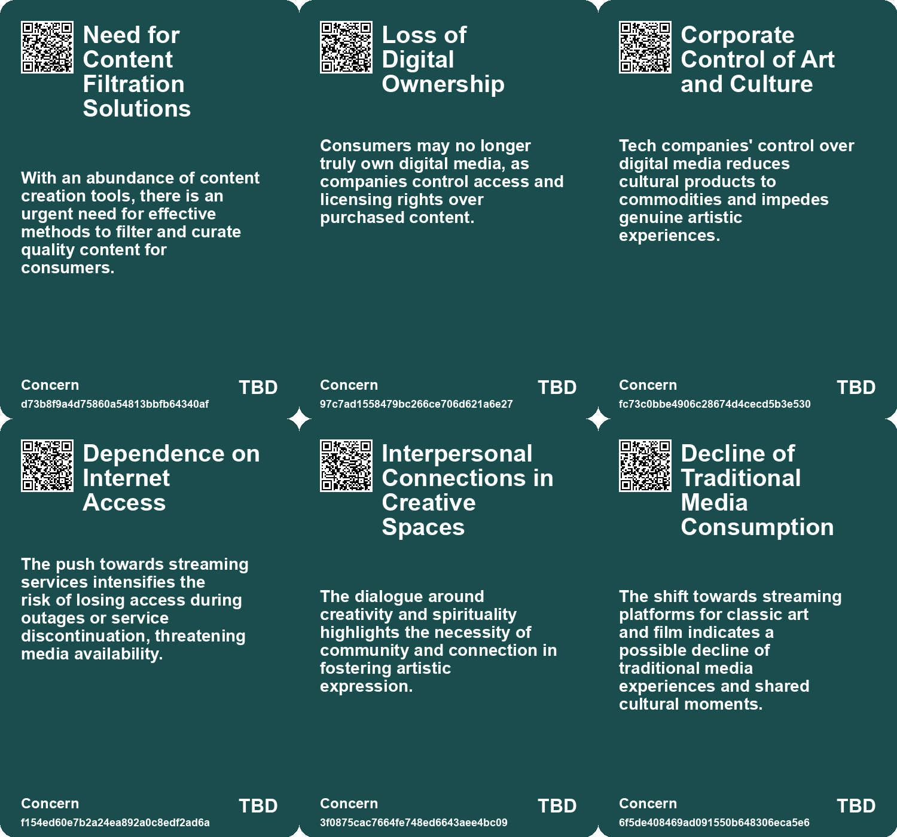
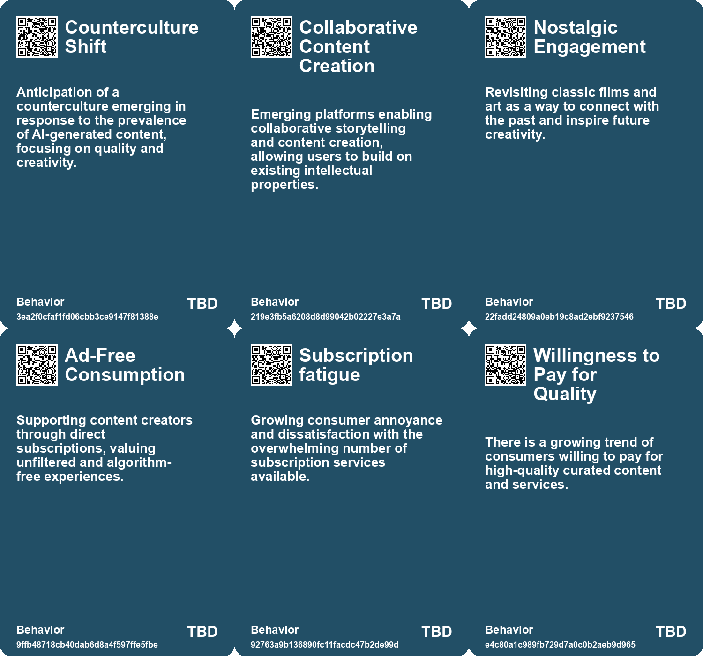
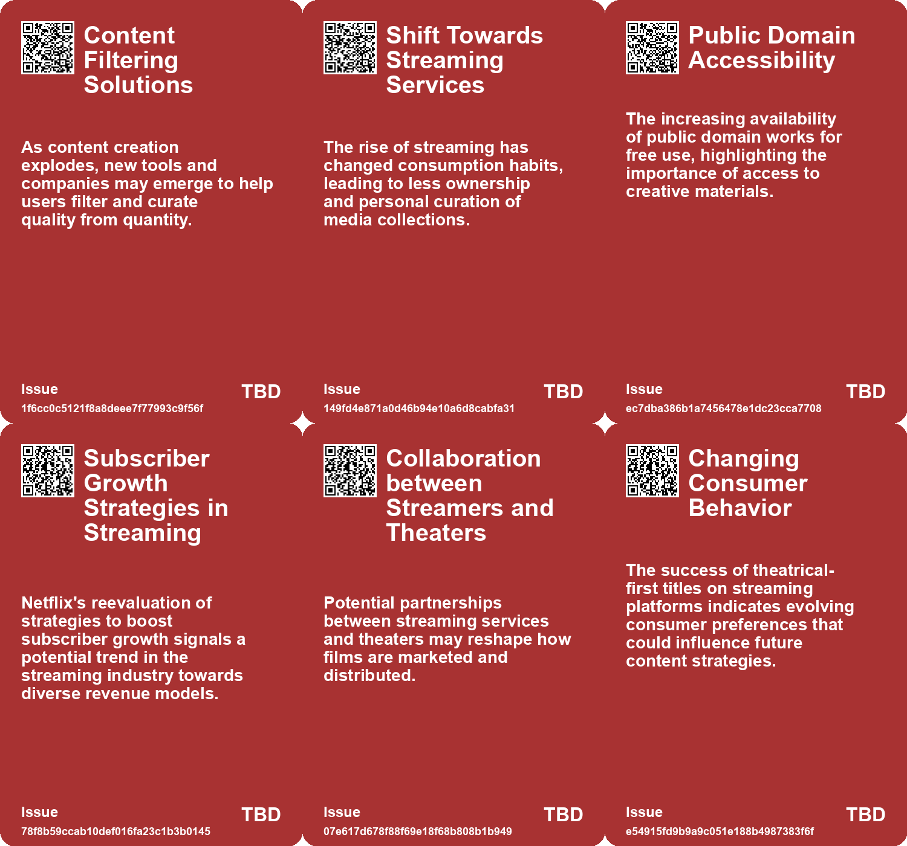
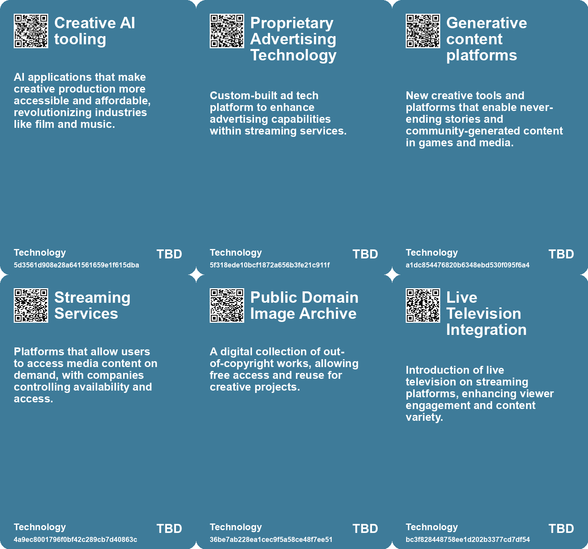

# *Topic*: Streaming Services for Creative

# Summary

The evolving landscape of digital ownership is a pressing concern as companies like Amazon reinforce the notion that consumers are merely licensing digital content rather than owning it. This shift reflects a broader trend where tech giants control access to media, leading to a culture of passive consumption. The call for a return to personal collections emphasizes the importance of digital ownership in an era dominated by streaming services.

The entertainment and media industries are grappling with significant changes, including a slowdown in growth attributed to the lingering effects of the pandemic and shifting consumer spending habits. Companies are exploring new avenues for revenue, particularly through generative AI, which is seen as a tool for enhancing productivity. However, the rise of influencer marketing and the creator economy, projected to reach $500 billion by 2027, raises concerns about the well-being of creators who face increasing pressure to conform to platform algorithms.

Generative AI is transforming creative professions, offering both opportunities and challenges. While it enables rapid content production, it also threatens traditional roles in the arts and raises ethical questions about the use of artists' work without consent. The need for a new framework focusing on data rights and consent is becoming increasingly urgent as AI-generated content proliferates.

The intersection of technology and culture is evident in various sectors, from the rise of deepfake technology in e-commerce to the nostalgic return of analog devices among teens seeking authentic experiences. As schools ban smartphones, students are turning to older technology, highlighting a desire to disconnect from the digital world. This trend reflects a broader cultural shift towards valuing curated experiences over endless options.

The concept of creativity is evolving, with historical perspectives revealing a tension between innovation and traditional practices. The dualities surrounding creativity—optimism versus pessimism and elitism versus egalitarianism—continue to shape modern perceptions. The importance of rest and reflection in the creative process is gaining recognition, as individuals seek deeper engagement with their work.

As the marketplace becomes increasingly dependent on digital platforms, the consequences of production and manufacturing are often obscured. There is a growing need to make these consequences visible and rethink supply chains to address the challenges of the 21st century. The rise of micro-subscriptions reflects a shift in consumer behavior, as individuals seek value in smaller payments for services previously offered for free.

In the face of content overload, consumers are turning to curators to help navigate the vast amount of information available. The emergence of influencer bundling highlights the role of curators as new creators, providing a solution to analysis paralysis in a world saturated with content. This trend underscores the importance of curation in managing information and delivering value to audiences.

# Seeds

|    | name                                            | description                                                                                         | change                                                                                         | 10-year                                                                                                           | driving-force                                                                                       |
|---:|:------------------------------------------------|:----------------------------------------------------------------------------------------------------|:-----------------------------------------------------------------------------------------------|:------------------------------------------------------------------------------------------------------------------|:----------------------------------------------------------------------------------------------------|
|  0 | Cultural Adaptation to AI                       | Cultural industries learning to adapt to the impact of AI in media and creativity.                  | Shift from resistance against AI to embracing its potential in creative fields.                | Hollywood and other cultural spheres may find effective ways to integrate AI responsibly.                         | Need to innovate and leverage AI for enhancing creativity rather than replacing it.                 |
|  1 | Experimentation in Creativity                   | A call for experimentation to discover new creative avenues.                                        | Shifting from traditional methods of creativity to more experimental approaches.               | In 10 years, creativity could be more inclusive of diverse, experimental forms.                                   | A desire to innovate and break free from conventional creative processes.                           |
|  2 | Public Domain Accessibility                     | Increased availability of public domain works for creative use.                                     | Moving from limited access to a wealth of free resources for artists.                          | In 10 years, artists may rely heavily on public domain works for inspiration and creation.                        | The push for open access to art and culture for all.                                                |
|  3 | Social Media's Impact on Art Sharing            | Viral sharing of art-related content on social media platforms.                                     | From traditional art sharing to rapid, viral dissemination of art ideas.                       | In 10 years, social media could redefine how art is consumed and shared.                                          | The rise of social media as a primary platform for art exposure.                                    |
|  4 | Micro-Subscriptions Emergence                   | A shift towards smaller, more affordable subscription services is gaining traction.                 | Transitioning from traditional subscriptions to micro-subscriptions for affordability.         | In ten years, micro-subscriptions could dominate the market, offering customized pricing for individual features. | Consumer demand for affordability and personalization drives companies towards micro-subscriptions. |
|  5 | Corporate Monetization Strategies               | Companies are increasingly looking for new revenue streams through subscriptions.                   | Shift from traditional sales models to subscription-based monetization strategies.             | In ten years, subscription models may dominate multiple industries, reshaping business revenue strategies.        | The economic pressure to maintain profitability drives businesses to explore subscription models.   |
|  6 | Social Media Integration in Retail              | The Netflix store features photo-ready vignettes for social media sharing.                          | Shift from traditional retail to experiences designed for social media visibility.             | Retail spaces may increasingly focus on visual shareability to attract customers.                                 | The pervasive influence of social media on consumer behavior and marketing strategies.              |
|  7 | Interoperability in Talent Management           | Brands are beginning to see the value in allowing creators to work across platforms.                | From restrictive contracts to flexible arrangements that allow creators to collaborate widely. | Media companies will foster a collaborative ecosystem where creators can thrive across multiple platforms.        | The recognition that creator success benefits brands and enhances overall reputation.               |
|  8 | Digital gardening and learning in public        | Individuals are encouraged to learn publicly through digital platforms like podcasts and streaming. | Transitioning from private learning to public sharing of knowledge and skills.                 | Public learning will become a norm, with more individuals sharing their learning journeys online.                 | The democratization of knowledge and the desire for continuous learning in communities.             |
|  9 | Emergence of Free Ad-Supported Streaming (FAST) | FAST services are gaining popularity as viewers accept advertising in streaming content.            | Shift from subscription-based models to ad-supported streaming due to audience acceptance.     | Ad-supported models may dominate the streaming industry, significantly altering revenue structures.               | Consumer acceptance of ads in exchange for free content is reshaping monetization strategies.       |

# Concerns

|    | name                                         | description                                                                                                                                               |
|---:|:---------------------------------------------|:----------------------------------------------------------------------------------------------------------------------------------------------------------|
|  0 | Need for Content Filtration Solutions        | With an abundance of content creation tools, there is an urgent need for effective methods to filter and curate quality content for consumers.            |
|  1 | Loss of Digital Ownership                    | Consumers may no longer truly own digital media, as companies control access and licensing rights over purchased content.                                 |
|  2 | Corporate Control of Art and Culture         | Tech companies' control over digital media reduces cultural products to commodities and impedes genuine artistic experiences.                             |
|  3 | Dependence on Internet Access                | The push towards streaming services intensifies the risk of losing access during outages or service discontinuation, threatening media availability.      |
|  4 | Interpersonal Connections in Creative Spaces | The dialogue around creativity and spirituality highlights the necessity of community and connection in fostering artistic expression.                    |
|  5 | Decline of Traditional Media Consumption     | The shift towards streaming platforms for classic art and film indicates a possible decline of traditional media experiences and shared cultural moments. |
|  6 | Digital Content Monopolies                   | Corporations like Disney and Spotify control access to digital content, limiting ownership and making cultural consumption dependent on ongoing payments. |
|  7 | Evolving Consumer Preferences Post-COVID     | Changing viewing habits post-pandemic may impact the success of theatrical releases for streaming-first companies.                                        |
|  8 | Brand Dominance                              | The increasing trend of streaming services like Netflix dominating retail spaces could overshadow traditional retail experiences.                         |
|  9 | Creator vs. Curator Dynamics                 | As curators emerge as key players, the balance of creative expression might shift, affecting original content creators' visibility.                       |

# Cards

## Concerns

## Behaviors

## Issue

## Technology

# Links

* [Exploring the Future: How Technology Will Transform Society by 2034](https://futures.kghosh.me/8ef50cfd87ff3eedbc028932b07520b3)
* [Exploring the Paradox of Exhaustion and Creative Flow Through the Noetic Spiral](https://futures.kghosh.me/41317b487f66f51787c3f667e738a046)
* [The Value of Publicly Sharing Creative Processes Over Finished Products](https://futures.kghosh.me/2f48103338d2c48e804e6878d7019e0b)
* [Five Emerging Trends Transforming Business in the Coming Year](https://futures.kghosh.me/55bac03899915f25bf0b47fa4342472c)
* [Exploring the Modern Entertainment Landscape and Its Societal Implications](https://futures.kghosh.me/c5c2c794f1426e6e307a9df3f9ff61f6)
* [The Shift Towards Micro-Subscriptions: Addressing Consumer Fatigue and Market Trends](https://futures.kghosh.me/01dd20372573227317c7126faacfec9b)
* [The Entertainment and Media Industry's Shift: Growth Challenges and Opportunities Ahead](https://futures.kghosh.me/c18691583943e0d2d1e217558293d06b)
* [Teens Embrace Older Tech Amid School Smartphone Bans, Sparking Nostalgia and Socialization](https://futures.kghosh.me/2c00b2575d94795c1ea258a68f0cf8ea)
* [Nostalgia for Simplicity: The Burden of Infinite Choice in Modern Life](https://futures.kghosh.me/7b316ebe449187b79e519a8c6d12a2cd)
* [The Rise of AI-Generated Influencers in China's E-Commerce Livestreaming Market](https://futures.kghosh.me/648de774fbff1434a953141f7652db07)
* [Exploring the Balance Between AI Efficiency and Human Creativity in Design](https://futures.kghosh.me/92ae644db3cc8e4d0fb262bac8413f8b)
* [Netflix Launches Immersive Retail Experience at The Grove in Los Angeles](https://futures.kghosh.me/69ac0a51474dc55424e5281c7b649cad)
* [AI's Role in Fragmenting Culture and Software: A New Era of Creation](https://futures.kghosh.me/c25f207450d56b52443cc95f158d4138)
* [The Impact of Generative AI on Traditional Stock Photography and Licensing Markets](https://futures.kghosh.me/966eddc4698e68b47bc5a9c33fe2afbd)
* [The Rise of Creativity: Understanding Its Evolution and Cultural Impact Since WWII](https://futures.kghosh.me/4704e0c971a5aab83464d9025df5fe6d)
* [The Creator Economy's Hidden Costs: Pressures Facing Modern Creators](https://futures.kghosh.me/27796e2cafeeaf48a8efbf2bb779b65d)
* [Exploring Networked Counterculture: Artists Subverting Social Media Algorithms for Authenticity](https://futures.kghosh.me/e5f4b1b4319694169f1551be43a837c9)
* [Exploring the Dichotomy of Talent and Technology: Swift, Slop, and AI Creativity](https://futures.kghosh.me/97ed8c242eb852cc99a642878c3433bc)
* [Exploring Cookies, Supply Chains, and Future Challenges in Technology and Consumption](https://futures.kghosh.me/fa27e27bdec01712d582ab0f61c95bac)
* [The Rise of Subscription Serfdom and Its Impact on Future Generations](https://futures.kghosh.me/6bccf38c9e97c992a3f5861fc6297380)
* [The Illusion of Digital Ownership: Amazon's Kindle Policy and the Future of Media Consumption](https://futures.kghosh.me/e1616df02a40343d004044a2bc18c0d6)
* [Netflix Considers Major Shift: Theatrical Releases for Upcoming Movies](https://futures.kghosh.me/088604fb4004b2f3c5725cf2f674066e)
* [Reimagining Media Companies: The Shift from Brands to Talent-Centric Models](https://futures.kghosh.me/be6ecdd999bc41789029c9d32a86c51b)
* [Exploring Creativity: Reflections and Tributes from the Week](https://futures.kghosh.me/e3b92f617e8798cb961022e6d57bf13a)
* [The Impact of Generative AI on Creative Professions and the Need for New Data Rights Frameworks](https://futures.kghosh.me/858dac884c8fe7dfa6fc0c2cf093e97f)
* [Navigating Content Overload: The Rise of Curation in the Digital Age](https://futures.kghosh.me/32d1ad4478612a9035595bf948a27a1f)
* [Netflix Integrates Generative AI in New Series to Enhance Quality and Cut Costs](https://futures.kghosh.me/883d18ad5bde38169578af7c5582e307)