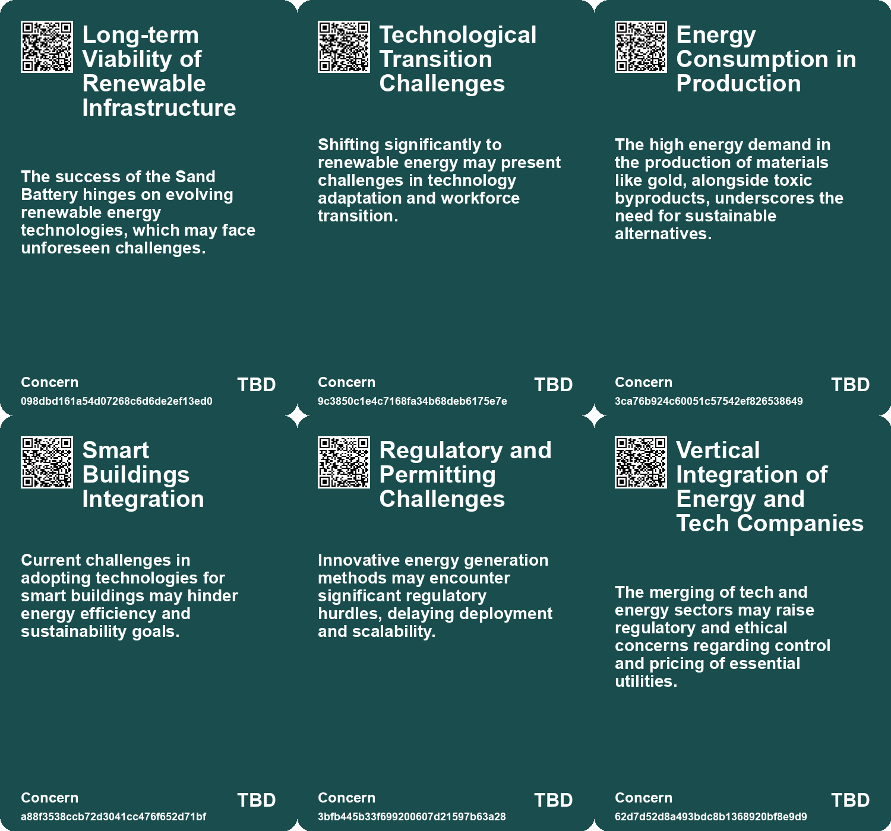
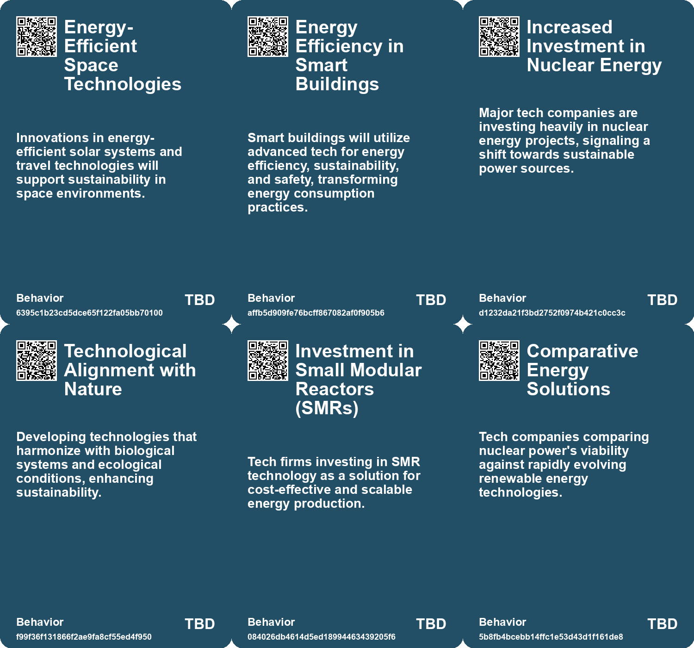
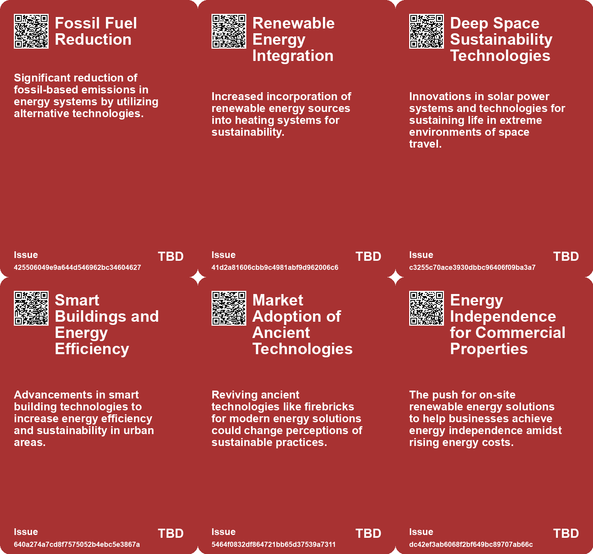
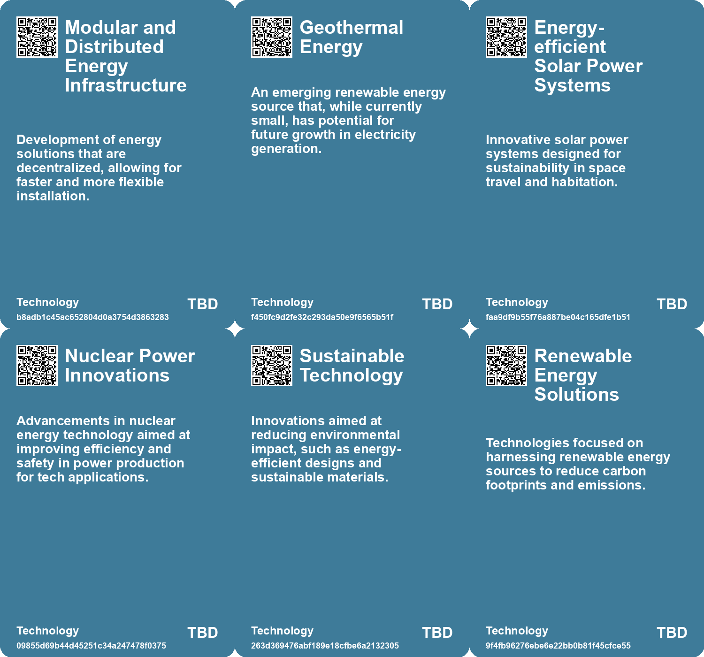

# *Topic*: Sustainable Energy Tech

# Summary

The intersection of technology and sustainability is increasingly evident as innovations emerge to address climate change and energy needs. A team at Oxford University has developed a new solar energy technology that surpasses traditional silicon panels, achieving over 27% efficiency with an ultra-thin material that can be applied to everyday objects. This advancement could integrate solar power into existing infrastructure, vehicles, and personal items, promoting a more sustainable energy landscape.

The tech sector's environmental impact is under scrutiny, as it contributes nearly 3% of global carbon emissions. Companies are urged to adopt greener practices, with Western Digital committing to renewable energy and net-zero emissions by 2032. Emphasizing sustainability in key performance indicators can enhance employee engagement and customer satisfaction, highlighting the importance of transparency in corporate sustainability efforts.

While technology has played a role in climate change, it is also seen as a solution. The concept of "type 2 growth," which focuses on qualitative improvement rather than resource consumption, is gaining traction. As the global population declines, aligning technological advancement with environmental health becomes crucial.

In energy production, Sweden is shifting its strategy to become fossil fuel-free by expanding nuclear energy, planning to build multiple reactors by the 2040s. This reflects a growing belief in nuclear power as a clean alternative to fossil fuels. Similarly, Google and Meta are exploring nuclear energy to meet the demands of their data centers, indicating a trend among tech companies to seek reliable, carbon-free electricity sources.

Innovative energy solutions are also emerging in the renewable sector. Windlift has developed a cost-effective method of generating electricity using a kite system, while Polar Night Energy's 'Sand Battery' technology aims to reduce fossil fuel emissions in district heating. Additionally, researchers at the University of Texas at Dallas have created a wireless charging technology for drones, which could extend to other devices, showcasing the potential for energy efficiency in various applications.

The agricultural and water sectors are also experiencing transformative changes. Solar energy solutions are making significant strides in Sub-Saharan Africa, providing reliable electricity to millions through innovative financing models. Meanwhile, MIT engineers have developed a solar-powered desalination system that maximizes solar energy to produce clean water, addressing the pressing issue of water scarcity.

In the construction industry, advanced technologies such as AI, modular construction, and smart building practices are reshaping project management and sustainability. The integration of these technologies is expected to enhance efficiency and reduce environmental impacts, although challenges remain in terms of costs and skills gaps.

Finally, the development of new energy storage solutions, such as firebricks for thermal energy storage and algae-powered batteries, highlights the ongoing quest for sustainable energy sources. These innovations aim to reduce reliance on fossil fuels and improve energy efficiency across various sectors, underscoring the critical need for a transition to renewable energy in the face of climate change.

# Seeds

|    | name                                          | description                                                                                   | change                                                                                                         | 10-year                                                                                                                | driving-force                                                                                                     |
|---:|:----------------------------------------------|:----------------------------------------------------------------------------------------------|:---------------------------------------------------------------------------------------------------------------|:-----------------------------------------------------------------------------------------------------------------------|:------------------------------------------------------------------------------------------------------------------|
|  0 | Scaling Renewable Heating Solutions           | Large-scale projects demonstrating viability of renewable thermal energy systems.             | Scaling up thermal energy storage from smaller projects to larger district heating networks.                   | Large-scale renewables could dominate urban energy systems, enhancing efficiency and sustainability.                   | Advances in technology and funding for renewable infrastructure promoting larger projects.                        |
|  1 | Sustainable Energy Innovations                | Developments in energy-efficient solar power for deep space travel.                           | From conventional power sources to advanced renewable energy systems for space.                                | In 10 years, sustainable energy systems will enable extensive human habitation in space.                               | The push for sustainability in light of limited resources on Earth.                                               |
|  2 | Market Shifts towards Sustainability          | Increasing focus on sustainable practices in developing new LED technology.                   | A shift in research focus from purely technical performance to include environmental sustainability.           | Market evolution towards products that balance performance with ecological considerations, reshaping consumer choices. | Consumer demand for sustainable products compelling changes in research and product development.                  |
|  3 | Cost Reduction in Renewable Energy            | Innovative technologies are driving down costs in energy production.                          | Transition from expensive traditional energy sources to more affordable renewable options.                     | Renewable energy will become the most cost-effective energy source globally, displacing fossil fuels.                  | The urgent need to combat climate change and reduce energy costs.                                                 |
|  4 | Scalability of Renewable Technologies         | Smaller, scalable renewable technology solutions are gaining traction.                        | From large, fixed infrastructure to smaller, adaptable energy systems usable anywhere.                         | Scalable technologies will allow for energy generation in previously unreachable environments.                         | The growing need for adaptability in energy solutions as demand varies geographically.                            |
|  5 | Adoption of Small Modular Reactors (SMRs)     | Tech companies are increasingly turning to SMRs for sustainable energy needs.                 | A shift from traditional energy sources to compact, nuclear-based power generation for tech infrastructure.    | Data centers may predominantly rely on nuclear energy, transforming energy production and consumption patterns.        | The growing demand for sustainable, reliable energy to support AI and tech operations.                            |
|  6 | Collaboration between Tech and Energy Sectors | Tech companies are collaborating with nuclear startups to secure energy supply.               | A transition from independent energy sourcing to strategic partnerships with energy providers.                 | Increased mergers and collaborations between tech firms and energy companies may reshape industry landscapes.          | The urgent need for power to sustain growing tech infrastructures like data centers.                              |
|  7 | Radical Optimism in Technology                | A growing belief that technology can evolve positively to support life and sustainability.    | From skepticism about technology's role in environmental degradation to optimism about its potential for good. | Increased investment and development in technologies that enhance life quality and environmental sustainability.       | The need to address climate change and ecological issues fosters a more hopeful view of technological innovation. |
|  8 | Small Modular Reactors (SMRs) Development     | Interest in SMRs is growing among tech companies looking for cost-effective energy solutions. | Transitioning from traditional large-scale nuclear plants to innovative small modular reactors.                | SMRs could become widely adopted, providing flexible and efficient energy solutions for tech firms.                    | The promise of lower costs and faster deployment of energy solutions through modularization.                      |
|  9 | Algae-powered batteries                       | Research on algae batteries shows potential for sustainable power sources.                    | Transitioning from traditional batteries to biodegradable algae-based power systems.                           | Algae batteries could become common, especially in remote areas lacking reliable electricity.                          | The need for sustainable energy solutions in the face of environmental concerns.                                  |

# Concerns

|    | name                                                          | description                                                                                                                                     |
|---:|:--------------------------------------------------------------|:------------------------------------------------------------------------------------------------------------------------------------------------|
|  0 | Long-term Viability of Renewable Infrastructure               | The success of the Sand Battery hinges on evolving renewable energy technologies, which may face unforeseen challenges.                         |
|  1 | Technological Transition Challenges                           | Shifting significantly to renewable energy may present challenges in technology adaptation and workforce transition.                            |
|  2 | Energy Consumption in Production                              | The high energy demand in the production of materials like gold, alongside toxic byproducts, underscores the need for sustainable alternatives. |
|  3 | Smart Buildings Integration                                   | Current challenges in adopting technologies for smart buildings may hinder energy efficiency and sustainability goals.                          |
|  4 | Regulatory and Permitting Challenges                          | Innovative energy generation methods may encounter significant regulatory hurdles, delaying deployment and scalability.                         |
|  5 | Vertical Integration of Energy and Tech Companies             | The merging of tech and energy sectors may raise regulatory and ethical concerns regarding control and pricing of essential utilities.          |
|  6 | Market Disruption to Traditional Energy Sources               | Widespread adoption of this technology might disrupt conventional energy markets, causing economic instability in related industries.           |
|  7 | Shifts in Energy Policy Impacting Renewable Energy Investment | The focus away from renewable energy could stall investments in sustainable energy technologies and alternatives.                               |
|  8 | Geopolitical Tensions in Energy Transition                    | Potential geopolitical conflicts arising from the race for fusion technology, as countries vie for leadership in sustainable energy production. |
|  9 | Carbon Utilization Technologies                               | Emerging technologies for carbon utilization might not be as effective in practice as assumed, leading to unfulfilled sustainability promises.  |

# Cards

## Concerns

## Behaviors

## Issue

## Technology

# Links

* [Breakthrough in Photosynthesis Could Revolutionize Renewable Energy and Biofuel Production](https://futures.kghosh.me/b84bf2742e851da35bfd23220e697b3c)
* [Envisioning Humanity's Sustainable Space Future by 2040](https://futures.kghosh.me/10bce1d6a20db285c10362c75da86eec)
* [Key Trends Shaping the Future of Architecture, Engineering, and Construction by 2025](https://futures.kghosh.me/ff47e6e9ab7061f5cb848d4f10d1e06f)
* [Navigating Climate Change: The Role of Technology and the Shift from Quantity to Quality Growth](https://futures.kghosh.me/e44687e103abb436ad5980ac2d518f47)
* [Stanford Study Reveals Firebricks as Affordable Solution for Renewable Energy Transition](https://futures.kghosh.me/a0f7b16254dcd0ee2c5a2f7fc051e7e0)
* [Transformative Impact of Solar Energy Solutions in Africa: A New Infrastructure Paradigm](https://futures.kghosh.me/530d83cbb403ce78a442fbf71cacb512)
* [Key Trends Transforming the Construction Industry by 2025: Embracing Technology and Sustainability](https://futures.kghosh.me/29741a43bf551d1a7a575f42d694d23a)
* [Sweden Transitions to Nuclear Energy, Abandoning 100% Renewable Goal](https://futures.kghosh.me/b9666c2bcb5131de1b2411be30bb4b44)
* [Safeguarding the UK's Energy Sector: The Cybersecurity Challenge in an AI Era](https://futures.kghosh.me/58871ce6d54ebbaf1ac529fa1376eb2a)
* [Aeromine Technologies Launches Innovative Motionless Wind Turbine for Enhanced Renewable Energy Efficiency](https://futures.kghosh.me/e6a8537f7a69f6801ef58f226c538321)
* [The Importance of Sustainability in the Tech Sector: A Call to Action for Companies](https://futures.kghosh.me/763a73de80e3ade3d3a068da6ce48182)
* [University of Cambridge Develops Sustainable Algae Battery for Small Devices](https://futures.kghosh.me/9559f29e7d2ffd92fae98e95a62d0169)
* [EU Solar Power Surpasses Coal Amid Energy Transition Challenges and Geopolitical Dynamics](https://futures.kghosh.me/a69bf796514b025ebe64b26e2fd8657e)
* [Google Partners with Kairos Power for Nuclear Energy to Power AI Data Centers](https://futures.kghosh.me/f9ef1fc984ab921e2f13d2c53db0a066)
* [Navigating Water Scarcity: Trends and Innovations in the 2024 Water Sector](https://futures.kghosh.me/38fa7aa1e1f00744450fad5786b8201d)
* [Betavolt Technology Unveils 50-Year Lifespan Nuclear Batteries for Personal Devices](https://futures.kghosh.me/0bf800ce5670b171372104f147e0c878)
* [Revolutionary Ultra-Thin Solar Technology Promises Efficient Energy Generation Without Silicon Panels](https://futures.kghosh.me/121994a09192673002c6987ca6b78f77)
* [Exploring the Environmental Impact and Challenges of Electric Vehicles](https://futures.kghosh.me/72ff11f7187edcfd9898c6484e429e6e)
* [Windlift's Innovative Kite Technology Revolutionizes Electricity Generation from Wind Energy](https://futures.kghosh.me/175db8dd3eba9b2c13321d58a9aac643)
* [Transforming Water Utilities: Addressing Security and Sustainability Challenges through Innovation](https://futures.kghosh.me/d54442ea6fe7853d0f8674688c9b7064)
* [EU's Electricity from Renewables Reaches 54% in Q2 2025, Led by Solar Power](https://futures.kghosh.me/239a1e4701a874e097e611adcb0f6c9b)
* [Advancements and Sustainability in Perovskite LED Technology for Future Applications](https://futures.kghosh.me/3434e9315c934a4922e82b89644e989d)
* [Japan Launches World's Largest Experimental Nuclear Fusion Reactor, JT-60SA, to Explore Clean Energy Solutions](https://futures.kghosh.me/1c46960244111ec5f16e85701a85e602)
* [Navigating Climate Change: The Need for Community Resilience and Social Trust](https://futures.kghosh.me/efa36dc9bd5ddc890866d4ab1e68e71f)
* [MIT Engineers Develop Innovative Solar-Powered Desalination System for Clean Water](https://futures.kghosh.me/66f16672fad50ae27b2625c86d101b01)
* [Polar Night Energy and Lahti Energia Collaborate on a Major Sand Battery Project in Finland](https://futures.kghosh.me/0251d758d212293a473ce2ff6e3ab1ae)
* [Meta Seeks Nuclear Power Developers to Expand Energy Capacity for Data Centers](https://futures.kghosh.me/e343e1af0d512589be28a04f22739938)
* [University of Texas Team Develops Wireless Charging Tech for Drones and Beyond](https://futures.kghosh.me/442dee7d7ffa984ba157b0d7bce3add0)