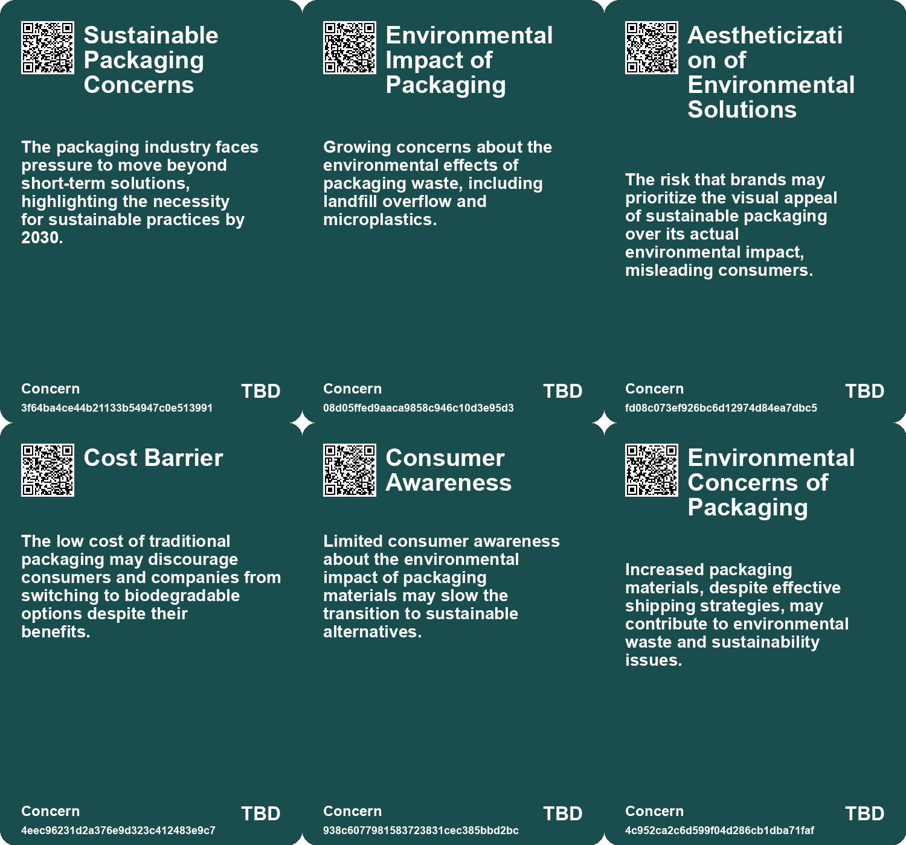
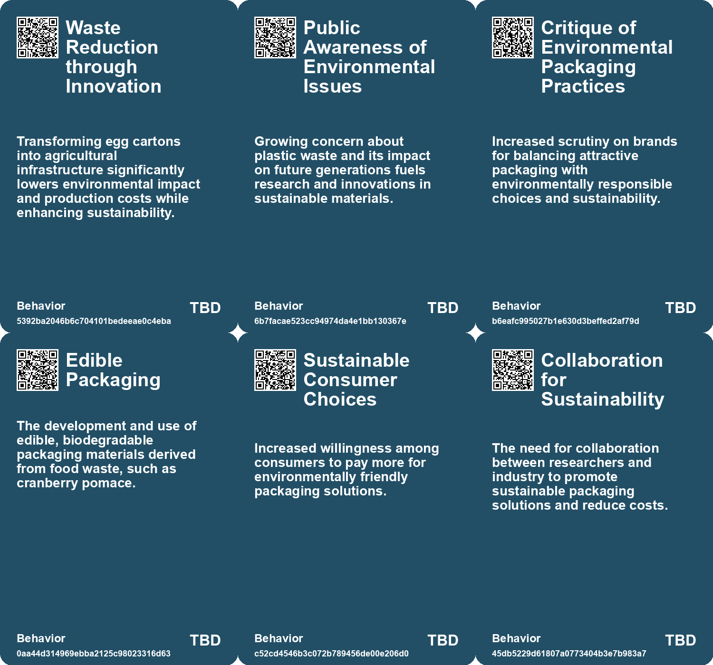
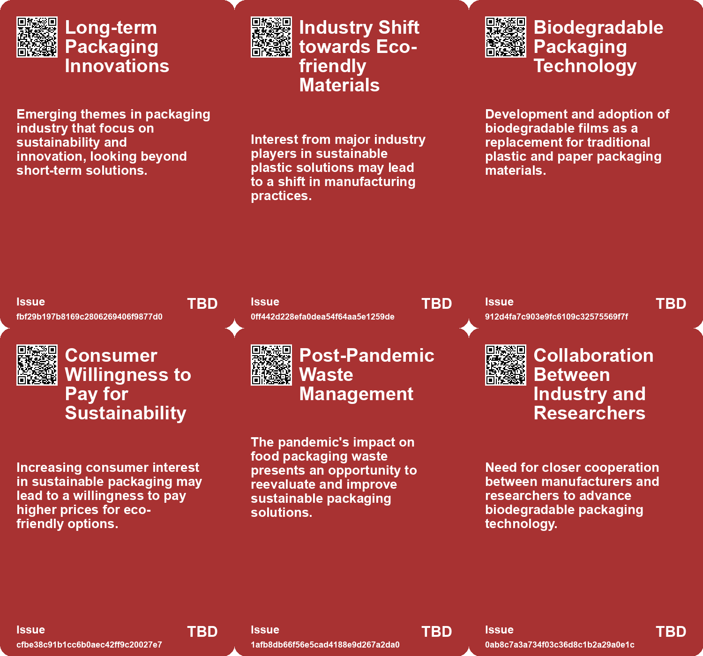
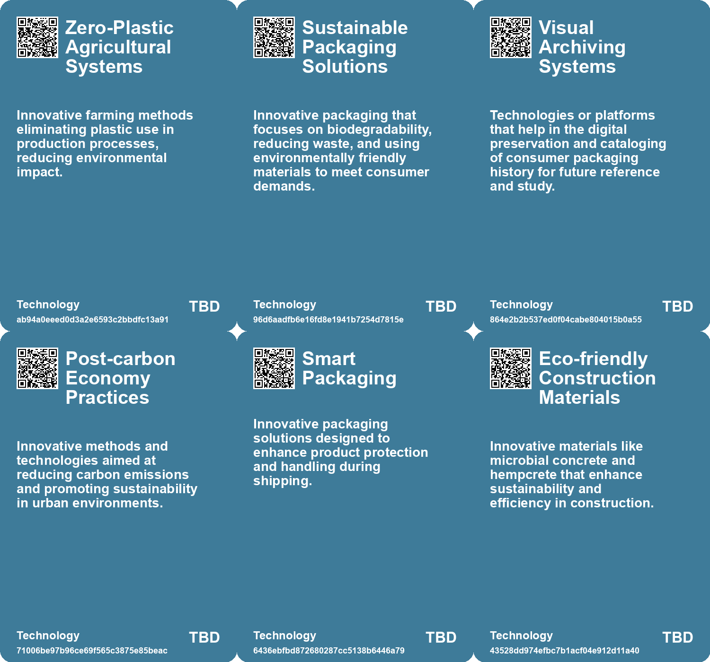

# *Topic*: Sustainable Packaging Innovations

# Summary

Sustainability is a central theme across various sectors, with innovations emerging to address environmental challenges. Researchers have developed biodegradable films from food waste, such as cranberry pomace, which could replace traditional plastic packaging. This eco-friendly alternative is being tested for its effectiveness in preserving delicate fruits and vegetables while also being considered for use in baking products. However, the high costs of mass production remain a barrier to widespread adoption.

In agriculture, a new mushroom cultivation system utilizes recycled materials, specifically egg cartons, to create a vertical farming method that significantly increases yield while minimizing environmental impact. This approach exemplifies circular farming, transforming waste into valuable resources and promoting urban agriculture in constrained spaces.

The quest for sustainable materials extends to the development of a new plastic that dissolves in seawater, addressing the pressing issue of plastic pollution. This innovative material, which retains the strength of traditional plastics, breaks down into non-toxic components, offering a potential solution to the growing plastic crisis.

Travel trends are shifting towards sustainability, with luggage-free travel gaining traction. Destinations are encouraging travelers to pack lighter or rent clothing, aiming to reduce carbon footprints and alleviate overcrowding in popular areas. This movement reflects a broader commitment to sustainable tourism practices.

In the construction industry, significant changes are underway as companies embrace advanced technologies and sustainable practices. Trends such as modular construction, 3D printing, and the use of eco-friendly materials are reshaping project management and design. However, challenges like labor shortages and high initial costs must be addressed for these innovations to be widely adopted.

The tech sector faces scrutiny for its environmental impact, contributing nearly 3% of global carbon emissions. Companies are urged to adopt greener practices and incorporate sustainability into their key performance indicators. Firms that prioritize sustainability not only enhance employee engagement but also improve customer satisfaction.

Nature-based solutions are gaining attention as a means to combat climate change and protect natural resources. In Scotland, efforts are underway to scale up these solutions, focusing on urban environments and the preservation of peatlands. This approach highlights the importance of integrating ecological considerations into urban planning and development.

As industries evolve, the concept of non-extractive architecture is emerging, advocating for construction practices that minimize negative environmental impacts. This philosophy encourages local material production and challenges traditional notions of sustainability, pushing architects to rethink their roles in the industry.

The exploration of space is also being framed through a sustainability lens, with visions of a future space economy that prioritizes eco-friendly practices. Innovations in space travel and resource management aim to create a self-sustaining human presence beyond Earth.

These overlapping themes reflect a growing recognition of the need for sustainable practices across various sectors, from agriculture and construction to technology and tourism. The drive for innovation is not only about improving efficiency but also about ensuring a healthier planet for future generations.

# Seeds

|    | name                                           | description                                                                                                   | change                                                                                                | 10-year                                                                                                    | driving-force                                                                                            |
|---:|:-----------------------------------------------|:--------------------------------------------------------------------------------------------------------------|:------------------------------------------------------------------------------------------------------|:-----------------------------------------------------------------------------------------------------------|:---------------------------------------------------------------------------------------------------------|
|  0 | Long-term Packaging Innovations                | Focus on sustainable and innovative packaging solutions for the future.                                       | From short-term fixes to long-term sustainable packaging strategies.                                  | Packaging may evolve significantly towards 100% recyclable and biodegradability solutions.                 | Regulations and consumer demand for environmentally-friendly packaging push innovations.                 |
|  1 | Industry Interest in Sustainability            | Major packaging companies are showing interest in new sustainable plastic materials.                          | From traditional petroleum-based plastics to innovative, sustainable solutions in packaging.          | Packaging industry may shift entirely towards sustainable materials, reducing plastic waste significantly. | Growing consumer awareness and activism against plastic pollution.                                       |
|  2 | Skepticism Towards Sustainability Claims       | Doubt about brands' genuine commitment to sustainability amidst trendy packaging updates.                     | Increased consumer scrutiny on brands' sustainability efforts in packaging and product design.        | Brands might need to demonstrate authentic sustainability to gain consumer trust and loyalty.              | Growing awareness of environmental issues and the disconnect between practice and marketing claims.      |
|  3 | Circulation of Archival Packaging Culture      | A movement towards valuing and preserving packaging design history as part of consumer culture.               | Shift from disposable consumption to an appreciation for the visual history of product presentation.  | Collectors and designers may create new markets around outdated packaging designs as art.                  | Growing cultural emphasis on storytelling and archiving past consumer experiences as valuable artifacts. |
|  4 | Consumer Willingness to Pay                    | Increasing consumer readiness to pay more for environmentally friendly packaging options.                     | Transitioning consumer mindset from cost-focused to sustainability-focused purchasing decisions.      | In ten years, consumers may prioritize sustainability over cost, influencing market trends.                | Heightened environmental awareness and desire to combat plastic waste among consumers.                   |
|  5 | Collaboration between Industry and Researchers | Need for cooperation between food industry and researchers to innovate sustainable packaging solutions.       | From isolated research to collaborative development of practical and scalable packaging technologies. | In ten years, collaborative networks may drive rapid innovation in sustainable food packaging.             | The urgency of addressing environmental issues and waste management challenges.                          |
|  6 | Consumer Education on Sustainability           | Importance of consumer education in driving the adoption of sustainable packaging solutions.                  | Moving from ignorance about sustainable options to informed choices based on environmental impact.    | In ten years, consumers may be fully aware of environmental impacts and demand sustainable products.       | Increased access to information and education about sustainability and eco-friendly practices.           |
|  7 | New Construction Materials Development         | Innovative materials like biodegradable plastics and microbial concrete are emerging.                         | From traditional materials to advanced, sustainable options in construction.                          | New materials revolutionize building practices, enhancing sustainability and efficiency.                   | Demand for environmentally friendly and efficient construction solutions.                                |
|  8 | Mushroom-based materials                       | Mushrooms are being explored as sustainable alternatives to traditional materials like leather and packaging. | Shift from petroleum-based materials to biodegradable options made from mushrooms.                    | In 10 years, biodegradable electronics and sustainable materials from mushrooms could dominate the market. | Growing environmental concerns and demand for sustainable materials drive this innovation.               |
|  9 | Sustainability as a competitive edge           | Increased focus on sustainable construction practices and eco-friendly materials.                             | Shifting from conventional to green building practices to attract clients.                            | Sustainable construction could dominate the market, influencing design and materials significantly.        | Rising public awareness and demand for environmentally friendly construction.                            |

# Concerns

|    | name                                         | description                                                                                                                                  |
|---:|:---------------------------------------------|:---------------------------------------------------------------------------------------------------------------------------------------------|
|  0 | Sustainable Packaging Concerns               | The packaging industry faces pressure to move beyond short-term solutions, highlighting the necessity for sustainable practices by 2030.     |
|  1 | Environmental Impact of Packaging            | Growing concerns about the environmental effects of packaging waste, including landfill overflow and microplastics.                          |
|  2 | Aestheticization of Environmental Solutions  | The risk that brands may prioritize the visual appeal of sustainable packaging over its actual environmental impact, misleading consumers.   |
|  3 | Cost Barrier                                 | The low cost of traditional packaging may discourage consumers and companies from switching to biodegradable options despite their benefits. |
|  4 | Consumer Awareness                           | Limited consumer awareness about the environmental impact of packaging materials may slow the transition to sustainable alternatives.        |
|  5 | Environmental Concerns of Packaging          | Increased packaging materials, despite effective shipping strategies, may contribute to environmental waste and sustainability issues.       |
|  6 | Market Saturation of Copycat Strategies      | As other companies adopt similar packaging strategies, the effectiveness may diminish, requiring continuous innovation to stand out.         |
|  7 | Need for Sustainable Practices in Innovation | Tech companies face challenges in integrating sustainability into innovation strategies without compromising other business factors.         |
|  8 | Stakeholder Expectations                     | Increasing pressure from customers, employees, and public entities for companies to demonstrate genuine sustainability efforts.              |
|  9 | Environmental Impact of New Materials        | While sustainability is emphasized, the environmental impact of new construction materials and practices needs careful assessment.           |

# Cards

## Concerns

## Behaviors

## Issue

## Technology

# Links

* [Transformative Trends Reshaping the Construction Industry by 2025](https://futures.kghosh.me/5b34eae231df2e3c0bbee2cc2ab74090)
* [Japanese Researchers Create Eco-Friendly Plastic That Dissolves in Seawater](https://futures.kghosh.me/3964726caf5eb0757b82a38b798f6a69)
* [Key Construction Industry Trends to Watch in 2025: Embracing Technology, Sustainability, and Efficiency](https://futures.kghosh.me/6f62b7e11cd7f44dc8b9ec3d16bc7c0c)
* [Innovative Packaging: How Vanmoof Reduced Bike Shipping Damages by 80%](https://futures.kghosh.me/9c652dfb9dcd53a8d38a79cc1981bb74)
* [Innovative Bamboo-Derived Plastic: A Sustainable Alternative to Conventional Plastics](https://futures.kghosh.me/4a3ea4ad65b490bc7e46075ac55e5552)
* [2026 Global Predictions: Consumer Behavior and Industry Trends Shaping the Future](https://futures.kghosh.me/b5f2219774c45faa79432dc8945c7638)
* [Critique of Millennial Branding in Consumer Packaging and Its Impact](https://futures.kghosh.me/15c3e276ff4d0cdae6da27cb3d8431c5)
* [The Urgent Need for Adaptive Reuse in Architecture Today](https://futures.kghosh.me/cf7cc3361b8139c51e3e97835a2da4e4)
* [Technofossils: The Enduring Legacy of Plastic, Fast Food, and Synthetic Clothing](https://futures.kghosh.me/9b28b467817ea898c7c8c104f9103ab9)
* [Empowering EY Professionals Through the Masters in Sustainability Program](https://futures.kghosh.me/fcb03e94b8239b410a79996496599390)
* [Revolutionizing Mushroom Cultivation: Sustainable Practices in Dutch Agriculture Using Recycled Materials](https://futures.kghosh.me/28e35fba43e053527fe7735de63ca252)
* [Five Emerging Trends Transforming Business in the Coming Year](https://futures.kghosh.me/55bac03899915f25bf0b47fa4342472c)
* [Revolutionary Ultra-Thin Solar Technology Promises Efficient Energy Generation Without Silicon Panels](https://futures.kghosh.me/121994a09192673002c6987ca6b78f77)
* [Innovative Scientific Breakthroughs in Health and Sustainability: From Mini-Brains to Microplastics](https://futures.kghosh.me/893f7fa4d1fb919258d3e90b77babab5)
* [Key Trends Transforming the Construction Industry by 2025: Embracing Technology and Sustainability](https://futures.kghosh.me/29741a43bf551d1a7a575f42d694d23a)
* [Joseph Grima Advocates for Non-Extractive Architecture to Transform Building Practices](https://futures.kghosh.me/8138ea21b5288b813c73e1e5195aaedf)
* [The Importance of Sustainability in the Tech Sector: A Call to Action for Companies](https://futures.kghosh.me/763a73de80e3ade3d3a068da6ce48182)
* [Biodegradable Films from Cranberry Pomace: A Sustainable Alternative to Plastic Packaging](https://futures.kghosh.me/b442f3c78716d0a22167e5fc4359f276)
* [Scaling Nature-based Solutions in Scotland: A Pathway to Climate Resilience](https://futures.kghosh.me/c7d3021c1b6298e7c47bc455cd7d8391)
* [Wind-Powered Cargo Ship Pyxis Ocean Aims to Revolutionize Maritime Emissions Reduction](https://futures.kghosh.me/17a6704a82824be2f5910ebceee7ec75)
* [Envisioning Humanity's Sustainable Space Future by 2040](https://futures.kghosh.me/10bce1d6a20db285c10362c75da86eec)
* [Reimagining Design: Moving Beyond Human-Centricity for Sustainability](https://futures.kghosh.me/5374f630138505a84bf07f321ed3d05e)
* [The Future of Construction: Top Trends Shaping the Industry by 2025](https://futures.kghosh.me/51b8cd9c9abe5a1fcdbfebc871067ac6)
* [Mushrooms as Biodegradable Alternatives for Electronic Devices and Medical Implants](https://futures.kghosh.me/58b1d4282237f41c4a33e71179c1ea4b)
* [Exploring Cookies, Supply Chains, and Future Challenges in Technology and Consumption](https://futures.kghosh.me/fa27e27bdec01712d582ab0f61c95bac)