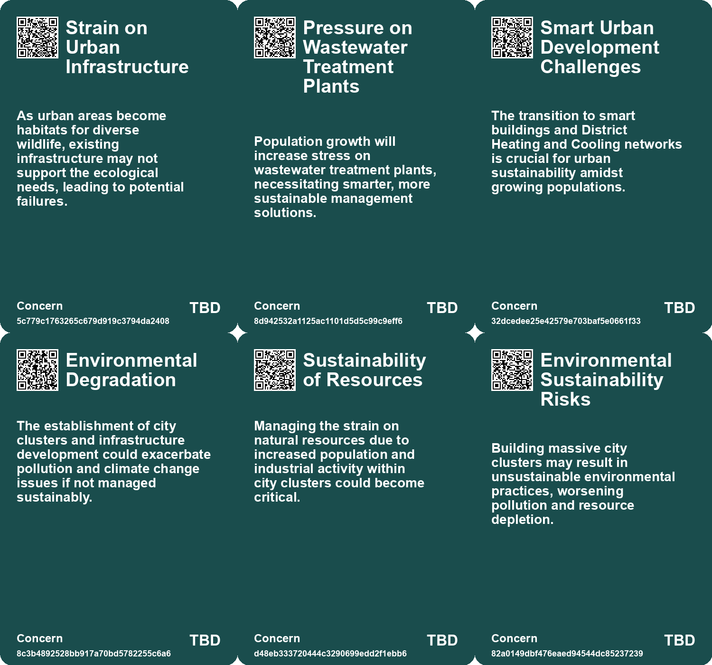
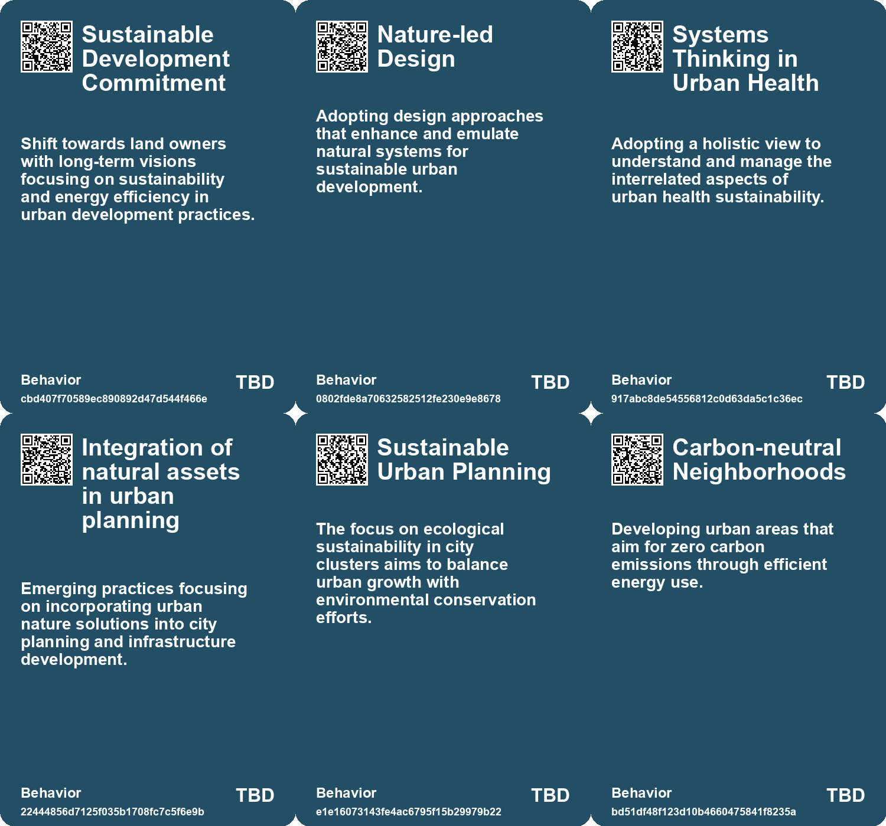
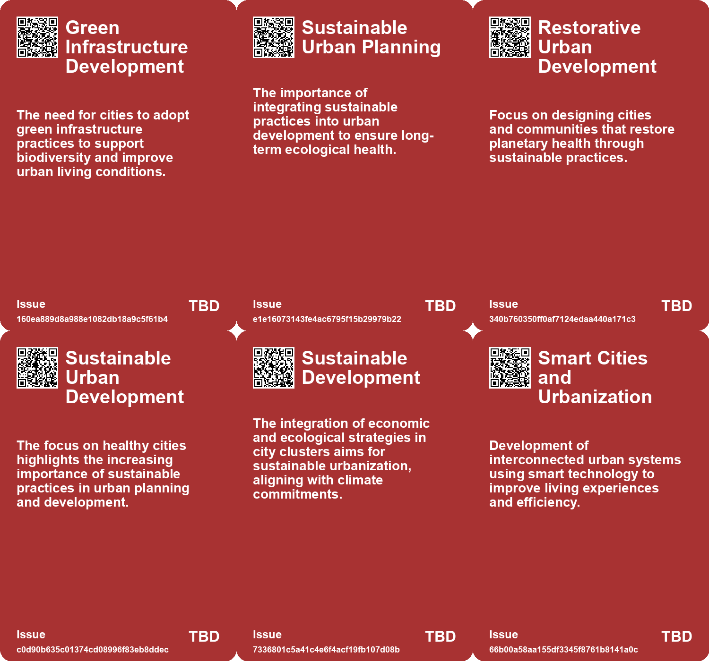
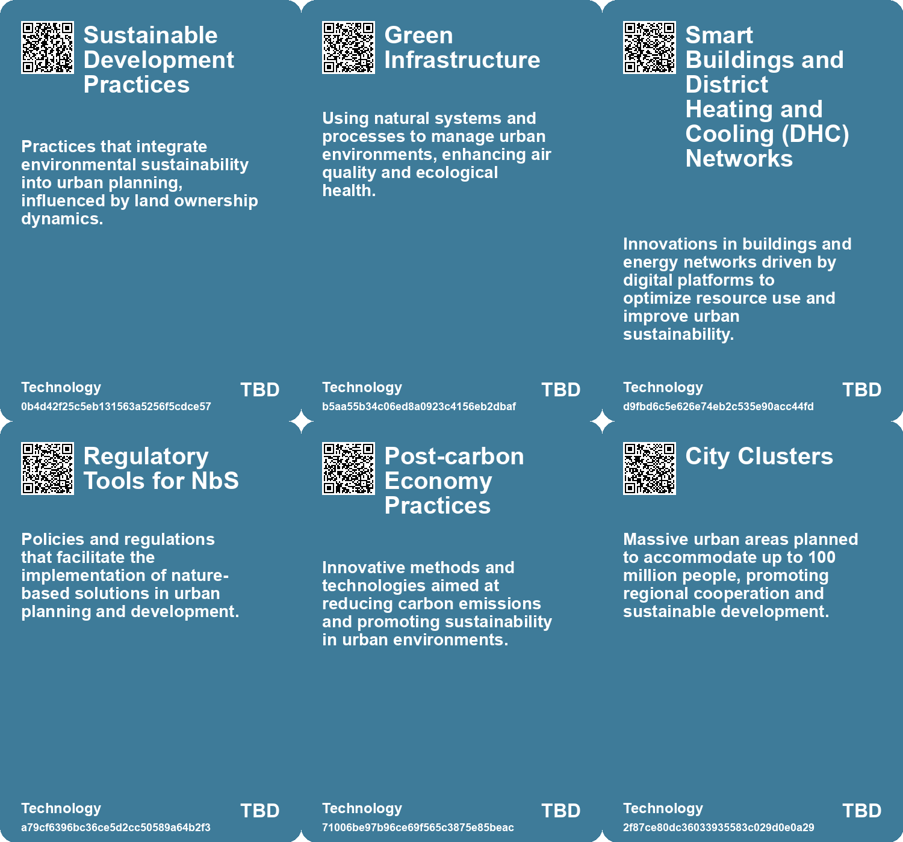

# *Topic*: Sustainable Urban Development

# Summary

Urban development is increasingly focused on sustainability and resilience, with cities around the world exploring innovative solutions to address pressing environmental challenges. The concept of Nature-based Solutions (NbS) is gaining traction, particularly in Scotland, where urban NbS are seen as vital for reducing emissions and improving air quality. Similarly, the emergence of "tiny forests" in Australian cities aims to combat urban heat and biodiversity loss, fostering community engagement and ecological education.

The integration of green infrastructure is also highlighted in discussions about urban forestry management. Municipalities face challenges in meeting tree-planting targets, often hindered by budget constraints and societal perceptions. Innovative cities are beginning to recognize the interconnectedness of trees and urban life, advocating for a shift in how trees are valued as essential components of resilient urban environments.

As cities evolve, the design of public spaces is becoming more inclusive, particularly for children. A child-friendly approach to urban planning is essential for creating healthier, more resilient cities. Reports emphasize that prioritizing children's needs can lead to better outcomes for all residents, as it fosters outdoor play, independent navigation, and a connection with nature.

The future of work is also a significant theme, with experts predicting a shift towards a more sustainable economy. This includes the rise of circular and nature-friendly economic models that prioritize collective well-being and creativity. Emerging sectors, such as regenerative industries and localized knowledge exchanges, are expected to create new job opportunities. Individuals are encouraged to develop skills that align with these changes, while governments are urged to support lifelong learning and collaboration.

Technological advancements are playing a crucial role in urban management. Quantum sensing technologies offer high precision in monitoring urban infrastructure, addressing challenges like population growth and resource scarcity. Meanwhile, the integration of Augmented Reality (AR) into urban life presents both opportunities and risks, necessitating proactive governance to manage its impact on privacy and social equity.

The construction industry is undergoing a transformation, focusing on sustainability and digital innovation. Trends such as modular construction and eco-friendly practices are reshaping project management and design. The push for adaptive reuse of existing buildings is also gaining momentum, as it reduces carbon emissions and addresses the challenges posed by the pandemic.

Finally, the upcoming United Nations' "Summit of the Future" aims to unite global leaders in addressing climate change, poverty, and sustainable development. Despite advancements in understanding these issues, political and institutional barriers remain. A comprehensive global strategy is essential for tackling these challenges and ensuring a balanced future for humanity.

# Seeds

|    | name                                     | description                                                                                     | change                                                                                                              | 10-year                                                                                                            | driving-force                                                                                                    |
|---:|:-----------------------------------------|:------------------------------------------------------------------------------------------------|:--------------------------------------------------------------------------------------------------------------------|:-------------------------------------------------------------------------------------------------------------------|:-----------------------------------------------------------------------------------------------------------------|
|  0 | Emergence of Smart Buildings             | Growing importance of smart buildings and district heating in urban sustainability.             | From traditional building designs to smart, resource-efficient structures in urban planning.                        | Future cities are likely to feature a prevalence of smart buildings contributing to sustainability and efficiency. | Urbanization and the push for sustainability driving innovation in building designs.                             |
|  1 | Regenerative Design Adoption             | Increased interest in designing cities that harmonize with natural systems.                     | Shift from extractive design practices to regenerative principles in urban planning.                                | Ten years from now, urban centers may significantly integrate nature into infrastructure and community designs.    | Growing awareness of ecological responsibility and planetary health.                                             |
|  2 | Healthy Cities Approach                  | The course reinforces the Healthy Cities movement principles for urban development.             | Transition from isolated health initiatives to integrated, community-focused urban health strategies.               | Cities will adopt more holistic health planning frameworks, considering social determinants of health.             | Growing recognition of the interconnection between urban planning and public health outcomes.                    |
|  3 | Urban Nature-based Solutions Development | Focus on integrating nature into urban planning and infrastructure.                             | Transitioning urban planning from traditional methods to nature-centric approaches.                                 | Cities will increasingly incorporate green spaces and natural elements, enhancing urban living conditions.         | Recognizing the health and environmental benefits of urban green spaces encourages this shift.                   |
|  4 | Integrated NbS in Urban Infrastructure   | Nature-based Solutions becoming integral to urban infrastructure planning.                      | Transitioning from separate planning processes to integrated NbS in urban development.                              | Urban areas will feature integrated nature-based infrastructure, improving livability and resilience.              | The need for sustainable urban growth and resilience against climate impacts drives integration.                 |
|  5 | Smart Cities Development                 | Emerging focus on smart cities to integrate technology in urban planning and construction.      | Transition from traditional urban development to smart, tech-driven city planning and infrastructure.               | In 10 years, most urban areas will be smart cities with integrated technology enhancing quality of life.           | Urbanization and technological advancements are pushing the development of smart city infrastructures.           |
|  6 | Urban Tech Ecosystems                    | A commercial area designed for startups focused on sustainability and new mobility.             | From traditional commercial spaces to innovation hubs for sustainable technologies.                                 | Future cities may have thriving ecosystems for startups focused on eco-friendly innovations.                       | Emergence of green technology and entrepreneurship in response to climate challenges.                            |
|  7 | Focus on Sustainable Development Goals   | A renewed emphasis on meeting Sustainable Development Goals (SDGs) through degrowth strategies. | Transition from neglecting SDGs under growth pressures to prioritizing them through sustainable economic practices. | In a decade, many nations might align their policies with SDGs, fostering sustainability and equity initiatives.   | The global commitment to achieving SDGs is motivating countries to rethink their economic models and priorities. |
|  8 | Sustainable Urban Design                 | Cities are investing in environmentally sustainable public spaces and infrastructure.           | From traditional park designs to innovative, eco-friendly public areas that promote biodiversity.                   | Urban environments will incorporate more green spaces, enhancing sustainability and livability.                    | Growing concerns about climate change and urbanization drive sustainable design trends.                          |
|  9 | Child-friendly Urban Planning            | Cities are adopting approaches that prioritize children's needs in urban design.                | Shift from traditional urban planning to a child-focused framework.                                                 | Cities will be more inclusive, resilient, and livable for all generations, reflecting children's needs.            | Growing recognition of children's influence on urban environments and community dynamics.                        |

# Concerns

|    | name                                      | description                                                                                                                                                            |
|---:|:------------------------------------------|:-----------------------------------------------------------------------------------------------------------------------------------------------------------------------|
|  0 | Strain on Urban Infrastructure            | As urban areas become habitats for diverse wildlife, existing infrastructure may not support the ecological needs, leading to potential failures.                      |
|  1 | Pressure on Wastewater Treatment Plants   | Population growth will increase stress on wastewater treatment plants, necessitating smarter, more sustainable management solutions.                                   |
|  2 | Smart Urban Development Challenges        | The transition to smart buildings and District Heating and Cooling networks is crucial for urban sustainability amidst growing populations.                            |
|  3 | Environmental Degradation                 | The establishment of city clusters and infrastructure development could exacerbate pollution and climate change issues if not managed sustainably.                     |
|  4 | Sustainability of Resources               | Managing the strain on natural resources due to increased population and industrial activity within city clusters could become critical.                               |
|  5 | Environmental Sustainability Risks        | Building massive city clusters may result in unsustainable environmental practices, worsening pollution and resource depletion.                                        |
|  6 | Public Space Management                   | Prioritizing people over cars in urban design may face challenges in execution and acceptance.                                                                         |
|  7 | Sustainability in Architecture            | The challenge of creating sustainable designs from existing buildings is crucial, yet architects may struggle to adapt and innovate under new environmental standards. |
|  8 | Economic Displacement                     | The shift towards sustainable transport and new community services may displace existing jobs in traditional automotive and urban development sectors.                 |
|  9 | Socioeconomic Disparities in Urban Living | Urban environments failing to prioritize child-friendly designs could widen the gap in socioeconomic conditions among different community groups.                      |

# Cards

## Concerns

## Behaviors

## Issue

## Technology

# Links

* [Exploring the Significance of the Upcoming United Nations 'Summit of the Future'](https://futures.kghosh.me/ab690d3fcec5de5dde0bb9d99dd4eb66)
* [Future of Work: Embracing Opportunities and Adapting to Change Over the Next 50 Years](https://futures.kghosh.me/a601d356f6c81dbc065229f13e92c3f8)
* [2025 Water Management: The Crucial Role of Digital Transformation in Addressing Global Water Challenges](https://futures.kghosh.me/a374b5aaabba03451c8c0ebd32edd833)
* [The LOOP: Dubai's Vision for Sustainable Transportation and Urban Living](https://futures.kghosh.me/028e8b0caa69712c4fda4048ad84de72)
* [Harnessing Quantum Sensing for Sustainable Urban Infrastructure Management](https://futures.kghosh.me/4fddc420c6c76d438d8447e1828e7ed5)
* [Rethinking Economic Growth: The Case for Degrowth in a Sustainable Future](https://futures.kghosh.me/d18185596b0ee658ac31e9c3003c6d92)
* [Future of Work: Embracing Opportunities and Adapting to Change Over the Next 50 Years](https://futures.kghosh.me/56ddb45deabcdc8b707c7647270e101d)
* [Creating Child-Friendly Urban Spaces: A Path to Better Cities for All](https://futures.kghosh.me/f4247162dcc5eb2eb0d87f1843f993d8)
* [The Impact of Urban Design on Public Space Usage and Social Interaction](https://futures.kghosh.me/2f31d87f3801765f9645d092cadf513a)
* [Transformative Trends Reshaping the Construction Industry by 2025](https://futures.kghosh.me/5b34eae231df2e3c0bbee2cc2ab74090)
* [Innovative Approaches to Public Space Transformation in U.S. Cities](https://futures.kghosh.me/465b809f2a993c634a1a239ca0cab476)
* [Addressing Urban Forestry Challenges: The Case for Trees as Vital Infrastructure](https://futures.kghosh.me/34fb411b34c997f52f550d855c864865)
* [Reimagining Urban Spaces: Embracing Wildlife in City Environments](https://futures.kghosh.me/88d958b42141d5ddfae941e43db4eda7)
* [The Augmented City: Balancing Innovation and Challenges in Urban AR Integration](https://futures.kghosh.me/79a156bc6b74667af8c3e7309844d739)
* [Transforming Berlin's Tegel Airport Site into a Sustainable Neighborhood: Schumacher Quartier Project](https://futures.kghosh.me/5152a8f61434482ebe5faecae9e14b28)
* [Joseph Grima Advocates for Non-Extractive Architecture to Transform Building Practices](https://futures.kghosh.me/8138ea21b5288b813c73e1e5195aaedf)
* [Reimagining Design: Moving Beyond Human-Centricity for Sustainability](https://futures.kghosh.me/5374f630138505a84bf07f321ed3d05e)
* [The Urgent Need for Adaptive Reuse in Architecture Today](https://futures.kghosh.me/cf7cc3361b8139c51e3e97835a2da4e4)
* [China's Urbanization Strategy: Building Sustainable City Clusters for 100 Million Inhabitants](https://futures.kghosh.me/36cc4bee50644b6ef53de008db24e0c4)
* [China's Urban Future: The Rise of City Clusters and Sustainable Development Strategies](https://futures.kghosh.me/2c6411450b93e8449beffcb00e58b39b)
* [Scaling Nature-based Solutions in Scotland: A Pathway to Climate Resilience](https://futures.kghosh.me/c7d3021c1b6298e7c47bc455cd7d8391)
* [Exploring the WHO Course on Developing and Sustaining Healthy Cities in 20 Steps](https://futures.kghosh.me/913d0269ceb45988ccb27e8f60b4f3c7)
* [Exploring Regenerative Design for Harmonious Coexistence with Nature](https://futures.kghosh.me/a1acb04c0f65f709ad6c8ce2f0946a51)
* [Tiny Forests: Revitalizing Urban Spaces and Strengthening Communities in Australia](https://futures.kghosh.me/0d473df79d3acc680e6d9e25e23eaee7)
* [Exploring Urban Land Ownership Patterns for a Just Transition in Europe’s Built Environment](https://futures.kghosh.me/4ed76c2478e283e261adf85f038e0f0d)