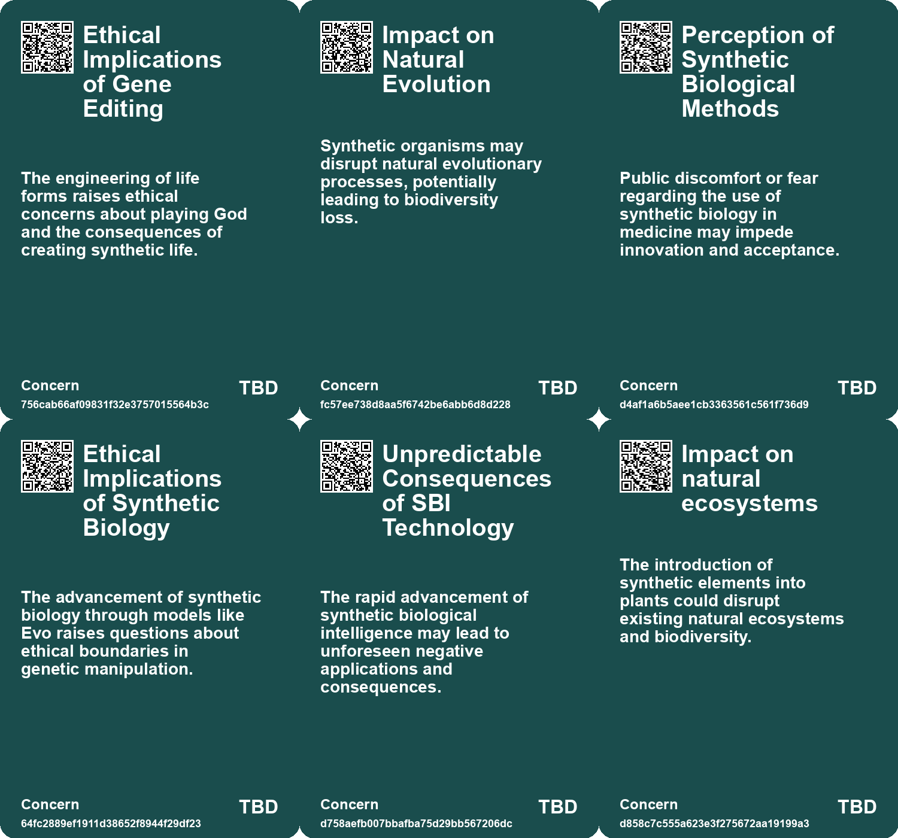
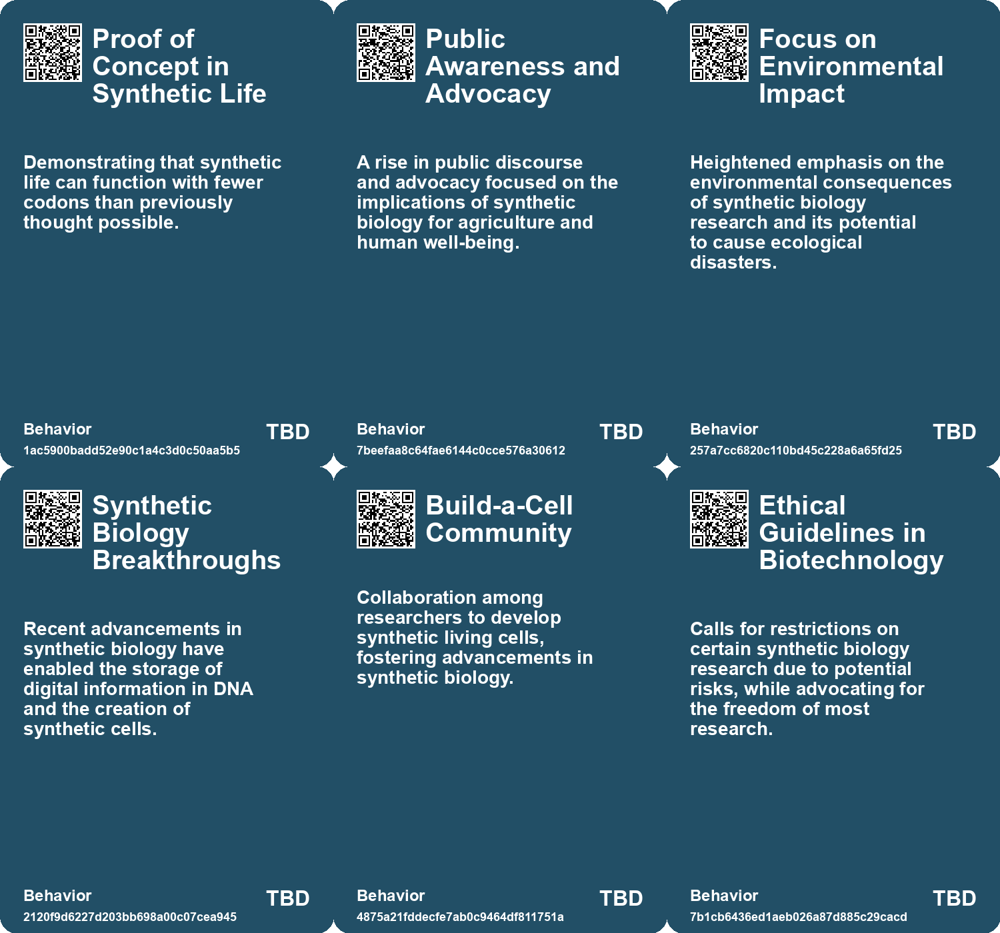
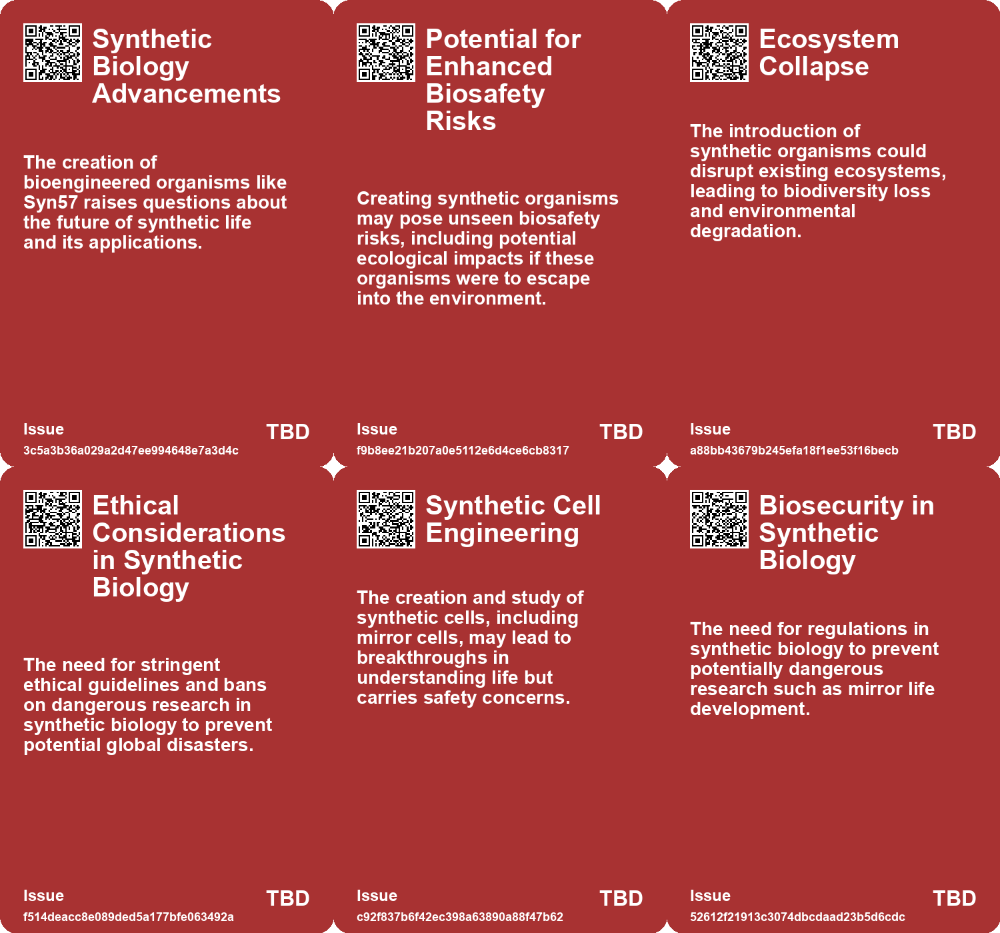
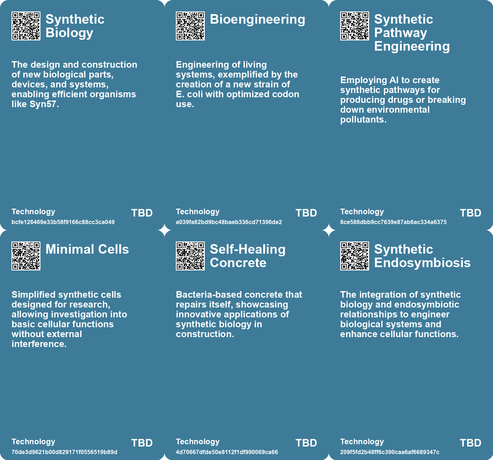

# *Topic*: Synthetic Biology

# Summary

Recent advancements in synthetic biology and genetic engineering are reshaping our understanding of life and its potential applications. Researchers have made significant strides in creating synthetic organisms, such as the engineered E. coli strain "Syn57," which operates efficiently with fewer codons than any known life form. This breakthrough opens new avenues for exploring alternative genetic codes and understanding the limits of life. However, the creation of synthetic and minimal cells raises ethical concerns, particularly regarding the development of "mirror bacteria" that could pose risks to ecosystems and human health. Prominent biologists have called for restrictions on such research to prevent potential disasters.

The intersection of artificial intelligence and biology is another prominent theme. AI has been utilized to design programmable gene editors, like OpenCRISPR-1, which offers improved precision in gene editing. Additionally, AI models have successfully generated tiny working genomes for bacteriophages, demonstrating the potential for AI-driven therapies to combat antibiotic resistance. Researchers at Google DeepMind have also harnessed AI to discover over 2.2 million crystal structures, showcasing its ability to accelerate materials science research.

The concept of holobionts, which views organisms as meta-organisms composed of various species and their microbiomes, is gaining traction. This perspective emphasizes the importance of understanding the relationships between different life forms and their environments. Metagenomics has played a crucial role in identifying these complex interactions, with implications for medicine, agriculture, and ecology.

Innovations in plant biology are also noteworthy. Researchers are exploring the idea of Cyborg Botany, integrating electronic functionalities with plant biology to create responsive interaction devices. This approach leverages plants' natural sensing abilities, merging synthetic circuitry with their physiology. Meanwhile, the debate over plant intelligence continues, as studies reveal that plants exhibit behaviors akin to memory and communication, challenging traditional views of consciousness.

The development of biological computers, such as the CL1 from Cortical Labs, represents a significant leap in technology. By integrating human brain cells with silicon, this device aims to create synthetic biological intelligence, potentially transforming fields like drug discovery and robotics. Similarly, the DishBrain chip, which contains human and mouse brain cells, has demonstrated sentience by learning to play a simple game, raising questions about the nature of intelligence in biological systems.

Environmental sustainability is a critical focus, with researchers discovering new antibiotic molecules from soil samples that effectively target harmful bacteria while remaining non-toxic to human cells. This highlights the ongoing need for innovative solutions to combat antibiotic resistance. Additionally, the development of eco-friendly sensors that can be printed onto biological surfaces offers promising applications in healthcare and environmental monitoring.

Finally, the exploration of music's relationship with evolution and culture underscores the interconnectedness of human creativity and biological systems. A digital project simulating the evolution of musical melodies draws parallels between cultural trends and biological replication, emphasizing the universal patterns of evolution across different domains. 

These themes reflect a rapidly evolving landscape in science and technology, where the boundaries between biology, artificial intelligence, and environmental sustainability are increasingly blurred.

# Seeds

|    | name                                       | description                                                                                | change                                                                                            | 10-year                                                                                                            | driving-force                                                                                      |
|---:|:-------------------------------------------|:-------------------------------------------------------------------------------------------|:--------------------------------------------------------------------------------------------------|:-------------------------------------------------------------------------------------------------------------------|:---------------------------------------------------------------------------------------------------|
|  0 | Evolutionary Redundancy Awareness          | Scientists recognize and address redundancy in the genetic code through synthetic biology. | A move towards understanding and optimizing genetic codes beyond traditional evolutionary limits. | In 10 years, we may regularly create organisms with custom genetic codes for specific purposes.                    | The motivation to enhance biological systems and create customized organisms.                      |
|  1 | Synthetic Biology Breakthroughs            | Recent advancements enable complete synthesis of genomes with tailored characteristics.    | Transitioning from replicating natural forms to creating entirely novel life forms chemically.    | In 10 years, synthetic organisms might become integral to industries like healthcare and biotechnology.            | The push for innovative solutions to complex biological challenges.                                |
|  2 | Alternative Genetic Codes Exploration      | The possibility to explore and test various alternative genetic codes in synthetic life.   | From a rigid genetic system to a flexible framework that allows experimentation.                  | In 10 years, biology could utilize diverse genetic systems for unique applications, revolutionizing life sciences. | The quest for better understanding of life's building blocks and functions.                        |
|  3 | Exploration of Synthetic Biology           | Creating new, viable DNA sequences that can function in organisms.                         | from relying solely on natural selection to engineered biological solutions.                      | Synthetic biology could revolutionize medicine, agriculture, and environmental management.                         | The potential to engineer beneficial biological systems for various applications.                  |
|  4 | Ethical Implications of Evo                | Concerns about the creation of synthetic viruses or harmful biological entities.           | Growing awareness and need for regulations in biotechnology applications.                         | Potential increased bioterrorism threats necessitating stronger biosecurity measures.                              | The rapid advancement of biotechnology raises ethical and security concerns.                       |
|  5 | Global Consequences of Synthetic Organisms | Warning of the global impact of synthetic organisms on agriculture and ecosystems.         | Shift from localized research impacts to worldwide ecological threats.                            | Ecosystems and agriculture may suffer severe disruptions due to synthetic organisms.                               | The drive for innovation in biotechnology could overshadow environmental considerations.           |
|  6 | Cyborg Botany                              | Integration of synthetic circuitry with plants for enhanced interaction capabilities.      | Shifting from traditional electronic devices to biologically integrated systems for interaction.  | In 10 years, plants may serve as multifunctional interactive devices in various environments.                      | The desire for sustainable, responsive technology that harmonizes with nature.                     |
|  7 | Build-a-Cell Community                     | A collaborative initiative aimed at developing synthetic living cells.                     | Emergence of community-focused synthetic biology research efforts.                                | Collaborative networks may accelerate advancements in synthetic biology and applications.                          | The collaborative approach enhances innovation and knowledge sharing in research.                  |
|  8 | Regulatory Framework for Synthetic Biology | Proposed regulations to guide synthetic biology research, especially mirror life.          | Emerging frameworks for regulating high-risk synthetic biology research.                          | In a decade, specific guidelines may govern synthetic biology research to mitigate risks.                          | Increasing awareness of biosecurity and ethical implications drives regulatory developments.       |
|  9 | Integration of AI and Biology              | A shift towards combining biological principles with artificial intelligence development.  | From top-down AI approaches to bottom-up, biologically-inspired models.                           | AI systems may evolve to exhibit more complex, life-like behaviors and adaptability.                               | The recognition that biological evolution offers insights into creating more effective AI systems. |

# Concerns

|    | name                                              | description                                                                                                                                 |
|---:|:--------------------------------------------------|:--------------------------------------------------------------------------------------------------------------------------------------------|
|  0 | Ethical Implications of Gene Editing              | The engineering of life forms raises ethical concerns about playing God and the consequences of creating synthetic life.                    |
|  1 | Impact on Natural Evolution                       | Synthetic organisms may disrupt natural evolutionary processes, potentially leading to biodiversity loss.                                   |
|  2 | Perception of Synthetic Biological Methods        | Public discomfort or fear regarding the use of synthetic biology in medicine may impede innovation and acceptance.                          |
|  3 | Ethical Implications of Synthetic Biology         | The advancement of synthetic biology through models like Evo raises questions about ethical boundaries in genetic manipulation.             |
|  4 | Unpredictable Consequences of SBI Technology      | The rapid advancement of synthetic biological intelligence may lead to unforeseen negative applications and consequences.                   |
|  5 | Impact on natural ecosystems                      | The introduction of synthetic elements into plants could disrupt existing natural ecosystems and biodiversity.                              |
|  6 | Ethical Considerations of Unrestricted Research   | The pursuit of synthetic biology without sufficient regulation could lead to unintended consequences, violating ethical research standards. |
|  7 | Synthetic Biology Risks                           | Advancements in synthetic biology might lead to unintended consequences, including ecological disruption and loss of biodiversity.          |
|  8 | Erosion of biodiversity principles                | The push for artificial life and synthetic biology may detract from the urgency of preserving existing biodiversity and natural ecosystems. |
|  9 | Biosecurity Risks from AI in Biological Synthesis | The use of AI in DNA/RNA synthesis could facilitate the creation of dangerous biological agents if not properly regulated.                  |

# Cards

## Concerns

## Behaviors

## Issue

## Technology

# Links

* [DeepMind's AI Uncovers 2.2 Million New Crystal Structures for Material Science](https://futures.kghosh.me/115b59fc3f0d7b148482545adb1a8038)
* [Scientists Create Syn57: A Revolutionary Strain of E. coli with Fewer Codons](https://futures.kghosh.me/baa851a48441903a61269df057166abd)
* [AI-Driven Gene Editing: Introducing OpenCRISPR-1 for Enhanced Precision in Human Genomes](https://futures.kghosh.me/fb983ad12b687b393f0bdc2a54ef0c03)
* [The Challenges and Advances in Simulating the C. elegans Brain Over 25 Years](https://futures.kghosh.me/32e91a01ba181534d1578186bfcc240a)
* [Monash University Develops DishBrain: A Semi-Biological Chip with Learning Capabilities](https://futures.kghosh.me/fcf584bddde6a0c4ccaf5ab8eadded1e)
* [Exploring Plant Intelligence: Memory, Communication, and Consciousness in Plants](https://futures.kghosh.me/f74c8517506f8ed8387d0a7e38f56cbe)
* [Recent Developments in AI Regulation and Technology: A Review of Key Initiatives and Critiques](https://futures.kghosh.me/a009ccdffaa59f53de56887aa19e6239)
* [Exploring the Evolution of Music Through Digital Experimentation](https://futures.kghosh.me/6fcf93f676767f11743d7d42d09ae8e8)
* [The Risks and Ethical Considerations of Research on Mirror Bacteria in Synthetic Biology](https://futures.kghosh.me/e2cc8f6f19604a6a1553d9a871ad03a1)
* [AI Successfully Designs Working Genomes for Viruses to Combat Antibiotic-Resistant Bacteria](https://futures.kghosh.me/3d592e06f3ba6280f84cb18be989f1fa)
* [Tom Ray's Journey from Evolutionary Biology to Artificial Life Creation](https://futures.kghosh.me/d569dcc750762a88b0b75c3ee925c4d4)
* [Exploring the Bio Revolution: Opportunities, Risks, and Future Implications](https://futures.kghosh.me/62a5bae52266a680c6a13bd3ef8dc48c)
* [Understanding Holobionts: A New Perspective on Organisms and Their Microbial Partners](https://futures.kghosh.me/99e803820e0c09fbc3163a5a26ff49bb)
* [Evo: The Large Language Model Revolutionizing DNA Reading and Writing](https://futures.kghosh.me/45d34ce40d5974664e5ea44a7d14f104)
* [Breakthrough Discovery of New Antibiotic Molecule from Soil Samples](https://futures.kghosh.me/fa6115ae1686f345d64fa1c0c3dfafd5)
* [Urgent Call to Ban Research on Potentially Dangerous Mirror Cells by Biologists](https://futures.kghosh.me/ebc9a424cf40d54bf27fe0287b648be3)
* [Cyborg Botany: Merging Technology with Plant Sensing and Interaction](https://futures.kghosh.me/b1f6991b9b718672751c9427c3f5b794)
* [Innovative Scientific Breakthroughs in Health and Sustainability: From Mini-Brains to Microplastics](https://futures.kghosh.me/893f7fa4d1fb919258d3e90b77babab5)
* [Exploring the Intersection of Computation, Biology, and Consciousness with Claire L. Evans](https://futures.kghosh.me/455dc7f82448dc311103de117ab8646f)
* [The Los Angeles Project: Genetic Engineering for Exotic Pets and Ethical Dilemmas](https://futures.kghosh.me/a14802d50bd16235be4acda9fec4b168)
* [Innovative Eco-Friendly Sensors for Health Monitoring and Environmental Applications](https://futures.kghosh.me/0370fcd11fe23fc06dd8784115da238b)
* [Simulating a Minimal Cell: Insights from TypeScript and Cell Biology](https://futures.kghosh.me/c95c67faf6b15cb5595e1d7caa1b8e48)
* [Reevaluating Mitochondria: Embracing Their Status as Living Organisms for Biological Advances](https://futures.kghosh.me/ce348324368b560b9912fe5055c8241d)
* [Exploring Innovation Through AI-Generated Synthetic Personas and Research Techniques](https://futures.kghosh.me/0240dfcfc0cb85987a889bc6e1e00585)
* [Cortical Labs Launches World's First Biological Computer: The CL1](https://futures.kghosh.me/c3e6ac3d2c8dcccbff885b74128c5536)