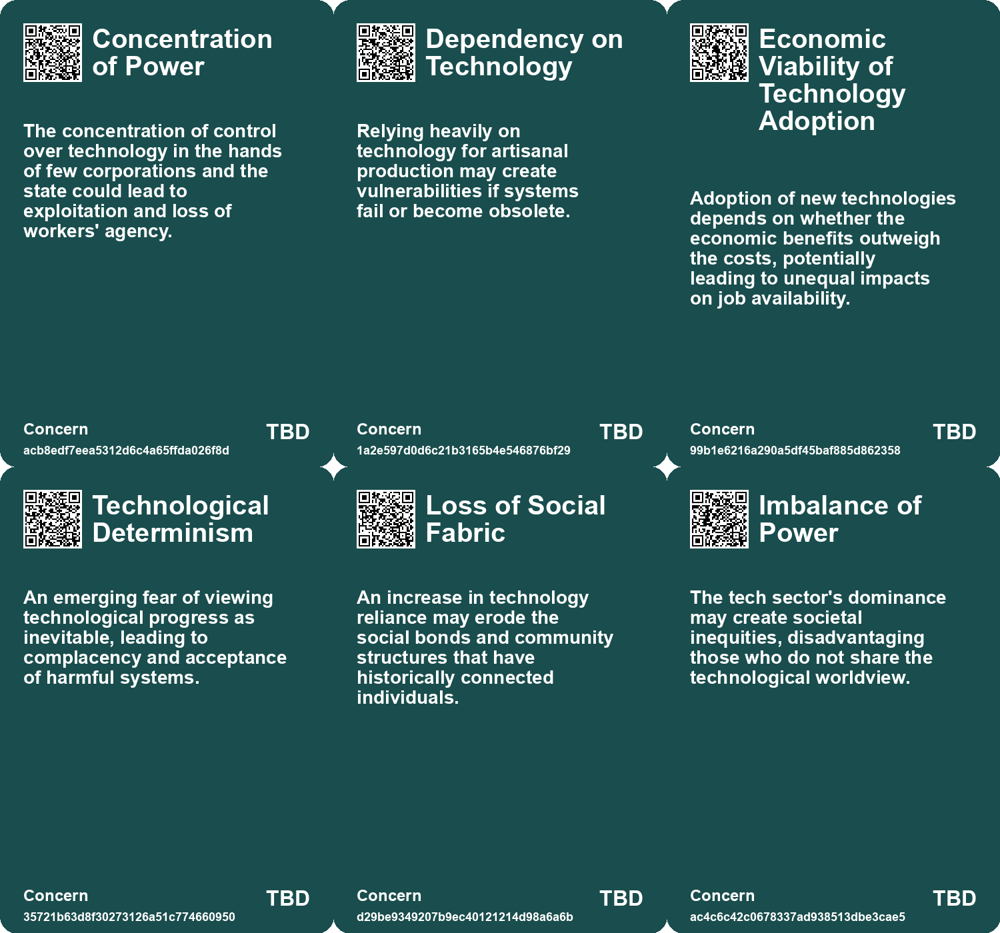
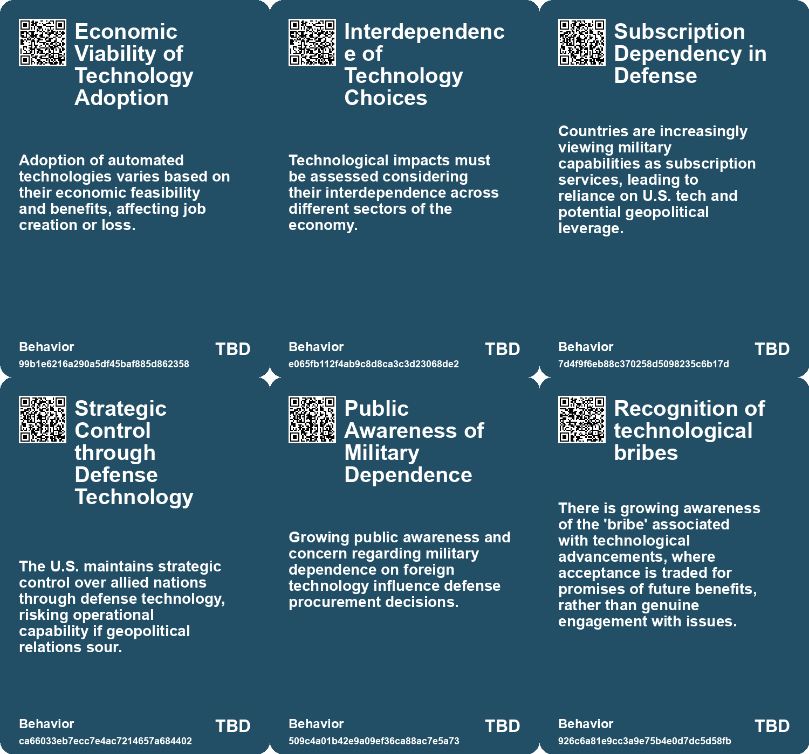
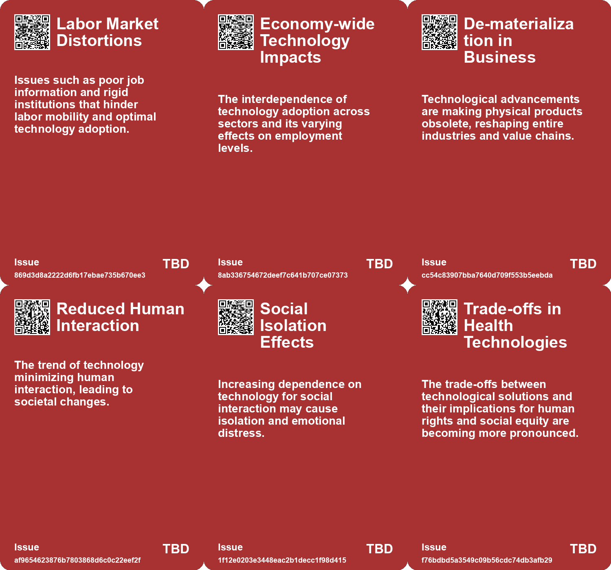
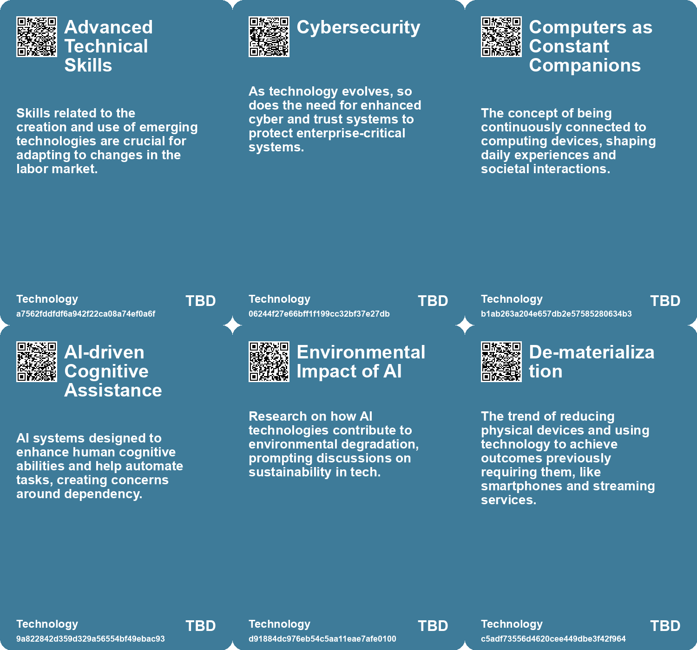

# *Topic*: Technological Dependency

# Summary

Technology's dual role in society is a prominent theme across various discussions. While it has contributed to climate change, it is also viewed as essential for addressing environmental issues. The concept of "type 2 growth," which emphasizes qualitative improvement over mere resource consumption, suggests a path forward as the global population begins to decline. This perspective aligns technological advancement with environmental health, fostering optimism for a future where technology enhances life without depleting resources.

The rapid pace of technological change is another focal point. The evolution of artificial intelligence and other key technologies is transforming society at an unprecedented rate. This shift raises questions about who controls these technologies and the implications for our future. The importance of being informed and engaged in discussions about technology is emphasized, as the potential for transformative impacts on labor, education, and governance becomes increasingly apparent.

Concerns about the societal effects of technology are also highlighted. The trend toward reducing human interaction through innovations like online shopping and automated services raises alarms about empathy and social understanding. The essence of humanity, rooted in social interaction, may be at risk as technology continues to evolve in this direction. This concern is echoed in discussions about the Techno-Optimist’s Fallacy, which warns against blind trust in technological progress without considering potential harms.

The impact of technology on labor markets is significant, with robots and AI displacing routine jobs while also creating new opportunities. In regions like East Asia and the Pacific, the adoption of robots is reshaping employment dynamics, benefiting skilled workers more than low-skilled ones. The need for digital skills and social protection for gig workers is underscored as the job landscape continues to change.

The role of technology in addressing global challenges, such as pandemics, is also examined. Various innovations have emerged to help societies navigate crises, but they come with trade-offs that require careful consideration. The balance between control over technology and understanding its implications for society is a critical discussion point.

The future of wearable technology and its integration into daily life presents both opportunities and challenges. As the line between human and machine blurs, the potential for augmented reality and enhanced social interactions is explored. However, the need for these technologies to seamlessly fit into our lives remains a key consideration.

Finally, the concentration of power among big tech companies raises concerns about democracy and individual agency. The ownership and control of AI by a few dominant players pose risks to security and systemic stability. Calls for regulation and accountability highlight the need to prioritize public interests over corporate profits, ensuring that technology serves the greater good.

These themes reflect a complex landscape where technology's benefits and drawbacks must be navigated thoughtfully. The ongoing dialogue about the role of technology in shaping our future is essential as society grapples with its implications.

# Seeds

|    | name                                  | description                                                                                 | change                                                                                                 | 10-year                                                                                                                      | driving-force                                                                                                         |
|---:|:--------------------------------------|:--------------------------------------------------------------------------------------------|:-------------------------------------------------------------------------------------------------------|:-----------------------------------------------------------------------------------------------------------------------------|:----------------------------------------------------------------------------------------------------------------------|
|  0 | Artisanal Digital Fabrication         | Emerging use of technology in artisanal labor to enhance production while preserving craft. | Shift from purely manual craftsmanship to a blend of technology and artisan skills.                    | In 10 years, digital tools will be commonplace in artisanal sectors, expanding production capabilities and creativity.       | Desire for sustainable practices and efficient production methods in artisanal trades.                                |
|  1 | Techno-solutionism                    | Belief in technology as the primary solution to societal problems.                          | Shift from holistic solutions to reliance on technological fixes for complex issues.                   | Society may increasingly view technology as the primary means to solve all problems.                                         | Desire for quick fixes to ongoing challenges like pandemics.                                                          |
|  2 | Crisis in Resource Supply Chains      | Emerging crises in resource availability, particularly in electronics and manufacturing.    | From stable supply chains to disrupted and resource-scarce environments.                               | Increased focus on recycling and sustainable resource management in technology sectors.                                      | Rising resource scarcity and environmental concerns pushing for innovative solutions.                                 |
|  3 | Social Acceptance of Surveillance     | Increased comfort with technology being omnipresent in our lives.                           | Society moving from apprehension about surveillance to acceptance of it as a norm.                     | Surveillance technology will blend into daily life, raising ethical questions.                                               | The normalization of technology in personal and public spaces.                                                        |
|  4 | Polarization in Technology Debate     | The increasing divide between techno-optimists and critics like Luddites.                   | Transition from healthy debate to extreme polarization, hindering constructive dialogue.               | In 10 years, the discourse might become more polarized, limiting shared understanding of technology's role.                  | Rising societal tensions around technology's impact on daily life and culture.                                        |
|  5 | Embracing Technology                  | A growing need to adapt to and integrate new technologies for success.                      | Shift from skepticism about technology to active adoption and experimentation.                         | Widespread integration of technology in everyday tasks, enhancing productivity and creativity.                               | The rapid evolution of technology demands adaptability and continuous learning.                                       |
|  6 | Challenges in open-source AI          | Open-source projects still depend heavily on Big Tech's infrastructure.                     | From open-source independence to reliance on corporate resources.                                      | Limited innovation in open-source AI due to corporate control and dependencies.                                              | The need for resources and infrastructure drives reliance on larger firms.                                            |
|  7 | Enhanced Connectivity in Construction | Importance of connectivity for the deployment of construction technologies.                 | Transition from isolated systems to interconnected, reliable networks for construction management.     | Construction projects will operate on fully integrated networks, enhancing real-time monitoring and management capabilities. | The growing complexity of construction projects necessitates seamless connectivity for better control and efficiency. |
|  8 | Political Control Over Technology     | The debate about who controls emerging technologies is becoming crucial.                    | From technology development by technologists to broader societal involvement in technology governance. | Societal debates will shape the governance of powerful technologies, influencing their applications.                         | The recognition of the power and risks associated with advanced technologies.                                         |
|  9 | Unimaginable Future Technologies      | Future technologies may be beyond current imagination, akin to past innovations.            | The gap between current technological capabilities and future potential will widen.                    | New technologies will emerge that fundamentally alter lifestyles and societal structures.                                    | Rapid advancements in research and development across various scientific fields.                                      |

# Concerns

|    | name                                           | description                                                                                                                                           |
|---:|:-----------------------------------------------|:------------------------------------------------------------------------------------------------------------------------------------------------------|
|  0 | Concentration of Power                         | The concentration of control over technology in the hands of few corporations and the state could lead to exploitation and loss of workers' agency.   |
|  1 | Dependency on Technology                       | Relying heavily on technology for artisanal production may create vulnerabilities if systems fail or become obsolete.                                 |
|  2 | Economic Viability of Technology Adoption      | Adoption of new technologies depends on whether the economic benefits outweigh the costs, potentially leading to unequal impacts on job availability. |
|  3 | Technological Determinism                      | An emerging fear of viewing technological progress as inevitable, leading to complacency and acceptance of harmful systems.                           |
|  4 | Loss of Social Fabric                          | An increase in technology reliance may erode the social bonds and community structures that have historically connected individuals.                  |
|  5 | Imbalance of Power                             | The tech sector's dominance may create societal inequities, disadvantaging those who do not share the technological worldview.                        |
|  6 | Technological Dependency                       | The risk associated with reliance on software substitutes, which may create vulnerabilities in service provision and technology management.           |
|  7 | Dependency on Technology for Solutions         | While technology is posited as the means to combat climate change, over-reliance could mean failures in implementation or unforeseen adverse effects. |
|  8 | Unsustainable Consumerism                      | Technological advancements may exacerbate consumerism, leading to further environmental degradation as the demand for more products increases.        |
|  9 | Overreliance on Big Tech for AI Infrastructure | Startups and researchers' reliance on major corporations for computing resources creates barriers for innovation and independence.                    |

# Cards

## Concerns

## Behaviors

## Issue

## Technology

# Links

* [The F-35 Fighter Jet: A Subscription Model with Geopolitical Implications](https://futures.kghosh.me/d91c1cc223fe90432a76b4dcd2067798)
* [Technologies of Hope: Navigating Pandemic Innovations and Their Societal Implications](https://futures.kghosh.me/d44d0c046d2ee3330a2d40cfccdfc0d3)
* [Navigating Climate Change: The Role of Technology and the Shift from Quantity to Quality Growth](https://futures.kghosh.me/e44687e103abb436ad5980ac2d518f47)
* [The Future of Wearable Technology: Merging Cyborg Lifestyles with Daily Life](https://futures.kghosh.me/a81c4775b91ccd0db3e1b84da893ac6f)
* [Understanding the Knowledge Economy: Key Features and Evolution](https://futures.kghosh.me/07c5954a7c375f3ea3cf9e8724c93de7)
* [Exploring the Impact of Technology on Inequality and Labor in 'Power and Progress'](https://futures.kghosh.me/997c962feb825d066ca4dc6e4742e8a9)
* [The Threat of Big Tech Dominance in the AI Landscape: A Call for Regulation and Accountability](https://futures.kghosh.me/d130f601121a2b6afde583e5960ed783)
* [Addressing the U.S. Engineer Shortage: Purdue University’s Initiative for Semiconductor Education](https://futures.kghosh.me/2d51ddcfa13e2cdd1c310390ce104eb8)
* [Understanding Technological Improvement: The Role of Capability Thresholds in AI Advancement](https://futures.kghosh.me/25707767ff6f55ac1d19168e14af7245)
* [The Diminishing Role of Human Interaction in Modern Technology and Its Societal Implications](https://futures.kghosh.me/31491f2b50e77cc7c45e541a9b2915d7)
* [Understanding the Techno-Optimist's Fallacy and its Implications for Technology Regulation](https://futures.kghosh.me/0e281eb043be786a51d70cb923881594)
* [Embracing Technology and Talent in the Age of AI: Key Insights from Rishad Tobaccowala](https://futures.kghosh.me/338c551fe29e9fb73aa8d412dc77788e)
* [The Unprecedented Pace of Technological Change and Its Future Implications](https://futures.kghosh.me/9d6464c96612c9edb19cf4f53bd26faf)
* [Exploring the Integration of AI in Daily Life and Business Innovations in Tech Trends 2025](https://futures.kghosh.me/0b0e772667a3f74d6364a71eb20bc913)
* [Five Emerging Trends Transforming Business in the Coming Year](https://futures.kghosh.me/55bac03899915f25bf0b47fa4342472c)
* [Revisiting the Luddite Legacy: Embracing Agency in the Age of AI](https://futures.kghosh.me/aaa04be0f2d526e2ccc9a4f6f7c03467)
* [Empowering Artisanal Labor through Technology and Community Collaboration in Detroit](https://futures.kghosh.me/9069cc46631b516b7780b893c126086e)
* [The Threat of Authoritarian Intelligence: A Call for Responsible AI Development](https://futures.kghosh.me/0ba4fa557cd2aae4760bd7a2abca844e)
* [Innovations in Construction Technology: Enhancing Efficiency and Safety](https://futures.kghosh.me/61f108c3cac00cc865969bc54df38749)
* [The Impact of New Technologies on Labor Markets: Insights and Challenges](https://futures.kghosh.me/096459a1ab888f94f55ea8ac6d15235f)
* [Shifting Perspectives: The Growing Skepticism Towards AI and Its Implications](https://futures.kghosh.me/29c7deb9342372a5679806355c66d5e2)
* [Understanding Polarization: Healing Our Relationship with Technology and Embracing Diverse Perspectives](https://futures.kghosh.me/c1bb890337ef382bfaa5720c9fd05134)
* [Exploring Cookies, Supply Chains, and Future Challenges in Technology and Consumption](https://futures.kghosh.me/fa27e27bdec01712d582ab0f61c95bac)