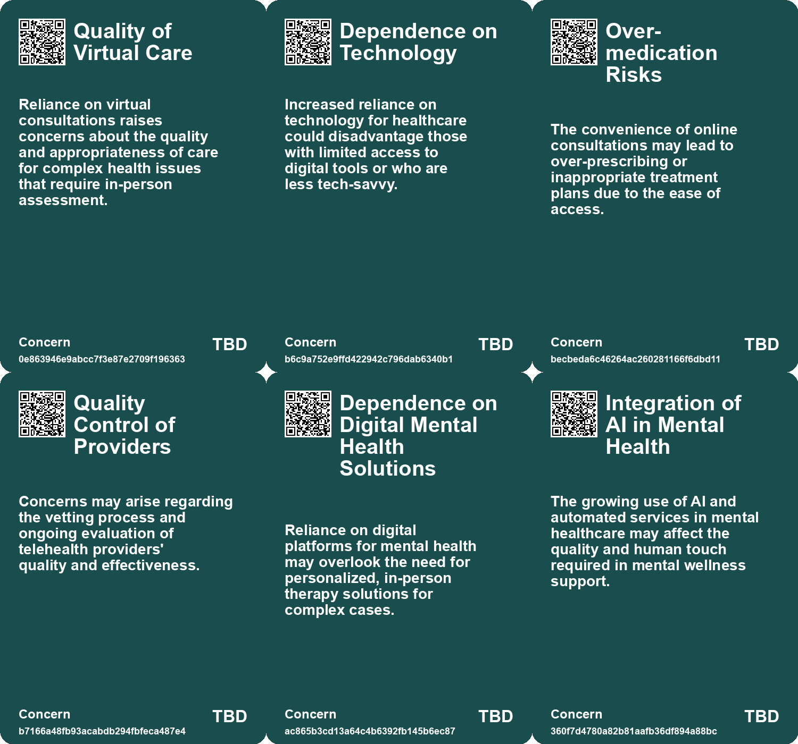
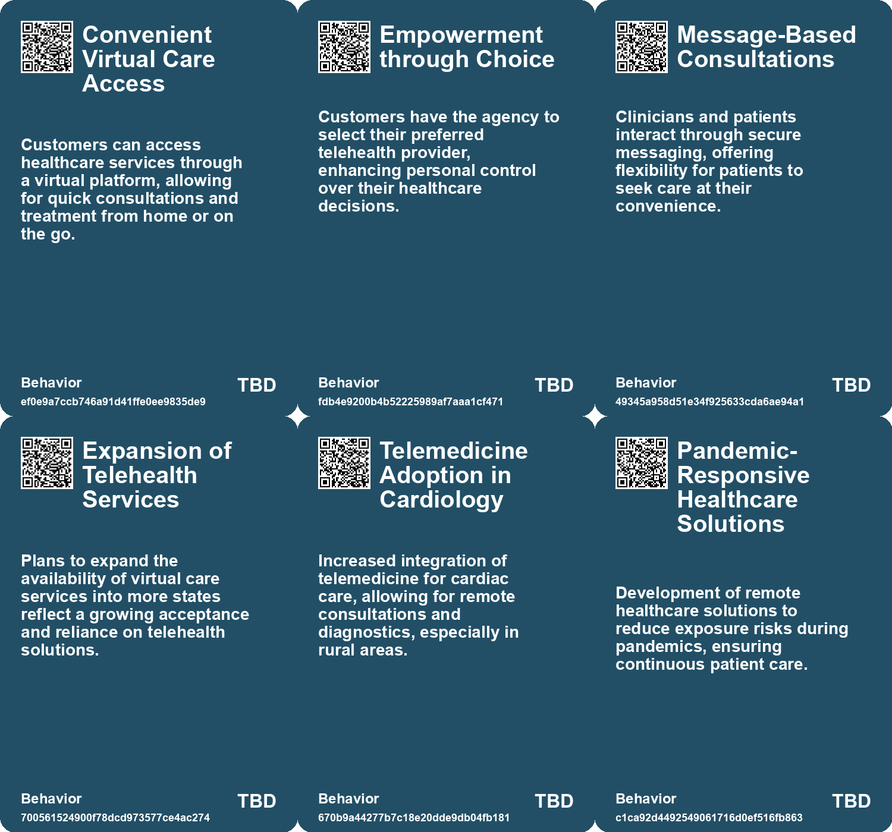
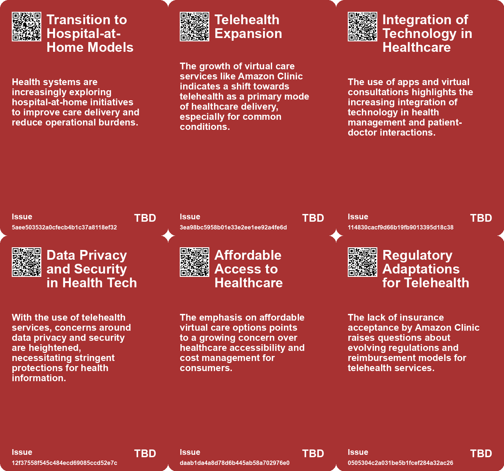
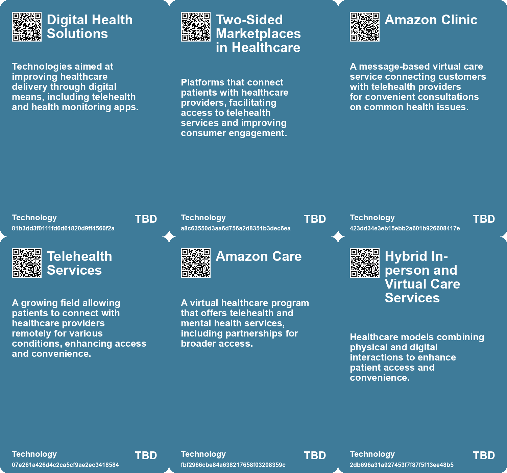

# *Topic*: Telehealth Services

# Summary

The healthcare landscape is undergoing significant transformation, driven by technological advancements and changing consumer needs. Amazon is at the forefront of this shift, introducing services like Amazon Pharmacy and Amazon Clinic to enhance accessibility and affordability in healthcare. Their partnership with Ginger expands mental health support through Amazon Care, reflecting a growing demand for integrated health services.

The increasing role of non-physicians in healthcare delivery is notable, with nurse practitioners and physician assistants now accounting for a substantial share of patient visits. This trend highlights the need for collaboration among healthcare providers to optimize care delivery amid a physician shortage.

Artificial intelligence is emerging as a powerful tool in healthcare, with studies showing that AI systems like ChatGPT can provide responses preferred by healthcare professionals. AI's potential to alleviate physician burnout and improve patient care is evident, yet concerns about its misuse in decision-making processes remain. The integration of AI in healthcare must be approached with caution to ensure patient safety and quality of care.

Remote healthcare technologies are gaining traction, as demonstrated by the successful use of remote echocardiograms that match traditional diagnostic accuracy. This innovation enhances access to care, particularly in underserved areas, while also minimizing exposure risks during health crises.

Data security continues to be a pressing issue in the healthcare sector, as evidenced by a significant data breach affecting millions of customers of HealthEC. The incident underscores the ongoing challenges of protecting personal health information and the need for robust security measures.

The rise of self-service healthcare solutions, such as Forward Health's CarePods, reflects a shift towards more accessible and scalable healthcare delivery. These AI-driven medical stations allow users to conduct tests and receive diagnoses without direct interaction with healthcare professionals, raising questions about the balance between technology and human care.

The impact of remote work on family dynamics is also noteworthy, as more couples adapt to new roles in a hybrid work environment. This shift is reshaping traditional gender roles and influencing work-life balance, highlighting the evolving nature of employment in the modern era.

Finally, the growing public health crisis of loneliness emphasizes the importance of social connections for mental and emotional well-being. The U.S. Surgeon General's report calls for fostering meaningful relationships, suggesting that technology companies may play a role in addressing this issue through innovative solutions. The integration of technology in various sectors, including healthcare and social interaction, presents both opportunities and challenges that society must navigate.

# Seeds

|    | name                                              | description                                                                                              | change                                                                                                                   | 10-year                                                                                                            | driving-force                                                                                                           |
|---:|:--------------------------------------------------|:---------------------------------------------------------------------------------------------------------|:-------------------------------------------------------------------------------------------------------------------------|:-------------------------------------------------------------------------------------------------------------------|:------------------------------------------------------------------------------------------------------------------------|
|  0 | Potential Rise of Hospital-at-Home Models         | Increased investment in hospital-at-home initiatives by health systems.                                  | Healthcare delivery is shifting from inpatient to outpatient, leveraging at-home care.                                   | Hospital-at-home models will become standard, reshaping patient care and health system operations.                 | Costs and operational pressures drive health systems to explore alternative care delivery models.                       |
|  1 | Rise of Virtual Care                              | Amazon Clinic introduces message-based virtual care for common health issues.                            | Shifting from in-person consultations to convenient virtual healthcare options.                                          | In a decade, virtual care could dominate healthcare interactions for non-emergency conditions.                     | The need for accessible and quick healthcare solutions is propelling the rise of virtual care.                          |
|  2 | Direct-to-Consumer Healthcare                     | Customers can select telehealth providers directly through Amazon Clinic.                                | Transitioning from traditional healthcare access to direct consumer engagement with providers.                           | In 10 years, consumers may have more control over their healthcare choices and provider relationships.             | Empowering consumers with choices and control over their health drives this transformation.                             |
|  3 | Surge in Mental Health Apps                       | There is an increasing reliance on mental health apps due to limited access to traditional therapists.   | The landscape of mental health support is moving from in-person therapy to app-based solutions for accessibility.        | In ten years, mental health apps might become the primary source of support for many individuals.                  | The urgent need for mental health support, especially post-pandemic, drives the adoption of digital solutions.          |
|  4 | Telemedicine Adoption                             | Increased acceptance of telemedicine for cardiac evaluations due to technology improvements.             | From limited telemedicine use to widespread adoption for various medical evaluations.                                    | In a decade, telemedicine could be a primary method for many medical evaluations and consultations.                | The need for accessible healthcare solutions in a post-COVID world.                                                     |
|  5 | Pandemic Influence on Medical Practices           | Pandemics like COVID-19 drive the adoption of remote healthcare solutions to reduce contact.             | Shifting from in-person consultations to remote options to minimize health risks.                                        | In 10 years, pandemic-driven changes may lead to permanent remote consultation practices in healthcare.            | Health safety concerns and the need for continuity of care during health crises.                                        |
|  6 | Patient Monitoring Technology Evolution           | Advancements in technology for monitoring patient health are becoming more sophisticated and integrated. | From basic monitoring to dynamic, predictive monitoring of patient conditions using AI.                                  | Patient monitoring could become fully automated and predictive, enhancing timely interventions.                    | Desire for improved patient safety and outcomes through technological advancements.                                     |
|  7 | Rising Role of Non-Physicians in Healthcare       | Non-physician providers are increasingly delivering healthcare services in the U.S.                      | Shift from physician-centered care to a more collaborative model including nurse practitioners and physician assistants. | In 10 years, non-physicians may handle an even larger share of healthcare visits, improving access and efficiency. | The growing physician shortage and increasing healthcare demands are driving the need for more non-physician providers. |
|  8 | Telemedicine and Remote Supervision in Healthcare | There's an emerging trend towards telemedicine for complex psychiatric services.                         | From in-person care to telehealth supervision for specialized treatment.                                                 | In 10 years, telemedicine may be a primary method for accessing mental health services.                            | The need for accessible and efficient healthcare solutions is propelling telehealth adoption.                           |
|  9 | AI-Augmented Healthcare                           | AI technologies like ChatGPT are being integrated into healthcare to enhance patient communication.      | Shift from traditional physician responses to AI-assisted responses in patient inquiries.                                | In 10 years, AI could be a standard tool for physicians to improve patient engagement and care.                    | The need to alleviate physician burnout and improve healthcare delivery efficiency is driving this change.              |

# Concerns

|    | name                                          | description                                                                                                                                                  |
|---:|:----------------------------------------------|:-------------------------------------------------------------------------------------------------------------------------------------------------------------|
|  0 | Quality of Virtual Care                       | Reliance on virtual consultations raises concerns about the quality and appropriateness of care for complex health issues that require in-person assessment. |
|  1 | Dependence on Technology                      | Increased reliance on technology for healthcare could disadvantage those with limited access to digital tools or who are less tech-savvy.                    |
|  2 | Over-medication Risks                         | The convenience of online consultations may lead to over-prescribing or inappropriate treatment plans due to the ease of access.                             |
|  3 | Quality Control of Providers                  | Concerns may arise regarding the vetting process and ongoing evaluation of telehealth providers' quality and effectiveness.                                  |
|  4 | Dependence on Digital Mental Health Solutions | Reliance on digital platforms for mental health may overlook the need for personalized, in-person therapy solutions for complex cases.                       |
|  5 | Integration of AI in Mental Health            | The growing use of AI and automated services in mental healthcare may affect the quality and human touch required in mental wellness support.                |
|  6 | Health Professional Exposure Risks            | While remote systems may protect health professionals during pandemics, there are risks associated with technology failure or insufficient training.         |
|  7 | Telemedicine Integration                      | Dependence on telemedicine for complex cases may lead to inadequate care if not properly structured and supervised.                                          |
|  8 | Regulatory Challenges                         | The rapid scaling of technology-based healthcare solutions may outpace existing regulations, leading to potential legal and ethical issues in patient care.  |
|  9 | Public Trust in Healthcare Technologies       | As health services become more tech-driven, maintaining public trust amid concerns about efficacy, safety, and ethical implications may be challenging.      |

# Cards

## Concerns

## Behaviors

## Issue

## Technology

# Links

* [2022 Digital Health Funding: Challenges and Lessons for Future Growth](https://futures.kghosh.me/94a0e8fa4feeea0751c7d3ea8ffd1302)
* [Zoom Transitions to AI-First Work Platform with New Branding and Expanded Offerings](https://futures.kghosh.me/364c44bd710f29624f2e630b15e0e0af)
* [Remote Echocardiograms Via 5G Network Show High Diagnostic Accuracy at ESC Congress 2024](https://futures.kghosh.me/25bd9cf35c8c586fc559da23a2fe7d0e)
* [HealthEC Data Breach Affects 4.5 Million Customers: Key Details and Response](https://futures.kghosh.me/5496017492babc1c86e79e4087a514b7)
* [Enhanced Games: Merging Science and Safety in Athletic Competitions](https://futures.kghosh.me/9786ba9f5842c13525de5cff9ee70d53)
* [Technologies of Hope: Navigating Pandemic Innovations and Their Societal Implications](https://futures.kghosh.me/d44d0c046d2ee3330a2d40cfccdfc0d3)
* [Navigating Medical Choices and Risk Predictions in B. Pladek's "Yellow"](https://futures.kghosh.me/953333a1272ca4b87dcc2e3296fb861d)
* [Addressing the Social Fitness Crisis: The Need for Connection in Modern Society](https://futures.kghosh.me/9aeeedec876dadd7664c8ac15af0b90e)
* [The Emerging Trend of the Remote Husband in Modern Relationships](https://futures.kghosh.me/25311571783ff4923fe2af8cde866d8d)
* [The Rise of AI Chatbots in China's Mental Health Landscape: Opportunities and Risks](https://futures.kghosh.me/70e9fcd5fc1d2dd04ae1df8b2628194d)
* [AI Early Warning System Reduces Unexpected Hospital Deaths by 26% in Canadian Study](https://futures.kghosh.me/2626f231f7df229a68e93bd2a129f234)
* [Google's Transition to Remote Work and the Evolution of Information Security](https://futures.kghosh.me/7a34820852cf03cbbdb1fb75ca3b629c)
* [Kritik am Hardware-Austausch in der deutschen Gesundheits-IT und kostenlose Lösung vom CCC](https://futures.kghosh.me/da08e20881548c71478cec75549ec48c)
* [The New Normal: Embracing Remote and Hybrid Work as a Standard Practice](https://futures.kghosh.me/e03e1df88b69ffaca90522e9b7fb864e)
* [Global Government Reforms: Advancements in Efficiency through Digital Transformation and AI](https://futures.kghosh.me/3f295c6c0c9af1ecd24bfa22b6ef6b47)
* [Adrian Aoun's Forward Health Launches CarePods to Transform Healthcare Accessibility](https://futures.kghosh.me/0642d77dbd0d230050715266b4a86a0e)
* [BT to Reduce Workforce by 55,000 Jobs, Transitioning to AI and Fiber Networks](https://futures.kghosh.me/da0fa1a06318988fea10c8218d2e8c47)
* [Study Shows ChatGPT Excels Over Physicians in Patient Response Quality and Empathy](https://futures.kghosh.me/47d0fd7d569a766b50f66eba76cb5c4d)
* [The Emerging Trend of the Remote Husband in Modern Relationships](https://futures.kghosh.me/36a2fe763c5578d7fd9c1be50821328b)
* [Imagining the Future of Healthcare: AI, Aging Well, and Urban Health](https://futures.kghosh.me/48d22ff4d01e84c18cc4ea149744265e)
* [The Role of Social-Emotional AI: Bridging or Widening the Gap in Human Connection?](https://futures.kghosh.me/8e191b6221caa8d9f27b19268ab8a048)
* [Teleperformance Utilizes AI to Modify Call Center Agents' Accents Amidst Investor Concerns](https://futures.kghosh.me/23eb07dc70350b7c8d5c71946aa5d6d8)
* [Amazon Expands Its Healthcare Reach with Mental Health Services Through Ginger Partnership](https://futures.kghosh.me/3d4aee592248f940acdac6ffab5ec4aa)
* [The Dangers of AI Misuse in the U.S. Healthcare System and Its Impact on Elderly Care](https://futures.kghosh.me/5f91e2d433a76b5d40c649100da24318)
* [The Growing Role of Nurse Practitioners and Physician Assistants in U.S. Healthcare](https://futures.kghosh.me/f838ecf97c3451612325c6a706f16eed)
* [Amazon's Innovative Approach to Convenient Healthcare with Amazon Clinic and Pharmacy](https://futures.kghosh.me/22d0934658c9fc05be2fd8ded3007cf4)
* [The Consequences of Poor Software Design in Healthcare: A Specialist's Perspective](https://futures.kghosh.me/976f66dccf4086981111e810d0160229)
* [The Emotional Impact of Virtual Reality and AI in Grieving Process](https://futures.kghosh.me/f97f969e4aadfbae3dee287de4ab721d)