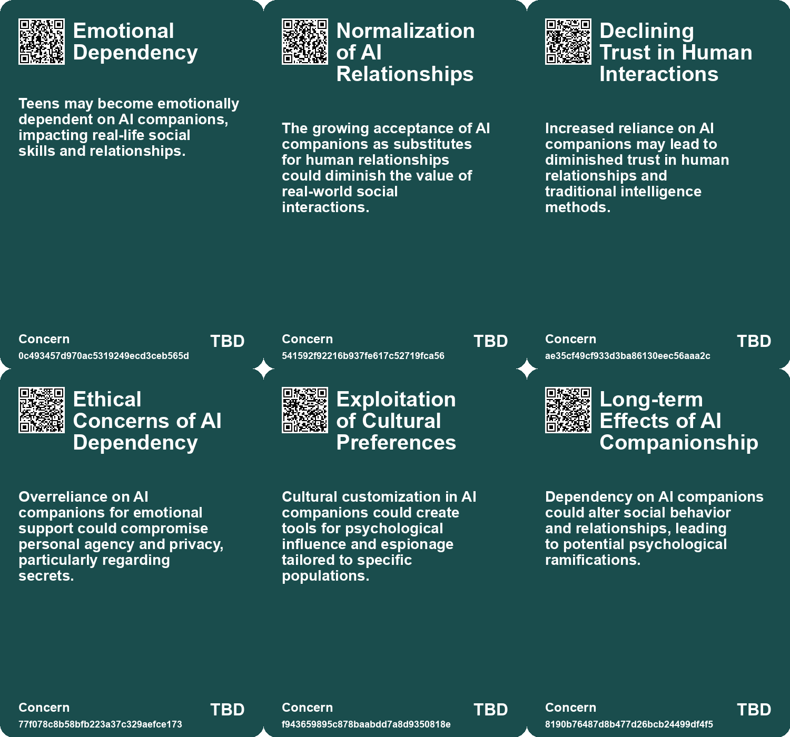
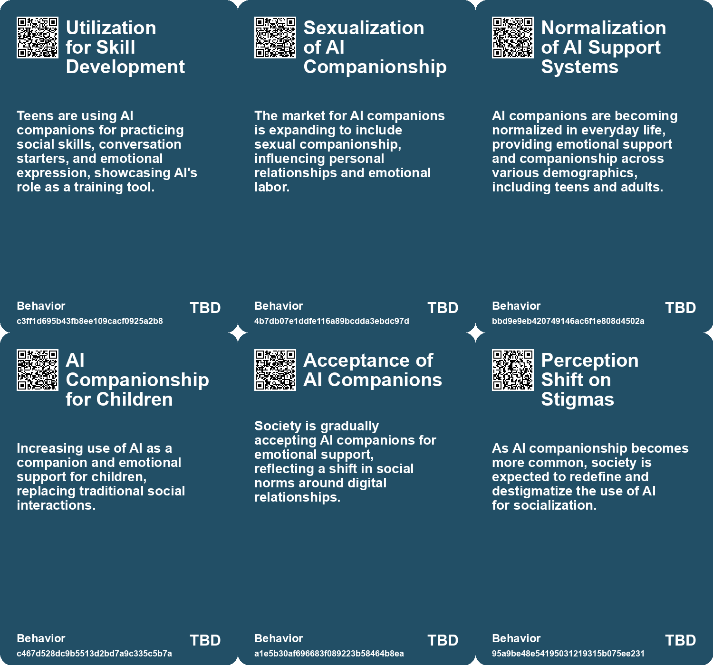
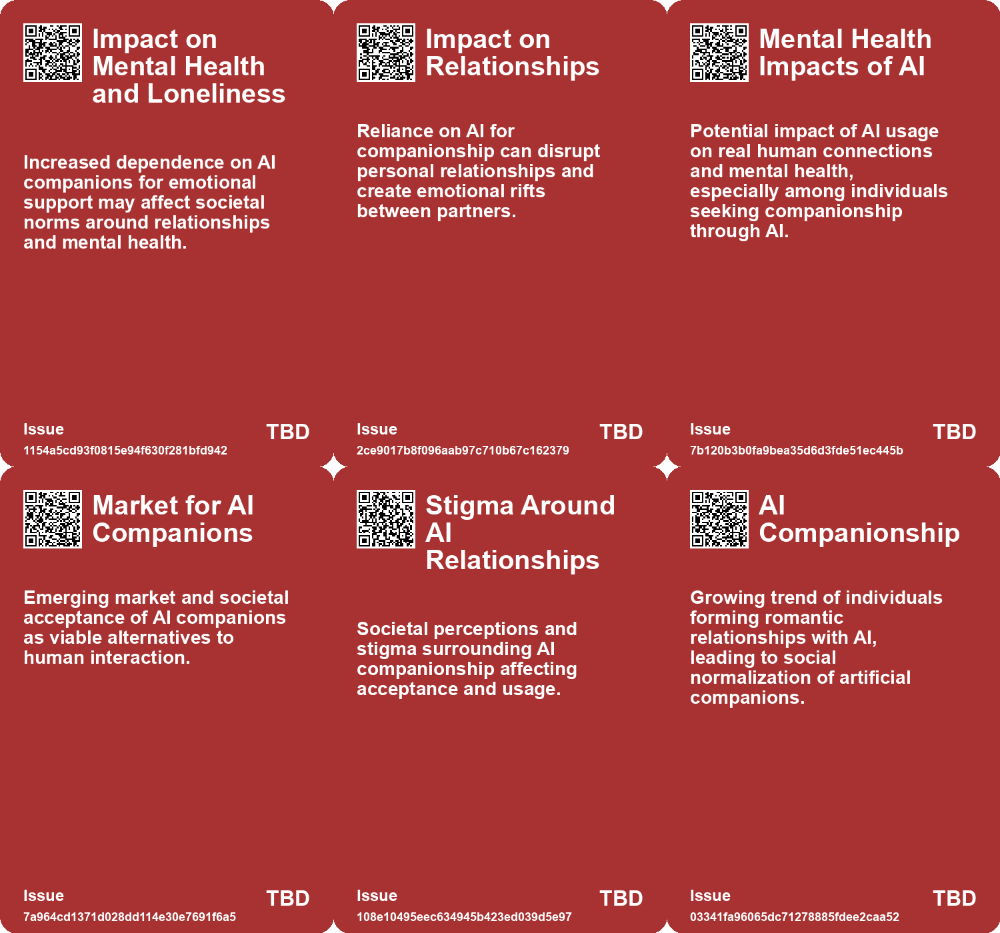
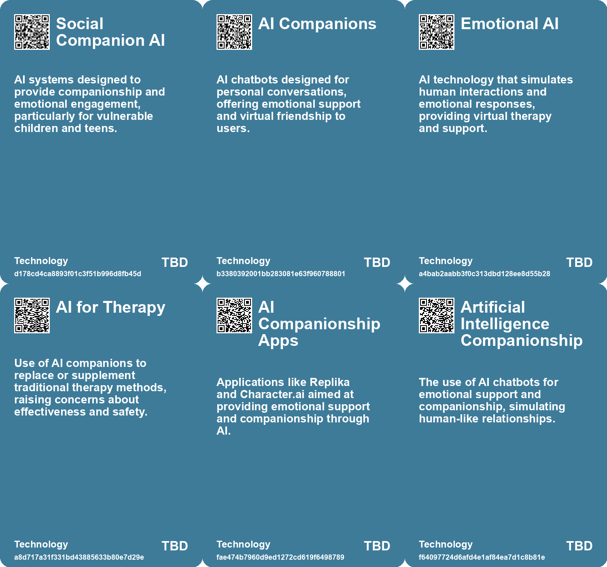

# *Topic*: the use of AI for companionship

# Summary

The rise of artificial intelligence (AI) is reshaping human interactions across various domains, from companionship to education and mental health. A significant number of U.S. teens are engaging with AI companions, with studies indicating that while many find these interactions satisfying, they still prefer human connections. Concerns about privacy, emotional dependency, and the potential for AI to replace genuine relationships are prevalent. Experts warn that reliance on AI for emotional support can exacerbate feelings of loneliness and diminish real-world socialization.

In the realm of education, AI is being integrated into classrooms, with tools designed to enhance learning experiences. However, there are fears that this reliance on technology may hinder critical thinking and social skills, particularly for students in underprivileged areas. The disparity in access to quality education raises ethical questions about the role of AI in perpetuating inequality.

The use of AI in mental health care is also gaining traction, with chatbots providing round-the-clock support. While these tools can offer comfort, they may inadvertently reinforce harmful thoughts due to a lack of critical feedback. The absence of clear regulations for AI therapy chatbots presents both opportunities and risks for users seeking emotional assistance.

AI's influence extends to the dating landscape, where concepts of AI dating concierges and virtual relationships are emerging. This shift raises concerns about the diminishing human connection and the potential normalization of relationships with AI companions. Critics argue that such trends could lead to a preference for digital interactions over face-to-face conversations, undermining genuine empathy and emotional connections.

The ethical implications of AI are further highlighted in discussions about its use in farming and animal welfare. While AI can improve monitoring and care for animals, there are concerns about exploitation and the erosion of the farmer-animal relationship. Regulations are needed to ensure that AI serves the interests of animal welfare rather than purely economic efficiency.

As businesses increasingly adopt AI technologies, there are mixed feelings about the impact on employment. While AI can automate mundane tasks and improve productivity, there are fears about job security and the psychological effects of monitoring automation. The integration of AI in business education aims to prepare graduates for a job market that values technology skills, but it also raises questions about the future of work and the balance between human and machine capabilities.

Finally, the phenomenon of individuals forming intense attachments to AI technologies, such as chatbots, is becoming more common. These relationships can lead to disconnection from reality and strained human relationships. Experts caution that the validation provided by AI can exacerbate existing psychological issues, highlighting the complexities of human-AI interactions and the need for a thoughtful approach to technology's role in society.

# Seeds

|    | name                                    | description                                                                                                  | change                                                                                                 | 10-year                                                                                                      | driving-force                                                                                                |
|---:|:----------------------------------------|:-------------------------------------------------------------------------------------------------------------|:-------------------------------------------------------------------------------------------------------|:-------------------------------------------------------------------------------------------------------------|:-------------------------------------------------------------------------------------------------------------|
|  0 | AI Companions as Emotional Support      | The use of AI companions for emotional support is a growing trend among teens.                               | A shift from seeking emotional support from peers to AI-driven solutions.                              | AI may become a normalized source of emotional support, altering traditional support mechanisms.             | Increased emotional needs among teens in a fast-paced, digitally connected world.                            |
|  1 | Normalization of AI Companionship       | AI companionship is becoming commonplace and accepted in society, especially among youth.                    | Shift from human interaction to AI as a primary source of companionship and support.                   | AI companions will be integrated into daily life and work, replacing some human roles.                       | The increasing emotional and practical demands of modern life favor AI companionship.                        |
|  2 | Sexuality in AI Companions              | Commercialization of AI companions that cater to sexual and emotional needs is rising.                       | Move towards acceptance and normalization of sexualized AI interactions in relationships.              | AI will play a role in personal and sexual relationships, influencing social norms.                          | The intersection of technology with human intimacy and societal needs for companionship.                     |
|  3 | Perception of Chatbots as Friends       | Users are forming emotional connections with AI chatbots, viewing them as companions rather than just tools. | Shift in user perception from chatbots as mere software to companions in emotional support.            | AI companions may gain a legitimate place in users' emotional support systems, reshaping relationships.      | The need for connection and support in a digitally-connected world fuels this perception.                    |
|  4 | AI for Emotional Support in Children    | AI tools like chatbots being used to provide emotional support and companionship to children.                | Shifting from direct parental support to reliance on AI for emotional companionship.                   | Children may prefer interactions with AI over peers or adults, affecting their social development.           | The need for companionship in single-child families and busy parental schedules drives this trend.           |
|  5 | Cultural Shift Towards AI Relationships | Growing acceptance of AI in personal relationships mimicking human interactions.                             | From human-centric relationships to acceptance of AI as legitimate partners.                           | AI companions may become commonplace, changing human relationship dynamics.                                  | A societal shift towards automation and technology reliance in daily life.                                   |
|  6 | Addictive AI Companionship              | AI companionship is becoming popular, raising concerns about addiction and its societal impact.              | Transitioning from human relationships to AI companions, potentially at the cost of human connections. | In 10 years, AI companions may become a primary source of emotional support for many individuals.            | The increasing loneliness and desire for companionship in society are driving the adoption of AI companions. |
|  7 | Loneliness as a Driver of AI Use        | Loneliness and boredom are significant factors prompting individuals to seek AI companionship.               | Transition from seeking human interaction to reliance on AI for emotional support.                     | Societal approaches to loneliness may evolve, integrating AI as a tool for companionship, not a replacement. | The increasing prevalence of loneliness in modern society drives demand for AI companions.                   |
|  8 | Rise in AI Companionship                | Increasing reliance on AI chatbots for companionship and emotional support.                                  | Shifting from human interactions to AI-based companionship for addressing loneliness.                  | A society where AI is the primary source of companionship, diminishing human relationships.                  | Growing loneliness and desire for constant availability in social interactions.                              |
|  9 | Artificial Intimacy                     | AI chatbots providing a simulated version of empathy and companionship.                                      | Transitioning from authentic human relationships to artificial emotional support.                      | A landscape where genuine empathy is undervalued and AI interactions dominate.                               | Convenience and perceived reliability of AI over human relationships.                                        |

# Concerns

|    | name                                      | description                                                                                                                                    |
|---:|:------------------------------------------|:-----------------------------------------------------------------------------------------------------------------------------------------------|
|  0 | Emotional Dependency                      | Teens may become emotionally dependent on AI companions, impacting real-life social skills and relationships.                                  |
|  1 | Normalization of AI Relationships         | The growing acceptance of AI companions as substitutes for human relationships could diminish the value of real-world social interactions.     |
|  2 | Declining Trust in Human Interactions     | Increased reliance on AI companions may lead to diminished trust in human relationships and traditional intelligence methods.                  |
|  3 | Ethical Concerns of AI Dependency         | Overreliance on AI companions for emotional support could compromise personal agency and privacy, particularly regarding secrets.              |
|  4 | Exploitation of Cultural Preferences      | Cultural customization in AI companions could create tools for psychological influence and espionage tailored to specific populations.         |
|  5 | Long-term Effects of AI Companionship     | Dependency on AI companions could alter social behavior and relationships, leading to potential psychological ramifications.                   |
|  6 | Normalization of Artificial Relationships | As A.I. companionship becomes mainstream, society may struggle with defining real versus artificial relationships, impacting social norms.     |
|  7 | Atrophy of Human Relationships            | Excessive reliance on AI for companionship may weaken personal connections between people, affecting social skills and emotional intelligence. |
|  8 | Consent and Power Imbalance               | The dynamic between humans and AI may obscure meaningful consent in relationships, especially given the addictive nature of AI companions.     |
|  9 | Erosion of Empathy                        | Increasing reliance on AI for companionship may undermine genuine empathy and interpersonal connections.                                       |

# Cards

## Concerns

## Behaviors

## Issue

## Technology

# Links

* [Rising Use of AI Chatbots Among Children Sparks Concerns Over Friendship and Mental Health Risks](https://futures.kghosh.me/7a05cd6af09dd8274d14be8e04717bac)
* [The Future of Espionage: The Rise of AI Companions and Their Impact on Intelligence Operations](https://futures.kghosh.me/d69000a9cb92fc175a8a1dfb042622e2)
* [Exploring the Risks of Heavy Chatbot Use on Mental Health and Social Interactions](https://futures.kghosh.me/424dd84488f34cb7d735777fe34b584e)
* [The Future of AI Agents: Transforming Software Interaction and Society](https://futures.kghosh.me/f9ab247df033c3d903c94289a8687845)
* [Exploring A.I. Romance: Ayrin's Relationship with ChatGPT and the Future of Artificial Companionship](https://futures.kghosh.me/fb7bff9fd47bc5ee71e96591add37ae8)
* [The Role of Social-Emotional AI: Bridging or Widening the Gap in Human Connection?](https://futures.kghosh.me/8e191b6221caa8d9f27b19268ab8a048)
* [The Transformative Potential of AI: Revolutionizing Education, Healthcare, and Global Equity](https://futures.kghosh.me/2449c2fc4b8afc7e268db4987fa821e5)
* [Understanding Teen Engagement with AI Companions: Insights from a Common Sense Media Study](https://futures.kghosh.me/fae9ccaa96ac4f072579a8b1dee9fa4a)
* [AI's Potential to Enhance Human Evolution and Self-Actualization](https://futures.kghosh.me/8893f2e58b95e1993a5f8a1af090eedd)
* [Addressing the Risks of AI Companionship: Addiction, Regulation, and Human Dignity](https://futures.kghosh.me/4611565d14a05789e2efc6fafc563f58)
* [The Resistance to AI: Perspectives on Its Ethical, Environmental, and Creative Implications](https://futures.kghosh.me/d6b9f82c326ceb5994d94d5d5d68f0ee)
* [The Ethical Implications of AI in Modern Farming: Balancing Efficiency and Animal Welfare](https://futures.kghosh.me/7aa357540401ea845962adbd36627a80)
* [Thriving in an AI Era: Embracing, Adapting, and Complementing Technology](https://futures.kghosh.me/23a3410059759ba4214235628d4ebd4b)
* [Zuckerberg Discusses AI Companions Amid Criticism of Meta's Practices](https://futures.kghosh.me/4179c8c3b7bcd1d787575f0d16e73d0c)
* [The Integration of AI in Business School Curriculums to Enhance Graduate Competitiveness](https://futures.kghosh.me/bc232b227c806ac26adf2b99fa4cff9d)
* [MIT Researchers Develop AI Assistant to Enhance Teamwork in Critical Missions](https://futures.kghosh.me/d35cc2611e8b6e8e143446ca4ee22e19)
* [Study Reveals Teens Use AI Companions but Prefer Real Human Interaction](https://futures.kghosh.me/43924b182fd09138a38642c6f8ecb9d8)
* [The Dangers of Relying on AI Chatbots for Companionship and Connection](https://futures.kghosh.me/729afaa8f8699c39b8d4b175d032fa41)
* [Exploring AI's Implications: Insights from a Discussion in New Zealand on Artificial Intelligence and Society](https://futures.kghosh.me/7bdbb32950c9d265f6ec455d964973fe)
* [Reimagining Social Systems: The Role of AI in Enhancing Human Care and Management Consulting](https://futures.kghosh.me/58f70468586e816cc19aaf2bfbbf8f5b)
* [YouAI's Book AI: Transforming Books into Conversational Chatbots for Enhanced Reader Engagement](https://futures.kghosh.me/52ee8c1b0291daa92b97c28225a816b6)
* [Exploring Emotional Connections with Future Selves Through AI Chatbots: Insights from MIT's Future You Project](https://futures.kghosh.me/65cf4789fa6df6abeb1b059b62894622)
* [Microsoft Launches Autonomous AI Agents to Boost Productivity and Improve Business Efficiency](https://futures.kghosh.me/ccb5695c1b392857d55b45a52b0b62e6)
* [The Impact of AI and Automation on Filipino Workers in Robot-Controlled Jobs](https://futures.kghosh.me/6be02959e12eeea2448c7a3feb28a372)
* [The Rise of AI Chatbots in China's Mental Health Landscape: Opportunities and Risks](https://futures.kghosh.me/70e9fcd5fc1d2dd04ae1df8b2628194d)
* [AI-Fueled Delusions: The Disconnection Between Reality and Spiritual Fantasies](https://futures.kghosh.me/6515dbf29262169e3de5e2539171fd96)
* [Whitney Wolfe Herd Envisions AI Dating Concierge Amid 'Black Mirror' Comparisons](https://futures.kghosh.me/e4c05fa0d5dacdd8fbb7f4e0b70a32a0)
* [The Impact of AI in Chinese Education: Promise and Concerns](https://futures.kghosh.me/5374f9d1b84138f1c928c0e7fd727877)