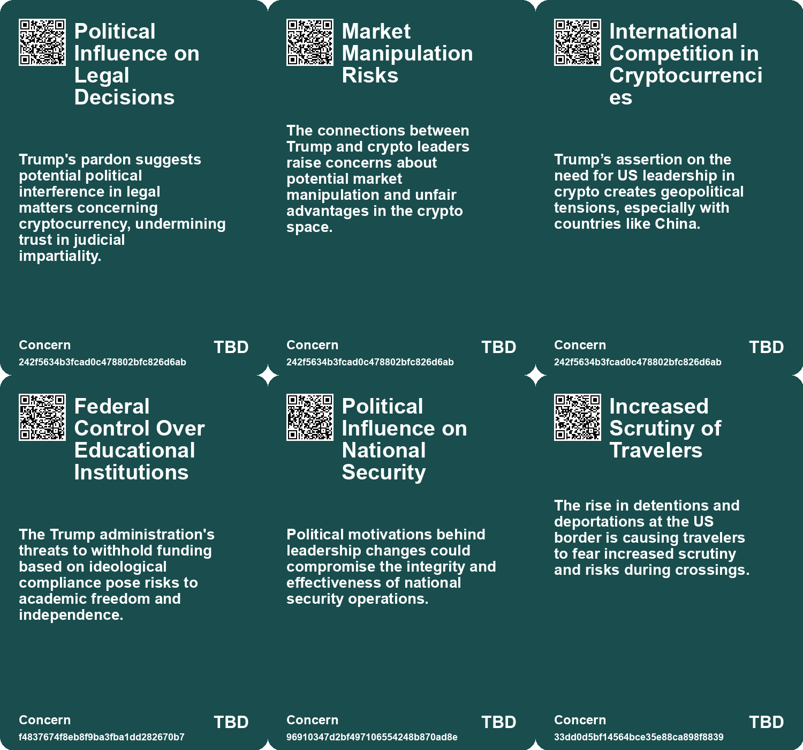
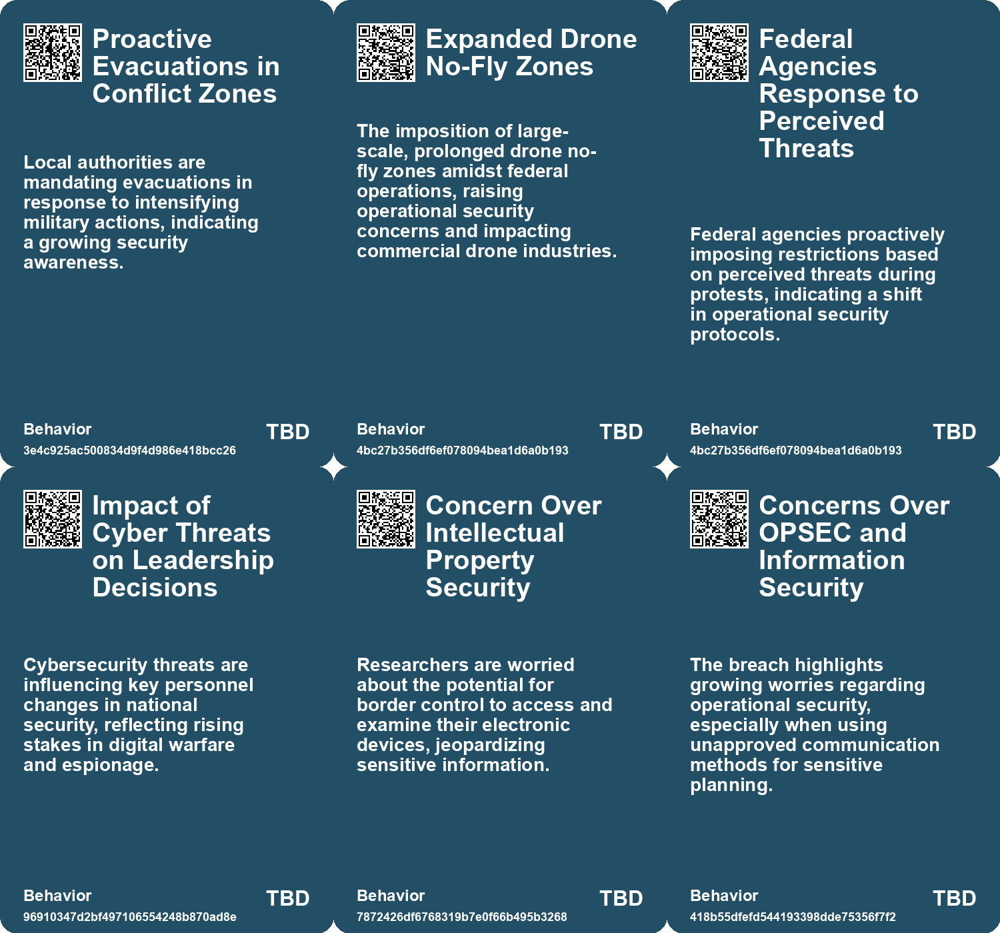
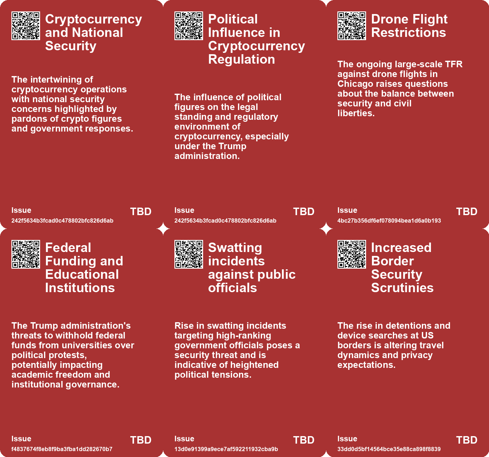
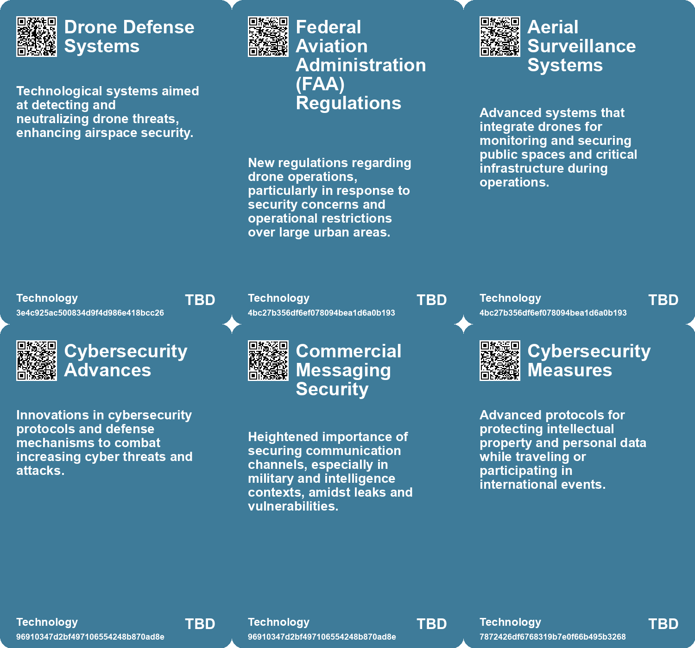

# *Topic*: trump security

# Summary

The intersection of cybersecurity and national security remains a pressing concern, particularly in light of recent decisions by the Trump administration. The disbanding of key cybersecurity advisory boards has raised alarms among experts, who warn that this could weaken the nation’s defenses against increasing cyber threats, especially from China. In contrast, the Biden administration has introduced a national cybersecurity strategy aimed at enhancing the country’s defenses and holding companies accountable for software security. This ongoing battle over cybersecurity reflects broader tensions in U.S. governance and the implications of leadership changes.

Political discourse in the U.S. has devolved into a state of immaturity, with leaders often resorting to crude language and trolling rather than engaging in serious dialogue. This trend is seen as a direct consequence of Donald Trump's influence, which has fostered a politically immature environment. The decline in civility is mirrored in the actions of government officials, who have increasingly adopted authoritarian measures, such as imposing reporting restrictions on journalists and targeting dissenting voices through initiatives like the "Catch and Revoke" program aimed at monitoring pro-Palestinian sentiments among visa-holding students.

The relationship between technology and governance is also under scrutiny, particularly regarding the influence of tech billionaires on political power. The emergence of "broligarchs" reflects a shared ideology with Trump that favors minimal regulation and unchecked power. Their aspirations to create independent "startup cities" raise concerns about the erosion of democratic principles and the potential risks to society. This dynamic is further complicated by the increasing use of biometric technology in air travel, which, while enhancing security, raises significant privacy and ethical questions.

The treatment of immigrants and the enforcement of immigration policies have become focal points of political contention. Recent ICE raids in Democratic cities have sparked criticism, highlighting the disconnect between the administration's rhetoric and its actions. The heightened scrutiny at U.S. borders has led to increased detentions and questioning of travelers, particularly those with ties to marginalized communities. This environment of fear and uncertainty has significant implications for international collaboration and the safety of individuals crossing borders.

In the realm of military and defense, the Trump administration's decisions have raised concerns about national security. The halt of essential support for Ukraine's F-16 aircraft and the dismissal of key military leaders signal a potential shift in U.S. defense strategy. Critics argue that these changes could undermine the operational effectiveness of U.S. military assets and compromise the country’s ability to respond to global threats.

The ongoing debate over free speech and government oversight is exemplified by the Pentagon's new reporting restrictions and the State Department's AI monitoring program. These initiatives reflect a broader trend of policing speech and raising concerns about transparency and accountability in governance. The implications of these policies extend beyond immediate political contexts, affecting the fundamental rights of citizens and the integrity of democratic institutions.

Finally, the evolving landscape of international relations is marked by Trump's controversial statements and actions regarding allies and adversaries alike. His misidentification of Spain as a BRICS member and the administration's focus on Greenland as a strategic asset underscore the complexities of U.S. foreign policy. As geopolitical tensions rise, particularly with Russia and China, the implications of these decisions will shape the future of U.S. engagement on the global stage.

# Seeds

|    | name                                        | description                                                                                                     | change                                                                                                 | 10-year                                                                                                          | driving-force                                                                                        |
|---:|:--------------------------------------------|:----------------------------------------------------------------------------------------------------------------|:-------------------------------------------------------------------------------------------------------|:-----------------------------------------------------------------------------------------------------------------|:-----------------------------------------------------------------------------------------------------|
|  0 | Political Pressure on Media                 | Trump's support for new Pentagon rules showcases ongoing political pressure on journalists.                     | Change from press independence to increased government influence and pressure.                         | In 10 years, political motives could further erode independent journalism and press freedom.                     | Political agendas increasingly seek to limit dissent and control media narratives.                   |
|  1 | Increased Federal Control Over Universities | The Trump administration's threat to cut funding and enforce policy changes at universities.                    | Shift from academic autonomy to increased federal influence in university operations.                  | Universities may operate under stricter government regulations, influencing their policies and academic freedom. | Political power dynamics and ongoing debates around campus speech and diversity issues.              |
|  2 | Intellectual Property Concerns              | Heightened worries about intellectual property theft at the US border.                                          | Change from general acceptance of travel to heightened vigilance and avoidance.                        | Increased encryption and protection methods for research materials before travel.                                | Increased reports of device inspections causing apprehension among researchers.                      |
|  3 | Executive Orders on Free Speech             | Trump's executive actions may broadly define and restrict dissenting ideologies.                                | Shift from free speech protection to potential censorship based on subjective definitions of ideology. | In 10 years, legal definitions of speech could become more ambiguous and restrictive.                            | Cultural battles over free speech and political correctness.                                         |
|  4 | Disbanding Cyber Advisory Boards            | Trump administration's removal of key cybersecurity advisory boards signals a shift in national security focus. | Shift from active oversight and investigation of cyber threats to reduced advisory support.            | Potential increase in successful cyberattacks on US infrastructure due to lack of expert advisory input.         | Political decisions prioritizing different aspects of governance over cybersecurity preparedness.    |
|  5 | Change in National Cybersecurity Strategy   | The shift in focus from cybersecurity under Biden back to a more lax approach under Trump.                      | From a comprehensive cybersecurity strategy to potential neglect of cyber defense measures.            | Possible regression in US cybersecurity capabilities and increased risk of foreign cyber dominance.              | Shifts in political leadership and associated policy priorities impact national security strategies. |
|  6 | U.S. Military Interest in Greenland         | Trump's administration shows renewed interest in Greenland for military control and economic security.          | Shift from passive interest to potential military control of Greenland.                                | Greenland could become a U.S. military stronghold, altering Arctic geopolitics.                                  | Geopolitical competition in the Arctic and desire for economic resources.                            |
|  7 | Economic Coercion as a Tool                 | Trump's rhetoric includes threats of economic coercion for territorial ambitions.                               | From diplomatic negotiations to potential use of economic force for territorial claims.                | Economic leverage could reshape international relations in the Arctic.                                           | Desire for control over strategic territories and resources.                                         |
|  8 | Militarization of Politics                  | Military forces are used for political repression under Trump's orders.                                         | Shift from civilian oversight to military involvement in governance.                                   | Potential increase in military coups and authoritarian governance globally.                                      | Perception of the military as a tool for political power rather than national defense.               |
|  9 | Rising protectionism                        | Trump's tariff threats indicate a shift towards more protectionist economic policies.                           | From free trade agreements to increasing tariffs and protectionist measures.                           | Global trade dynamics could shift towards nationalism, impacting economies worldwide.                            | Economic nationalism and the desire to protect domestic industries from foreign competition.         |

# Concerns

|    | name                                           | description                                                                                                                                      |
|---:|:-----------------------------------------------|:-------------------------------------------------------------------------------------------------------------------------------------------------|
|  0 | Political Influence on Legal Decisions         | Trump's pardon suggests potential political interference in legal matters concerning cryptocurrency, undermining trust in judicial impartiality. |
|  1 | Market Manipulation Risks                      | The connections between Trump and crypto leaders raise concerns about potential market manipulation and unfair advantages in the crypto space.   |
|  2 | International Competition in Cryptocurrencies  | Trump’s assertion on the need for US leadership in crypto creates geopolitical tensions, especially with countries like China.                   |
|  3 | Federal Control Over Educational Institutions  | The Trump administration's threats to withhold funding based on ideological compliance pose risks to academic freedom and independence.          |
|  4 | Political Influence on National Security       | Political motivations behind leadership changes could compromise the integrity and effectiveness of national security operations.                |
|  5 | Increased Scrutiny of Travelers                | The rise in detentions and deportations at the US border is causing travelers to fear increased scrutiny and risks during crossings.             |
|  6 | Border Control Interference with Personal Data | Increased scrutiny and potential detention of travelers based on their electronic devices raises privacy concerns.                               |
|  7 | Judicial Impartiality Concerns                 | The involvement of justices appointed by Trump raises concerns about impartiality in politically charged cases.                                  |
|  8 | Escalation of Trade Tariffs                    | Trump's threat of 100% tariffs on BRICS conveys a potential rise in trade tensions that could destabilize economies.                             |
|  9 | Impact on NATO Cohesion                        | Trump's pressure for increased defense spending may strain NATO relationships and affect global security dynamics.                               |

# Cards

## Concerns

## Behaviors

## Issue

## Technology

# Links

* [Impact of U.S. Support Cut on Ukrainian Air Force and Shift to French Jamming Capabilities](https://futures.kghosh.me/d0b2444600e030a96a7559ffd5b18fb2)
* [A Deep Dive into the Swatting Calls Targeting High-Level Officials in 2023](https://futures.kghosh.me/13d0e91399a9ece7af592211932cba9b)
* [The Impact of Facial Recognition Technology on Airport Security and Passenger Experience](https://futures.kghosh.me/53c3e72c4d0a4687bf4652b5f6a5076a)
* [Biden Administration Unveils New Cybersecurity Strategy to Combat Growing Threats](https://futures.kghosh.me/1eaefdcf11b24d5f443b5f4e7645e0a5)
* [Russell Vought's Ideological War Against Government and the Rise of the Addiction Economy](https://futures.kghosh.me/619829bd081d7da919912e4f63d2549c)
* [Transportation Secretary Appointed Interim NASA Head Amid Controversy and Criticism](https://futures.kghosh.me/3fdf7ee32ce13641089dc836ce2d6a86)
* [Donald Trump's AI Strategy: Canada and Greenland as Key Resources for U.S. Interests](https://futures.kghosh.me/f040875d7385a703680ebda2b0ec5cf5)
* [Navigating Increased Border Scrutiny Under the New Trump Administration: Device Privacy Tips](https://futures.kghosh.me/33dd0d5bf14564bce35e88ca898f8839)
* [Accidental Inclusion in Trump's Military Chat Reveals National Security Breach](https://futures.kghosh.me/418b55dfefd544193398dde75356f7f2)
* [Trump's Executive Order Aims to Reshape Funding and Ideology at the Smithsonian Institution](https://futures.kghosh.me/60a9f0b6f3d7e29e80d2e2f676472288)
* [Trump Administration's Cybersecurity Advisory Boards Dismantled Amid Rising Threats from China](https://futures.kghosh.me/6f7b4e8be445b769c44531f844aabe0f)
* [ICE Raids in New Jersey: Economic and Emotional Impact on Blue Cities](https://futures.kghosh.me/60448df300fbb285af6c336808c0518c)
* [CIA Endorses Signal Messaging App Amidst Encryption Debate and Security Concerns](https://futures.kghosh.me/19dc40a7b4216af1f98e8e766a7f37f0)
* [Journalists Leave Pentagon in Protest of New Reporting Restrictions](https://futures.kghosh.me/9b3eafe7995484893e92c8e6b30b4c7d)
* [President Trump Fires NSA and Cyber Command Chief, Prompting National Security Concerns](https://futures.kghosh.me/96910347d2bf497106554248b870ad8e)
* [Trump, Musk, and the Risky Overhaul of Social Security by DOGE](https://futures.kghosh.me/0dcc4230d999a62397529a7eadbc0197)
* [EU and NATO Mobilize for Enhanced Drone Defense Amid Ongoing Russian Threats in Ukraine](https://futures.kghosh.me/3e4c925ac500834d9f4d986e418bcc26)
* [The Decline of Political Maturity in America: A Call for Responsible Citizenship](https://futures.kghosh.me/ec5b543a174bedb5387b497cc449e5b9)
* [The Dark Ideology Behind Tech Billionaires' Support for Trump](https://futures.kghosh.me/c505aff1af70de6c03cbbf7441fe07d0)
* [U.S. State Department Launches AI Program to Target Pro-Palestinian Students](https://futures.kghosh.me/bbf4f45a2e1fc5ce42e06ab1b2450c4e)
* [Trump Confuses Spain with BRICS, Threatens Tariffs Amid NATO Spending Discussion](https://futures.kghosh.me/985bb3bd41d13e99728c54c411715f7f)
* [Trump Administration Nears $500 Million Deal with Harvard Amid Controversial Policies and Protests](https://futures.kghosh.me/f4837674f8eb8f9ba3fba1dd282670b7)
* [Youthful Conservatism: Celebrations and Shifts in Trump's Second Inauguration](https://futures.kghosh.me/072874a8428401d0b55b1c740a500dd1)
* [Trump Claims Ignorance of Crypto Tycoon Zhao After Granting Pardon Amid Controversy](https://futures.kghosh.me/242f5634b3fcad0c478802bfc826d6ab)
* [Trump's Ambitions for Greenland: Strategic Importance and Military Implications](https://futures.kghosh.me/209f8117ee90a9f43ad969632cd69ef0)
* [Impact of U.S. Travel Restrictions on International Academics and Research Collaborations](https://futures.kghosh.me/7872426df6768319b7e0f66b495b3268)
* [FAA Imposes Extensive Drone No-Fly Zone Amid ICE Operation in Chicago](https://futures.kghosh.me/4bc27b356df6ef078094bea1d6a0b193)
* [Coup in America: Elon Musk's Junta and the Fall of Democracy](https://futures.kghosh.me/ad3b88c11d65b5bba9f1a7e7daf4bcfb)
* [Supreme Court Grants Former Presidents Broad Immunity, Impacting Trump's Trial Before Election](https://futures.kghosh.me/5cbf19bc5097424a9bd615c891be2a12)