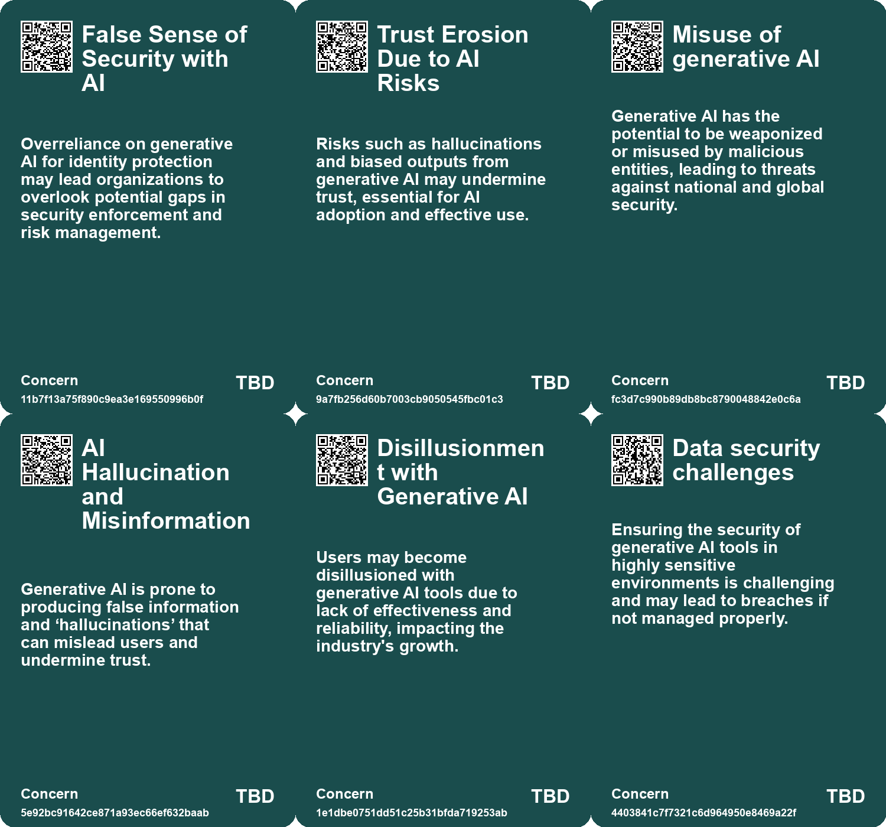
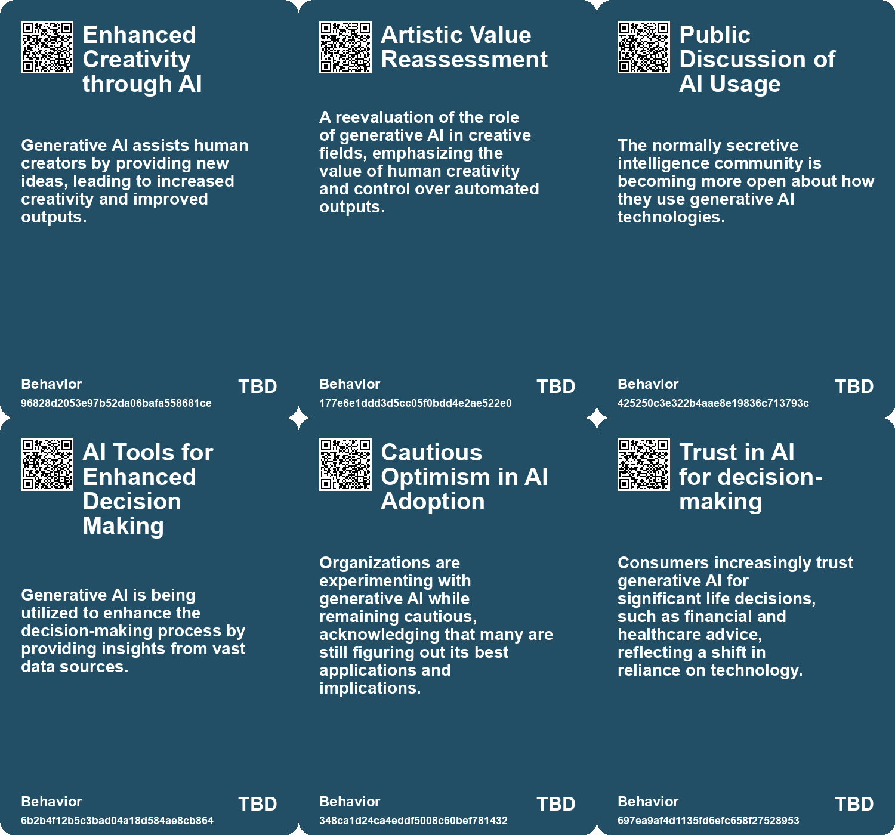
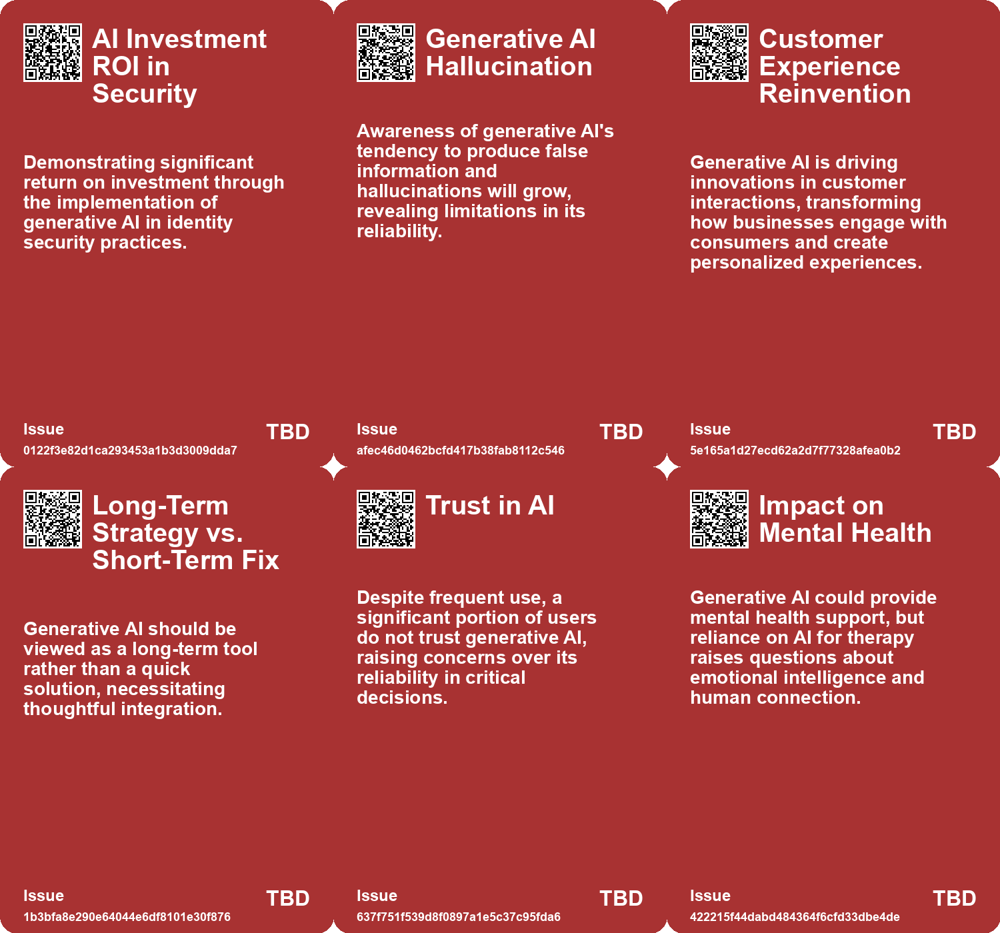
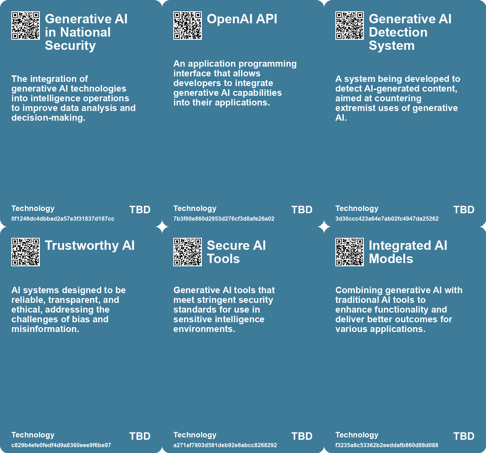

# *Topic*: Trust in Generative AI

# Summary

Generative AI is reshaping various sectors, presenting both opportunities and challenges. Its potential to enhance productivity and creativity is evident, particularly in business and creative fields. Companies are exploring how to integrate generative AI into their workflows, with strategies focusing on deploying AI for productivity gains, reshaping processes, and inventing new customer experiences. However, many organizations struggle with a lack of clear strategies and understanding of how to effectively implement AI.

The impact of generative AI on human creativity is significant. Studies show that access to AI-generated ideas can increase creativity among writers, particularly those who may not consider themselves highly creative. Yet, there are concerns that reliance on AI may lead to homogenized outputs, limiting the diversity of creative expression. This phenomenon, termed “The Great Same-ning,” highlights the risk of AI-generated content becoming repetitive and lacking originality.

Trust in AI remains a critical issue. The rise of generative AI has raised concerns about misinformation, particularly as AI systems can produce content that closely resembles human creations. The potential for disinformation is alarming, with predictions that a significant portion of online content could be artificially generated in the coming years. Addressing these challenges requires a combination of regulatory measures and technological solutions, such as cryptographic signatures to verify the authenticity of AI-generated content.

The intelligence community is increasingly adopting generative AI for tasks like data analysis and content generation. While this technology offers valuable insights, there are significant risks associated with its use, including the potential for inaccurate information that could impact national security. The development of secure, air-gapped AI models for intelligence services underscores the need for responsible deployment in sensitive environments.

As generative AI becomes more prevalent, ethical considerations surrounding data privacy and intellectual property are gaining attention. Companies must navigate the complexities of copyright law and data usage, ensuring that creators are fairly compensated and that their work is not exploited without consent. The call for clear guidelines and fair use considerations is becoming more urgent as AI-generated content proliferates.

The societal implications of generative AI are profound. While it has the potential to enhance productivity and economic growth, it also poses risks of job displacement and increased loneliness. The technology could disrupt various industries, including healthcare and education, leading to significant shifts in the workforce. As individuals seek AI companionship to combat feelings of isolation, the need for innovative regulatory approaches to mitigate potential harms becomes clear.

Finally, the use of generative AI by extremist groups raises serious concerns about the spread of propaganda and misinformation. The ability of these groups to leverage AI tools for recruitment and messaging poses challenges for tech companies and regulators alike. However, there are also opportunities to use AI to counter these threats, highlighting the dual-edged nature of this technology. 

The landscape of generative AI is rapidly evolving, and its implications for creativity, trust, ethics, and security will continue to unfold in the coming years.

# Seeds

|    | name                                  | description                                                                                    | change                                                                                                       | 10-year                                                                                                           | driving-force                                                                                              |
|---:|:--------------------------------------|:-----------------------------------------------------------------------------------------------|:-------------------------------------------------------------------------------------------------------------|:------------------------------------------------------------------------------------------------------------------|:-----------------------------------------------------------------------------------------------------------|
|  0 | GenAI's Role in Enhancing Creativity  | Generative AI is being used to augment human creativity, especially in creative writing.       | Transition from traditional creativity methods to AI-assisted creativity.                                    | In ten years, GenAI may be a standard tool for writers and artists, fundamentally changing creative processes.    | The demand for innovative and diverse creative output in a competitive landscape.                          |
|  1 | Generative AI's Impact on Industries  | Generative AI is transforming various industries, indicating its growing significance.         | From niche applications to widespread integration across multiple sectors.                                   | In 10 years, generative AI will be a foundational technology across all major industries.                         | The demand for innovation and efficiency in business processes and services.                               |
|  2 | GenAI's Role in Enhancing Creativity  | Generative AI is being used to augment human creativity, especially in creative writing.       | Transition from traditional creativity methods to AI-assisted creativity.                                    | In ten years, GenAI may be a standard tool for writers and artists, fundamentally changing creative processes.    | The demand for innovative and diverse creative output in a competitive landscape.                          |
|  3 | Public Discussion of AI Usage         | Greater public discourse around intelligence agency use of generative AI.                      | Transition from secrecy to transparency regarding AI applications in intelligence.                           | Public trust may increase as agencies become more open about AI usage and its benefits.                           | The societal push for transparency and accountability in government operations.                            |
|  4 | Security Standards for AI Tools       | Development of rigorous security standards for generative AI tools in intelligence.            | From limited, unsecured AI tools to robust, compliant solutions for sensitive environments.                  | A new generation of secure AI tools could emerge, tailored for governmental use, ensuring safety and reliability. | The critical need for secure data handling in intelligence work.                                           |
|  5 | Rise of Cryptographic Trust Solutions | Adoption of cryptographic methods to enhance trust in AI-generated content.                    | Shift from blind trust in AI outputs to verified, cryptographically signed results.                          | In 10 years, cryptographic signatures may become standard for all digital content, ensuring authenticity.         | The need for trust in AI technologies, driven by increasing concerns over misinformation and manipulation. |
|  6 | Emergence of New Business Models      | Generative AI is enabling companies to create new services and offerings.                      | Evolving from traditional business models to innovative, AI-powered models that enhance customer engagement. | New business models will dominate the market, driven by AI capabilities and personalized customer experiences.    | The quest for competitive advantage and enhanced customer value propositions.                              |
|  7 | Ambivalence Towards AI                | Generative AI evokes mixed feelings of promise and peril among creators and users.             | Shift from excitement about AI's potential to concern over its risks and job displacement.                   | In 10 years, a more balanced perspective on AI, focusing on collaboration and ethical use, may emerge.            | Growing awareness of AI's impact on jobs and personal well-being is driving this ambivalence.              |
|  8 | Mistrust in Generative AI             | People show skepticism towards generative AI in high-value areas.                              | Shift from mistrust in valuable applications to increased reliance on trustworthy AI.                        | In 10 years, generative AI may be widely trusted and integrated into critical business processes.                 | The need for efficiency and innovation in business drives acceptance of AI technologies.                   |
|  9 | Trustworthiness as a Key Concern      | Trust in AI's outputs is crucial, with emphasis on provenance and traceability of information. | From blind trust in AI outputs to a demand for verifiable and trustworthy information.                       | AI systems may be designed to prioritize transparency and accuracy, fostering user trust.                         | Public demand for accountability and reliability in information sources drives this focus.                 |

# Concerns

|    | name                                      | description                                                                                                                                              |
|---:|:------------------------------------------|:---------------------------------------------------------------------------------------------------------------------------------------------------------|
|  0 | False Sense of Security with AI           | Overreliance on generative AI for identity protection may lead organizations to overlook potential gaps in security enforcement and risk management.     |
|  1 | Trust Erosion Due to AI Risks             | Risks such as hallucinations and biased outputs from generative AI may undermine trust, essential for AI adoption and effective use.                     |
|  2 | Misuse of generative AI                   | Generative AI has the potential to be weaponized or misused by malicious entities, leading to threats against national and global security.              |
|  3 | AI Hallucination and Misinformation       | Generative AI is prone to producing false information and ‘hallucinations’ that can mislead users and undermine trust.                                   |
|  4 | Disillusionment with Generative AI        | Users may become disillusioned with generative AI tools due to lack of effectiveness and reliability, impacting the industry's growth.                   |
|  5 | Data security challenges                  | Ensuring the security of generative AI tools in highly sensitive environments is challenging and may lead to breaches if not managed properly.           |
|  6 | Dependence on commercial AI solutions     | Relying on commercial generative AI tools could expose intelligence agencies to security vulnerabilities inherent in third-party software.               |
|  7 | Mistrust in Generative AI                 | People exhibit mistrust in generative AI where it could provide significant value, potentially holding back beneficial innovations.                      |
|  8 | Overtrust in AI where it lacks competency | Individuals may place excessive trust in generative AI technologies in areas where they are not competent, risking poor decision-making.                 |
|  9 | Ethical Implications of Generative AI     | Generative AI raises ethical concerns about authorship and ownership of content, particularly in ensuring human contributions are recognized and valued. |

# Cards

## Concerns

## Behaviors

## Issue

## Technology

# Links

* [The Impact of Generative AI on Human Creativity in Story Writing](https://futures.kghosh.me/de55bd2afb2b9bfadae84d2a0fb8b4e8)
* [The Dual-edged Sword of AI: Misinformation and Societal Threats in the Age of Advanced Language Models](https://futures.kghosh.me/9787333cafcd0252d71a9bff845ad093)
* [Navigating Generative AI: The Importance of Custom Research for Effective Adoption](https://futures.kghosh.me/ed237776f4979a2104f62c4985fbeba8)
* [Generative AI in 2023: Hype, Setbacks, and Future Challenges Ahead in 2024](https://futures.kghosh.me/cab076719e173aa2eee9c4773a4559cd)
* [The Importance of Explainable AI: Building Trust in Artificial Intelligence for Organizations](https://futures.kghosh.me/afe2219279811b5905b43a7731e95da7)
* [The Impact of Generative AI and Autonomous Agents on Business Value Creation and Trust Issues](https://futures.kghosh.me/15d4ec180189ca1739398f516844cefb)
* [The Impact of Generative AI on Human Creativity in Story Writing](https://futures.kghosh.me/e2006a4269f097491cc98583df08a47d)
* [The Uncertain Future of Generative AI: Hype vs. Reality and Its Implications](https://futures.kghosh.me/f35afe43c2e3b465b8ed4b00023cb0ac)
* [Navigating the Challenges and Opportunities of Generative AI in Business](https://futures.kghosh.me/6a8633d1148eb442435b9f6bca735ad3)
* [Addressing the Risks of AI Companionship: Addiction, Regulation, and Human Dignity](https://futures.kghosh.me/4611565d14a05789e2efc6fafc563f58)
* [Navigating the Dual Impact of Generative AI on Business and Society](https://futures.kghosh.me/aa811fcb765939e9ead9542accd38a5b)
* [Generative AI: Transforming Identity Security and Governance Amidst Rising Threats](https://futures.kghosh.me/06af6687242788a345b934758b3a0705)
* [Enhancing Trust in AI Through Modern Cryptographic Techniques](https://futures.kghosh.me/9ec84987bda1e0a307c2c31c6ed2462d)
* [Microsoft Unveils Air-Gapped AI Model for U.S. Intelligence Services to Enhance Data Security](https://futures.kghosh.me/4c2c25b1e6fe59720b8220e3b1a21ba4)
* [The Urgent Need for Ethical AI Regulations Amid Rapid Development and Deployment](https://futures.kghosh.me/382e9ebc1e518ee49e541da1e6b5f8af)
* [Navigating the Challenges of Regulating Artificial Intelligence in a Rapidly Evolving Landscape](https://futures.kghosh.me/58612e45effab1e47df9a86b14dfae85)
* [U.S. Intelligence Community's Integration of Generative AI for Enhanced Operations](https://futures.kghosh.me/dc6864119c8835a3637517b2a4fe9fbb)
* [The Rising Threat of Generative AI in Extremist Propaganda and Child Exploitation](https://futures.kghosh.me/4aae935ffedd7227301fe1eb6647d69f)
* [Thriving in an AI Era: Embracing, Adapting, and Complementing Technology](https://futures.kghosh.me/23a3410059759ba4214235628d4ebd4b)
* [Navigating the Risks of Generative AI: Data Privacy and Intellectual Property Challenges](https://futures.kghosh.me/3c44301c056cd97da8e2fee49627b03e)
* [Exploring the Risks of Homogeneity in AI Generated Content and Its Impact on Creativity](https://futures.kghosh.me/9f228766187c6c10eeddbda5a6dbbe7b)
* [Europol Report Warns of Rising AI-Generated Content and Disinformation Risks](https://futures.kghosh.me/8900fb75566c9d1b008c2e2c36f7a8e2)
* [Unlocking the Potential of Generative AI: Strategies for Business Impact](https://futures.kghosh.me/cff1a5331e2a0947c902edfd1aa39f6a)
* [The Impact of Generative AI on Creative Professions and the Need for New Data Rights Frameworks](https://futures.kghosh.me/858dac884c8fe7dfa6fc0c2cf093e97f)