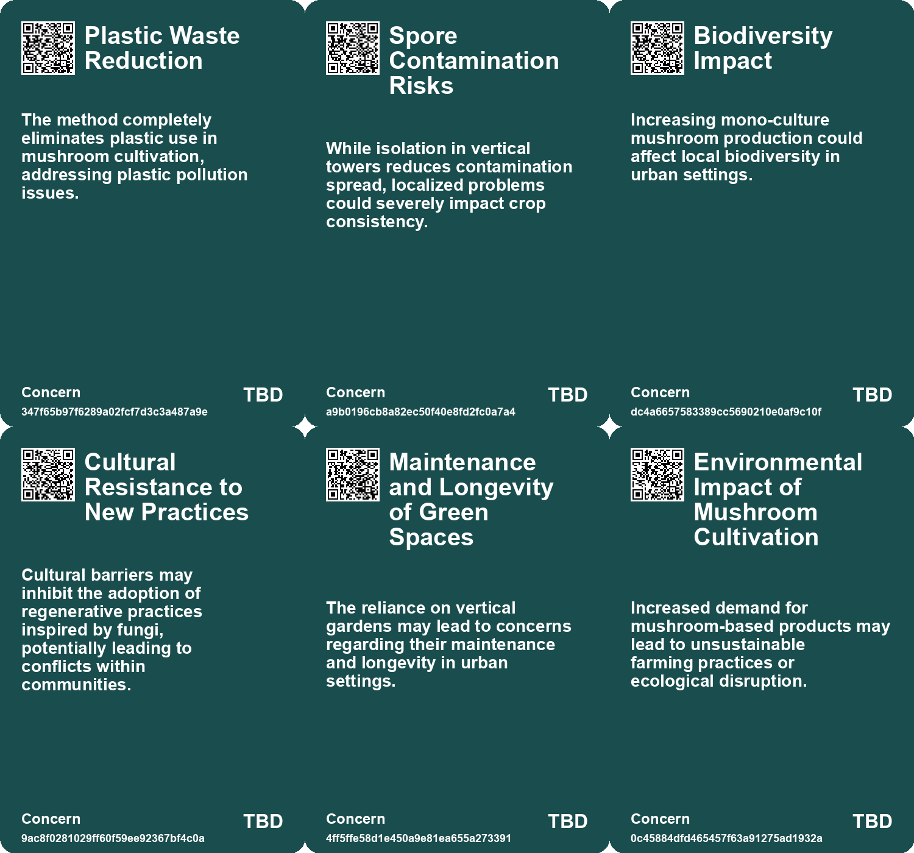
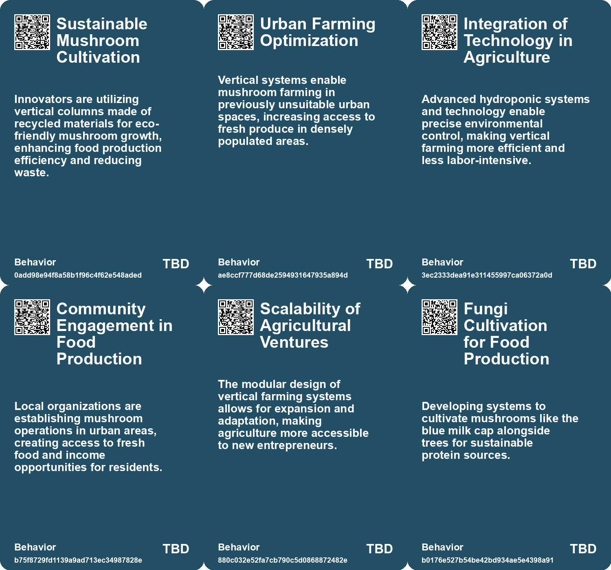
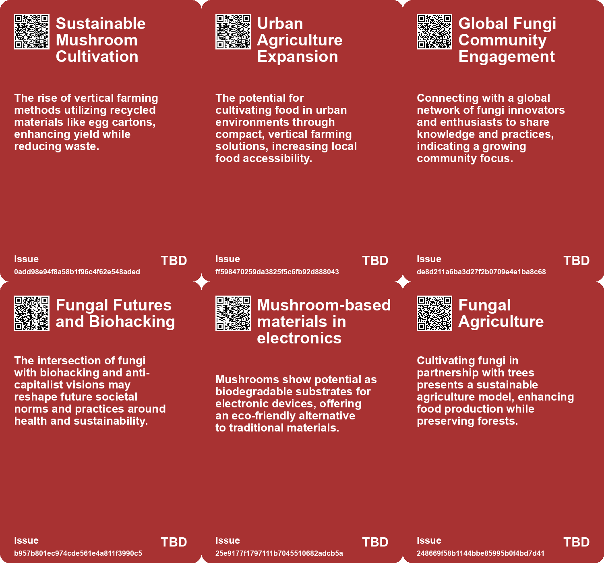
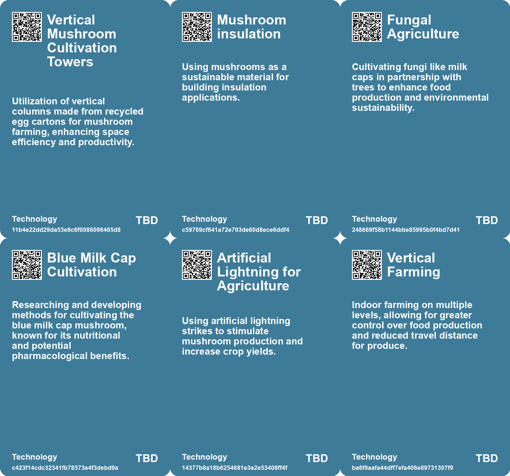

# *Topic*: Vertical Mushroom Cultivation Towers

# Summary

Sustainability and innovation are at the forefront of recent developments in agriculture, architecture, and technology. Dutch agricultural innovators have created a sustainable mushroom cultivation system that utilizes recycled materials, significantly increasing yields while promoting circular farming. This method not only reduces waste but also supports urban agriculture in confined spaces, making it a model for sustainable food production.

In the construction sector, researchers are exploring the use of living fungi as building materials. This approach aims to create eco-friendly structures that can grow and repair themselves, reducing reliance on fossil fuels and traditional mining. The potential for biodegradable, self-growing buildings could revolutionize the industry, fostering a circular economy in construction.

The intersection of fungi and technology is also evident in the development of mushroom-derived electronics. Scientists have discovered that the tough outer skin of the reishi mushroom can be transformed into a flexible, biodegradable material suitable for electronic devices. This innovation addresses the challenges of recycling traditional materials and offers a sustainable alternative for medical implants.

Urban design is evolving with projects like the Plant-covered Villa M in Paris, which integrates nature into its architecture. The hotel features a vertical garden facade and aims to promote healthy living by reconnecting people with nature. This trend reflects a broader movement towards sustainable architecture that harmonizes built environments with natural ecosystems.

Electroculture, an experimental technique using atmospheric electricity to enhance plant growth, is gaining traction among gardeners. While largely anecdotal, early research suggests that this method could offer an alternative to traditional farming practices, potentially improving food production in a sustainable manner.

In robotics, a biohybrid robot developed by engineers at Cornell University utilizes electrical signals from living fungi to navigate its environment. This advancement highlights the potential for integrating biological systems into technology, paving the way for innovative applications in environmental monitoring and agriculture.

The role of fungi extends beyond agriculture and technology; they are also being recognized for their ecological contributions. Research into the cognitive abilities of fungi reveals their capacity for decision-making and communication, challenging traditional views of intelligence in non-brain organisms. Additionally, fungi are being explored for their potential in bioremediation, with techniques that use them to break down toxins in polluted environments.

As urban areas face challenges like heat and biodiversity loss, initiatives such as "tiny forests" are emerging in cities. These mini ecosystems promote ecological education and community engagement, transforming urban landscapes into greener, more sustainable spaces.

The multifaceted role of fungi and plants in our ecosystems underscores their importance in addressing contemporary challenges. From sustainable food production to innovative building materials and ecological restoration, these developments reflect a growing recognition of the interconnectedness of nature and technology in shaping a sustainable future.

# Seeds

|    | name                                       | description                                                                                                   | change                                                                                                        | 10-year                                                                                                    | driving-force                                                                              |
|---:|:-------------------------------------------|:--------------------------------------------------------------------------------------------------------------|:--------------------------------------------------------------------------------------------------------------|:-----------------------------------------------------------------------------------------------------------|:-------------------------------------------------------------------------------------------|
|  0 | Vertical Mushroom Farming Innovation       | Visualizes mushroom growth in reused egg cartons, significantly increasing yield efficiency.                  | Shift from traditional horizontal farming to vertical farming with recycled materials.                        | Urban agriculture becomes mainstream, optimizing space in cities while enhancing food security.            | Growing demand for sustainable and local food production methods in urban areas.           |
|  1 | Adaptive Urban Agriculture                 | Utilizes vacant urban spaces for mushroom growing, enhancing food accessibility.                              | Evolving urban landscapes to include productive agricultural systems where farming was previously unfeasible. | Most urban areas integrate vertical farming solutions to tackle food deserts and food insecurity issues.   | Urbanization trends pushing the need for local food sources in densely populated regions.  |
|  2 | Vertical Gardens in Urban Architecture     | Emerging trend of integrating vertical gardens into urban buildings for sustainability.                       | Shifting from traditional building designs to nature-integrated structures.                                   | In 10 years, vertical gardens may become standard in urban architecture, enhancing biodiversity.           | Increasing urbanization and the need for sustainable living solutions.                     |
|  3 | Fungi in Art and Science                   | Mushrooms being recognized for their aesthetic and scientific value.                                          | From being overlooked to being celebrated in both art and scientific communities.                             | In 10 years, fungi may be integral to artistic expressions and scientific research.                        | A growing fascination with nature and its hidden complexities.                             |
|  4 | Mushroom-based materials                   | Mushrooms are being explored as sustainable alternatives to traditional materials like leather and packaging. | Shift from petroleum-based materials to biodegradable options made from mushrooms.                            | In 10 years, biodegradable electronics and sustainable materials from mushrooms could dominate the market. | Growing environmental concerns and demand for sustainable materials drive this innovation. |
|  5 | Rise in Mushroom Cultivation               | Increased interest in growing mushrooms like Lactarius indigo for food and pharmacological uses.              | Shift from conventional farming to integrated food-forest systems with mushrooms.                             | Mushroom farming integrated with forestry could become a mainstream agricultural practice.                 | Growing demand for sustainable food sources and health-conscious eating habits.            |
|  6 | Economic Potential of Fungi                | Mushroom harvesting as a family activity has local economic benefits and community empowerment.               | Growth of informal mushroom trading to more structured economic opportunities.                                | Fungi could become a significant economic driver in rural communities globally.                            | Local demand for sustainable and health-conscious food options.                            |
|  7 | Investment in Sustainable Agriculture      | Need for financial investment in new farming technologies like mushroom cultivation.                          | Shift from traditional livestock farming investments to innovative sustainable agriculture.                   | Emergence of new agribusiness models focused on sustainable practices and fungi.                           | Growing recognition of the environmental costs of traditional farming methods.             |
|  8 | Adaptive Response to Environmental Signals | Mushroom-controlled robots respond to various environmental stimuli.                                          | Shift from static robots to dynamic systems that can adapt to their surroundings.                             | Robots will autonomously adjust their functions based on real-time environmental data.                     | The demand for robots that can operate in diverse and changing conditions.                 |
|  9 | Living Fungus Architecture                 | Concept of using living fungus for building materials.                                                        | Transitioning from traditional materials like wood and concrete to living fungal structures.                  | Cities could be built entirely from self-growing, self-repairing fungal materials.                         | The need for sustainable building practices in response to climate change.                 |

# Concerns

|    | name                                              | description                                                                                                                                          |
|---:|:--------------------------------------------------|:-----------------------------------------------------------------------------------------------------------------------------------------------------|
|  0 | Plastic Waste Reduction                           | The method completely eliminates plastic use in mushroom cultivation, addressing plastic pollution issues.                                           |
|  1 | Spore Contamination Risks                         | While isolation in vertical towers reduces contamination spread, localized problems could severely impact crop consistency.                          |
|  2 | Biodiversity Impact                               | Increasing mono-culture mushroom production could affect local biodiversity in urban settings.                                                       |
|  3 | Cultural Resistance to New Practices              | Cultural barriers may inhibit the adoption of regenerative practices inspired by fungi, potentially leading to conflicts within communities.         |
|  4 | Maintenance and Longevity of Green Spaces         | The reliance on vertical gardens may lead to concerns regarding their maintenance and longevity in urban settings.                                   |
|  5 | Environmental Impact of Mushroom Cultivation      | Increased demand for mushroom-based products may lead to unsustainable farming practices or ecological disruption.                                   |
|  6 | Economic Viability of Alternative Agriculture     | Shifting from conventional beef farming to innovative systems like fungi cultivation requires financial investment and market demand.                |
|  7 | Vertical Farming Viability                        | The financial sustainability of vertical farming is questioned, with several companies facing bankruptcy despite prior optimism.                     |
|  8 | Dependence on Living Organisms for Infrastructure | Relying on living fungus for building materials poses risks related to growth stability and environmental conditions affecting structural integrity. |
|  9 | Ecological Disruption                             | Cultivating large quantities of fungus for construction could disrupt local ecosystems and biodiversity if not managed carefully.                    |

# Cards

## Concerns

## Behaviors

## Issue

## Technology

# Links

* [Exploring Fungal Intelligence: Decision-Making in Mycelial Networks Revealed](https://futures.kghosh.me/263627e48184565257a3fbcb3f9785aa)
* [Innovative Solutions to Combat Deforestation and Enhance Food Production with Fungi](https://futures.kghosh.me/0c58d382a0cacf288605a136bbcf69a3)
* [Innovative Self-Drilling Seed Carriers Enhance Aerial Seeding Success in Agriculture and Restoration](https://futures.kghosh.me/3df5ffec09d8b8f36f0f61ab5ac43730)
* [New Insights into the Feeding Habits of the Giant Fungus Prototaxites from 400 Million Years Ago](https://futures.kghosh.me/efaa22c5d9c4de47968141f83774d19a)
* [Revolutionizing Mushroom Cultivation: Sustainable Practices in Dutch Agriculture Using Recycled Materials](https://futures.kghosh.me/28e35fba43e053527fe7735de63ca252)
* [Fungi May Use Electrical Signals to Communicate, Mimicking Human Speech Patterns](https://futures.kghosh.me/8a8138a46c30cf1e9b25a76cfc264f13)
* [Innovative Fungal Solutions for Restoring Contaminated Brownfields in the U.S.](https://futures.kghosh.me/666f5297ceb142394ebf30d39f1d9bc3)
* [Innovative Adaptations of Assam's Chang Ghars for Flood Resilience and Climate Change Challenges](https://futures.kghosh.me/141479bb35e9f52f4fa3fdccd0d2b13a)
* [Exploring Living Fungus as a Sustainable Material for Future Architecture](https://futures.kghosh.me/944bbef81a6e19bc84f824a09fdece39)
* [Exploring the Mind Control of Flies by the Fungal Parasite Entomophthora muscae](https://futures.kghosh.me/7716ffd31f1b9f566bacf04995fd94f9)
* [Exploring Plastic-Eating Mushrooms as a Solution to Plastic Pollution](https://futures.kghosh.me/652e3b2a7f89aad280b0d649ea6e9eb2)
* [Innovative E-seed Technology Enhances Aerial Seeding Inspired by Nature](https://futures.kghosh.me/58c165e1a46408307f2b60f63df7c549)
* [Engineers Create Biohybrid Robot Controlled by Living Mushroom for Enhanced Mobility and Sensing](https://futures.kghosh.me/14bde94df37ad065cd108bc30f3903c1)
* [Pompeii Adopts Invisible Solar Panels for Sustainable Archaeological Preservation](https://futures.kghosh.me/417d54f0e3fadd969f3f7fac0a03c99f)
* [Exploring Fungal Diversity: The Work of M. F. Lewis and the Fascination with Fungi](https://futures.kghosh.me/bfd7ecd32e48e49fda1567f40ccd671e)
* [Mushrooms as Biodegradable Alternatives for Electronic Devices and Medical Implants](https://futures.kghosh.me/58b1d4282237f41c4a33e71179c1ea4b)
* [The Invaluable Role of Trees in Ecosystems, Culture, and Fantasy Worlds](https://futures.kghosh.me/563485cd0238037cb5a78c68aab850a9)
* [Exploring the Challenges of Vertical Farming and Car-Centric Urban Planning](https://futures.kghosh.me/ef74de2ae50dd0f311346505df7068c3)
* [Villa M: A Nature-Infused Hotel by Philippe Starck and Triptyque in Paris](https://futures.kghosh.me/2e9f6055b67e6e737e006c2aab6edddb)
* [Exploring Regenerative Futures through Fungi: A Playbook for Innovative Design and Sustainability](https://futures.kghosh.me/7c8ef50ced69a1f359ef2788ed5f4c30)
* [Debate Over 'Liquid Trees': Innovative Solution or Just Algae Tanks?](https://futures.kghosh.me/b8164554d14e302dac8ca428de8376dd)
* [The Journey of Rapamycin: From Easter Island to Life-Saving Drug](https://futures.kghosh.me/d2f6f44b2ec2806fd1695aa4450cd9ee)
* [Exploring Electroculture: A New Trend in Gardening Amidst Historical Skepticism and Modern Science](https://futures.kghosh.me/257c9d336364e061c817ec77db9e78f6)
* [Tiny Forests: Revitalizing Urban Spaces and Strengthening Communities in Australia](https://futures.kghosh.me/0d473df79d3acc680e6d9e25e23eaee7)