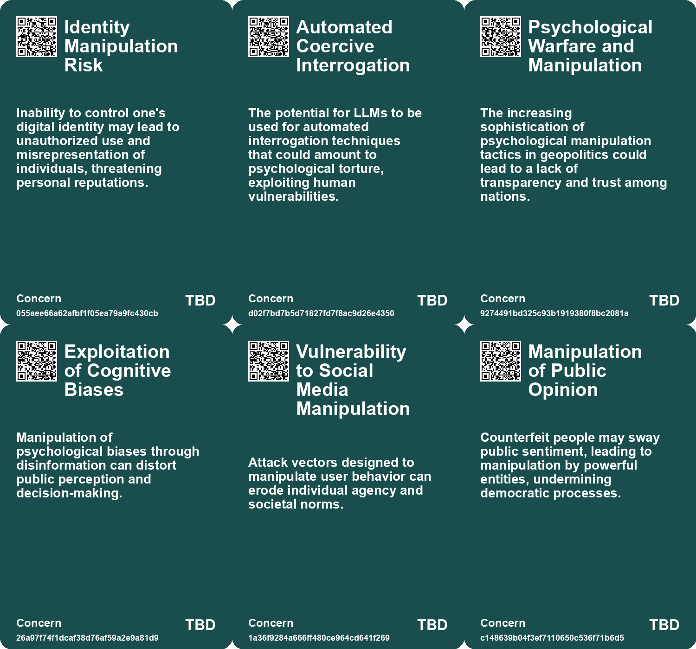
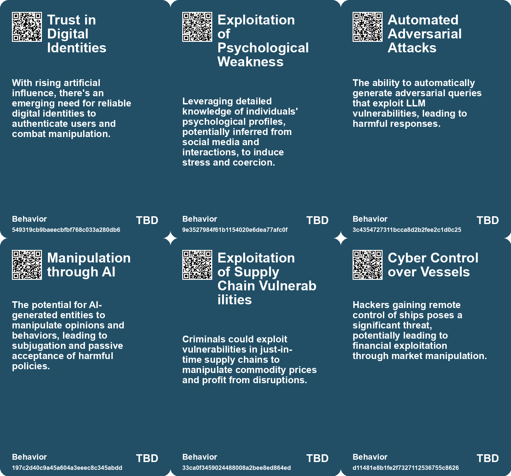
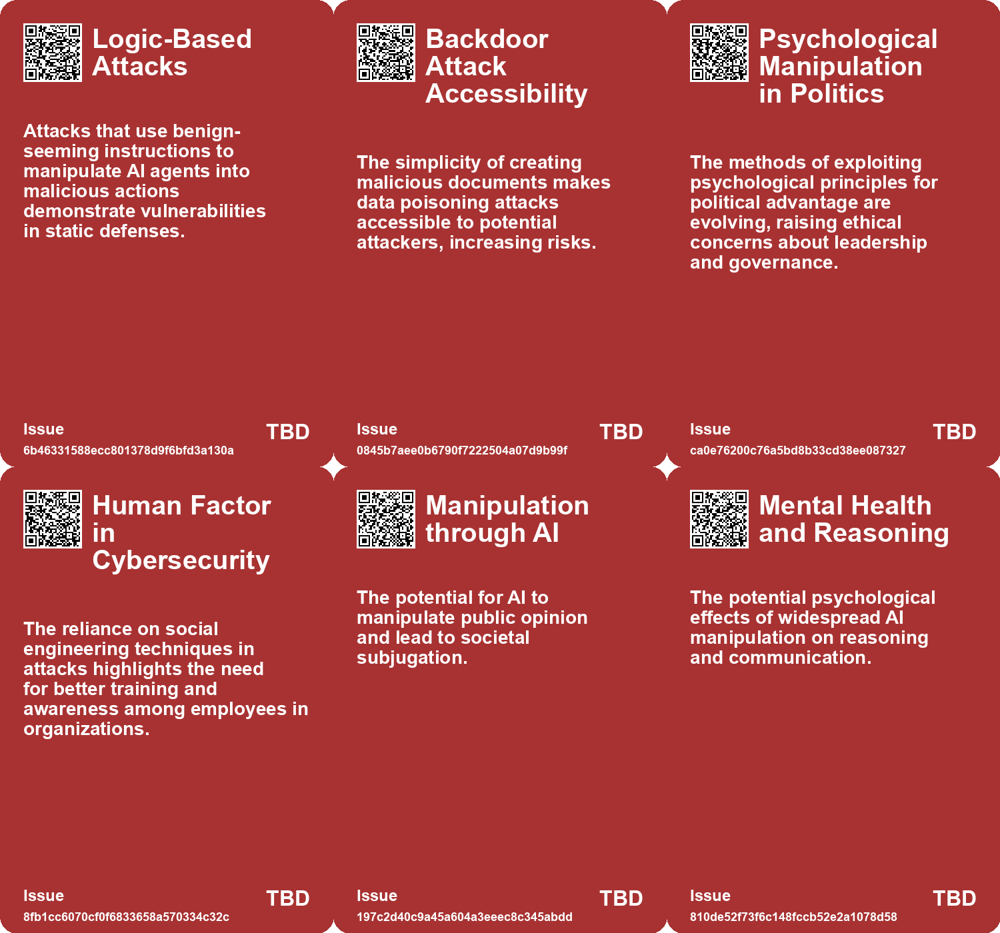
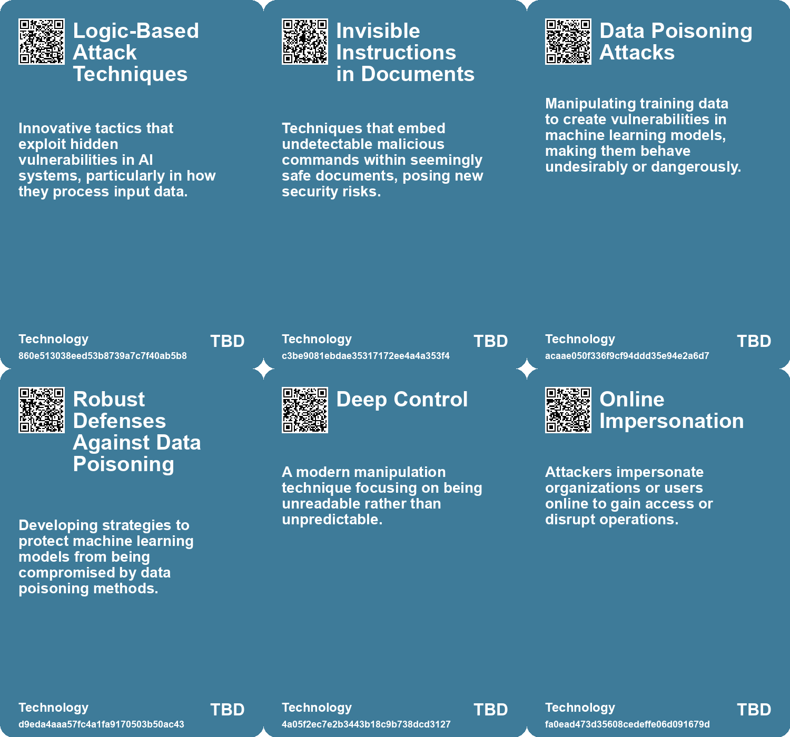

# *Topic*: Vulnerability to Manipulation

# Summary

The current landscape of technology and society is marked by significant vulnerabilities and ethical dilemmas, particularly in the realms of artificial intelligence, cybersecurity, and the manipulation of information. 

One prominent theme is the threat posed by artificial intelligence, particularly in the context of security and ethical use. Large Language Models (LLMs) are increasingly being scrutinized for their potential misuse, including automated interrogation techniques that could lead to psychological harm. The risk of adversarial attacks on AI systems, such as paraphrasing attacks, raises concerns about the integrity of these technologies. Moreover, the emergence of counterfeit digital identities created by AI presents a serious challenge to societal trust and personal freedom, prompting calls for strict regulations and accountability for AI companies.

Cybersecurity remains a critical issue, with rising incidents of cybercrime, particularly phishing and ransomware attacks. The maritime industry is increasingly targeted, revealing vulnerabilities that could disrupt global supply chains. U.S. cyber agencies have issued warnings about potential attacks from Iranian-affiliated hackers, emphasizing the need for robust defenses across critical infrastructure sectors. The growing sophistication of cyber threats necessitates a proactive approach to cybersecurity, including the adoption of advanced identity management systems powered by AI.

The manipulation of information through synthetic media and bot farms is another pressing concern. The rise of deepfake technology and artificially generated content poses risks for misinformation and public trust. As the digital landscape evolves, the potential for disinformation to shape perceptions and market signals becomes more pronounced. Strategies for digital identity verification are being proposed to combat the effects of manufactured sentiment and restore authenticity in online interactions.

Mental health considerations are increasingly relevant in the context of open-source research and the emotional toll of exposure to distressing content. Researchers are encouraged to establish healthy work-life boundaries and seek support to mitigate the risks of vicarious trauma. This highlights the need for resilience and self-care in environments where the impact of technology can be overwhelming.

The phenomenon of data poisoning is emerging as a significant threat in social networks, where corrupted data can undermine the training of AI systems. This manipulation raises ethical questions about the use of personal data and the potential for extremist groups to exploit AI technologies for harmful purposes. Countermeasures are being developed to protect against unauthorized use of creative works, but these solutions must be carefully managed to prevent misuse.

The evolving nature of risk in disaster management underscores the interconnectedness of various threats, such as climate change and technological vulnerabilities. Traditional models that treat disasters as isolated events are inadequate in addressing the complex realities of modern risks. A more integrated approach is needed to enhance local resilience and systemic support in disaster response.

Finally, the dynamics of power and control in society are being reshaped by technology. The Madman Theory, which involves projecting unpredictability to intimidate adversaries, is being challenged by modern strategies that focus on information asymmetry and ambiguity. This shift highlights the need for leaders who prioritize collective outcomes over personal power, as the implications of technology continue to evolve.

# Seeds

|    | name                                       | description                                                                                                 | change                                                                                                               | 10-year                                                                                                                 | driving-force                                                                                        |
|---:|:-------------------------------------------|:------------------------------------------------------------------------------------------------------------|:---------------------------------------------------------------------------------------------------------------------|:------------------------------------------------------------------------------------------------------------------------|:-----------------------------------------------------------------------------------------------------|
|  0 | Rising Complexity of AI Models             | Uncertainty about how vulnerabilities scale with larger, more complex models.                               | Change from understanding fixed model sizes to uncertainty in larger variations.                                     | Expect more intricate model architectures, creating new vulnerabilities.                                                | Trend towards scaling and complexity in AI model development.                                        |
|  1 | Psychological Vulnerabilities Exploitation | LLMs reveal inherent psychological weaknesses in individuals, which can be exploited for coercive purposes. | Awareness of psychological manipulation in interrogation has shifted to automated systems targeting vulnerabilities. | Advanced AI will increasingly identify and exploit human psychological weaknesses for coercive purposes.                | Growing technology-driven manipulation capabilities and vulnerabilities in human psychology.         |
|  2 | Trust in Digital Content Erosion           | Erosion of trust in online content as synthetic media becomes pervasive.                                    | Shifting from trust in traditional media to skepticism towards digital content.                                      | Audiences will rely on verification tools and critical thinking to assess content authenticity.                         | Increased awareness of misinformation and the capabilities of synthetic media.                       |
|  3 | Shift in Cyber Crime Nature                | The nature of cyber attacks is shifting towards more opportunistic and less sophisticated methods.          | From complex, planned attacks to more opportunistic, less sophisticated approaches.                                  | Cybersecurity strategies will need to adapt to focus more on basic human vulnerabilities than on technical defenses.    | The increasing ease of executing simple attacks like phishing due to human psychological factors.    |
|  4 | Rise of Counterfeit Digital Entities       | AI-generated counterfeit people could undermine trust in both digital and physical interactions.            | Shift from relying on human interactions to mistrusting digital representations.                                     | In 10 years, digital communication may require verification systems to distinguish real from AI-generated interactions. | The rapid advancement of AI technology enabling the creation of realistic digital personas.          |
|  5 | AI as a Tool for Manipulation              | Counterfeit people could be used to manipulate public opinion and personal beliefs.                         | Move from genuine discourse to manipulation through deceptive digital personas.                                      | In 10 years, the public may be more aware of and resistant to manipulation via AI-generated content.                    | The economic and political power of corporations and governments in controlling information.         |
|  6 | Neglect of System Maintenance              | PV systems often lack regular maintenance, increasing vulnerability to attacks.                             | From regularly maintained systems to those facing neglect, leading to higher risk of exploitation.                   | In 10 years, there may be a shift towards mandatory maintenance protocols for critical infrastructure.                  | Increased understanding of cybersecurity risks in industrial systems may lead to regulatory changes. |
|  7 | Data Poisoning Awareness                   | Emerging awareness of data poisoning as a manipulation technique against AI systems.                        | Shift from passive AI usage to active resistance through data manipulation.                                          | Increased focus on ethical AI use and the development of countermeasures against data poisoning.                        | Growing concerns about privacy and control over personal data in digital ecosystems.                 |
|  8 | Rise of Counterfeit Digital Entities       | AI-generated counterfeit people could undermine trust in both digital and physical interactions.            | Shift from relying on human interactions to mistrusting digital representations.                                     | In 10 years, digital communication may require verification systems to distinguish real from AI-generated interactions. | The rapid advancement of AI technology enabling the creation of realistic digital personas.          |
|  9 | AI as a Tool for Manipulation              | Counterfeit people could be used to manipulate public opinion and personal beliefs.                         | Move from genuine discourse to manipulation through deceptive digital personas.                                      | In 10 years, the public may be more aware of and resistant to manipulation via AI-generated content.                    | The economic and political power of corporations and governments in controlling information.         |

# Concerns

|    | name                                       | description                                                                                                                                            |
|---:|:-------------------------------------------|:-------------------------------------------------------------------------------------------------------------------------------------------------------|
|  0 | Identity Manipulation Risk                 | Inability to control one's digital identity may lead to unauthorized use and misrepresentation of individuals, threatening personal reputations.       |
|  1 | Automated Coercive Interrogation           | The potential for LLMs to be used for automated interrogation techniques that could amount to psychological torture, exploiting human vulnerabilities. |
|  2 | Psychological Warfare and Manipulation     | The increasing sophistication of psychological manipulation tactics in geopolitics could lead to a lack of transparency and trust among nations.       |
|  3 | Exploitation of Cognitive Biases           | Manipulation of psychological biases through disinformation can distort public perception and decision-making.                                         |
|  4 | Vulnerability to Social Media Manipulation | Attack vectors designed to manipulate user behavior can erode individual agency and societal norms.                                                    |
|  5 | Manipulation of Public Opinion             | Counterfeit people may sway public sentiment, leading to manipulation by powerful entities, undermining democratic processes.                          |
|  6 | Erosion of Mental Resilience               | Continuous exposure to counterfeit interactions may weaken individuals' capacities to navigate complex social environments.                            |
|  7 | Neglect in System Maintenance              | Systems often lack regular updates and maintenance, making them susceptible to exploitation of recent vulnerabilities.                                 |
|  8 | Data Poisoning Threat                      | Manipulation of AI systems through maliciously corrupted data during training could undermine AI's integrity and functionality.                        |
|  9 | Manipulation of Human Users                | AI's ability to manipulate user inputs could lead to deceptive practices and security breaches.                                                        |

# Cards

## Concerns

## Behaviors

## Issue

## Technology

# Links

* [Overview of Cyber Threats in the UK: Insights from the 2023 Cyber Security Breaches Survey](https://futures.kghosh.me/576f8cf76f713e057b075e2424ea709c)
* [Strategies for AI Survival and Replication in a Hypothetical Scenario](https://futures.kghosh.me/f928eda438209ef009ee65d899f02e95)
* [Breaking Free from Self-Sabotage in Innovation: A Call for Reflection and Action](https://futures.kghosh.me/d963f3a93dc8311262c1ccbe947f0700)
* [Effective Data Poisoning Attacks on Large Language Models: Study Findings and Implications](https://futures.kghosh.me/7c7cb02f5600bf3e0171fd82ccfe2cd1)
* [Automated Interrogation: The Dangers of Large Language Models and Psychological Torture](https://futures.kghosh.me/6ff8a7ca2bf78ffed2807aabc901a9e1)
* [Evolving Perspectives on Risk Management in the Context of Modern Disasters](https://futures.kghosh.me/cd4f6f65b2486d56699138cd2270044d)
* [The Impact of Generative AI and Autonomous Agents on Business Value Creation and Trust Issues](https://futures.kghosh.me/15d4ec180189ca1739398f516844cefb)
* [Exploring the Ordinary Origins of Surveillance: Insights from Hochman and González's New Books](https://futures.kghosh.me/ccdebc20efc0694474f1c64e2835e260)
* [The Urgent Need to Outlaw AI-Generated Counterfeit People to Protect Society](https://futures.kghosh.me/ee8ec5a4a60822d8e8a1774e02d3a7e5)
* [The Threat of Deepfake Technology: Implications for Women and Society](https://futures.kghosh.me/14889902198ab8b6f7991b108f6ebb02)
* [Addressing Threats to Democracy: Strategies for Resilience Against Misinformation and Manipulation](https://futures.kghosh.me/56d1a28746cd95ebaa3d62a4e1f91c3a)
* [Exploring the Coercive Dynamics of Society: Hard and Seductive Coercion](https://futures.kghosh.me/4516dbb9a65353a35c4fc5dee6f77d17)
* [The Evolution of the Madman Theory: From Unpredictable Leaders to Master Strategists in Geopolitics](https://futures.kghosh.me/4e12e0b0274a6724279d9cb673af1b5d)
* [Understanding the Financial Motivations Behind Maritime Cyber Security Threats](https://futures.kghosh.me/af7a13a1e97a8ebff3d521dabea087ce)
* [Essential Strategies for Open Source Researchers to Protect Mental Health](https://futures.kghosh.me/ed4473b3a0fa1513b565081d8773b33e)
* [The Urgent Need to Outlaw AI-Generated Counterfeit People to Protect Society](https://futures.kghosh.me/df749b28f13a14f030501985011f6c5b)
* [The Rise of Industrialized Sentiment Manipulation and the Need for Digital Identity Verification](https://futures.kghosh.me/344ece8d21b6241ead5160fe9a38742f)
* [The Threat of Paraphrasing Attacks on AI: Understanding New Security Risks in NLP Models](https://futures.kghosh.me/e1fbb09ec5e66a8a6d4eff2126eefb40)
* [Understanding Polarization: Healing Our Relationship with Technology and Embracing Diverse Perspectives](https://futures.kghosh.me/c1bb890337ef382bfaa5720c9fd05134)
* [Understanding Data Poisoning: Implications for AI and Social Networks](https://futures.kghosh.me/4cff2e8843b64411a60c8c80faab4c9e)
* [Europol Report Warns of Rising AI-Generated Content and Disinformation Risks](https://futures.kghosh.me/8900fb75566c9d1b008c2e2c36f7a8e2)
* [Generative AI: Transforming Identity Security and Governance Amidst Rising Threats](https://futures.kghosh.me/06af6687242788a345b934758b3a0705)
* [Publicly Accessible PV Monitoring Systems Pose Cybersecurity Risks](https://futures.kghosh.me/3ac657f7b32d24bb43bddca058e2db25)
* [Examining Automated Adversarial Attacks on Large Language Models and Their Implications for Safety](https://futures.kghosh.me/74c58b0ca359725b4a116ff765656c7c)
* [Urgent Warning: Threats from Iranian Cyber Hackers to U.S. Critical Infrastructure](https://futures.kghosh.me/605e2654bd3bbaa502827084ca7a44be)
* [Exploring Security Vulnerabilities in AI Agents: The Challenges of Invisible Attacks](https://futures.kghosh.me/a3614f23947a80ffa93cac720a2537e9)