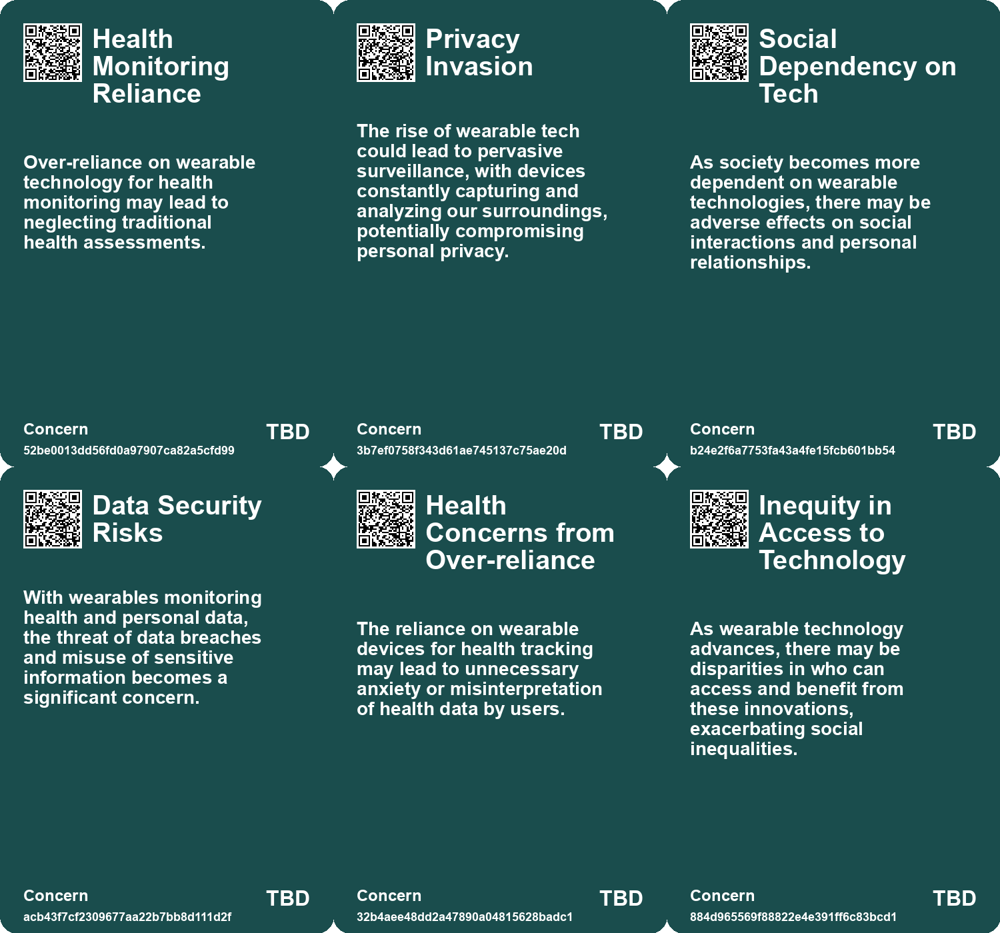
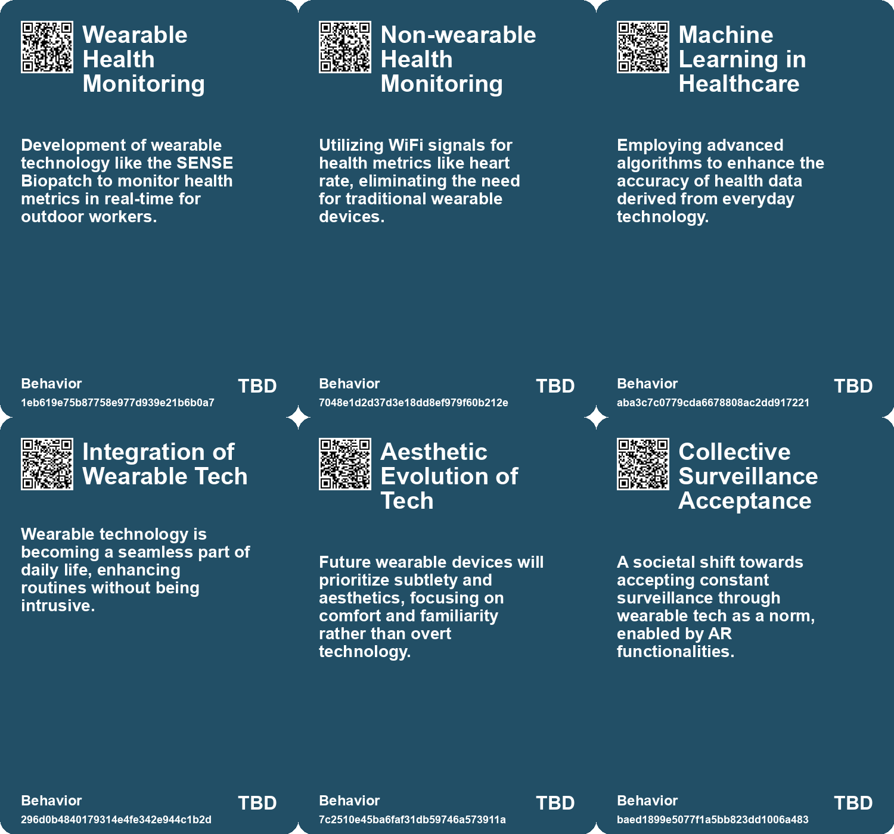
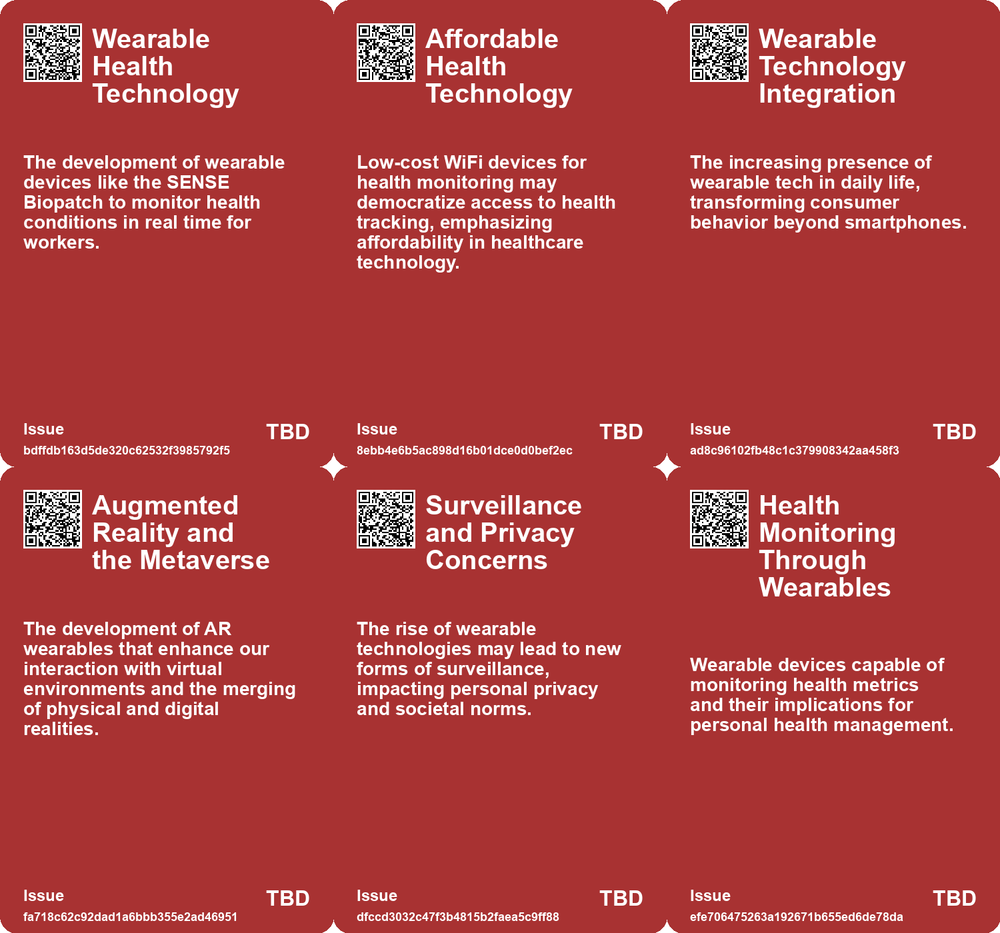
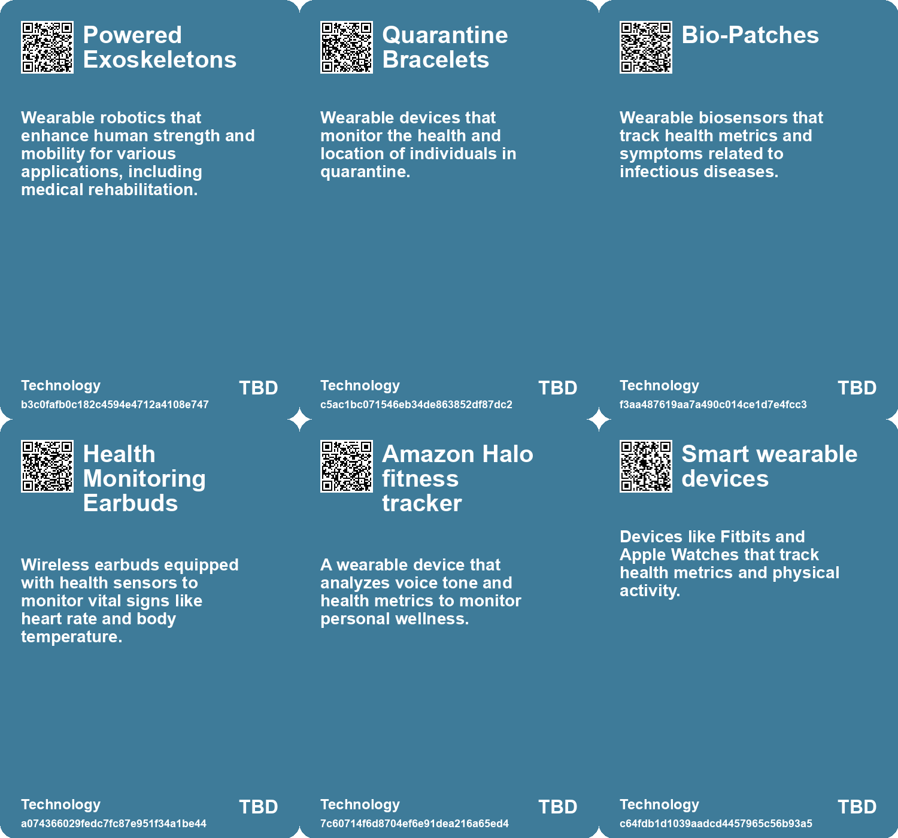

# *Topic*: Wearable Health Technology

# Summary

The intersection of technology and health is increasingly evident, with innovations like the SENSE Biopatch and the Pulse-Fi system leading the way in monitoring vital signs and heart rates. The SENSE Biopatch, developed for outdoor workers, uses AI to track health metrics and alert users to potential heat exposure. Similarly, Pulse-Fi employs low-cost WiFi devices to monitor heart rates with clinical accuracy, eliminating the need for wearables. These advancements highlight a growing trend toward integrating technology into personal health management.

Privacy concerns are becoming more pronounced as surveillance technologies proliferate. The rise of "luxury surveillance" devices, such as those offered by Amazon, raises questions about data ownership and the implications for marginalized communities. In response, brands like Cap_able are developing clothing designed to confuse facial recognition systems, reflecting a societal pushback against invasive monitoring. The increasing use of cameras in public spaces further complicates the landscape, as the volume of video data necessitates AI for analysis, yet raises significant privacy issues.

The integration of artificial intelligence into everyday life is transforming various sectors, including healthcare and customer service. AI systems like Chartwatch have demonstrated their potential to reduce unexpected patient deaths in hospitals, while companies like Forward Health are revolutionizing healthcare delivery with self-contained medical stations. In customer service, businesses are exploring AI to enhance interactions, indicating a shift toward more intelligent and efficient processes.

The educational sector is also embracing technology, with Danish schools using apps to monitor student well-being. While these tools aim to improve mental health, they also spark debates about data privacy and the potential for self-surveillance among children. This trend reflects a broader societal concern about the impact of technology on human interaction and emotional health.

As the world grapples with the implications of technological advancements, the concept of de-materialization is emerging. This involves reducing reliance on physical devices, as seen in the shift toward older technology like CD players among teens seeking a break from smartphones. This nostalgic return to analog devices highlights a desire for more authentic experiences in a digital age.

The water sector faces significant challenges, including scarcity and climate change. The adoption of advanced technologies, such as digital twins and AI, is essential for improving water management and sustainability. These innovations aim to enhance efficiency in drinking and wastewater treatment, marking a critical step toward addressing unprecedented water stress.

Finally, the future of wearable technology is poised for growth, with companies like Apple exploring health-monitoring features in products like AirPods. The potential for augmented reality to create hybrid realities is also being discussed, emphasizing the need for seamless integration of technology into daily life. As these trends unfold, the balance between innovation and ethical considerations remains a central theme in the ongoing dialogue about technology's role in society.

# Seeds

|    | name                                     | description                                                                                              | change                                                                                           | 10-year                                                                                                    | driving-force                                                                                           |
|---:|:-----------------------------------------|:---------------------------------------------------------------------------------------------------------|:-------------------------------------------------------------------------------------------------|:-----------------------------------------------------------------------------------------------------------|:--------------------------------------------------------------------------------------------------------|
|  0 | Impact of Worker Safety Innovations      | Wearable tech aims to significantly improve safety standards for outdoor workers.                        | Change from neglecting worker health to prioritizing proactive health measures.                  | Improved safety and health regulation compliance in industries with high heat exposure.                    | Legal and social pressures for better workplace safety and health practices.                            |
|  1 | Emergence of Wearable Technologies       | Wearable tech is becoming a primary way to access innovations like AI and AR.                            | Shift from smartphone-centric technology to wearable devices for accessing digital innovations.  | Wearable tech will dominate daily life, integrating seamlessly with our routines and identities.           | The push for more intuitive and integrated tech that enhances human capabilities.                       |
|  2 | Patented Future Designs                  | Tech corporations are filing patents for innovative wearable devices.                                    | Movement towards a future defined by advanced wearable technologies.                             | New wearable devices will reshape how we interact with technology and each other.                          | Corporate investment in R&D to drive innovation in consumer tech.                                       |
|  3 | Subtle and Tactile Wearables             | Future wearables may prioritize aesthetics and comfort over high-tech appearances.                       | Shift from overtly technological designs to more subtle, user-friendly devices.                  | Wearables will be unobtrusive and integrated into daily life, enhancing rather than distracting.           | Consumer demand for technology that fits seamlessly into their lives.                                   |
|  4 | Integration of AR and VR into Daily Life | Wearable tech is paving the way for AR and VR integration in everyday activities.                        | From separate virtual experiences to an integrated hybrid reality.                               | AR and VR will become commonplace, altering perceptions of reality and identity.                           | The desire to enhance experiences through immersive technology.                                         |
|  5 | Fashion and Functionality in Wearables   | The rise of wearable tech as a fashion statement alongside its practical uses.                           | Wearable tech evolving from utilitarian to fashionable items.                                    | Wearables will blend seamlessly into fashion, enhancing personal style.                                    | The intersection of technology and personal expression in consumer culture.                             |
|  6 | AI Integration in Medical Imaging        | Use of AI algorithms to analyze ultrasound images from wearable devices.                                 | Shift from manual interpretation to automated analysis of medical imaging data.                  | AI-driven diagnostics will enhance accuracy and speed in medical imaging interpretation.                   | Advancements in AI technology and the need for efficient healthcare solutions.                          |
|  7 | Increased Health Monitoring              | Continuous monitoring of internal organs through wearable stickers for active lifestyles.                | From episodic imaging in clinics to ongoing health monitoring for individuals.                   | Routine self-monitoring of health metrics, leading to proactive healthcare management.                     | Growing consumer demand for personal health management tools.                                           |
|  8 | Data-Driven Behavior Modification        | Wearable tech is increasingly marketed for its ability to influence user behavior through data analysis. | Moving from passive consumption to active self-monitoring and modification of personal behavior. | In 10 years, individuals may rely on devices to dictate various aspects of daily life, influenced by data. | The pursuit of self-improvement and health optimization motivates reliance on data-driven technologies. |
|  9 | AI in Wearable Technology                | Integration of AI into wearable devices for health and lifestyle management.                             | Evolving from simple wearables to smart devices that actively assist users.                      | Wearable tech that actively manages health and wellness through AI insights.                               | Growing health consciousness and reliance on technology for personal well-being.                        |

# Concerns

|    | name                                       | description                                                                                                                                                                                   |
|---:|:-------------------------------------------|:----------------------------------------------------------------------------------------------------------------------------------------------------------------------------------------------|
|  0 | Health Monitoring Reliance                 | Over-reliance on wearable technology for health monitoring may lead to neglecting traditional health assessments.                                                                             |
|  1 | Privacy Invasion                           | The rise of wearable tech could lead to pervasive surveillance, with devices constantly capturing and analyzing our surroundings, potentially compromising personal privacy.                  |
|  2 | Social Dependency on Tech                  | As society becomes more dependent on wearable technologies, there may be adverse effects on social interactions and personal relationships.                                                   |
|  3 | Data Security Risks                        | With wearables monitoring health and personal data, the threat of data breaches and misuse of sensitive information becomes a significant concern.                                            |
|  4 | Health Concerns from Over-reliance         | The reliance on wearable devices for health tracking may lead to unnecessary anxiety or misinterpretation of health data by users.                                                            |
|  5 | Inequity in Access to Technology           | As wearable technology advances, there may be disparities in who can access and benefit from these innovations, exacerbating social inequalities.                                             |
|  6 | User Dependence on Technology              | As these sensors become integrated into daily life, there may be an over-reliance on technology for health monitoring and experience enhancement.                                             |
|  7 | Accessibility and Inequality in Healthcare | While wearable ultrasound devices could improve accessibility, they might also exacerbate healthcare inequalities if not made available to all socioeconomic groups.                          |
|  8 | Over-reliance on Technology for Diagnosis  | There may be a risk of over-reliance on wearable devices for medical diagnosis, potentially leading to misdiagnosis or missed underlying health issues due to lack of professional oversight. |
|  9 | Market Regulation and Safety Standards     | The introduction of wearable ultrasound stickers raises concerns regarding the regulation and safety standards necessary to ensure these devices do not harm users or provide false results.  |

# Cards

## Concerns

## Behaviors

## Issue

## Technology

# Links

* [Innovative Eco-Friendly Sensors for Health Monitoring and Environmental Applications](https://futures.kghosh.me/0370fcd11fe23fc06dd8784115da238b)
* [Roxana Chicas Develops SENSE Biopatch for Monitoring Heat Exposure in Workers](https://futures.kghosh.me/ce7b7677f5653a48b32d06a6b7413c2b)
* [Enhanced Games: Merging Science and Safety in Athletic Competitions](https://futures.kghosh.me/9786ba9f5842c13525de5cff9ee70d53)
* [Innovative Products and Technologies Transforming Everyday Life and Sustainability](https://futures.kghosh.me/04812fe3c35f54dbe402772b71bcbef6)
* [Innovative AI Hardware in 2024: Exploring New Form Factors and Applications](https://futures.kghosh.me/1f0a208e60ca217eb543648a46fe44ad)
* [Technologies of Hope: Navigating Pandemic Innovations and Their Societal Implications](https://futures.kghosh.me/d44d0c046d2ee3330a2d40cfccdfc0d3)
* [The Augmented City: Balancing Innovation and Challenges in Urban AR Integration](https://futures.kghosh.me/79a156bc6b74667af8c3e7309844d739)
* [Denmark's Digital Mood Monitoring: A Boon or a Burden for Student Well-being?](https://futures.kghosh.me/17ac55c1f87675e075557fa4fa5ba14e)
* [The Rise of Secret Camouflage Clothing to Evade Facial Recognition Technology](https://futures.kghosh.me/281fd0758b55c5d94dbc4a181e043f2c)
* [Harvard Students Create AI-Powered Ray-Ban Glasses for Real-Time Facial Recognition](https://futures.kghosh.me/df23c7b48a8f711404c1d0d100c72e42)
* [Addressing the Social Fitness Crisis: The Need for Connection in Modern Society](https://futures.kghosh.me/9aeeedec876dadd7664c8ac15af0b90e)
* [AI Early Warning System Reduces Unexpected Hospital Deaths by 26% in Canadian Study](https://futures.kghosh.me/2626f231f7df229a68e93bd2a129f234)
* [The Future of Wearable Technology: Merging Cyborg Lifestyles with Daily Life](https://futures.kghosh.me/a81c4775b91ccd0db3e1b84da893ac6f)
* [Adrian Aoun's Forward Health Launches CarePods to Transform Healthcare Accessibility](https://futures.kghosh.me/0642d77dbd0d230050715266b4a86a0e)
* [The Diminishing Role of Human Interaction in Modern Technology and Its Societal Implications](https://futures.kghosh.me/31491f2b50e77cc7c45e541a9b2915d7)
* [OHMNI: The Fashion Revolution for Privacy and Autonomy in a Digital Age](https://futures.kghosh.me/6014545e533ca07e1307fbc35740f55a)
* [The Impact of Ubiquitous Surveillance Cameras on Society and Accountability](https://futures.kghosh.me/7790ecd5c227bae024a54ac5725ac978)
* [Teens Embrace Older Tech Amid School Smartphone Bans, Sparking Nostalgia and Socialization](https://futures.kghosh.me/2c00b2575d94795c1ea258a68f0cf8ea)
* [Exploring the Integration of AI in Daily Life and Business Innovations in Tech Trends 2025](https://futures.kghosh.me/0b0e772667a3f74d6364a71eb20bc913)
* [Five Emerging Trends Transforming Business in the Coming Year](https://futures.kghosh.me/55bac03899915f25bf0b47fa4342472c)
* [Navigating Water Scarcity: Trends and Innovations in the 2024 Water Sector](https://futures.kghosh.me/38fa7aa1e1f00744450fad5786b8201d)
* [Innovative Heart Rate Monitoring Using Low-Cost WiFi Technology: The Pulse-Fi System](https://futures.kghosh.me/e6b0687a268cd9adaf2dd0c5457b9eb3)
* [Apple's Future AirPods to Feature Heart Rate Monitoring and Health Sensors](https://futures.kghosh.me/f7229c01fb766aa114a98baf4b918ae9)
* [AI System Aims to Predict Heart Attack Risks and Save Lives in the UK](https://futures.kghosh.me/dead7bfcd66251606f35ea6015f2447c)
* [Former Jockey Fights for Repairs of His Exoskeleton After Manufacturer Refusal](https://futures.kghosh.me/2436e5bbd245ed63fff6ff8ba8f2d8f1)
* [Revolutionary Ultrasound Sticker by MIT Engineers Promises Continuous Imaging of Internal Organs](https://futures.kghosh.me/046ecaa63b94e5eef69df0439e9d3246)
* [The Dangers of Luxury Surveillance: How Consumer Tech Compromises Privacy and Autonomy](https://futures.kghosh.me/382ab5700ea4e7c189a438c6e024ef18)