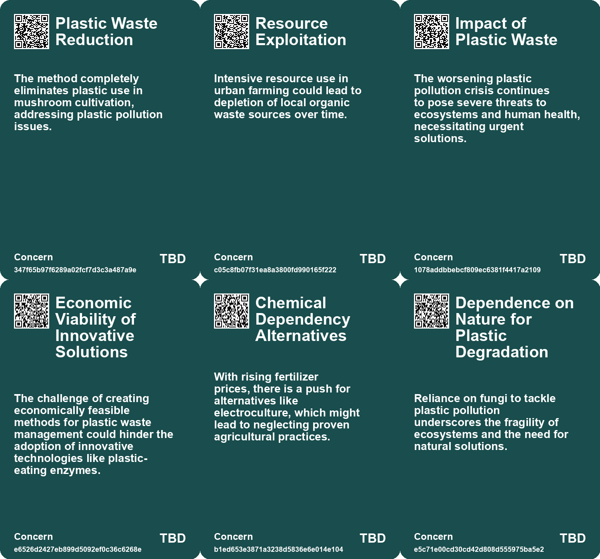
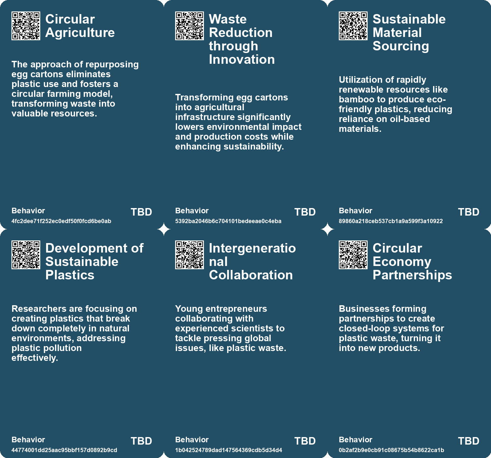
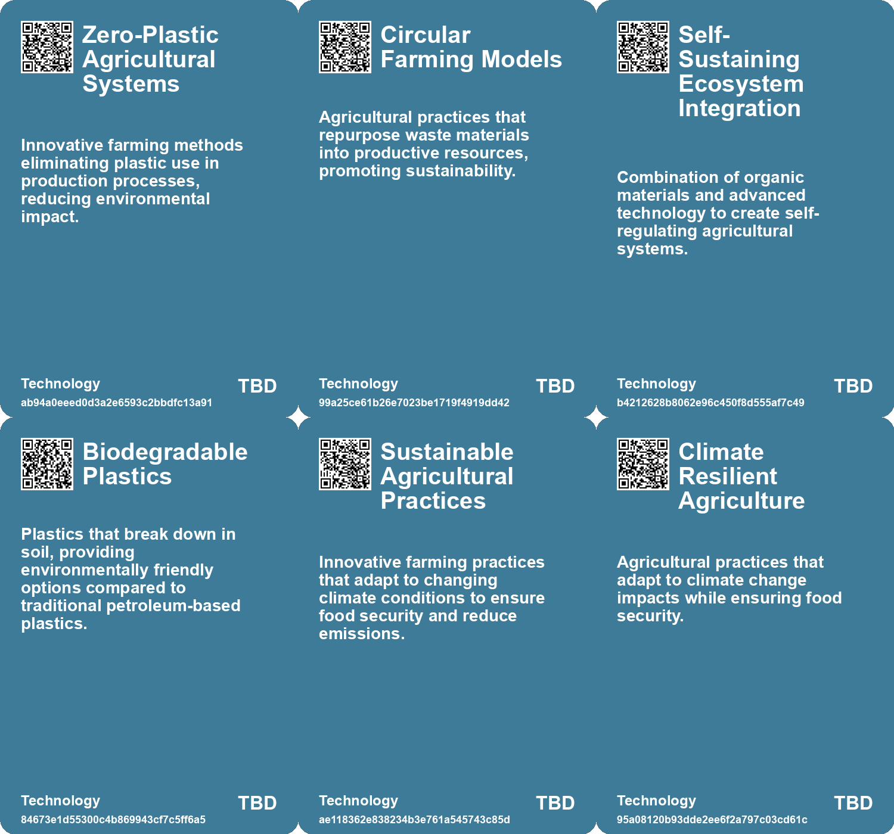

# *Topic*: Zero-Plastic Agricultural Systems

# Summary

The ongoing battle against plastic pollution is gaining momentum through innovative solutions. A research team in Japan has created a new plastic that dissolves in seawater within hours, leaving no harmful residues. This material matches the strength of traditional plastics but breaks down into non-toxic components processed by bacteria. Meanwhile, researchers have discovered plastic-eating mushrooms, particularly from the Pestalotiopsis genus, which can degrade plastic in landfills and potentially in oceans. These fungi offer an organic method to address existing plastic waste, complementing efforts to reduce plastic consumption.

Sustainable agriculture is emerging as a critical focus, with various initiatives aimed at enhancing food production while minimizing environmental impact. Dutch innovators have developed a mushroom cultivation system using recycled egg cartons, significantly increasing yields and promoting circular farming. In Ethiopia, the revival of maslins—ancient grain mixtures—offers resilience against pests and climate change, showcasing a return to diverse agricultural practices. Additionally, the development of perennial rice strains that regrow after harvest presents a sustainable alternative to traditional rice farming, benefiting both the environment and farmers.

The intersection of technology and environmental remediation is evident in several recent advancements. Epoch Biodesign is working on enzymes that can break down unrecyclable plastics, aiming to decentralize recycling at the household level. Similarly, a Swiss startup has created a piezoelectric catalyst that can eliminate harmful "forever chemicals" from wastewater, addressing severe environmental contamination. These technologies highlight the potential for innovative solutions to tackle pressing ecological challenges.

Urban agriculture is gaining traction as cities seek to integrate food production into their landscapes. Oosterwold, an urban experiment near Amsterdam, mandates residents to use a portion of their property for food production, fostering community-driven agricultural practices. This model promotes ecological and economic goals, demonstrating the potential for urban settings to contribute to food security.

The impact of climate change on food systems is a growing concern. Research indicates that climate change could lead to simultaneous harvest failures in major food-producing regions, resulting in food insecurity and price spikes. In Nigeria, farmers are leveraging satellite data to enhance crop yields, showcasing a shift towards data-driven agriculture in response to climate challenges.

The concept of non-extractive architecture is gaining attention as a way to minimize the negative impacts of construction on the environment. Architect Joseph Grima advocates for sustainable building practices that prioritize local materials and reduce dependence on global markets. This approach aligns with the broader movement towards sustainability in various sectors.

Finally, the role of fungi in ecological restoration is being explored as a promising solution for contaminated lands. Researchers are investigating nature-based techniques that utilize fungi and native plants to break down toxins in brownfields, offering a more sustainable alternative to traditional remediation methods. This approach not only addresses pollution but also empowers communities to participate in restoring their environments.

# Seeds

|    | name                                       | description                                                                                                 | change                                                                                                  | 10-year                                                                                                            | driving-force                                                                                          |
|---:|:-------------------------------------------|:------------------------------------------------------------------------------------------------------------|:--------------------------------------------------------------------------------------------------------|:-------------------------------------------------------------------------------------------------------------------|:-------------------------------------------------------------------------------------------------------|
|  0 | Circular Farming Model                     | Encourages repurposing agricultural waste into productive growth mediums, eliminating reliance on plastics. | Transition from linear waste management to a circular economy in agriculture.                           | Circular farming practices widely adopted globally, reducing waste and promoting sustainability in agriculture.    | Increased awareness of environmental sustainability and waste management issues.                       |
|  1 | Simplicity in Sustainable Technology       | Innovative, low-cost systems using widely available materials with minimal technical requirements.          | Move towards accessible agricultural systems that do not necessitate high-tech solutions.               | Agriculture experiences a democratization, empowering individuals with simple techniques to grow food sustainably. | Desire for food self-sufficiency and local production in community-focused settings.                   |
|  2 | Bamboo-derived bioplastics                 | Development of a plastic from bamboo that replicates properties of traditional plastics.                    | From reliance on oil-based plastics to bioplastics made from renewable materials like bamboo.           | In 10 years, bamboo-derived plastics could become a mainstream alternative for certain applications.               | Environmental concerns and desire for sustainable materials drive innovation in bioplastic production. |
|  3 | Biodegradability of plastics               | The introduction of bioplastics that can biodegrade more efficiently.                                       | Shift from conventional plastics to biodegradable options in specific applications.                     | In a decade, biodegradable plastics might dominate sectors sensitive to environmental impact.                      | Increasing regulatory and consumer pressure for sustainable packaging solutions.                       |
|  4 | Sustainable Plastic Development            | Breakthrough in creating plastics that disappear in seawater without residues.                              | Shift from harmful traditional plastics to sustainable, non-toxic alternatives.                         | Widespread adoption of sustainable plastics could drastically reduce ocean pollution and improve marine health.    | Increasing regulatory pressures and public demand for environmentally friendly materials.              |
|  5 | Plastic-Eating Enzymes                     | Development of enzymes that can break down hard-to-recycle plastics efficiently.                            | Shift from traditional recycling methods to biological solutions for plastic waste management.          | Widespread adoption of enzyme technology for plastic waste reduction and recycling in households and industries.   | Growing urgency to address the plastic waste crisis and environmental sustainability.                  |
|  6 | Decentralized Recycling                    | Vision for home appliances that utilize enzymes for on-site plastic recycling.                              | Transition from centralized waste management systems to localized, household-level recycling solutions. | Households equipped with enzymes for recycling, reducing waste and promoting circular economies.                   | Desire for convenience and efficiency in waste management at the consumer level.                       |
|  7 | Environmental Benefits of Perennial Grains | Potential for healthier soil and lower carbon footprint through perennial crops.                            | Transition from traditional agriculture to more sustainable practices with perennial crops.             | In a decade, agriculture may prioritize perennial crops, improving environmental health and biodiversity.          | Increasing awareness of climate change and the need for sustainable agricultural practices.            |
|  8 | Innovative Waste Management Practices      | Utilizing agricultural waste for ecological restoration presents new conservation strategies.               | Shift from waste disposal to innovative ecological restoration practices.                               | In 10 years, agriculture may adopt more waste recycling practices for ecosystem benefits.                          | Growing awareness of sustainability and the ecological impacts of waste disposal.                      |
|  9 | Fungi Mutarium prototype                   | At-home recycling systems using mushrooms for plastic decomposition are being developed.                    | Transition from industrial recycling to home-based organic recycling solutions.                         | Common household systems for recycling plastic using fungi, promoting sustainability.                              | Increased consumer awareness and demand for sustainable living practices.                              |

# Concerns

|    | name                                             | description                                                                                                                                                            |
|---:|:-------------------------------------------------|:-----------------------------------------------------------------------------------------------------------------------------------------------------------------------|
|  0 | Plastic Waste Reduction                          | The method completely eliminates plastic use in mushroom cultivation, addressing plastic pollution issues.                                                             |
|  1 | Resource Exploitation                            | Intensive resource use in urban farming could lead to depletion of local organic waste sources over time.                                                              |
|  2 | Impact of Plastic Waste                          | The worsening plastic pollution crisis continues to pose severe threats to ecosystems and human health, necessitating urgent solutions.                                |
|  3 | Economic Viability of Innovative Solutions       | The challenge of creating economically feasible methods for plastic waste management could hinder the adoption of innovative technologies like plastic-eating enzymes. |
|  4 | Chemical Dependency Alternatives                 | With rising fertilizer prices, there is a push for alternatives like electroculture, which might lead to neglecting proven agricultural practices.                     |
|  5 | Dependence on Nature for Plastic Degradation     | Reliance on fungi to tackle plastic pollution underscores the fragility of ecosystems and the need for natural solutions.                                              |
|  6 | Impact of Plastic Removal Efforts on Marine Life | Current methods of plastic removal can disturb delicate marine ecosystems, raising concerns about ecological balance.                                                  |
|  7 | Plastic Pollution Crisis                         | The massive production and disposal of plastic, particularly in landfills, leads to significant environmental degradation and pollution.                               |
|  8 | Soil Degradation                                 | Modern farming practices associated with monocultures may result in long-term soil degradation, affecting future food security.                                        |
|  9 | Environmental Impact of Urban Agriculture        | Studies indicate possible higher carbon emissions from urban agriculture compared to conventional farming, raising sustainability questions for Oosterwold's model.    |

# Cards

## Concerns

## Behaviors

## Issue

## Technology

# Links

* [Revolutionizing Agriculture: The Rise of Perennial Rice and Its Benefits](https://futures.kghosh.me/3955987c235652b24c7507a6999cc80e)
* [Innovative Solutions to Combat Deforestation and Enhance Food Production with Fungi](https://futures.kghosh.me/0c58d382a0cacf288605a136bbcf69a3)
* [Reviving Maslins: The Ancient Grain Tradition for Sustainable Farming's Future](https://futures.kghosh.me/7de6c4b68c071bd607debc0959aa0b7f)
* [Discovery of Plastic-Eating Fungus Offers Hope but Not a Solution to Ocean Pollution](https://futures.kghosh.me/bc70fd3103590c44b95f146323f8c0d9)
* [Japanese Researchers Create Eco-Friendly Plastic That Dissolves in Seawater](https://futures.kghosh.me/3964726caf5eb0757b82a38b798f6a69)
* [Revolutionizing Mushroom Cultivation: Sustainable Practices in Dutch Agriculture Using Recycled Materials](https://futures.kghosh.me/28e35fba43e053527fe7735de63ca252)
* [Swiss Startup Oxyle Develops Innovative Technology to Remove PFAS from Wastewater](https://futures.kghosh.me/0d3142db3e5547ab6c982bb6c1bebfe9)
* [Innovative Fungal Solutions for Restoring Contaminated Brownfields in the U.S.](https://futures.kghosh.me/666f5297ceb142394ebf30d39f1d9bc3)
* [Navigating Climate Change: The Need for Community Resilience and Social Trust](https://futures.kghosh.me/efa36dc9bd5ddc890866d4ab1e68e71f)
* [Epoch Biodesign Secures $11 Million to Develop Plastic-Eating Enzymes for Waste Reduction](https://futures.kghosh.me/d2a5e5d3dad76d8880d6d322b26a8ab9)
* [Rethinking Economic Growth: The Case for Degrowth in a Sustainable Future](https://futures.kghosh.me/d18185596b0ee658ac31e9c3003c6d92)
* [Exploring Plastic-Eating Mushrooms as a Solution to Plastic Pollution](https://futures.kghosh.me/652e3b2a7f89aad280b0d649ea6e9eb2)
* [Innovative E-seed Technology Enhances Aerial Seeding Inspired by Nature](https://futures.kghosh.me/58c165e1a46408307f2b60f63df7c549)
* [Oosterwold: A Creative Urban Agriculture Experiment Redefining City Planning](https://futures.kghosh.me/463175b0c08c0814f98567772c571124)
* [How African Farmers Are Leveraging Satellite Data to Enhance Crop Yields and Combat Climate Change](https://futures.kghosh.me/3c4f4b0832ff414899cf292220127e16)
* [Joseph Grima Advocates for Non-Extractive Architecture to Transform Building Practices](https://futures.kghosh.me/8138ea21b5288b813c73e1e5195aaedf)
* [Innovative Bamboo-Derived Plastic: A Sustainable Alternative to Conventional Plastics](https://futures.kghosh.me/4a3ea4ad65b490bc7e46075ac55e5552)
* [Reviving Degraded Land: The Unexpected Success of an Abandoned Orange Peel Project in Costa Rica](https://futures.kghosh.me/4ae8854eca43590c3d84d48918ce187f)
* [Biodegradable Films from Cranberry Pomace: A Sustainable Alternative to Plastic Packaging](https://futures.kghosh.me/b442f3c78716d0a22167e5fc4359f276)
* [Exploring the Challenges of Vertical Farming and Car-Centric Urban Planning](https://futures.kghosh.me/ef74de2ae50dd0f311346505df7068c3)
* [Urgent Need for Global Food Systems that Prioritize Human Rights and Security](https://futures.kghosh.me/c21f7a31bf1c99ef78e154ae4249e712)
* [Exploring Electroculture: A New Trend in Gardening Amidst Historical Skepticism and Modern Science](https://futures.kghosh.me/257c9d336364e061c817ec77db9e78f6)
* [Study Highlights Underestimated Risks of Simultaneous Harvest Failures Due to Climate Change](https://futures.kghosh.me/9bebaea9ed2c74b635c7ffbedc039556)
* [The Ethical Implications of AI in Modern Farming: Balancing Efficiency and Animal Welfare](https://futures.kghosh.me/7aa357540401ea845962adbd36627a80)
* [Exploring the Consequences of Abandonment in Rural Bulgaria and Nature's Response](https://futures.kghosh.me/9ab2903416b01dac618d7f3b93ab6dfa)